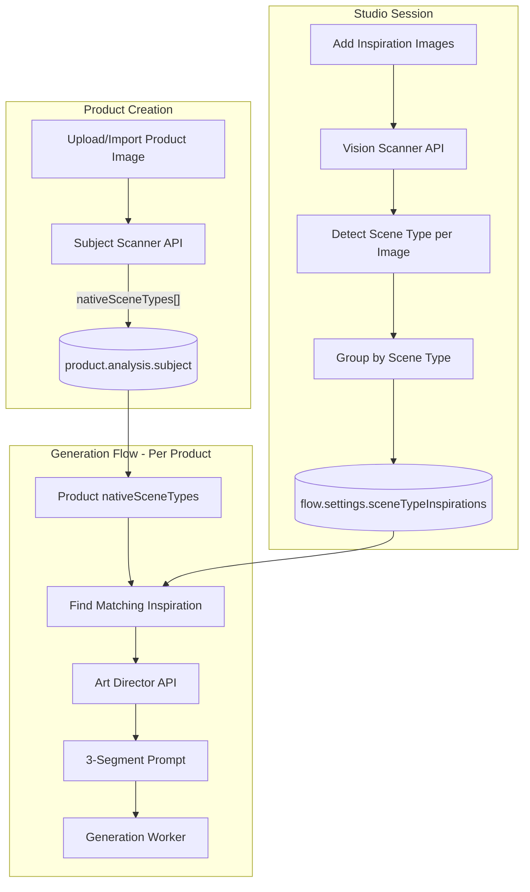

# Generation Flow Settings Redesign Plan

## Finalized Design Decisions

| Decision | Choice | Rationale |

|----------|--------|-----------|

| **Inspiration Images** | Multiple (array) | Support mood board style references |

| **Subject Scanner** | Pre-compute on product creation | Avoid recomputation, faster flow setup |

| **Vision Scanner Format** | Hybrid (JSON + text) | JSON for logic, text for UI/prompts |

| **Art Director** | Server-side API endpoint | Centralized control, can use Gemini |

| **User Control Level** | Simple Mode | Presets + optional custom prompt override |

---

## 1. Type System Updates

### New Types to Add ([`packages/visualizer-types/src/settings.ts`](packages/visualizer-types/src/settings.ts))

```typescript
// ===== SUBJECT SCANNER OUTPUT (stored in product.analysis) =====
export interface SubjectAnalysis {
  subjectClassHyphenated: string; // e.g., "Dining-Chair", "Serum-Bottle"
  nativeSceneTypes: string[]; // ARRAY: ["Living-Room", "Office", "Bedroom"]
  nativeSceneCategory: 'Indoor Room' | 'Outdoor Nature' | 'Urban/Street' | 'Studio';
  inputCameraAngle: 'Frontal' | 'Angled' | 'Top-Down' | 'Low Angle';
  dominantColors?: string[]; // Optional: extracted palette
  materialTags?: string[]; // Optional: "wood", "metal", "fabric"
}

// ===== VISION SCANNER OUTPUT (per inspiration image) =====
export interface VisionAnalysisResult {
  // Structured JSON (for programmatic use)
  json: {
    styleSummary: string; // "A serene, cream-white Japandi bedroom..."
    detectedSceneType: string; // "Bedroom", "Office" - AI-detected from image
    heroObjectAccessories?: {
      identity: string;
      materialPhysics: string;
      placement: string;
    } | null;
    sceneInventory: Array<{
      identity: string; // "Back Wall", "Floor Lamp"
      geometry: string; // "Arched", "Tall and columnar"
      surfacePhysics: string; // "Rough hewn limestone"
      colorGrading: string; // "Warm terracotta"
      spatialContext: string; // "Framing the view"
    }>;
    lightingPhysics: {
      sourceDirection: string; // "Hard sunlight from top-left"
      shadowQuality: string; // "Long, sharp shadows"
      colorTemperature: string; // "Golden hour warm"
    };
  };
  // Auto-generated text prompt (for UI display / editable)
  promptText: string;
}

// ===== SCENE-TYPE GROUPED INSPIRATION (stored in flow settings) =====
// Groups inspiration images by their detected scene type
// Example: { "Bedroom": [analysis1, analysis2], "Office": [analysis3] }
export interface SceneTypeInspirationMap {
  [sceneType: string]: {
    inspirationImages: InspirationImage[]; // Images that match this scene type
    mergedAnalysis: VisionAnalysisResult; // Combined/dominant analysis for this scene type
  };
}

// ===== INSPIRATION IMAGE (with metadata) =====
export interface InspirationImage {
  url: string;
  thumbnailUrl?: string;
  tags?: string[]; // User-added or auto-detected tags
  addedAt: string; // ISO date
  sourceType: 'upload' | 'library' | 'stock' | 'unsplash';
}

// ===== STYLE PRESET (for Simple Mode) =====
export type StylePreset =
  | 'Modern Minimalist'
  | 'Scandinavian'
  | 'Industrial'
  | 'Bohemian'
  | 'Mid-Century'
  | 'Rustic'
  | 'Coastal'
  | 'Luxurious'
  | 'Studio Clean';

export type LightingPreset =
  | 'Natural Daylight'
  | 'Studio Soft Light'
  | 'Golden Hour'
  | 'Dramatic Shadow'
  | 'Bright & Airy'
  | 'Moody Low-Key'
  | 'Cool Overcast';
```

### Updated FlowGenerationSettings

```typescript
export interface FlowGenerationSettings {
  // ===== SCENE STYLE (Section 1) =====
  inspirationImages: InspirationImage[]; // Multiple images (raw uploads)
  sceneTypeInspirations?: SceneTypeInspirationMap; // Grouped by detected scene type
  stylePreset?: StylePreset; // Simple Mode dropdown
  lightingPreset?: LightingPreset; // Simple Mode dropdown

  // ===== USER PROMPT (Section 3) =====
  // User's additional details - gets APPENDED to generated prompt, not replacing it
  // Example: "include a coffee cup on the table" or "make it feel cozy and warm"
  userPrompt?: string;

  // ===== OUTPUT SETTINGS (Section 4) =====
  aspectRatio: string;
  imageQuality?: ImageQuality;
  variantsCount?: number;
}
```

---

## 2. Product Schema Extension

Update `ProductAnalysis` in [`packages/visualizer-types/src/domain.ts`](packages/visualizer-types/src/domain.ts):

```typescript
export interface ProductAnalysis {
  category?: string;
  sceneTypes?: string[]; // Renamed from roomTypes
  style?: string[];
  features?: string[];
  colors?: string[];

  // Subject Scanner output (pre-computed on product creation)
  subject?: SubjectAnalysis;
}
```

---

## 3. Art Director API Endpoint

Create [`apps/epox-platform/app/api/art-director/route.ts`](apps/epox-platform/app/api/art-director/route.ts):

```typescript
// POST /api/art-director
// Called per-product during generation
// Matches product's scene types to available inspiration analyses

interface ArtDirectorRequest {
  // Product data
  subjectAnalysis: SubjectAnalysis; // Includes nativeSceneTypes[]

  // Flow-level inspiration (grouped by scene type)
  sceneTypeInspirations: SceneTypeInspirationMap;

  // User settings
  stylePreset?: StylePreset;
  lightingPreset?: LightingPreset;
  userPrompt?: string; // Additional details to append
}

interface ArtDirectorResponse {
  finalPrompt: string; // Complete prompt sent to generator
  matchedSceneType: string; // Which scene type was matched
  segments: {
    introAnchor: string; // Segment A - Subject locking
    sceneNarrative: string; // Segment B - Scene description
    userAdditions: string; // User's additional details (if any)
    outroAnchor: string; // Segment C - Safety net
  };
}
```

**Art Director Logic Implementation:**

1. **Scene Type Matching**: Find intersection of `product.nativeSceneTypes[]` and available `sceneTypeInspirations` keys
2. **Select Best Match**: Pick the scene type with the most inspiration images (or first match)
3. **Get Vision Analysis**: Use `sceneTypeInspirations[matchedSceneType].mergedAnalysis`
4. Derive `environmentType` and `designDiscipline` from `nativeSceneCategory`
5. Derive `geometricDescription` from `inputCameraAngle`
6. Apply semantic filtering to vision analysis's `sceneInventory`
7. Construct 3-segment prompt using template

---

## 4. Subject Scanner Integration

Add to product creation flow in:

- [`apps/epox-platform/app/api/products/route.ts`](apps/epox-platform/app/api/products/route.ts) (POST handler)
- [`apps/epox-platform/app/api/products/[id]/route.ts`](apps/epox-platform/app/api/products/[id]/route.ts) (PATCH for image upload)

```typescript
// After product image is uploaded/imported:
const subjectAnalysis = await gemini.analyzeProductSubject(imageUrl);
await db.products.update(productId, {
  analysis: {
    ...existingAnalysis,
    subject: subjectAnalysis,
  },
});
```

---

## 5. Studio UI Restructure (Simple Mode)

### Config Panel Layout

```
┌─────────────────────────────────────────────┐
│ 1. SCENE STYLE                              │
│    ┌─────────────────────────────────────┐  │
│    │ [+] Add inspiration images (0/5)    │  │
│    │  [img] [img] [img]                  │  │
│    └─────────────────────────────────────┘  │
│                                             │
│    Detected Scene Types:                    │
│    ┌─────────────────────────────────────┐  │
│    │ 🏠 Bedroom (2 images)               │  │
│    │ 🏢 Office (1 image)                 │  │
│    └─────────────────────────────────────┘  │
│                                             │
│    Style: [Modern Minimalist ▼]             │
│    Lighting: [Natural Daylight ▼]           │
├─────────────────────────────────────────────┤
│ 2. PRODUCT DETAILS (read-only, AI-detected) │
│    Subject: Dining Chair                    │
│    Scene Types: Living Room, Office, Dining │
│    Camera: Frontal view                     │
│    ┌─────────────────────────────────────┐  │
│    │ [Primary] [Alt 1] [Alt 2]           │  │
│    └─────────────────────────────────────┘  │
│                                             │
│    Matched Inspiration: Office ✓            │
├─────────────────────────────────────────────┤
│ 3. USER PROMPT (optional additions)         │
│    ┌─────────────────────────────────────┐  │
│    │ Add specific details for this       │  │
│    │ generation...                       │  │
│    │ e.g., "include a coffee cup"        │  │
│    └─────────────────────────────────────┘  │
│                                             │
│    Final Prompt Preview:                    │
│    ┌─────────────────────────────────────┐  │
│    │ [A] "Create an interior Dining-     │  │
│    │ Chair scene..."                     │  │
│    │ [B] "Professional interior design   │  │
│    │ of a Dining-Room..."                │  │
│    │ [+] "include a coffee cup"          │  │
│    │ [C] "keep the visual integrity..."  │  │
│    └─────────────────────────────────────┘  │
├─────────────────────────────────────────────┤
│ 4. OUTPUT SETTINGS                          │
│    Quality: [1K] [2K] [4K]                  │
│    Ratio:   [1:1] [16:9] [9:16] [4:3]       │
│    Variants: [1] [2] [4] [6]                │
└─────────────────────────────────────────────┘
      [✨ Generate Images]
```

### UI Behavior Notes

- **Inspiration Images**: When user uploads, Vision Scanner runs and detects scene type
- **Scene Type Groups**: UI shows how many images were detected per scene type
- **Product Scene Types**: Shows array of compatible scene types for the product
- **Match Indicator**: Shows which inspiration group will be used for this product

---

## 6. Scene-Type Matching Logic

### How It Works

1.  **Product Creation**: Subject Scanner extracts `nativeSceneTypes[]` (e.g., Chair → ["Living-Room", "Office", "Bedroom"])

2.  **Inspiration Upload**: Vision Scanner analyzes each image and detects `detectedSceneType` (e.g., "Bedroom")

3.  **Grouping**: System groups inspiration images by their detected scene type:

    ```
    sceneTypeInspirations: {
      "Bedroom": { images: [img1, img2], mergedAnalysis: {...} },
      "Office":  { images: [img3], mergedAnalysis: {...} }
    }
    ```

4.  **Generation**: For each product, Art Director:

                                                                                                                                                                                                                                                                                                                                                                                                                                                                                                                                                                                                                                                                                                                                                                                                                                                                                                                                                                                                                                                                                                                                                                                                                                                                                                                                                                                                                                                                                                                                                                                                - Looks at product's `nativeSceneTypes[]`
                                                                                                                                                                                                                                                                                                                                                                                                                                                                                                                                                                                                                                                                                                                                                                                                                                                                                                                                                                                                                                                                                                                                                                                                                                                                                                                                                                                                                                                                                                                                                                                                - Finds matching inspiration from `sceneTypeInspirations`
                                                                                                                                                                                                                                                                                                                                                                                                                                                                                                                                                                                                                                                                                                                                                                                                                                                                                                                                                                                                                                                                                                                                                                                                                                                                                                                                                                                                                                                                                                                                                                                                - Uses the matched `mergedAnalysis` for prompt construction

### Example Flow

```
Collection Products:
 - Bed (nativeSceneTypes: ["Bedroom"])
 - Desk (nativeSceneTypes: ["Office", "Bedroom"])
 - Chair (nativeSceneTypes: ["Living-Room", "Office", "Dining-Room"])

Inspiration Images Uploaded:
 - img1.jpg → detected as "Bedroom"
 - img2.jpg → detected as "Bedroom"
 - img3.jpg → detected as "Office"

Result - sceneTypeInspirations:
  "Bedroom": merged analysis of img1 + img2
  "Office": analysis of img3

Generation Matching:
 - Bed → uses "Bedroom" inspiration (exact match)
 - Desk → uses "Office" or "Bedroom" (has both, picks best/first match)
 - Chair → uses "Office" (only available match from its types)
```

---

## 7. Data Flow Diagram



---

## 7. Default Settings

```typescript
export const DEFAULT_FLOW_SETTINGS: FlowGenerationSettings = {
  inspirationImages: [],
  sceneTypeInspirations: {},
  stylePreset: 'Modern Minimalist',
  lightingPreset: 'Studio Soft Light',
  aspectRatio: '1:1',
  imageQuality: '2K',
  userPrompt: '',
};
```

---

## 8. Files to Create/Modify

| File | Action | Description |

|------|--------|-------------|

| [`packages/visualizer-types/src/settings.ts`](packages/visualizer-types/src/settings.ts) | Modify | Add new types, update FlowGenerationSettings |

| [`packages/visualizer-types/src/domain.ts`](packages/visualizer-types/src/domain.ts) | Modify | Extend ProductAnalysis with SubjectAnalysis |

| `apps/epox-platform/app/api/art-director/route.ts` | Create | Art Director prompt generation endpoint |

| `apps/epox-platform/app/api/vision-scanner/route.ts` | Create | Vision Scanner for inspiration analysis |

| [`apps/epox-platform/app/api/products/route.ts`](apps/epox-platform/app/api/products/route.ts) | Modify | Integrate Subject Scanner on create |

| [`apps/epox-platform/app/(dashboard)/studio/[id]/page.tsx`](<apps/epox-platform/app/(dashboard)/studio/[id]/page.tsx>) | Modify | Rebuild with 4-section Simple Mode UI |

| [`apps/epox-platform/app/api/studio/[id]/settings/route.ts`](apps/epox-platform/app/api/studio/[id]/settings/route.ts) | Modify | Support new fields |

| `apps/epox-platform/lib/presets.ts` | Create | Style/Lighting preset constants |

---

## 9. Implementation Order

1. **Phase 1: Types & Schema**
   - Add new types to visualizer-types (SubjectAnalysis, VisionAnalysis, etc.)
   - Extend ProductAnalysis with subject field
   - Add default settings

2. **Phase 2: Backend APIs**
   - Create Vision Scanner endpoint (analyzes inspiration images, detects scene type)
   - Create Art Director endpoint (scene-type matching, prompt construction)
   - Integrate Subject Scanner into product creation

3. **Phase 3: UI Rebuild**
   - Restructure studio page with 4 sections
   - Implement Simple Mode presets
   - Add inspiration image management with scene-type grouping

4. **Phase 4: Integration**
   - Wire up Art Director to generation flow
   - Test end-to-end with real generations
