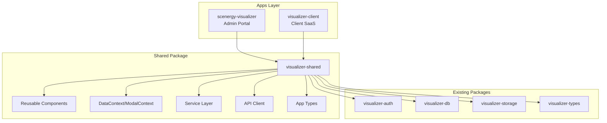
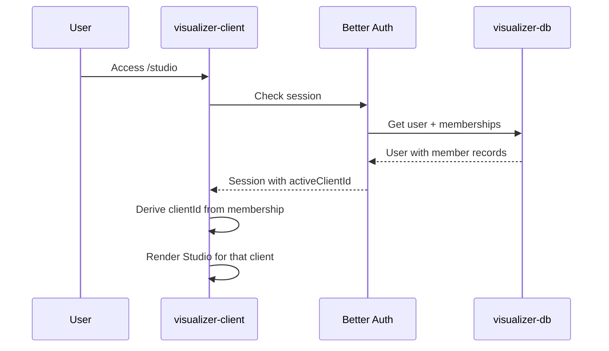

# Visualizer Client App Architecture

## Overview

Create `apps/visualizer-client` - a single-client SaaS studio using the same backend infrastructure as `scenergy-visualizer`, but:

- Authenticated via `user` table (Better Auth) instead of `adminUser`
- No `[clientId]` in URL - client is derived from user's membership
- Reuses all studio capabilities via a new shared package

## Architecture



## Phase 1: Create visualizer-shared Package

Extract reusable code from `scenergy-visualizer` into [`packages/visualizer-shared`](packages/visualizer-shared):| Category | Files to Extract ||----------|-----------------|| **Components** | SceneStudioView/_, ChatView/_, common/_, modals/_ (subset) || **Contexts** | DataContext.tsx, ModalContext.tsx, ThemeContext.tsx || **Services** | gemini/, image-generation/, image-processing/, s3/, visualization/ || **Types** | lib/types/app-types.ts || **API Client** | lib/api-client.ts (make base URL configurable) || **Hooks** | lib/hooks/\* |Key changes during extraction:

- Make `apiClient` configurable with base URL injection
- DataContext will accept an `authProvider` abstraction (admin vs user auth)
- Components will be app-agnostic (no hardcoded routes)

## Phase 2: Create visualizer-client App

### App Structure

```javascript
apps/visualizer-client/
├── app/
│   ├── layout.tsx              # Root layout with user auth
│   ├── page.tsx                # Dashboard/redirect
│   ├── login/page.tsx          # User login (Better Auth)
│   ├── studio/
│   │   └── page.tsx            # Scene Studio (main workspace)
│   ├── products/
│   │   └── page.tsx            # Product catalog
│   ├── settings/
│   │   └── page.tsx            # Client settings
│   └── api/
│       ├── auth/[...all]/route.ts   # Better Auth routes
│       └── ... (proxy or mount shared API routes)
├── lib/
│   ├── auth/
│   │   └── client-auth.ts      # User auth helpers (wraps visualizer-auth)
│   └── client-context.tsx      # Provides clientId from user membership
├── package.json
└── next.config.js
```

### Authentication Flow



### Key Differences from scenergy-visualizer

| Aspect | scenergy-visualizer | visualizer-client ||--------|---------------------|-------------------|| Auth | adminUser table | user table (Better Auth) || Scope | All clients (admin) | Single client (member) || URL | `/[clientId]/... `| `/studio`, `/products` || Client access | Any client | Only user's client(s) || Create clients | Yes | No |

## Phase 3: Refactor scenergy-visualizer

Update `scenergy-visualizer` to consume from `visualizer-shared`:

- Replace local copies with imports from shared package
- Keep admin-specific logic (multi-client management, admin auth)
- Both apps now share the same component/service implementations

## Key Files to Create

1. **[packages/visualizer-shared/package.json]** - Package definition
2. **[packages/visualizer-shared/src/index.ts]** - Public exports
3. **[apps/visualizer-client/package.json]** - App dependencies
4. **[apps/visualizer-client/app/layout.tsx]** - User auth provider setup
5. **[apps/visualizer-client/lib/client-context.tsx]** - Client derivation from user membership

## Implementation Considerations

- **API Routes**: The client app can either:
