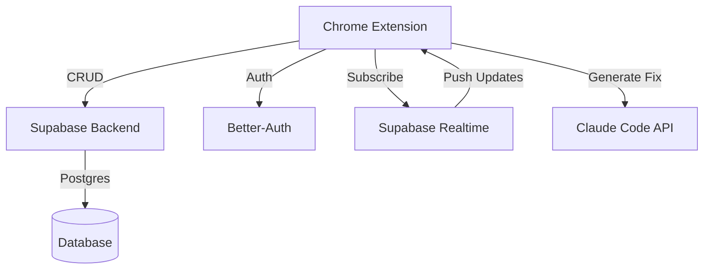

# Phase 2: Collaboration & Claude Code Integration

## Background

Anton Phase 1 is a local-only Chrome extension. Phase 2 transforms it into a collaborative platform with:
- Workspace/Project hierarchy
- Team member access control
- Real-time annotation sync
- Claude Code integration for AI-powered fixes

## Problem

Current limitations:
- Annotations stored locally only (no sharing)
- No user accounts or teams
- No real-time collaboration
- Comments not linked to DOM elements
- No AI-assisted workflows

## Goals

1. **Multi-tenant Collaboration**
   - Workspaces contain Projects
   - Projects have members with roles
   - Real-time annotation sync across team

2. **Enhanced Comments**
   - Map to specific DOM elements
   - Include element screenshots
   - Store context (surrounding code, styles)

3. **Claude Code Integration**
   - Generate fix prompts from comments
   - Send to Claude Code API
   - Auto-create tasks in Claude project
   - Include screenshots and selectors

## Architecture Overview



## Database Schema

```sql
-- Organizations/Workspaces
CREATE TABLE workspaces (
  id UUID PRIMARY KEY DEFAULT gen_random_uuid(),
  name TEXT NOT NULL,
  slug TEXT UNIQUE NOT NULL,
  owner_id UUID NOT NULL REFERENCES auth.users(id),
  created_at TIMESTAMPTZ DEFAULT NOW(),
  updated_at TIMESTAMPTZ DEFAULT NOW()
);

-- Workspace members
CREATE TABLE workspace_members (
  id UUID PRIMARY KEY DEFAULT gen_random_uuid(),
  workspace_id UUID NOT NULL REFERENCES workspaces(id) ON DELETE CASCADE,
  user_id UUID NOT NULL REFERENCES auth.users(id) ON DELETE CASCADE,
  role TEXT NOT NULL CHECK (role IN ('owner', 'admin', 'member', 'viewer')),
  created_at TIMESTAMPTZ DEFAULT NOW(),
  UNIQUE(workspace_id, user_id)
);

-- Projects within workspaces
CREATE TABLE projects (
  id UUID PRIMARY KEY DEFAULT gen_random_uuid(),
  workspace_id UUID NOT NULL REFERENCES workspaces(id) ON DELETE CASCADE,
  name TEXT NOT NULL,
  description TEXT,
  url_pattern TEXT, -- e.g., "https://example.com/*"
  created_by UUID NOT NULL REFERENCES auth.users(id),
  created_at TIMESTAMPTZ DEFAULT NOW(),
  updated_at TIMESTAMPTZ DEFAULT NOW()
);

-- Project members (inherit from workspace + can restrict)
CREATE TABLE project_members (
  id UUID PRIMARY KEY DEFAULT gen_random_uuid(),
  project_id UUID NOT NULL REFERENCES projects(id) ON DELETE CASCADE,
  user_id UUID NOT NULL REFERENCES auth.users(id) ON DELETE CASCADE,
  role TEXT NOT NULL CHECK (role IN ('admin', 'editor', 'viewer')),
  created_at TIMESTAMPTZ DEFAULT NOW(),
  UNIQUE(project_id, user_id)
);

-- Pages being annotated
CREATE TABLE pages (
  id UUID PRIMARY KEY DEFAULT gen_random_uuid(),
  project_id UUID NOT NULL REFERENCES projects(id) ON DELETE CASCADE,
  url TEXT NOT NULL,
  normalized_url TEXT NOT NULL,
  title TEXT,
  thumbnail TEXT, -- base64 or storage URL
  created_by UUID NOT NULL REFERENCES auth.users(id),
  created_at TIMESTAMPTZ DEFAULT NOW(),
  updated_at TIMESTAMPTZ DEFAULT NOW(),
  UNIQUE(project_id, normalized_url)
);

-- Enhanced annotations with element mapping
CREATE TABLE annotations (
  id UUID PRIMARY KEY DEFAULT gen_random_uuid(),
  page_id UUID NOT NULL REFERENCES pages(id) ON DELETE CASCADE,
  project_id UUID NOT NULL REFERENCES projects(id) ON DELETE CASCADE,
  type TEXT NOT NULL CHECK (type IN ('comment', 'text', 'highlight', 'arrow')),

  -- Position (one of these will be populated)
  position JSONB NOT NULL, -- {type: 'coordinate', x, y, scrollY} or {type: 'selector', selector, offsetX, offsetY}

  -- Content
  content TEXT,
  color TEXT,

  -- Element context (for comments)
  element_selector TEXT, -- CSS selector to target element
  element_html TEXT, -- Outer HTML of element
  element_screenshot TEXT, -- Base64 screenshot of element
  element_styles JSONB, -- Computed styles of element

  -- Arrow specific
  end_x NUMERIC,
  end_y NUMERIC,

  -- Metadata
  created_by UUID NOT NULL REFERENCES auth.users(id),
  created_at TIMESTAMPTZ DEFAULT NOW(),
  updated_at TIMESTAMPTZ DEFAULT NOW(),
  resolved BOOLEAN DEFAULT FALSE,
  resolved_by UUID REFERENCES auth.users(id),
  resolved_at TIMESTAMPTZ
);

-- Comment replies
CREATE TABLE annotation_replies (
  id UUID PRIMARY KEY DEFAULT gen_random_uuid(),
  annotation_id UUID NOT NULL REFERENCES annotations(id) ON DELETE CASCADE,
  content TEXT NOT NULL,
  created_by UUID NOT NULL REFERENCES auth.users(id),
  created_at TIMESTAMPTZ DEFAULT NOW(),
  updated_at TIMESTAMPTZ DEFAULT NOW()
);

-- Claude Code integration
CREATE TABLE claude_tasks (
  id UUID PRIMARY KEY DEFAULT gen_random_uuid(),
  annotation_id UUID NOT NULL REFERENCES annotations(id) ON DELETE CASCADE,
  project_id UUID NOT NULL REFERENCES projects(id) ON DELETE CASCADE,

  -- Claude Code project info
  claude_project_id TEXT, -- From Claude Code API
  claude_task_id TEXT, -- Task ID in Claude Code

  -- Prompt data
  prompt TEXT NOT NULL,
  context JSONB, -- {element, screenshot, styles, etc.}

  -- Status
  status TEXT NOT NULL CHECK (status IN ('pending', 'sent', 'completed', 'failed')),
  error TEXT,

  -- Metadata
  created_by UUID NOT NULL REFERENCES auth.users(id),
  created_at TIMESTAMPTZ DEFAULT NOW(),
  updated_at TIMESTAMPTZ DEFAULT NOW()
);

-- Indexes
CREATE INDEX idx_workspace_members_user ON workspace_members(user_id);
CREATE INDEX idx_workspace_members_workspace ON workspace_members(workspace_id);
CREATE INDEX idx_projects_workspace ON projects(workspace_id);
CREATE INDEX idx_project_members_user ON project_members(user_id);
CREATE INDEX idx_project_members_project ON project_members(project_id);
CREATE INDEX idx_pages_project ON pages(project_id);
CREATE INDEX idx_pages_normalized_url ON pages(normalized_url);
CREATE INDEX idx_annotations_page ON annotations(page_id);
CREATE INDEX idx_annotations_project ON annotations(project_id);
CREATE INDEX idx_annotations_created_by ON annotations(created_by);
CREATE INDEX idx_annotation_replies_annotation ON annotation_replies(annotation_id);
CREATE INDEX idx_claude_tasks_annotation ON claude_tasks(annotation_id);
```

## Better-Auth Integration

### Setup

```typescript
// apps/anton/src/server/auth.ts
import { betterAuth } from 'better-auth';
import { Database } from 'better-auth/adapters/supabase';

export const auth = betterAuth({
  database: new Database({
    url: process.env.SUPABASE_URL!,
    key: process.env.SUPABASE_SERVICE_KEY!,
  }),
  emailAndPassword: {
    enabled: true,
  },
  socialProviders: {
    google: {
      clientId: process.env.GOOGLE_CLIENT_ID!,
      clientSecret: process.env.GOOGLE_CLIENT_SECRET!,
    },
    github: {
      clientId: process.env.GITHUB_CLIENT_ID!,
      clientSecret: process.env.GITHUB_CLIENT_SECRET!,
    },
  },
});
```

### Extension Authentication

```typescript
// apps/anton/src/shared/auth-client.ts
import { createAuthClient } from 'better-auth/client';

export const authClient = createAuthClient({
  baseURL: 'https://your-backend.com', // Or local server
});

// Login flow
export async function loginWithGoogle() {
  const result = await authClient.signIn.social({
    provider: 'google',
    callbackURL: chrome.identity.getRedirectURL(),
  });

  // Store session in chrome.storage
  await chrome.storage.local.set({
    anton_session: result.session,
    anton_user: result.user,
  });

  return result;
}

// Get current user
export async function getCurrentUser() {
  const { anton_session } = await chrome.storage.local.get('anton_session');
  if (!anton_session) return null;

  const user = await authClient.getSession();
  return user;
}

// Logout
export async function logout() {
  await authClient.signOut();
  await chrome.storage.local.remove(['anton_session', 'anton_user']);
}
```

## Supabase Client Setup

```typescript
// apps/anton/src/shared/supabase.ts
import { createClient } from '@supabase/supabase-js';
import type { Database } from './database.types';

let supabaseClient: ReturnType<typeof createClient<Database>> | null = null;

export async function getSupabaseClient() {
  if (supabaseClient) return supabaseClient;

  const { anton_session } = await chrome.storage.local.get('anton_session');

  supabaseClient = createClient<Database>(
    process.env.SUPABASE_URL!,
    process.env.SUPABASE_ANON_KEY!,
    {
      auth: {
        persistSession: false, // We handle session in chrome.storage
        autoRefreshToken: true,
      },
      global: {
        headers: {
          Authorization: `Bearer ${anton_session?.access_token}`,
        },
      },
    }
  );

  return supabaseClient;
}
```

## Real-time Annotation Sync

```typescript
// apps/anton/src/shared/realtime.ts
import { getSupabaseClient } from './supabase';
import type { Annotation } from './types';

export class AnnotationSyncManager {
  private channel: any;
  private projectId: string;
  private onUpdate: (annotation: Annotation) => void;
  private onDelete: (annotationId: string) => void;

  constructor(
    projectId: string,
    onUpdate: (annotation: Annotation) => void,
    onDelete: (annotationId: string) => void
  ) {
    this.projectId = projectId;
    this.onUpdate = onUpdate;
    this.onDelete = onDelete;
  }

  async start() {
    const supabase = await getSupabaseClient();

    // Subscribe to annotation changes for this project
    this.channel = supabase
      .channel(`project:${this.projectId}`)
      .on(
        'postgres_changes',
        {
          event: '*',
          schema: 'public',
          table: 'annotations',
          filter: `project_id=eq.${this.projectId}`,
        },
        (payload) => {
          console.log('Annotation change:', payload);

          if (payload.eventType === 'INSERT' || payload.eventType === 'UPDATE') {
            this.onUpdate(payload.new as Annotation);
          } else if (payload.eventType === 'DELETE') {
            this.onDelete(payload.old.id);
          }
        }
      )
      .subscribe();
  }

  stop() {
    if (this.channel) {
      this.channel.unsubscribe();
    }
  }
}

// Usage in AnnotationOverlay
const syncManager = new AnnotationSyncManager(
  projectId,
  (annotation) => {
    // Update local state with remote annotation
    setAnnotations((prev) => {
      const index = prev.findIndex((a) => a.id === annotation.id);
      if (index >= 0) {
        prev[index] = annotation;
        return [...prev];
      } else {
        return [...prev, annotation];
      }
    });
  },
  (annotationId) => {
    // Remove deleted annotation
    setAnnotations((prev) => prev.filter((a) => a.id !== annotationId));
  }
);

useEffect(() => {
  syncManager.start();
  return () => syncManager.stop();
}, [projectId]);
```

## Enhanced Comment Model with Element Mapping

```typescript
// apps/anton/src/lib/element-context.ts
import { generateSelector } from './selector';

export interface ElementContext {
  selector: string;
  html: string;
  screenshot: string; // base64
  styles: Record<string, string>;
  boundingRect: DOMRect;
  xpath: string;
}

/**
 * Capture full context of an element for AI prompts
 */
export async function captureElementContext(
  element: Element
): Promise<ElementContext> {
  const selector = generateSelector(element);
  const rect = element.getBoundingClientRect();

  // Capture element screenshot
  const screenshot = await captureElementScreenshot(element);

  // Get computed styles
  const computed = window.getComputedStyle(element);
  const styles: Record<string, string> = {};

  // Capture relevant CSS properties
  const relevantProps = [
    'display', 'position', 'width', 'height', 'margin', 'padding',
    'border', 'background', 'color', 'font-size', 'font-family',
    'flex', 'grid', 'z-index', 'overflow',
  ];

  relevantProps.forEach((prop) => {
    styles[prop] = computed.getPropertyValue(prop);
  });

  // Generate XPath
  const xpath = getXPath(element);

  return {
    selector,
    html: element.outerHTML.substring(0, 5000), // Limit size
    screenshot,
    styles,
    boundingRect: rect,
    xpath,
  };
}

async function captureElementScreenshot(element: Element): Promise<string> {
  const rect = element.getBoundingClientRect();

  // Use Chrome's capture API
  return new Promise((resolve) => {
    chrome.tabs.captureVisibleTab({ format: 'png' }, (dataUrl) => {
      if (!dataUrl) {
        resolve('');
        return;
      }

      // Crop to element bounds
      const img = new Image();
      img.onload = () => {
        const canvas = document.createElement('canvas');
        canvas.width = rect.width;
        canvas.height = rect.height;

        const ctx = canvas.getContext('2d');
        if (!ctx) {
          resolve('');
          return;
        }

        // Draw cropped region
        ctx.drawImage(
          img,
          rect.left * window.devicePixelRatio,
          rect.top * window.devicePixelRatio,
          rect.width * window.devicePixelRatio,
          rect.height * window.devicePixelRatio,
          0,
          0,
          rect.width,
          rect.height
        );

        resolve(canvas.toDataURL('image/png'));
      };
      img.src = dataUrl;
    });
  });
}

function getXPath(element: Element): string {
  if (element.id) {
    return `//*[@id="${element.id}"]`;
  }

  const parts: string[] = [];
  let current: Element | null = element;

  while (current && current !== document.body) {
    let index = 1;
    let sibling = current.previousElementSibling;

    while (sibling) {
      if (sibling.tagName === current.tagName) {
        index++;
      }
      sibling = sibling.previousElementSibling;
    }

    const tagName = current.tagName.toLowerCase();
    parts.unshift(`${tagName}[${index}]`);
    current = current.parentElement;
  }

  return '/' + parts.join('/');
}
```

## Claude Code Integration

```typescript
// apps/anton/src/lib/claude-integration.ts
import type { Annotation } from '@/shared/types';
import type { ElementContext } from './element-context';

export interface ClaudeFixRequest {
  annotation: Annotation;
  elementContext: ElementContext;
  pageUrl: string;
  pageTitle: string;
}

export interface ClaudeTask {
  taskId: string;
  projectId: string;
  status: 'pending' | 'running' | 'completed' | 'failed';
}

/**
 * Generate a Claude Code prompt from an annotation
 */
export function generateClaudePrompt(request: ClaudeFixRequest): string {
  const { annotation, elementContext, pageUrl, pageTitle } = request;

  const prompt = `
# Fix Request from Anton Annotation

## Context
- **Page**: ${pageTitle}
- **URL**: ${pageUrl}
- **Element**: \`${elementContext.selector}\`

## Issue Description
${annotation.content}

## Element Information

### HTML
\`\`\`html
${elementContext.html}
\`\`\`

### Computed Styles
\`\`\`css
${Object.entries(elementContext.styles)
  .map(([key, value]) => `  ${key}: ${value};`)
  .join('\n')}
\`\`\`

### Location
- **XPath**: ${elementContext.xpath}
- **Bounding Box**: ${Math.round(elementContext.boundingRect.width)}px × ${Math.round(elementContext.boundingRect.height)}px
- **Position**: (${Math.round(elementContext.boundingRect.left)}, ${Math.round(elementContext.boundingRect.top)})

## Screenshot
See attached screenshot of the element.

## Task
Please analyze the issue described and propose a fix. Consider:
1. What is the root cause?
2. What files need to be modified?
3. Provide the specific code changes needed
4. Are there any related components that might be affected?

Generate a complete fix for this issue.
`.trim();

  return prompt;
}

/**
 * Send annotation to Claude Code API
 */
export async function sendToClaudeCode(
  request: ClaudeFixRequest,
  claudeProjectId: string
): Promise<ClaudeTask> {
  const prompt = generateClaudePrompt(request);

  // Call Claude Code API (using your existing backend)
  const response = await fetch('https://your-backend.com/api/claude/tasks', {
    method: 'POST',
    headers: {
      'Content-Type': 'application/json',
      'Authorization': `Bearer ${await getAuthToken()}`,
    },
    body: JSON.stringify({
      projectId: claudeProjectId,
      prompt,
      attachments: [
        {
          type: 'image',
          data: request.elementContext.screenshot,
          filename: 'element-screenshot.png',
        },
      ],
      context: {
        url: request.pageUrl,
        selector: request.elementContext.selector,
        annotationId: request.annotation.id,
      },
    }),
  });

  const data = await response.json();

  return {
    taskId: data.taskId,
    projectId: claudeProjectId,
    status: 'pending',
  };
}

async function getAuthToken(): Promise<string> {
  const { anton_session } = await chrome.storage.local.get('anton_session');
  return anton_session?.access_token || '';
}
```

## Enhanced Comment Component with Claude Button

```typescript
// apps/anton/src/content/CommentThreadEnhanced.tsx
import React, { useState } from 'react';
import type { Annotation } from '@/shared/types';
import { captureElementContext } from '@/lib/element-context';
import { sendToClaudeCode, generateClaudePrompt } from '@/lib/claude-integration';

interface CommentThreadEnhancedProps {
  annotation: Annotation;
  element: Element | null; // The DOM element this comment is attached to
  onClose: () => void;
  onUpdate: (updates: Partial<Annotation>) => void;
  onDelete: () => void;
}

export function CommentThreadEnhanced({
  annotation,
  element,
  onClose,
  onUpdate,
  onDelete,
}: CommentThreadEnhancedProps) {
  const [isGeneratingFix, setIsGeneratingFix] = useState(false);
  const [claudeTaskId, setClaudeTaskId] = useState<string | null>(null);

  const handleGenerateFix = async () => {
    if (!element) {
      alert('Element not found - cannot generate fix');
      return;
    }

    setIsGeneratingFix(true);

    try {
      // Capture element context
      const elementContext = await captureElementContext(element);

      // Send to Claude Code
      const task = await sendToClaudeCode(
        {
          annotation,
          elementContext,
          pageUrl: window.location.href,
          pageTitle: document.title,
        },
        'your-claude-project-id' // Get from project settings
      );

      setClaudeTaskId(task.taskId);

      // Save task reference to annotation
      await saveClaudeTask({
        annotationId: annotation.id,
        taskId: task.taskId,
        prompt: generateClaudePrompt({
          annotation,
          elementContext,
          pageUrl: window.location.href,
          pageTitle: document.title,
        }),
        context: elementContext,
      });

      alert(`Fix request sent to Claude Code! Task ID: ${task.taskId}`);
    } catch (error) {
      console.error('Failed to generate fix:', error);
      alert('Failed to send to Claude Code. See console for details.');
    } finally {
      setIsGeneratingFix(false);
    }
  };

  const handleCopyPrompt = async () => {
    if (!element) return;

    const elementContext = await captureElementContext(element);
    const prompt = generateClaudePrompt({
      annotation,
      elementContext,
      pageUrl: window.location.href,
      pageTitle: document.title,
    });

    await navigator.clipboard.writeText(prompt);
    alert('Prompt copied to clipboard!');
  };

  return (
    <div className="anton-comment-thread" data-testid="anton-comment-thread-enhanced">
      {/* ... existing comment UI ... */}

      {/* Claude Code Integration */}
      <div className="mt-4 border-t border-dark-border pt-3">
        <h4 className="text-xs font-semibold text-dark-muted mb-2">AI Assistant</h4>

        <div className="flex gap-2">
          <button
            className="anton-btn flex-1 text-xs"
            onClick={handleGenerateFix}
            disabled={isGeneratingFix || !element}
            data-testid="generate-fix-btn"
          >
            {isGeneratingFix ? '⏳ Sending...' : '🤖 Generate Fix in Claude Code'}
          </button>

          <button
            className="anton-btn anton-btn-secondary text-xs"
            onClick={handleCopyPrompt}
            disabled={!element}
            data-testid="copy-prompt-btn"
            title="Copy prompt to clipboard"
          >
            📋
          </button>
        </div>

        {claudeTaskId && (
          <div className="mt-2 text-xs text-accent-success">
            ✓ Task created: {claudeTaskId}
          </div>
        )}

        {!element && (
          <div className="mt-2 text-xs text-accent-warning">
            ⚠️ Element not found - cannot generate AI fix
          </div>
        )}
      </div>
    </div>
  );
}

async function saveClaudeTask(data: any) {
  const supabase = await getSupabaseClient();
  await supabase.from('claude_tasks').insert(data);
}
```

## Project Selection UI

```typescript
// apps/anton/src/sidepanel/ProjectSelector.tsx
import React, { useEffect, useState } from 'react';
import { getSupabaseClient } from '@/shared/supabase';

interface Workspace {
  id: string;
  name: string;
  slug: string;
}

interface Project {
  id: string;
  workspace_id: string;
  name: string;
  description: string;
  url_pattern: string;
}

export function ProjectSelector() {
  const [workspaces, setWorkspaces] = useState<Workspace[]>([]);
  const [projects, setProjects] = useState<Project[]>([]);
  const [selectedWorkspace, setSelectedWorkspace] = useState<string | null>(null);
  const [selectedProject, setSelectedProject] = useState<string | null>(null);

  useEffect(() => {
    loadWorkspaces();
  }, []);

  useEffect(() => {
    if (selectedWorkspace) {
      loadProjects(selectedWorkspace);
    }
  }, [selectedWorkspace]);

  const loadWorkspaces = async () => {
    const supabase = await getSupabaseClient();
    const { data } = await supabase
      .from('workspaces')
      .select('*')
      .order('name');

    setWorkspaces(data || []);
  };

  const loadProjects = async (workspaceId: string) => {
    const supabase = await getSupabaseClient();
    const { data } = await supabase
      .from('projects')
      .select('*')
      .eq('workspace_id', workspaceId)
      .order('name');

    setProjects(data || []);
  };

  const handleSelectProject = async (projectId: string) => {
    setSelectedProject(projectId);

    // Save to chrome.storage for persistence
    await chrome.storage.local.set({
      anton_current_workspace: selectedWorkspace,
      anton_current_project: projectId,
    });

    // Notify content script to switch project
    chrome.tabs.query({ active: true, currentWindow: true }, (tabs) => {
      if (tabs[0]?.id) {
        chrome.tabs.sendMessage(tabs[0].id, {
          type: 'PROJECT_CHANGED',
          payload: { projectId },
        });
      }
    });
  };

  return (
    <div className="p-4" data-testid="project-selector">
      <h3 className="font-semibold mb-3 text-dark-text">Select Project</h3>

      {/* Workspace Selection */}
      <div className="mb-4">
        <label className="text-sm text-dark-muted mb-1 block">Workspace</label>
        <select
          className="w-full p-2 bg-dark-surface border border-dark-border rounded text-dark-text"
          value={selectedWorkspace || ''}
          onChange={(e) => setSelectedWorkspace(e.target.value)}
          data-testid="workspace-select"
        >
          <option value="">Select workspace...</option>
          {workspaces.map((ws) => (
            <option key={ws.id} value={ws.id}>
              {ws.name}
            </option>
          ))}
        </select>
      </div>

      {/* Project Selection */}
      {selectedWorkspace && (
        <div className="mb-4">
          <label className="text-sm text-dark-muted mb-1 block">Project</label>
          <select
            className="w-full p-2 bg-dark-surface border border-dark-border rounded text-dark-text"
            value={selectedProject || ''}
            onChange={(e) => handleSelectProject(e.target.value)}
            data-testid="project-select"
          >
            <option value="">Select project...</option>
            {projects.map((proj) => (
              <option key={proj.id} value={proj.id}>
                {proj.name}
              </option>
            ))}
          </select>
        </div>
      )}

      {selectedProject && (
        <div className="p-3 bg-accent-success/10 border border-accent-success rounded">
          <p className="text-sm text-accent-success">
            ✓ Project selected - annotations will sync across team
          </p>
        </div>
      )}
    </div>
  );
}
```

## Implementation Plan

### Phase 2.1: Backend Setup (Week 1)
1. Set up Supabase project
2. Run database migrations
3. Configure Better-Auth
4. Set up RLS policies
5. Create API endpoints

### Phase 2.2: Authentication (Week 2)
1. Add login/signup UI to extension
2. Integrate Better-Auth client
3. Store session in chrome.storage
4. Add user profile management

### Phase 2.3: Workspace & Projects (Week 3)
1. Build workspace creation UI
2. Project creation and management
3. Member invitation system
4. Role-based permissions

### Phase 2.4: Real-time Sync (Week 4)
1. Integrate Supabase Realtime
2. Update AnnotationOverlay for sync
3. Conflict resolution strategy
4. Offline support with queue

### Phase 2.5: Enhanced Comments (Week 5)
1. Element context capture
2. Screenshot integration
3. Update comment UI
4. Store element data in DB

### Phase 2.6: Claude Code Integration (Week 6)
1. Build Claude Code API client
2. Prompt generation logic
3. "Generate Fix" button in comments
4. Task status tracking

### Phase 2.7: Polish & Testing (Week 7)
1. End-to-end testing
2. Performance optimization
3. Documentation
4. Beta testing with team

## Security Considerations

### Row Level Security (RLS)

```sql
-- Workspaces: Users can only see workspaces they're members of
CREATE POLICY "Users can view their workspaces"
  ON workspaces FOR SELECT
  USING (
    id IN (
      SELECT workspace_id FROM workspace_members
      WHERE user_id = auth.uid()
    )
  );

-- Projects: Inherit workspace access + project-specific
CREATE POLICY "Users can view workspace projects"
  ON projects FOR SELECT
  USING (
    workspace_id IN (
      SELECT workspace_id FROM workspace_members
      WHERE user_id = auth.uid()
    )
  );

-- Annotations: Can view if member of project
CREATE POLICY "Users can view project annotations"
  ON annotations FOR SELECT
  USING (
    project_id IN (
      SELECT p.id FROM projects p
      JOIN workspace_members wm ON wm.workspace_id = p.workspace_id
      WHERE wm.user_id = auth.uid()
    )
  );

-- Annotations: Can create if editor or admin
CREATE POLICY "Editors can create annotations"
  ON annotations FOR INSERT
  WITH CHECK (
    project_id IN (
      SELECT pm.project_id FROM project_members pm
      WHERE pm.user_id = auth.uid()
      AND pm.role IN ('editor', 'admin')
    )
    OR
    project_id IN (
      SELECT p.id FROM projects p
      JOIN workspace_members wm ON wm.workspace_id = p.workspace_id
      WHERE wm.user_id = auth.uid()
      AND wm.role IN ('admin', 'owner')
    )
  );
```

## Cost Estimation

### Supabase
- Free tier: 500MB database, 2GB bandwidth
- Pro tier ($25/mo): 8GB database, 50GB bandwidth
- Realtime: Included in both tiers

### Claude Code API
- Pay per task/prompt
- Estimate: $0.10-0.50 per fix generation
- Monthly cost depends on usage

### Better-Auth
- Self-hosted: Free
- Managed (if available): TBD

## Trade-offs

### Local + Cloud Hybrid
**Option 1**: All annotations in cloud
- ✅ Full collaboration
- ❌ Requires internet
- ❌ Privacy concerns

**Option 2**: Local first, sync optional
- ✅ Works offline
- ✅ Privacy friendly
- ❌ More complex sync logic

**Decision**: Start with Option 1 (cloud-first), add offline mode in Phase 3

### Element Selector Storage
**Option 1**: Store full HTML + styles
- ✅ Rich context for AI
- ❌ Large storage size
- ❌ May contain sensitive data

**Option 2**: Store selector + minimal context
- ✅ Smaller footprint
- ❌ Less context for AI
- ❌ May break if page changes

**Decision**: Option 1 with size limits (5KB HTML max) and opt-out for sensitive pages

## Success Metrics

- ✅ Users can create workspaces and invite team
- ✅ Real-time annotation sync < 1s latency
- ✅ Claude Code integration success rate > 80%
- ✅ Element context capture success rate > 95%
- ✅ Zero data loss during sync conflicts

## Questions

1. Should workspaces have a free tier limit (e.g., 3 projects, 5 members)?
2. How to handle element selectors that break when page updates?
3. Should Claude Code tasks be visible in Anton UI or only in Claude Code?
4. Rate limiting for Claude Code API calls?
5. How to handle private/sensitive pages (e.g., admin panels)?

## Next Steps

1. Review this design
2. Create Supabase project
3. Write database migrations
4. Set up Better-Auth configuration
5. Build authentication flow
6. Implement workspace/project CRUD
