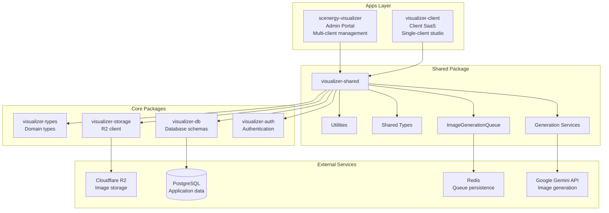
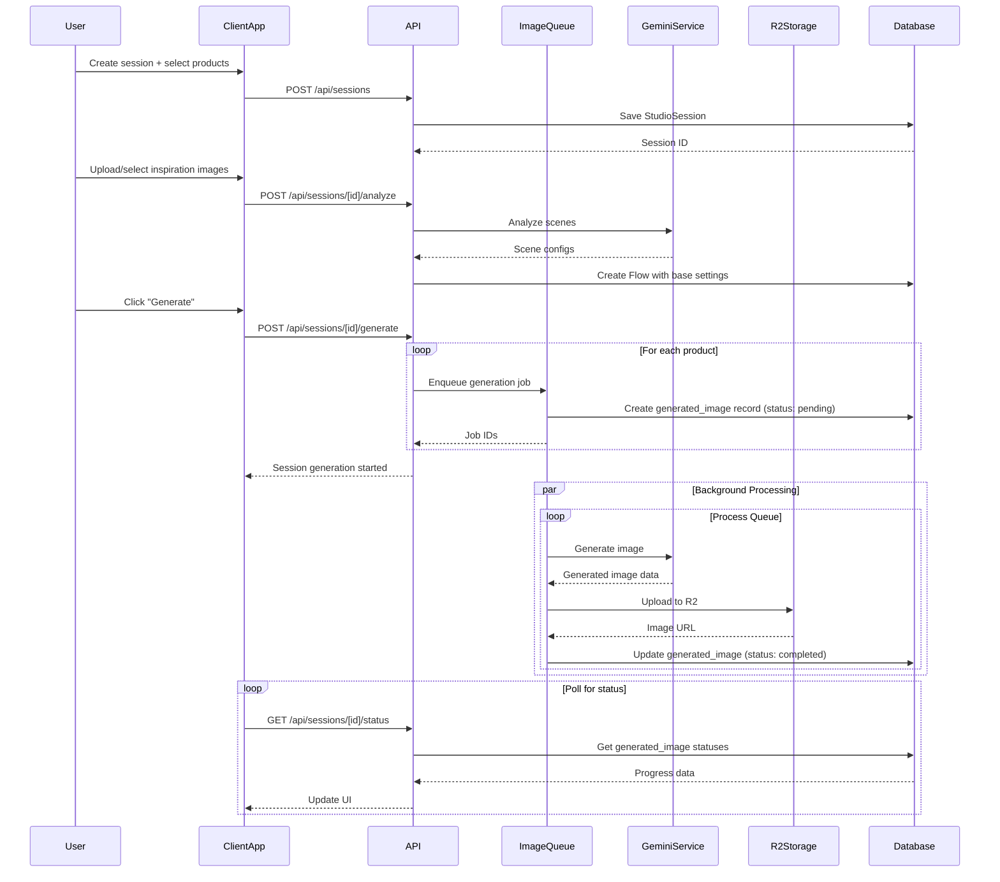

# Design Log #001: Architecture & Infrastructure

**Status**: Draft
**Created**: 2026-01-10
**Author**: Claude
**Updated**: 2026-01-11

---

## Background

We're building `visualizer-client` - a SaaS platform for individual clients to generate AI-powered product visualizations at scale. This platform will:
- Serve as a client-facing studio (vs. `scenergy-visualizer` which is admin-facing)
- Allow bulk generation of product images (20-500+ products per session)
- Use AI to analyze products and match them with appropriate room contexts
- Support multiple inspiration sources (upload, Unsplash, previous generations)
- **Reuse existing infrastructure** from `scenergy-visualizer` including StudioSession, Flow, and image generation systems

## Problem

Currently, `scenergy-visualizer` is an admin portal with:
- Multi-client management (URL pattern: `/[clientId]/...`)
- Admin authentication (`adminUser` table)
- Full access to all client data
- Direct manipulation of products, images, and settings
- Existing data model: StudioSession → Flow → generated_image

We need a separate client-facing app that:
- Is scoped to a single client per user
- Has simplified, bulk-first UX
- Uses standard user authentication
- **Reuses existing StudioSession/Flow infrastructure**
- Shares common code with the admin portal
- Uses the same Cloudflare R2 storage structure

## Questions and Answers

### Q1: Should we create a shared package or duplicate code?
**A**: Create `packages/visualizer-shared` to house:
- Shared types and interfaces
- Generation services (Gemini, R2, image processing)
- Queue management logic (reuse existing ImageGenerationQueue)
- Reusable React components (where applicable)

This prevents drift and ensures both apps use the same generation logic.

### Q2: How do we handle authentication differences?
**A**: Abstract authentication at the app level:
- Admin app: Uses `visualizer-auth` with `adminUser` table
- Client app: Uses `visualizer-auth` with new `user` and `member` tables
- Shared package: Receives `clientId` from app context, doesn't care about auth source

### Q3: Should API routes be shared or duplicated?
**A**: Hybrid approach:
- Core generation logic → Move to shared package as services
- API routes → App-specific (different auth, different scoping)
- Both apps call same underlying services

### Q4: Where should the generation queue live?
**A**: Reuse existing `ImageGenerationQueue` from shared package:
- Both apps import and use the same queue implementation
- Redis keys are prefixed by app (`admin:` vs `client:`)
- Same job processing, same status polling
- Queue already exists in scenergy-visualizer, just needs to be moved to shared package

### Q5: How do we handle database access?
**A**: Both apps use `visualizer-db` with **existing schema**:
- Same tables: `studio_session`, `flow`, `generated_image`, `product`, `product_image`
- Row-level scoping via `clientId` column
- Client app: WHERE clientId = user.activeClientId
- Admin app: WHERE clientId = [selected client]
- **NEW tables**: Only `user` and `member` for client authentication

### Q6: What's the relationship between StudioSession and Flow?
**A**: Use existing data model (already implemented):
- **StudioSession**: Top-level container (like "collection" in client UX)
- **Flow**: Generation configuration supporting multiple products
- **generated_image**: Individual outputs linked to flowId
- Client app creates StudioSessions → Flows → generated_images
- Each Flow can have `productIds: string[]` (already supported)

### Q7: Should we use S3 or R2 for storage?
**A**: Use existing **Cloudflare R2** infrastructure:
- Already configured in scenergy-visualizer
- Same bucket structure for consistency
- Environment vars: `R2_BUCKET`, `R2_PUBLIC_URL`, `R2_ACCESS_KEY_ID`, `R2_SECRET_ACCESS_KEY`
- S3-compatible API, easier migration path

---

## Design

### High-Level Architecture



### Package Structure

```
monorepo/
├── apps/
│   ├── scenergy-visualizer/        # Admin portal (existing)
│   │   ├── app/
│   │   │   ├── [clientId]/         # Multi-client routes
│   │   │   └── api/
│   │   └── lib/
│   │       └── admin-specific/     # Admin-only features
│   │
│   └── visualizer-client/          # Client SaaS (new)
│       ├── app/
│       │   ├── sessions/           # Main workflow (StudioSessions)
│       │   ├── products/
│       │   ├── settings/
│       │   └── api/                # Client-scoped API
│       └── lib/
│           ├── auth/               # User auth wrapper
│           └── contexts/           # ClientContext
│
├── packages/
│   ├── visualizer-shared/          # NEW: Shared code
│   │   ├── src/
│   │   │   ├── services/
│   │   │   │   ├── generation/
│   │   │   │   │   ├── queue.ts              # ImageGenerationQueue
│   │   │   │   │   ├── gemini-client.ts
│   │   │   │   │   └── prompt-builder.ts
│   │   │   │   ├── analysis/
│   │   │   │   │   ├── product-analyzer.ts
│   │   │   │   │   └── scene-analyzer.ts
│   │   │   │   └── storage/
│   │   │   │       └── r2-uploader.ts
│   │   │   ├── types/
│   │   │   │   ├── generation.ts            # FlowGenerationSettings
│   │   │   │   ├── studio-session.ts
│   │   │   │   └── settings.ts
│   │   │   └── utils/
│   │   │       ├── prompt-helpers.ts
│   │   │       └── validators.ts
│   │   ├── package.json
│   │   └── tsconfig.json
│   │
│   ├── visualizer-auth/            # Existing
│   ├── visualizer-db/              # Existing (add user/member tables)
│   ├── visualizer-storage/         # Existing (R2 client)
│   └── visualizer-types/           # Existing
```

### Technology Stack

| Layer | Technology | Notes |
|-------|-----------|-------|
| **Frontend** | Next.js 14 (App Router) | Both apps |
| **UI Library** | shadcn/ui + Tailwind | Consistent design system |
| **State Management** | React Context + TanStack Query | Server state with React Query |
| **Authentication** | Better Auth | `visualizer-auth` package |
| **Database** | PostgreSQL via Drizzle ORM | `visualizer-db` package |
| **Object Storage** | Cloudflare R2 | `visualizer-storage` package (S3-compatible) |
| **Queue/Cache** | Redis | Job queue + rate limiting |
| **AI Provider** | Google Gemini API | Image generation + analysis |
| **Image Search** | Unsplash API | Inspiration images |
| **Deployment** | Vercel | Both apps independently deployed |

### Data Flow: Image Generation



### Infrastructure Components

#### 1. Redis Queue Architecture

```typescript
// Queue key structure (reuse existing ImageGenerationQueue)
admin:generation:jobs:{jobId}           // Admin app jobs
client:generation:jobs:{jobId}          // Client app jobs
admin:generation:queue                  // Admin job queue (list)
client:generation:queue                 // Client job queue (list)

// Job TTL
- Pending/Generating: No expiration (until processed)
- Completed: 24 hours
- Error: 24 hours
```

#### 2. R2 Storage Structure

```
r2://bucket-name/
├── clients/
│   └── {clientId}/
│       ├── products/
│       │   └── {productId}/
│       │       └── media/
│       │           └── images/
│       │               ├── base/
│       │               │   └── {imageId}.png      # PNG for AI (with transparency)
│       │               └── preview/
│       │                   └── {imageId}.jpg      # JPEG for UI (white background)
│       └── sessions/
│           └── {sessionId}/
│               └── media/
│                   └── {filename}                 # Generated images
```

#### 3. Database Schema (Existing Tables)

**Existing tables** (reuse as-is):

```sql
-- StudioSession table (existing)
-- Represents a generation session (client UX: "collection")
CREATE TABLE studio_session (
  id UUID PRIMARY KEY DEFAULT gen_random_uuid(),
  client_id UUID NOT NULL REFERENCES clients(id),
  name TEXT NOT NULL,
  status TEXT NOT NULL,
  created_at TIMESTAMPTZ NOT NULL DEFAULT NOW(),
  updated_at TIMESTAMPTZ NOT NULL DEFAULT NOW()
);

-- Flow table (existing)
-- Stores generation configuration, supports multiple products
CREATE TABLE flow (
  id UUID PRIMARY KEY DEFAULT gen_random_uuid(),
  studio_session_id UUID REFERENCES studio_session(id),
  client_id UUID NOT NULL REFERENCES clients(id),

  -- Flow configuration
  name TEXT,
  product_ids TEXT[], -- ALREADY SUPPORTS MULTI-PRODUCT
  settings JSONB,      -- FlowGenerationSettings

  created_at TIMESTAMPTZ NOT NULL DEFAULT NOW(),
  updated_at TIMESTAMPTZ NOT NULL DEFAULT NOW()
);

-- generated_image table (existing)
-- Individual generation outputs
CREATE TABLE generated_image (
  id UUID PRIMARY KEY DEFAULT gen_random_uuid(),
  flow_id UUID REFERENCES flow(id),
  client_id UUID NOT NULL REFERENCES clients(id),
  product_id UUID REFERENCES products(id),

  -- Generation metadata
  status TEXT NOT NULL,           -- 'pending' | 'generating' | 'completed' | 'error'
  image_url TEXT,
  error_message TEXT,

  -- Queue metadata
  job_id TEXT,                    -- Redis job ID (transient)

  created_at TIMESTAMPTZ NOT NULL DEFAULT NOW(),
  updated_at TIMESTAMPTZ NOT NULL DEFAULT NOW(),
  completed_at TIMESTAMPTZ
);

-- Product table (existing)
CREATE TABLE product (
  id UUID PRIMARY KEY DEFAULT gen_random_uuid(),
  client_id UUID NOT NULL REFERENCES clients(id),
  name TEXT NOT NULL,
  -- ... other product fields
);

-- product_image table (existing)
CREATE TABLE product_image (
  id UUID PRIMARY KEY DEFAULT gen_random_uuid(),
  product_id UUID NOT NULL REFERENCES product(id),
  image_url TEXT NOT NULL,
  -- ... other fields
);
```

**NEW tables** (client authentication only):

```sql
-- User table (new - for client app authentication)
CREATE TABLE "user" (
  id UUID PRIMARY KEY DEFAULT gen_random_uuid(),
  email TEXT NOT NULL UNIQUE,
  name TEXT,
  created_at TIMESTAMPTZ NOT NULL DEFAULT NOW(),
  updated_at TIMESTAMPTZ NOT NULL DEFAULT NOW()
);

-- Member table (new - links users to clients)
CREATE TABLE member (
  id UUID PRIMARY KEY DEFAULT gen_random_uuid(),
  user_id UUID NOT NULL REFERENCES "user"(id),
  client_id UUID NOT NULL REFERENCES clients(id),
  role TEXT NOT NULL,              -- 'owner' | 'editor' | 'viewer'
  created_at TIMESTAMPTZ NOT NULL DEFAULT NOW(),
  updated_at TIMESTAMPTZ NOT NULL DEFAULT NOW(),

  UNIQUE(user_id, client_id)
);

-- Indexes
CREATE INDEX idx_member_user ON member(user_id);
CREATE INDEX idx_member_client ON member(client_id);
```

### Shared Package API

```typescript
// packages/visualizer-shared/src/index.ts
export * from './services/generation/queue';
export * from './services/generation/gemini-client';
export * from './services/generation/prompt-builder';
export * from './services/analysis/product-analyzer';
export * from './services/analysis/scene-analyzer';
export * from './types/generation';
export * from './types/studio-session';
export * from './types/settings';

// Core service exports
export { ImageGenerationQueue } from './services/generation/queue';
export { ProductAnalyzer } from './services/analysis/product-analyzer';
export { SceneAnalyzer } from './services/analysis/scene-analyzer';
export { PromptBuilder } from './services/generation/prompt-builder';

// Types
export type { FlowGenerationSettings } from './types/generation';
```

### Environment Configuration

Both apps need these environment variables:

```bash
# Database
DATABASE_URL=postgresql://...

# Redis
REDIS_URL=redis://...

# Cloudflare R2
R2_BUCKET=epox-visualizer
R2_PUBLIC_URL=https://...
R2_ACCESS_KEY_ID=...
R2_SECRET_ACCESS_KEY=...
R2_ENDPOINT=https://...  # Cloudflare R2 endpoint

# Google Gemini
GEMINI_API_KEY=...

# Unsplash (client app only)
UNSPLASH_ACCESS_KEY=...

# Better Auth
BETTER_AUTH_SECRET=...
BETTER_AUTH_URL=http://localhost:3000

# App-specific
APP_ENV=admin|client  # Determines Redis key prefix
```

---

## Implementation Plan

### Phase 1: Create Shared Package Foundation
1. Create `packages/visualizer-shared` directory
2. Set up package.json with dependencies
3. Configure TypeScript
4. Create basic directory structure

### Phase 2: Extract Core Services
1. Move **ImageGenerationQueue** from scenergy-visualizer to shared package
2. Move Gemini client to shared package
3. Move prompt builder (reuse existing) to shared package
4. Extract R2 upload utilities (already using R2)
5. Create analyzer services (product, scene)

### Phase 3: Extract Shared Types
1. Move generation types (**FlowGenerationSettings**, etc.)
2. Export StudioSession types (already exist in visualizer-db)
3. Export Flow types (already exist in visualizer-db)
4. Export all types from shared package

### Phase 4: Create Client App Structure
1. Initialize Next.js app in `apps/visualizer-client`
2. Set up authentication with Better Auth
3. Create ClientContext for user → clientId mapping
4. Configure environment variables (R2, Redis, Gemini)

### Phase 5: Database Migrations
1. Create `user` table
2. Create `member` table
3. Add indexes for user/member lookups
4. Create Drizzle schema definitions
5. **No changes to existing tables** (studio_session, flow, generated_image, product)

### Phase 6: Build API Layer
1. Product listing/filtering API (reuse existing queries)
2. StudioSession CRUD API (reuse existing table)
3. Product analysis API
4. Scene analysis API
5. Generation trigger API (uses ImageGenerationQueue)
6. Status polling API (queries generated_image table)

### Phase 7: Build UI Components
(See Design Log #005 for details)

### Phase 8: Refactor Admin App
1. Update scenergy-visualizer to import from visualizer-shared
2. Remove duplicated code (ImageGenerationQueue, prompt builder)
3. Test that admin app still works with shared services
4. Verify R2 storage paths remain consistent

---

## Examples

### ✅ Good: Reusing Existing Data Model

```typescript
// apps/visualizer-client/app/api/sessions/[id]/generate/route.ts
import { ImageGenerationQueue } from '@repo/visualizer-shared';
import { db } from '@repo/visualizer-db';

export async function POST(req: Request, { params }: { params: { id: string } }) {
  // Use existing StudioSession table
  const session = await db.query.studioSession.findFirst({
    where: eq(studioSession.id, params.id),
  });

  // Use existing Flow table
  const flow = await db.insert(flow).values({
    studioSessionId: session.id,
    clientId: session.clientId,
    productIds: selectedProductIds,  // Multi-product support (already exists)
    settings: flowGenerationSettings,
  }).returning();

  const queue = new ImageGenerationQueue({ prefix: 'client' });

  // Create generated_image records (existing table)
  for (const productId of flow.productIds) {
    const jobId = await queue.enqueue({
      clientId: session.clientId,
      productId,
      flowId: flow.id,
      settings: flow.settings,
    });

    await db.insert(generatedImage).values({
      flowId: flow.id,
      clientId: session.clientId,
      productId,
      jobId,
      status: 'pending',
    });
  }

  return Response.json({ success: true, flowId: flow.id });
}
```

### ✅ Good: Using R2 Storage Structure

```typescript
// packages/visualizer-shared/src/services/storage/r2-uploader.ts
import { S3Client, PutObjectCommand } from '@aws-sdk/client-s3';

export class R2Uploader {
  private client: S3Client;

  constructor() {
    this.client = new S3Client({
      region: 'auto',
      endpoint: process.env.R2_ENDPOINT,
      credentials: {
        accessKeyId: process.env.R2_ACCESS_KEY_ID!,
        secretAccessKey: process.env.R2_SECRET_ACCESS_KEY!,
      },
    });
  }

  async uploadProductImage(
    clientId: string,
    productId: string,
    imageId: string,
    buffer: Buffer,
    type: 'base' | 'preview'
  ) {
    const ext = type === 'base' ? 'png' : 'jpg';
    const key = `clients/${clientId}/products/${productId}/media/images/${type}/${imageId}.${ext}`;

    await this.client.send(new PutObjectCommand({
      Bucket: process.env.R2_BUCKET,
      Key: key,
      Body: buffer,
      ContentType: `image/${ext === 'png' ? 'png' : 'jpeg'}`,
    }));

    return `${process.env.R2_PUBLIC_URL}/${key}`;
  }

  async uploadGeneratedImage(
    clientId: string,
    sessionId: string,
    filename: string,
    buffer: Buffer
  ) {
    const key = `clients/${clientId}/sessions/${sessionId}/media/${filename}`;

    await this.client.send(new PutObjectCommand({
      Bucket: process.env.R2_BUCKET,
      Key: key,
      Body: buffer,
      ContentType: 'image/jpeg',
    }));

    return `${process.env.R2_PUBLIC_URL}/${key}`;
  }
}
```

### ❌ Bad: Creating New Tables When Existing Ones Work

```typescript
// ❌ Don't create "collections" table
CREATE TABLE collections (
  id UUID PRIMARY KEY,
  name TEXT NOT NULL,
  ...
);

// ✅ Use existing studio_session table
// It already exists and serves the same purpose!
```

### ❌ Bad: Hardcoding App-Specific Logic in Shared Package

```typescript
// packages/visualizer-shared/src/services/queue.ts
export class ImageGenerationQueue {
  async enqueue(request: GenerationRequest) {
    // ❌ Don't check auth in shared package
    const isAdmin = await checkAdminAuth();

    // ❌ Don't hardcode app logic
    if (appType === 'admin') {
      // different logic
    }
  }
}
```

### ✅ Good: App-Specific Logic in App Layer

```typescript
// apps/visualizer-client/lib/contexts/ClientContext.tsx
export function ClientProvider({ children }: { children: React.ReactNode }) {
  const { user } = useAuth();

  // App-specific: derive clientId from user's membership
  const membership = await db.query.member.findFirst({
    where: eq(member.userId, user.id),
  });

  const clientId = membership?.clientId;

  return (
    <ClientContext.Provider value={{ clientId }}>
      {children}
    </ClientContext.Provider>
  );
}
```

---

## Trade-offs

### Shared Package vs. Monolithic
**Chosen**: Shared package
**Rationale**:
- ✅ Single source of truth for generation logic
- ✅ Easier to keep admin and client apps in sync
- ✅ Can version and test shared code independently
- ❌ More complex dependency management
- ❌ Need to avoid app-specific logic in shared package

### Redis vs. Database for Queue
**Chosen**: Redis with database persistence (existing pattern)
**Rationale**:
- ✅ Fast queue operations
- ✅ TTL-based cleanup for transient data
- ✅ Database stores permanent records (generated_image)
- ✅ Can rebuild queue from database if Redis fails
- ❌ Two sources of truth (need sync strategy)

### Separate Apps vs. Single App with Roles
**Chosen**: Separate apps
**Rationale**:
- ✅ Clearer separation of concerns
- ✅ Can deploy independently
- ✅ Different UX optimized for each persona
- ✅ Easier to reason about permissions
- ❌ More deployment complexity
- ❌ Some code duplication in routing

### Polling vs. WebSockets for Status Updates
**Chosen**: Polling (initially)
**Rationale**:
- ✅ Simpler to implement
- ✅ Works with serverless (Vercel)
- ✅ No connection management needed
- ❌ More API requests
- ❌ Slight delay in status updates
- 🔄 Future: Can add WebSocket support later

### R2 vs. S3
**Chosen**: Cloudflare R2 (already in use)
**Rationale**:
- ✅ Already configured in scenergy-visualizer
- ✅ S3-compatible API (easy migration if needed)
- ✅ Lower egress costs
- ✅ Better integration with Cloudflare ecosystem
- ✅ Existing storage structure already proven

### New Data Model vs. Existing Tables
**Chosen**: Reuse existing tables (studio_session, flow, generated_image)
**Rationale**:
- ✅ No migration needed for core tables
- ✅ Proven data model already in production
- ✅ Flow already supports multiple products (productIds array)
- ✅ Less complexity, faster implementation
- ✅ Admin and client apps share same data structures
- ❌ Table names might be confusing to new developers ("studio_session" vs "collection")

---

## Open Questions

1. **Multi-client support**: Should a single user be able to belong to multiple clients?
   - For MVP: Single client per user
   - Future: Support client switching (member table supports this)

2. **Rate limiting**: How to prevent abuse?
   - Proposal: 100 generations/day per client on free tier
   - Enterprise: Unlimited or higher limits

3. **Webhooks**: Should we notify clients when generation completes?
   - For MVP: No webhooks, just in-app notifications
   - Future: Webhook support for integrations

4. **Video support**: When do we add video generation?
   - Not in MVP
   - generated_image table can be extended or supplemented later

5. **StudioSession naming**: Should we rename it to "Session" in client UX?
   - Database: Keep `studio_session` (existing table)
   - Client UX: Display as "Session" or "Collection"
   - Types: Use StudioSession in shared code

---

## Success Criteria

- [ ] Both apps can generate images using the same underlying services
- [ ] No duplicated generation logic between apps (ImageGenerationQueue is shared)
- [ ] Client app authenticates users and scopes to their client
- [ ] Admin app retains all existing functionality
- [ ] Shared package has <5% coupling to specific app concerns
- [ ] All generation jobs persist to database (generated_image table)
- [ ] Can recover queue state from database after Redis restart
- [ ] R2 storage structure is consistent between apps
- [ ] Existing tables (studio_session, flow, generated_image) work for both apps
- [ ] No new tables created except user/member for authentication
