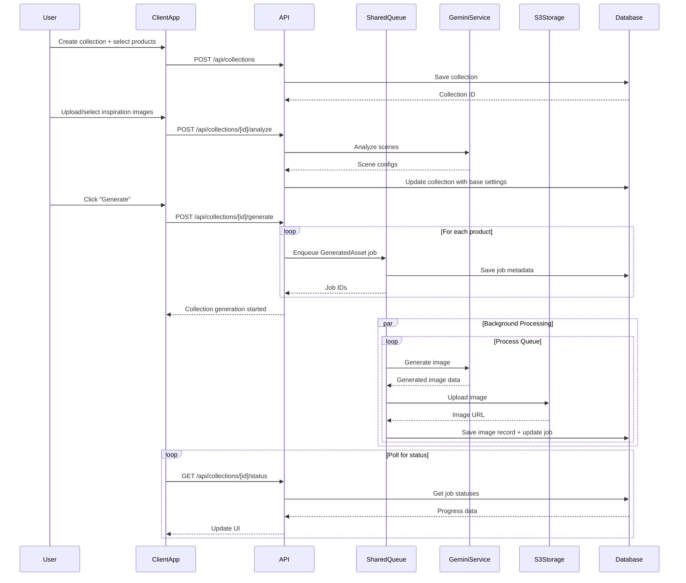

# Design Log #001: Architecture & Infrastructure

**Status**: Draft
**Created**: 2026-01-10
**Author**: Claude

---

## Background

We're building `visualizer-client` - a SaaS platform for individual clients to generate AI-powered product visualizations at scale. This platform will:
- Serve as a client-facing studio (vs. `scenergy-visualizer` which is admin-facing)
- Allow bulk generation of product images (20-500+ products per collection)
- Use AI to analyze products and match them with appropriate room contexts
- Support multiple inspiration sources (upload, Unsplash, previous generations)

## Problem

Currently, `scenergy-visualizer` is an admin portal with:
- Multi-client management (URL pattern: `/[clientId]/...`)
- Admin authentication (`adminUser` table)
- Full access to all client data
- Direct manipulation of products, images, and settings

We need a separate client-facing app that:
- Is scoped to a single client per user
- Has simplified, bulk-first UX
- Uses standard user authentication
- Reuses core generation infrastructure
- Shares common code with the admin portal

## Questions and Answers

### Q1: Should we create a shared package or duplicate code?
**A**: Create `packages/visualizer-shared` to house:
- Shared types and interfaces
- Generation services (Gemini, S3, image processing)
- Queue management logic
- Reusable React components (where applicable)

This prevents drift and ensures both apps use the same generation logic.

### Q2: How do we handle authentication differences?
**A**: Abstract authentication at the app level:
- Admin app: Uses `visualizer-auth` with `adminUser` table
- Client app: Uses `visualizer-auth` with `user` table
- Shared package: Receives `clientId` from app context, doesn't care about auth source

### Q3: Should API routes be shared or duplicated?
**A**: Hybrid approach:
- Core generation logic → Move to shared package as services
- API routes → App-specific (different auth, different scoping)
- Both apps call same underlying services

### Q4: Where should the generation queue live?
**A**: Queue logic moves to `visualizer-shared/services/generation-queue.ts`:
- Both apps import and use the same queue
- Redis keys are prefixed by app (`admin:` vs `client:`)
- Same job processing, same status polling

### Q5: How do we handle database access?
**A**: Both apps use `visualizer-db`:
- Same schema, same tables
- Row-level scoping via `clientId` column
- Client app: WHERE clientId = user.activeClientId
- Admin app: WHERE clientId = [selected client]

---

## Design

### High-Level Architecture


### Package Structure

```
monorepo/
├── apps/
│   ├── scenergy-visualizer/        # Admin portal (existing)
│   │   ├── app/
│   │   │   ├── [clientId]/         # Multi-client routes
│   │   │   └── api/
│   │   └── lib/
│   │       └── admin-specific/     # Admin-only features
│   │
│   └── visualizer-client/          # Client SaaS (new)
│       ├── app/
│       │   ├── collections/        # Main workflow
│       │   ├── products/
│       │   ├── settings/
│       │   └── api/                # Client-scoped API
│       └── lib/
│           ├── auth/               # User auth wrapper
│           └── contexts/           # ClientContext
│
├── packages/
│   ├── visualizer-shared/          # NEW: Shared code
│   │   ├── src/
│   │   │   ├── services/
│   │   │   │   ├── generation/
│   │   │   │   │   ├── queue.ts
│   │   │   │   │   ├── gemini-client.ts
│   │   │   │   │   └── prompt-builder.ts
│   │   │   │   ├── analysis/
│   │   │   │   │   ├── product-analyzer.ts
│   │   │   │   │   └── scene-analyzer.ts
│   │   │   │   └── storage/
│   │   │   │       └── image-uploader.ts
│   │   │   ├── types/
│   │   │   │   ├── generation.ts
│   │   │   │   ├── collection.ts
│   │   │   │   └── settings.ts
│   │   │   └── utils/
│   │   │       ├── prompt-helpers.ts
│   │   │       └── validators.ts
│   │   ├── package.json
│   │   └── tsconfig.json
│   │
│   ├── visualizer-auth/            # Existing
│   ├── visualizer-db/              # Existing
│   ├── visualizer-storage/         # Existing
│   └── visualizer-types/           # Existing
```

### Technology Stack

| Layer | Technology | Notes |
|-------|-----------|-------|
| **Frontend** | Next.js 14 (App Router) | Both apps |
| **UI Library** | shadcn/ui + Tailwind | Consistent design system |
| **State Management** | React Context + TanStack Query | Server state with React Query |
| **Authentication** | Better Auth | `visualizer-auth` package |
| **Database** | PostgreSQL via Drizzle ORM | `visualizer-db` package |
| **Object Storage** | AWS S3 | `visualizer-storage` package |
| **Queue/Cache** | Redis | Job queue + rate limiting |
| **AI Provider** | Google Gemini API | Image generation + analysis |
| **Image Search** | Unsplash API | Inspiration images |
| **Deployment** | Vercel | Both apps independently deployed |

### Data Flow: Image Generation



### Infrastructure Components

#### 1. Redis Queue Architecture

```typescript
// Queue key structure
admin:generation:jobs:{jobId}           // Admin app jobs
client:generation:jobs:{jobId}          // Client app jobs
admin:generation:queue                  // Admin job queue (list)
client:generation:queue                 // Client job queue (list)

// Job TTL
- Pending/Generating: No expiration (until processed)
- Completed: 24 hours
- Error: 24 hours
```

#### 2. S3 Storage Structure

```
s3://bucket-name/
├── clients/
│   └── {clientId}/
│       ├── products/
│       │   └── {productId}/
│       │       └── original.jpg
│       ├── generated/
│       │   └── {imageId}.jpg
│       └── inspirations/
│           └── {inspirationId}.jpg
```

#### 3. Database Schema Extensions

New tables needed:

```sql
-- Collections table
CREATE TABLE collections (
  id UUID PRIMARY KEY DEFAULT gen_random_uuid(),
  client_id UUID NOT NULL REFERENCES clients(id),
  name TEXT NOT NULL,
  status TEXT NOT NULL, -- 'selecting' | 'analyzing' | 'ready' | 'generating' | 'completed'

  -- Product selection
  selected_product_ids UUID[] NOT NULL,

  -- Analysis results
  product_analysis JSONB,

  -- Inspiration images
  inspiration_images JSONB,

  -- Base generation settings (from inspiration analysis)
  base_settings JSONB,

  created_at TIMESTAMPTZ NOT NULL DEFAULT NOW(),
  updated_at TIMESTAMPTZ NOT NULL DEFAULT NOW()
);

-- GeneratedAssets table (replaces concept of "Job" for persistence)
CREATE TABLE generated_assets (
  id UUID PRIMARY KEY DEFAULT gen_random_uuid(),
  client_id UUID NOT NULL REFERENCES clients(id),
  collection_id UUID REFERENCES collections(id),
  product_id UUID NOT NULL REFERENCES products(id),

  -- Asset metadata
  type TEXT NOT NULL, -- 'image' | 'video' (future)
  status TEXT NOT NULL, -- 'pending' | 'generating' | 'completed' | 'error'

  -- Generation config (full FlowGenerationSettings)
  settings JSONB NOT NULL,

  -- Result
  image_id UUID REFERENCES images(id),
  error_message TEXT,

  -- Queue metadata
  job_id TEXT, -- Redis job ID (transient)
  progress INTEGER DEFAULT 0, -- 0-100

  -- Pinning (for reuse as inspiration)
  pinned BOOLEAN DEFAULT FALSE,

  created_at TIMESTAMPTZ NOT NULL DEFAULT NOW(),
  updated_at TIMESTAMPTZ NOT NULL DEFAULT NOW(),
  completed_at TIMESTAMPTZ
);

-- Indexes
CREATE INDEX idx_generated_assets_collection ON generated_assets(collection_id);
CREATE INDEX idx_generated_assets_status ON generated_assets(status);
CREATE INDEX idx_generated_assets_pinned ON generated_assets(client_id, pinned) WHERE pinned = TRUE;
```

### Shared Package API

```typescript
// packages/visualizer-shared/src/index.ts
export * from './services/generation/queue';
export * from './services/generation/gemini-client';
export * from './services/generation/prompt-builder';
export * from './services/analysis/product-analyzer';
export * from './services/analysis/scene-analyzer';
export * from './types/generation';
export * from './types/collection';
export * from './types/settings';

// Core service exports
export { GenerationQueue } from './services/generation/queue';
export { ProductAnalyzer } from './services/analysis/product-analyzer';
export { SceneAnalyzer } from './services/analysis/scene-analyzer';
```

### Environment Configuration

Both apps need these environment variables:

```bash
# Database
DATABASE_URL=postgresql://...

# Redis
REDIS_URL=redis://...

# AWS S3
AWS_ACCESS_KEY_ID=...
AWS_SECRET_ACCESS_KEY=...
AWS_REGION=us-east-1
AWS_S3_BUCKET=epox-visualizer

# Google Gemini
GEMINI_API_KEY=...

# Unsplash (client app only)
UNSPLASH_ACCESS_KEY=...

# Better Auth
BETTER_AUTH_SECRET=...
BETTER_AUTH_URL=http://localhost:3000

# App-specific
APP_ENV=admin|client  # Determines Redis key prefix
```

---

## Implementation Plan

### Phase 1: Create Shared Package Foundation
1. Create `packages/visualizer-shared` directory
2. Set up package.json with dependencies
3. Configure TypeScript
4. Create basic directory structure

### Phase 2: Extract Core Services
1. Move generation queue logic to shared package
2. Move Gemini client to shared package
3. Move prompt builder to shared package
4. Extract S3 upload utilities
5. Create analyzer services (product, scene)

### Phase 3: Extract Shared Types
1. Move generation types (FlowGenerationSettings, etc.)
2. Create Collection types
3. Create GeneratedAsset types
4. Export all types from shared package

### Phase 4: Create Client App Structure
1. Initialize Next.js app in `apps/visualizer-client`
2. Set up authentication with Better Auth
3. Create ClientContext for user → clientId mapping
4. Configure environment variables

### Phase 5: Database Migrations
1. Create `collections` table
2. Create `generated_assets` table
3. Add indexes
4. Create Drizzle schema definitions

### Phase 6: Build API Layer
1. Product listing/filtering API
2. Collection CRUD API
3. Product analysis API
4. Scene analysis API
5. Generation trigger API
6. Status polling API

### Phase 7: Build UI Components
(See Design Log #005 for details)

### Phase 8: Refactor Admin App
1. Update scenergy-visualizer to import from visualizer-shared
2. Remove duplicated code
3. Test that admin app still works

---

## Examples

### ✅ Good: Shared Service Usage

```typescript
// apps/visualizer-client/app/api/collections/[id]/generate/route.ts
import { GenerationQueue } from '@repo/visualizer-shared';
import { db } from '@repo/visualizer-db';

export async function POST(req: Request, { params }: { params: { id: string } }) {
  const collection = await db.collections.findById(params.id);
  const queue = new GenerationQueue({ prefix: 'client' });

  for (const productId of collection.selectedProductIds) {
    const settings = buildProductSettings(collection, productId);
    const jobId = await queue.enqueue({
      clientId: collection.clientId,
      productId,
      settings,
    });

    await db.generatedAssets.create({
      collectionId: collection.id,
      productId,
      jobId,
      settings,
      status: 'pending',
    });
  }

  return Response.json({ success: true });
}
```

### ❌ Bad: Hardcoding App-Specific Logic in Shared Package

```typescript
// packages/visualizer-shared/src/services/queue.ts
export class GenerationQueue {
  async enqueue(request: GenerationRequest) {
    // ❌ Don't check auth in shared package
    const isAdmin = await checkAdminAuth();

    // ❌ Don't hardcode app logic
    if (appType === 'admin') {
      // different logic
    }
  }
}
```

### ✅ Good: App-Specific Logic in App Layer

```typescript
// apps/visualizer-client/lib/contexts/ClientContext.tsx
export function ClientProvider({ children }: { children: React.ReactNode }) {
  const { user } = useAuth();

  // App-specific: derive clientId from user's membership
  const clientId = user?.memberships?.[0]?.clientId;

  return (
    <ClientContext.Provider value={{ clientId }}>
      {children}
    </ClientContext.Provider>
  );
}
```

---

## Trade-offs

### Shared Package vs. Monolithic
**Chosen**: Shared package
**Rationale**:
- ✅ Single source of truth for generation logic
- ✅ Easier to keep admin and client apps in sync
- ✅ Can version and test shared code independently
- ❌ More complex dependency management
- ❌ Need to avoid app-specific logic in shared package

### Redis vs. Database for Queue
**Chosen**: Redis with database persistence
**Rationale**:
- ✅ Fast queue operations
- ✅ TTL-based cleanup for transient data
- ✅ Database stores permanent records (GeneratedAssets)
- ✅ Can rebuild queue from database if Redis fails
- ❌ Two sources of truth (need sync strategy)

### Separate Apps vs. Single App with Roles
**Chosen**: Separate apps
**Rationale**:
- ✅ Clearer separation of concerns
- ✅ Can deploy independently
- ✅ Different UX optimized for each persona
- ✅ Easier to reason about permissions
- ❌ More deployment complexity
- ❌ Some code duplication in routing

### Polling vs. WebSockets for Status Updates
**Chosen**: Polling (initially)
**Rationale**:
- ✅ Simpler to implement
- ✅ Works with serverless (Vercel)
- ✅ No connection management needed
- ❌ More API requests
- ❌ Slight delay in status updates
- 🔄 Future: Can add WebSocket support later

---

## Open Questions

1. **Multi-client support**: Should a single user be able to belong to multiple clients?
   - For MVP: Single client per user
   - Future: Support client switching

2. **Rate limiting**: How to prevent abuse?
   - Proposal: 100 generations/day per client on free tier
   - Enterprise: Unlimited or higher limits

3. **Webhooks**: Should we notify clients when generation completes?
   - For MVP: No webhooks, just in-app notifications
   - Future: Webhook support for integrations

4. **Video support**: When do we add video generation?
   - Not in MVP
   - GeneratedAsset type field supports it for future

---

## Success Criteria

- [ ] Both apps can generate images using the same underlying services
- [ ] No duplicated generation logic between apps
- [ ] Client app authenticates users and scopes to their client
- [ ] Admin app retains all existing functionality
- [ ] Shared package has <5% coupling to specific app concerns
- [ ] All generation jobs persist to database (not just Redis)
- [ ] Can recover queue state from database after Redis restart
