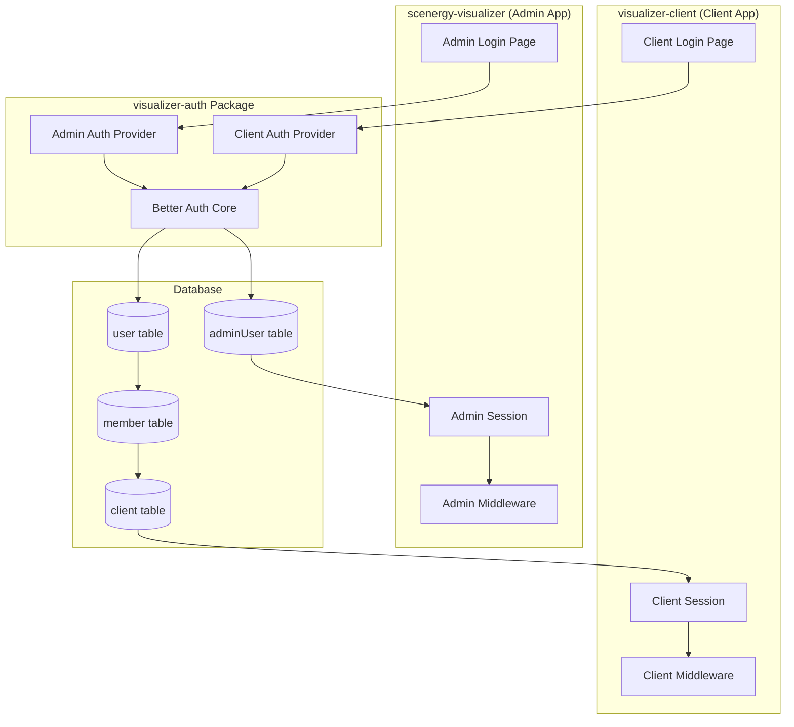
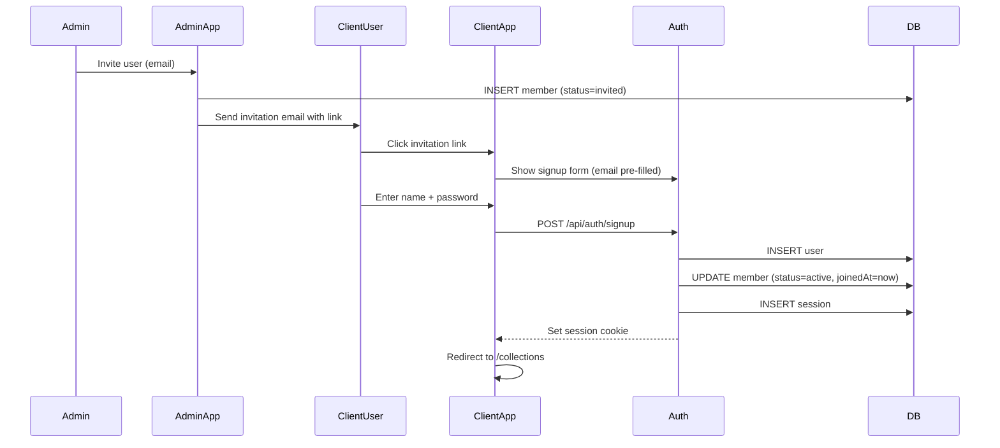
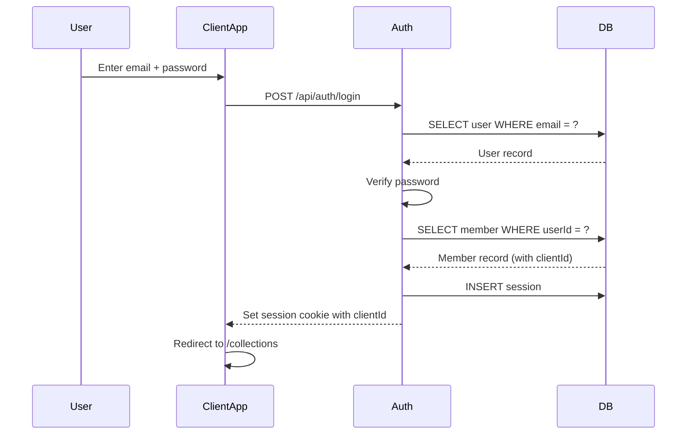
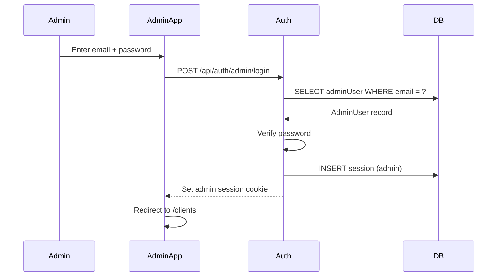

# Design Log #002: Authentication & Authorization

**Status**: Draft
**Created**: 2026-01-10
**Author**: Claude
**Related**: Design Log #001 (Architecture)

---

## Background

The platform has two distinct user personas:
1. **Admins** - Internal team managing multiple clients (scenergy-visualizer app)
2. **Client Users** - External users who belong to a single client (visualizer-client app)

Currently, only admin authentication exists via the `adminUser` table. We need to add client user authentication while keeping both systems isolated.

## Problem

We need an authentication and authorization system that:
- Supports two different user types without mixing concerns
- Uses the existing `visualizer-auth` package (Better Auth)
- Scopes all data access to the authenticated user's client
- Prevents cross-client data leakage
- Supports future features (team collaboration, role-based access)

## Questions and Answers

### Q1: Should we use separate auth tables or a unified user table with roles?
**A**: Separate tables:
- `adminUser` - Existing, for internal team
- `user` - New, for client users

**Rationale**:
- Different access patterns (admins see all clients, users see one)
- Different feature sets (admins manage clients, users generate)
- Easier to secure (no accidental role confusion)
- Cleaner separation for future auth requirements

### Q2: How do we handle user-to-client association?
**A**: Use `member` table (many-to-many):
```
user ↔ member ↔ client
```
- MVP: One user = one client (one membership)
- Future: One user can belong to multiple clients (multiple memberships)
- The `member` record can store role information (`owner`, `editor`, `viewer`)

### Q3: Should client users be able to create clients?
**A**: No, not in MVP:
- Admins create clients via scenergy-visualizer
- Admins invite users to clients
- Users receive invitation email → sign up → auto-associated with client

Future: Self-service client creation with billing

### Q4: How do we prevent client users from accessing other clients' data?
**A**: Multi-layered approach:
1. **App-level**: ClientContext provides activeClientId from session
2. **API-level**: All queries filtered by `WHERE clientId = session.activeClientId`
3. **Database-level**: Row-level security policies (future enhancement)
4. **Middleware**: Authentication middleware validates clientId matches user's membership

### Q5: What happens if a user belongs to multiple clients?
**A**: For MVP:
- User must have exactly one membership
- Reject signup/login if user has 0 or 2+ memberships
- Error message: "Please contact support"

Future phase:
- Client switcher in UI
- `session.activeClientId` to track current client
- Update endpoint to switch between clients

---

## Design

### Authentication Architecture



### Database Schema

```typescript
// Existing tables (for reference)
interface Client {
  id: string;
  name: string;
  slug: string;
  createdAt: Date;
  updatedAt: Date;
}

interface AdminUser {
  id: string;
  email: string;
  name: string;
  passwordHash: string;
  createdAt: Date;
  updatedAt: Date;
}

// New tables
interface User {
  id: string;
  email: string;
  name: string;
  emailVerified: boolean;
  image?: string;
  createdAt: Date;
  updatedAt: Date;
}

interface Member {
  id: string;
  userId: string;          // FK: user.id
  clientId: string;        // FK: client.id
  role: 'owner' | 'editor' | 'viewer';
  status: 'active' | 'invited' | 'suspended';
  invitedBy?: string;      // FK: adminUser.id
  invitedAt?: Date;
  joinedAt?: Date;
  createdAt: Date;
  updatedAt: Date;
}

interface Session {
  id: string;
  userId: string;
  expiresAt: Date;
  createdAt: Date;
}

interface Account {
  id: string;
  userId: string;
  provider: 'credentials' | 'google' | 'github';
  providerAccountId: string;
  // OAuth fields...
}
```

### SQL Schema

```sql
-- Users table (client users)
CREATE TABLE users (
  id UUID PRIMARY KEY DEFAULT gen_random_uuid(),
  email TEXT UNIQUE NOT NULL,
  name TEXT NOT NULL,
  email_verified BOOLEAN DEFAULT FALSE,
  image TEXT,
  created_at TIMESTAMPTZ NOT NULL DEFAULT NOW(),
  updated_at TIMESTAMPTZ NOT NULL DEFAULT NOW()
);

-- Members table (user ↔ client association)
CREATE TABLE members (
  id UUID PRIMARY KEY DEFAULT gen_random_uuid(),
  user_id UUID NOT NULL REFERENCES users(id) ON DELETE CASCADE,
  client_id UUID NOT NULL REFERENCES clients(id) ON DELETE CASCADE,
  role TEXT NOT NULL DEFAULT 'editor',
  status TEXT NOT NULL DEFAULT 'invited',
  invited_by UUID REFERENCES admin_users(id),
  invited_at TIMESTAMPTZ,
  joined_at TIMESTAMPTZ,
  created_at TIMESTAMPTZ NOT NULL DEFAULT NOW(),
  updated_at TIMESTAMPTZ NOT NULL DEFAULT NOW(),

  UNIQUE(user_id, client_id)
);

-- Better Auth sessions
CREATE TABLE sessions (
  id UUID PRIMARY KEY DEFAULT gen_random_uuid(),
  user_id UUID NOT NULL REFERENCES users(id) ON DELETE CASCADE,
  expires_at TIMESTAMPTZ NOT NULL,
  created_at TIMESTAMPTZ NOT NULL DEFAULT NOW()
);

-- Better Auth accounts (for OAuth)
CREATE TABLE accounts (
  id UUID PRIMARY KEY DEFAULT gen_random_uuid(),
  user_id UUID NOT NULL REFERENCES users(id) ON DELETE CASCADE,
  provider TEXT NOT NULL,
  provider_account_id TEXT NOT NULL,
  access_token TEXT,
  refresh_token TEXT,
  expires_at TIMESTAMPTZ,
  token_type TEXT,
  scope TEXT,
  created_at TIMESTAMPTZ NOT NULL DEFAULT NOW(),
  updated_at TIMESTAMPTZ NOT NULL DEFAULT NOW(),

  UNIQUE(provider, provider_account_id)
);

-- Indexes
CREATE INDEX idx_members_user_id ON members(user_id);
CREATE INDEX idx_members_client_id ON members(client_id);
CREATE INDEX idx_members_status ON members(status);
CREATE INDEX idx_sessions_user_id ON sessions(user_id);
CREATE INDEX idx_sessions_expires_at ON sessions(expires_at);
```

### Role Definitions

| Role | Permissions |
|------|-------------|
| **owner** | Full access: manage products, generate images, invite users, billing |
| **editor** | Create/edit collections, generate images, manage products |
| **viewer** | View collections, download images (read-only) |

MVP: Only `editor` role implemented. All invited users are editors.

Future: Add owner/viewer roles with permission checks.

### Authentication Flows

#### 1. Client User Signup (Invitation-based)



#### 2. Client User Login



#### 3. Admin Login (Existing)



### Session Structure

#### Client User Session
```typescript
interface ClientSession {
  userId: string;
  email: string;
  name: string;
  clientId: string;         // From member record
  role: 'owner' | 'editor' | 'viewer';
  expiresAt: Date;
}
```

#### Admin Session
```typescript
interface AdminSession {
  adminUserId: string;
  email: string;
  name: string;
  expiresAt: Date;
  // No clientId - admins access all clients via URL params
}
```

### Authorization Middleware

#### Client App Middleware

```typescript
// apps/visualizer-client/middleware.ts
import { getSession } from '@repo/visualizer-auth/client';

export async function middleware(request: NextRequest) {
  const session = await getSession(request);

  // Require auth for all routes except /login, /signup
  if (!session && !isPublicRoute(request)) {
    return NextResponse.redirect(new URL('/login', request.url));
  }

  // Validate user has exactly one client membership
  if (session && !session.clientId) {
    return NextResponse.redirect(new URL('/error/no-client', request.url));
  }

  // Inject clientId into request headers for API routes
  const requestHeaders = new Headers(request.headers);
  requestHeaders.set('x-client-id', session.clientId);

  return NextResponse.next({
    request: {
      headers: requestHeaders,
    },
  });
}
```

#### API Route Authorization

```typescript
// apps/visualizer-client/app/api/collections/route.ts
import { getSession } from '@repo/visualizer-auth/client';
import { db } from '@repo/visualizer-db';

export async function GET(request: Request) {
  const session = await getSession(request);

  if (!session) {
    return Response.json({ error: 'Unauthorized' }, { status: 401 });
  }

  // Get collections ONLY for this user's client
  const collections = await db.collections.findMany({
    where: {
      clientId: session.clientId,  // 🔒 Critical: scope to user's client
    },
  });

  return Response.json(collections);
}
```

### ClientContext Provider

```typescript
// apps/visualizer-client/lib/contexts/ClientContext.tsx
'use client';

import { createContext, useContext, ReactNode } from 'react';
import { useSession } from '@repo/visualizer-auth/client';

interface ClientContextValue {
  clientId: string;
  role: 'owner' | 'editor' | 'viewer';
  loading: boolean;
}

const ClientContext = createContext<ClientContextValue | null>(null);

export function ClientProvider({ children }: { children: ReactNode }) {
  const { data: session, isLoading } = useSession();

  if (isLoading) {
    return <div>Loading...</div>;
  }

  if (!session?.clientId) {
    throw new Error('User not associated with a client');
  }

  return (
    <ClientContext.Provider
      value={{
        clientId: session.clientId,
        role: session.role,
        loading: false,
      }}
    >
      {children}
    </ClientContext.Provider>
  );
}

export function useClient() {
  const context = useContext(ClientContext);
  if (!context) {
    throw new Error('useClient must be used within ClientProvider');
  }
  return context;
}
```

### Security Checklist

- [ ] All API routes validate session exists
- [ ] All database queries filter by `clientId = session.clientId`
- [ ] No client can access another client's data
- [ ] Session cookies are httpOnly and secure
- [ ] CSRF tokens on all mutations
- [ ] Rate limiting on auth endpoints (prevent brute force)
- [ ] Email verification required before full access
- [ ] Password requirements enforced (min 8 chars, complexity)
- [ ] Failed login attempts logged and monitored
- [ ] Sessions expire after 7 days (configurable)

---

## Implementation Plan

### Phase 1: Database Setup
1. Create `users` table migration
2. Create `members` table migration
3. Create `sessions` table migration
4. Create `accounts` table migration (OAuth support)
5. Run migrations in dev environment

### Phase 2: Auth Package Configuration
1. Configure Better Auth for client users
2. Set up email provider (for invitations)
3. Configure OAuth providers (Google, GitHub) - optional
4. Create auth client helpers (`getSession`, `login`, `signup`)

### Phase 3: Client App Auth Implementation
1. Create `/login` page with form
2. Create `/signup` page (invitation flow)
3. Implement auth API routes (`/api/auth/[...all]`)
4. Set up middleware for route protection
5. Create ClientContext provider

### Phase 4: Invitation System
1. Admin UI: Invite user form (in scenergy-visualizer)
2. API: Create member with `status=invited`
3. Email service: Send invitation with signup link
4. Signup flow: Pre-fill email, validate invitation token
5. Activate member on successful signup

### Phase 5: Security Hardening
1. Add CSRF protection
2. Add rate limiting
3. Add session expiration
4. Add email verification
5. Audit all API routes for clientId scoping

### Phase 6: Testing
1. Unit tests for auth helpers
2. Integration tests for login/signup flows
3. E2E tests for invitation flow
4. Security tests (attempt cross-client access)

---

## Examples

### ✅ Good: Proper Client Scoping

```typescript
// API route that correctly scopes to user's client
export async function GET(request: Request) {
  const session = await getSession(request);

  const products = await db.products.findMany({
    where: {
      clientId: session.clientId,  // ✅ Always scope to user's client
    },
  });

  return Response.json(products);
}
```

### ❌ Bad: Missing Client Scoping

```typescript
// Dangerous! Returns ALL products across ALL clients
export async function GET(request: Request) {
  const session = await getSession(request);

  const products = await db.products.findMany();  // ❌ No where clause!

  return Response.json(products);
}
```

### ✅ Good: Using ClientContext

```typescript
'use client';

import { useClient } from '@/lib/contexts/ClientContext';

export function CollectionList() {
  const { clientId } = useClient();

  // TanStack Query automatically includes clientId in cache key
  const { data: collections } = useQuery({
    queryKey: ['collections', clientId],
    queryFn: () => fetchCollections(clientId),
  });

  return <div>...</div>;
}
```

### ✅ Good: Invitation Email Template

```tsx
// Email sent when admin invites a user
export function InvitationEmail({ clientName, inviterName, signupLink }: Props) {
  return (
    <Email>
      <h1>You've been invited to {clientName}</h1>
      <p>{inviterName} has invited you to join their team on Epox Visualizer.</p>
      <p>Create your account to start generating beautiful product visualizations.</p>
      <Button href={signupLink}>Accept Invitation</Button>
      <p>This invitation expires in 7 days.</p>
    </Email>
  );
}
```

---

## Trade-offs

### Invitation-Only vs. Self-Service Signup
**Chosen**: Invitation-only (MVP)
**Rationale**:
- ✅ Admins control who joins
- ✅ Prevents spam/abuse
- ✅ Ensures user-client association is correct
- ❌ Extra step for onboarding
- ❌ Requires admin involvement

Future: Self-service with billing integration

### JWT vs. Session Cookies
**Chosen**: Session cookies (Better Auth default)
**Rationale**:
- ✅ Can revoke sessions server-side
- ✅ Smaller cookie size
- ✅ Easier to add session metadata (clientId)
- ❌ Database hit on each request
- ❌ Harder to scale horizontally

Mitigation: Use Redis for session storage

### Single Client vs. Multi-Client per User
**Chosen**: Single client (MVP)
**Rationale**:
- ✅ Simpler UX (no client switcher)
- ✅ Simpler auth logic
- ✅ Clearer scoping
- ❌ Less flexible for users who work with multiple brands
- 🔄 Easy to add multi-client support later (just update member table query)

---

## Open Questions

1. **Password reset flow**: Should we implement it in MVP?
   - Proposal: Yes, use Better Auth's built-in reset flow

2. **OAuth providers**: Which ones to support?
   - Proposal: Google (high priority), GitHub (nice-to-have)

3. **Session duration**: How long should sessions last?
   - Proposal: 7 days (remember me), 1 day (default)

4. **Email verification**: Required or optional?
   - Proposal: Required (mark as unverified until email clicked)

5. **Member deactivation**: What happens to their generated assets?
   - Proposal: Assets remain (owned by client), but user loses access

---

## Success Criteria

- [ ] Client users can sign up via invitation link
- [ ] Client users can log in and see only their client's data
- [ ] All API routes properly scope queries by clientId
- [ ] Cannot access other clients' data via URL manipulation
- [ ] Admins can invite users to clients
- [ ] Email invitations are sent and work correctly
- [ ] Password reset flow works
- [ ] Sessions expire and require re-login
- [ ] All auth flows work on both localhost and production domains
