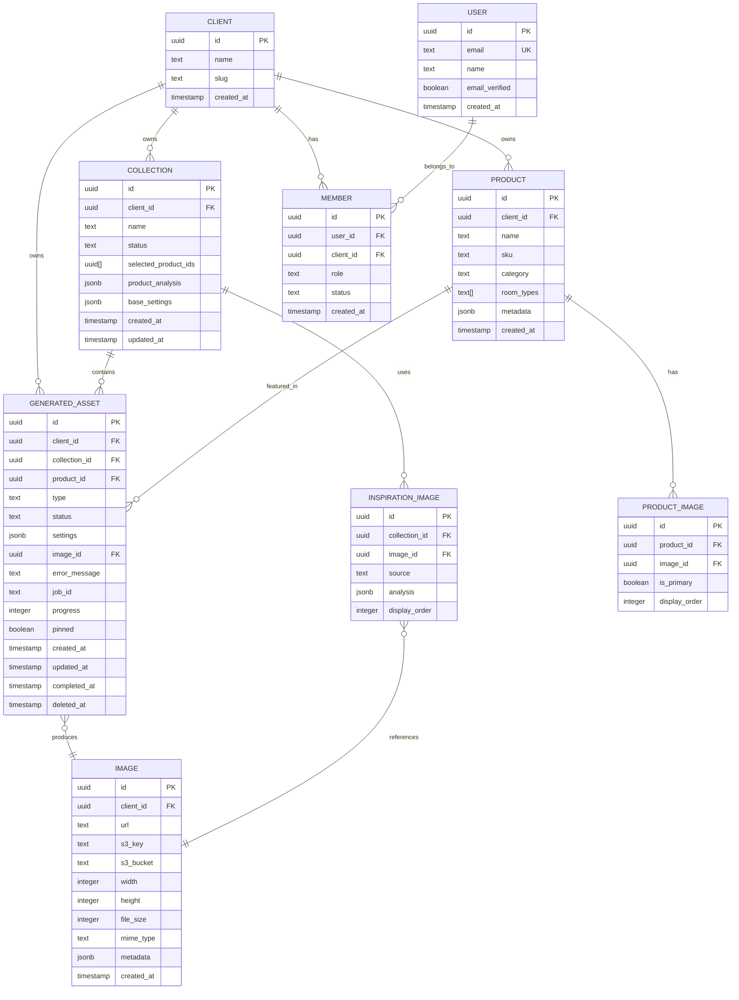

# Design Log #003: Data Model & Terminology

**Status**: Draft
**Created**: 2026-01-10
**Author**: Claude
**Related**: Design Log #001 (Architecture), Design Log #002 (Authentication)

---

## Background

The current codebase uses "Job" terminology (`ImageGenerationJob`, `VisualizationJob`) to represent transient work items in the generation queue. However, these are actually **persisted assets** (images, future videos) that:
- Are valuable outputs, not just temporary jobs
- Need long-term storage and retrieval
- Can be reused as inspiration for future generations
- Are the primary deliverable of the platform

The terminology "Job" is misleading and creates confusion between:
- Queue mechanics (processing work)
- Business value (generated visual assets)

## Problem

We need a comprehensive data model that:
1. **Renames** "Job" → "GeneratedAsset" to reflect the true nature of these entities
2. **Clarifies** the distinction between transient queue items vs. persistent database records
3. **Supports** both image and video generation (future-proof)
4. **Organizes** assets into Collections for bulk workflows
5. **Enables** asset reuse (pinning for inspiration)
6. **Tracks** generation settings for reproducibility

## Questions and Answers

### Q1: Should "GeneratedAsset" replace "Job" everywhere?
**A**: No, maintain two concepts:
- **GeneratedAsset** - Database record (persistent, valuable)
- **QueueJob** - Redis record (transient, processing metadata)

Relationship: `GeneratedAsset.jobId → QueueJob.id`

### Q2: How do we model Collections vs. individual generations?
**A**: Collections are first-class entities:
- User creates a Collection (selects products, inspirations, settings)
- Collection spawns N GeneratedAssets (one per product)
- Each GeneratedAsset links back to its Collection
- Individual generations (outside collections) have `collectionId = null`

### Q3: What's the lifecycle of a GeneratedAsset?
**A**:
```
Draft → Pending → Generating → Completed
                            → Error
```
- **Draft**: Created but not enqueued yet
- **Pending**: Enqueued, waiting for processing
- **Generating**: Currently being processed
- **Completed**: Successfully generated, has imageId
- **Error**: Failed, has error message

### Q4: How do we handle regeneration (same product, different settings)?
**A**: Create a new GeneratedAsset:
- Each generation is immutable once completed
- Re-generating creates a new asset with a new ID
- Original asset remains for historical tracking
- UI can show "previous versions" grouped by productId

### Q5: Should we soft-delete or hard-delete GeneratedAssets?
**A**: Soft-delete:
- Add `deletedAt` timestamp
- Keep image in S3 for 30 days (lifecycle policy)
- Hard-delete from database after 30 days (cron job)
- Allows "undo" and reduces accidental data loss

---

## Design

### Terminology Mapping

| Old Term | New Term | Definition |
|----------|----------|------------|
| ImageGenerationJob | GeneratedAsset (type: image) | A persisted generated image |
| VisualizationJob | GeneratedAsset (type: 3d_render) | A persisted 3D visualization |
| Job Queue | Generation Queue | The processing system |
| Job ID | Asset ID (DB) / Job ID (Redis) | Disambiguate persistence vs. queue |
| enqueue() | createGenerationRequest() | More descriptive action |
| jobStatus | asset.status | Clearer naming |

### Core Entities



### Database Schema (TypeScript)

```typescript
// ====================
// Core Entities
// ====================

interface Client {
  id: string;
  name: string;
  slug: string;
  settings?: ClientSettings;
  createdAt: Date;
  updatedAt: Date;
}

interface ClientSettings {
  generationDefaults?: Partial<FlowGenerationSettings>;
  monthlyGenerationLimit?: number;
  allowedFileTypes?: string[];
}

interface Product {
  id: string;
  clientId: string;
  name: string;
  sku: string;
  category: string;
  roomTypes: string[];
  metadata?: ProductMetadata;
  createdAt: Date;
  updatedAt: Date;
}

interface ProductMetadata {
  dimensions?: { width: number; height: number; depth: number; unit: string };
  materials?: string[];
  colors?: string[];
  tags?: string[];
  customFields?: Record<string, unknown>;
}

interface Image {
  id: string;
  clientId: string;
  url: string;
  s3Key: string;
  s3Bucket: string;
  width: number;
  height: number;
  fileSize: number;
  mimeType: string;
  metadata?: ImageMetadata;
  createdAt: Date;
}

interface ImageMetadata {
  source?: 'upload' | 'generated' | 'unsplash';
  originalFilename?: string;
  altText?: string;
  caption?: string;
  exif?: Record<string, unknown>;
}

// ====================
// Collection Workflow
// ====================

interface Collection {
  id: string;
  clientId: string;
  name: string;
  status: CollectionStatus;

  // Step 1: Product Selection
  selectedProductIds: string[];

  // Step 2: Product Analysis (from AI)
  productAnalysis?: ProductAnalysisResult;

  // Step 3: Inspiration Images
  inspirationImages?: InspirationImage[];

  // Step 4: Base Settings (derived from inspiration analysis)
  baseSettings?: Partial<FlowGenerationSettings>;

  createdAt: Date;
  updatedAt: Date;
  completedAt?: Date;
}

type CollectionStatus =
  | 'draft'          // Being created
  | 'analyzing'      // AI analyzing products
  | 'ready'          // Ready to generate
  | 'generating'     // Generation in progress
  | 'completed'      // All assets generated
  | 'error';         // Generation failed

interface InspirationImage {
  id: string;
  collectionId: string;
  imageId: string;           // FK: images.id
  source: 'upload' | 'unsplash' | 'library';
  analysis?: SceneAnalysis;  // AI-extracted scene attributes
  displayOrder: number;
  createdAt: Date;
}

interface ProductAnalysisResult {
  roomTypeDistribution: Record<string, number>;
  productTypes: string[];
  dominantCategory: string;
  suggestedStyles: string[];
  recommendedInspirationKeywords: string[];
  productRoomAssignments: Record<string, string>; // productId → roomType
  analyzedAt: Date;
}

interface SceneAnalysis {
  environment: 'indoor' | 'outdoor' | 'mixed';
  suggestedRoomTypes: string[];
  style: string;
  lighting: string;
  colorPalette: string[];
  materials: {
    floor?: string;
    walls?: string;
    ceiling?: string;
  };
  props: string[];
  mood: string;
}

// ====================
// Generated Assets (The Core Entity)
// ====================

interface GeneratedAsset {
  id: string;
  clientId: string;
  collectionId: string | null;  // null = standalone generation
  productId: string;

  // Asset type (extensible for future media types)
  type: AssetType;

  // Lifecycle
  status: AssetStatus;
  progress: number;              // 0-100

  // Generation Configuration
  settings: FlowGenerationSettings;  // Full settings used for this generation

  // Result
  imageId: string | null;        // FK: images.id (populated when completed)
  errorMessage: string | null;   // Populated when status = 'error'

  // Queue Integration (transient)
  jobId: string | null;          // Redis queue job ID (can be null after completion)

  // Features
  pinned: boolean;               // Can be reused as inspiration

  // Timestamps
  createdAt: Date;
  updatedAt: Date;
  completedAt: Date | null;
  deletedAt: Date | null;        // Soft delete
}

type AssetType =
  | 'image'         // Static product image
  | 'video'         // Future: video generation
  | '3d_render';    // Future: 3D model render

type AssetStatus =
  | 'draft'         // Created but not enqueued
  | 'pending'       // Enqueued, waiting for worker
  | 'generating'    // Worker processing
  | 'completed'     // Successfully generated
  | 'error';        // Failed

// ====================
// Generation Settings (Reused from existing system)
// ====================

interface FlowGenerationSettings {
  roomType: string;
  style: string;
  lighting: string;
  colorScheme: string;
  cameraAngle: string;
  aspectRatio: string;
  surroundings: string;
  props: string[];
  sceneImageUrl?: string;        // Inspiration image URL
  varietyLevel: number;          // 1-10
  matchProductColors: boolean;
  promptText?: string;           // Custom prompt override
}
```

### SQL Schema

```sql
-- ====================
-- Collections
-- ====================
CREATE TABLE collections (
  id UUID PRIMARY KEY DEFAULT gen_random_uuid(),
  client_id UUID NOT NULL REFERENCES clients(id) ON DELETE CASCADE,
  name TEXT NOT NULL,
  status TEXT NOT NULL DEFAULT 'draft',

  -- Product selection
  selected_product_ids UUID[] NOT NULL DEFAULT '{}',

  -- Analysis results (JSONB)
  product_analysis JSONB,

  -- Base generation settings (JSONB)
  base_settings JSONB,

  -- Timestamps
  created_at TIMESTAMPTZ NOT NULL DEFAULT NOW(),
  updated_at TIMESTAMPTZ NOT NULL DEFAULT NOW(),
  completed_at TIMESTAMPTZ,

  CONSTRAINT valid_status CHECK (status IN ('draft', 'analyzing', 'ready', 'generating', 'completed', 'error'))
);

CREATE INDEX idx_collections_client_id ON collections(client_id);
CREATE INDEX idx_collections_status ON collections(status);

-- ====================
-- Inspiration Images
-- ====================
CREATE TABLE inspiration_images (
  id UUID PRIMARY KEY DEFAULT gen_random_uuid(),
  collection_id UUID NOT NULL REFERENCES collections(id) ON DELETE CASCADE,
  image_id UUID NOT NULL REFERENCES images(id) ON DELETE CASCADE,
  source TEXT NOT NULL,
  analysis JSONB,
  display_order INTEGER NOT NULL DEFAULT 0,
  created_at TIMESTAMPTZ NOT NULL DEFAULT NOW(),

  CONSTRAINT valid_source CHECK (source IN ('upload', 'unsplash', 'library'))
);

CREATE INDEX idx_inspiration_images_collection ON inspiration_images(collection_id);

-- ====================
-- Generated Assets (The Main Entity)
-- ====================
CREATE TABLE generated_assets (
  id UUID PRIMARY KEY DEFAULT gen_random_uuid(),
  client_id UUID NOT NULL REFERENCES clients(id) ON DELETE CASCADE,
  collection_id UUID REFERENCES collections(id) ON DELETE SET NULL,
  product_id UUID NOT NULL REFERENCES products(id) ON DELETE CASCADE,

  -- Asset metadata
  type TEXT NOT NULL DEFAULT 'image',
  status TEXT NOT NULL DEFAULT 'draft',
  progress INTEGER NOT NULL DEFAULT 0,

  -- Generation config (full FlowGenerationSettings as JSONB)
  settings JSONB NOT NULL,

  -- Result
  image_id UUID REFERENCES images(id) ON DELETE SET NULL,
  error_message TEXT,

  -- Queue integration (transient)
  job_id TEXT,

  -- Features
  pinned BOOLEAN NOT NULL DEFAULT FALSE,

  -- Timestamps
  created_at TIMESTAMPTZ NOT NULL DEFAULT NOW(),
  updated_at TIMESTAMPTZ NOT NULL DEFAULT NOW(),
  completed_at TIMESTAMPTZ,
  deleted_at TIMESTAMPTZ,

  -- Constraints
  CONSTRAINT valid_type CHECK (type IN ('image', 'video', '3d_render')),
  CONSTRAINT valid_status CHECK (status IN ('draft', 'pending', 'generating', 'completed', 'error')),
  CONSTRAINT valid_progress CHECK (progress >= 0 AND progress <= 100),
  CONSTRAINT completed_has_image CHECK (
    (status = 'completed' AND image_id IS NOT NULL) OR
    (status != 'completed')
  ),
  CONSTRAINT error_has_message CHECK (
    (status = 'error' AND error_message IS NOT NULL) OR
    (status != 'error')
  )
);

-- Indexes for efficient queries
CREATE INDEX idx_generated_assets_client ON generated_assets(client_id);
CREATE INDEX idx_generated_assets_collection ON generated_assets(collection_id);
CREATE INDEX idx_generated_assets_product ON generated_assets(product_id);
CREATE INDEX idx_generated_assets_status ON generated_assets(status);
CREATE INDEX idx_generated_assets_type ON generated_assets(type);
CREATE INDEX idx_generated_assets_pinned ON generated_assets(client_id, pinned) WHERE pinned = TRUE AND deleted_at IS NULL;
CREATE INDEX idx_generated_assets_active ON generated_assets(client_id, status) WHERE deleted_at IS NULL;

-- Partial index for active generations
CREATE INDEX idx_generated_assets_active_generations ON generated_assets(client_id, status, created_at)
  WHERE status IN ('pending', 'generating') AND deleted_at IS NULL;
```

### Drizzle Schema (TypeScript ORM)

```typescript
// packages/visualizer-db/src/schema/generated-assets.ts
import { pgTable, uuid, text, integer, boolean, timestamp, jsonb, index } from 'drizzle-orm/pg-core';
import { clients } from './clients';
import { collections } from './collections';
import { products } from './products';
import { images } from './images';

export const generatedAssets = pgTable('generated_assets', {
  id: uuid('id').primaryKey().defaultRandom(),
  clientId: uuid('client_id').notNull().references(() => clients.id, { onDelete: 'cascade' }),
  collectionId: uuid('collection_id').references(() => collections.id, { onDelete: 'set null' }),
  productId: uuid('product_id').notNull().references(() => products.id, { onDelete: 'cascade' }),

  type: text('type').notNull().default('image'),
  status: text('status').notNull().default('draft'),
  progress: integer('progress').notNull().default(0),

  settings: jsonb('settings').notNull(),

  imageId: uuid('image_id').references(() => images.id, { onDelete: 'set null' }),
  errorMessage: text('error_message'),

  jobId: text('job_id'),

  pinned: boolean('pinned').notNull().default(false),

  createdAt: timestamp('created_at').notNull().defaultNow(),
  updatedAt: timestamp('updated_at').notNull().defaultNow(),
  completedAt: timestamp('completed_at'),
  deletedAt: timestamp('deleted_at'),
}, (table) => ({
  clientIdIdx: index('idx_generated_assets_client').on(table.clientId),
  collectionIdIdx: index('idx_generated_assets_collection').on(table.collectionId),
  productIdIdx: index('idx_generated_assets_product').on(table.productId),
  statusIdx: index('idx_generated_assets_status').on(table.status),
  pinnedIdx: index('idx_generated_assets_pinned').on(table.clientId, table.pinned),
}));

export type GeneratedAsset = typeof generatedAssets.$inferSelect;
export type NewGeneratedAsset = typeof generatedAssets.$inferInsert;
```

### Queue vs. Database Separation

| Aspect | Redis Queue (QueueJob) | Database (GeneratedAsset) |
|--------|----------------------|---------------------------|
| **Purpose** | Transient processing metadata | Permanent asset record |
| **Lifetime** | Minutes to hours | Forever (until soft-deleted) |
| **TTL** | 24 hours after completion | No expiration |
| **Fields** | jobId, status, progress, queueMetadata | Full asset: settings, imageId, timestamps |
| **Query Pattern** | Get by jobId for polling | List/filter by client, collection, product |
| **Cleanup** | Auto-expires via Redis TTL | Soft-delete, cron hard-delete after 30 days |

**Synchronization**:
- When GeneratedAsset created → QueueJob created (jobId stored in asset)
- QueueJob status changes → Update GeneratedAsset.status/progress
- QueueJob completes → Update GeneratedAsset.imageId/completedAt, keep jobId for reference
- QueueJob auto-expires → GeneratedAsset persists forever

---

## Implementation Plan

### Phase 1: Database Migrations
1. Create `collections` table
2. Create `inspiration_images` table
3. Create `generated_assets` table
4. Add indexes
5. Run migrations in dev environment

### Phase 2: Update Drizzle Schemas
1. Define `collections` schema
2. Define `inspirationImages` schema
3. Define `generatedAssets` schema
4. Generate TypeScript types
5. Update schema exports

### Phase 3: Rename Throughout Codebase
1. Find all "Job" references in existing code
2. Update queue service to use "GeneratedAsset" terminology
3. Update API routes to use new naming
4. Update tests to match new terminology
5. Update documentation

### Phase 4: Service Layer Updates
1. Create `GeneratedAssetService` (CRUD operations)
2. Update `GenerationQueue` to sync with GeneratedAsset table
3. Create `CollectionService` (collection management)
4. Create `InspirationService` (inspiration image handling)

### Phase 5: Migration Strategy (if existing jobs in production)
1. Create migration script to convert old "jobs" data to GeneratedAssets
2. Run dual-write (write to both old and new tables) during transition
3. Verify data integrity
4. Switch all reads to new table
5. Drop old tables after grace period

---

## Examples

### ✅ Good: Creating a GeneratedAsset

```typescript
// apps/visualizer-client/app/api/collections/[id]/generate/route.ts
import { db } from '@repo/visualizer-db';
import { GenerationQueue } from '@repo/visualizer-shared';

export async function POST(req: Request, { params }: { params: { id: string } }) {
  const collection = await db.collections.findById(params.id);
  const queue = new GenerationQueue({ prefix: 'client' });

  for (const productId of collection.selectedProductIds) {
    // Build settings for this product
    const settings = {
      ...collection.baseSettings,
      roomType: collection.productAnalysis.productRoomAssignments[productId],
      promptText: `Beautiful ${collection.baseSettings.style} scene featuring the product`,
    };

    // Create database record FIRST
    const asset = await db.generatedAssets.create({
      clientId: collection.clientId,
      collectionId: collection.id,
      productId,
      type: 'image',
      status: 'pending',
      settings,
    });

    // Then enqueue for processing
    const jobId = await queue.enqueue({
      assetId: asset.id,  // Link queue job to asset
      clientId: collection.clientId,
      productId,
      settings,
    });

    // Update asset with jobId
    await db.generatedAssets.update(asset.id, { jobId });
  }

  return Response.json({ success: true });
}
```

### ✅ Good: Polling for Asset Status

```typescript
// apps/visualizer-client/app/api/generated-assets/[id]/route.ts
import { db } from '@repo/visualizer-db';

export async function GET(req: Request, { params }: { params: { id: string } }) {
  const asset = await db.generatedAssets.findById(params.id);

  if (!asset) {
    return Response.json({ error: 'Asset not found' }, { status: 404 });
  }

  // Return database record (always authoritative)
  return Response.json({
    id: asset.id,
    productId: asset.productId,
    status: asset.status,
    progress: asset.progress,
    imageUrl: asset.imageId ? await getImageUrl(asset.imageId) : null,
    error: asset.errorMessage,
  });
}
```

### ✅ Good: Pinning an Asset for Reuse

```typescript
// Mark a generated asset as pinned (can be used as inspiration)
export async function PATCH(req: Request, { params }: { params: { id: string } }) {
  const { pinned } = await req.json();

  const asset = await db.generatedAssets.update(params.id, {
    pinned,
    updatedAt: new Date(),
  });

  return Response.json(asset);
}
```

### ✅ Good: Soft Deleting an Asset

```typescript
// Soft delete (mark as deleted, actual deletion happens via cron)
export async function DELETE(req: Request, { params }: { params: { id: string } }) {
  const asset = await db.generatedAssets.update(params.id, {
    deletedAt: new Date(),
  });

  // Optionally: mark S3 object for deletion after 30 days
  await markS3ObjectForDeletion(asset.imageId, 30);

  return Response.json({ success: true });
}
```

### ❌ Bad: Using "Job" Terminology

```typescript
// ❌ Don't use old "Job" naming
interface ImageGenerationJob {  // Bad
  id: string;
  status: string;
}

// ✅ Use "GeneratedAsset"
interface GeneratedAsset {  // Good
  id: string;
  status: AssetStatus;
}
```

---

## Trade-offs

### GeneratedAsset vs. Job
**Chosen**: GeneratedAsset (new), deprecate Job (old)
**Rationale**:
- ✅ Clearer business meaning (it's an asset, not just a job)
- ✅ Emphasizes persistence (database, not just queue)
- ✅ Extensible (image, video, 3D in future)
- ✅ Supports features (pinning, soft-delete, search)
- ❌ Requires migration from old terminology
- ❌ Slightly longer name

### Separate Collection Entity vs. Inline
**Chosen**: Separate `collections` table
**Rationale**:
- ✅ First-class entity with its own lifecycle
- ✅ Can store analysis results independent of assets
- ✅ Easier to query "all collections" vs. "all assets"
- ✅ Supports future features (collection templates, sharing)
- ❌ Extra table join when querying assets with collection info

### Soft-Delete vs. Hard-Delete
**Chosen**: Soft-delete with `deletedAt`
**Rationale**:
- ✅ Can undo accidental deletions
- ✅ Audit trail for compliance
- ✅ S3 lifecycle policy handles actual file cleanup
- ❌ Queries must filter `WHERE deletedAt IS NULL`
- ❌ Database size grows (mitigated by cron cleanup)

### JSONB Settings vs. Normalized Columns
**Chosen**: JSONB for `settings` field
**Rationale**:
- ✅ Flexible schema (settings evolve over time)
- ✅ Easier to store full FlowGenerationSettings object
- ✅ Can query JSON fields with Postgres JSON operators
- ❌ Harder to enforce schema validation
- ❌ Less efficient queries vs. indexed columns

---

## Open Questions

1. **Asset versioning**: Should we track versions when regenerating the same product?
   - Proposal: No explicit versioning, just create new asset each time
   - Group by productId in UI to show "previous generations"

2. **Asset expiration**: Should old assets auto-delete after N days?
   - Proposal: No auto-delete for completed assets (user controls deletion)
   - Do auto-delete failed/error assets after 7 days

3. **Duplicate detection**: Should we prevent identical settings from being generated twice?
   - Proposal: No duplicate detection in MVP (users may want variations)
   - Future: Add "similar asset" detection

4. **Asset limits**: How many assets can a client have?
   - Proposal: Soft limit of 10,000 assets per client
   - Cron job warns admins when approaching limit

---

## Success Criteria

- [ ] All "Job" references renamed to "GeneratedAsset" in codebase
- [ ] Database tables created and migrated
- [ ] Can create Collections with multiple products
- [ ] Each product in collection creates a GeneratedAsset
- [ ] Assets persist even after queue jobs expire
- [ ] Can query all assets for a collection
- [ ] Can pin assets for reuse as inspiration
- [ ] Can soft-delete assets and recover them
- [ ] Drizzle schema generates correct TypeScript types
- [ ] All API routes use new terminology consistently
