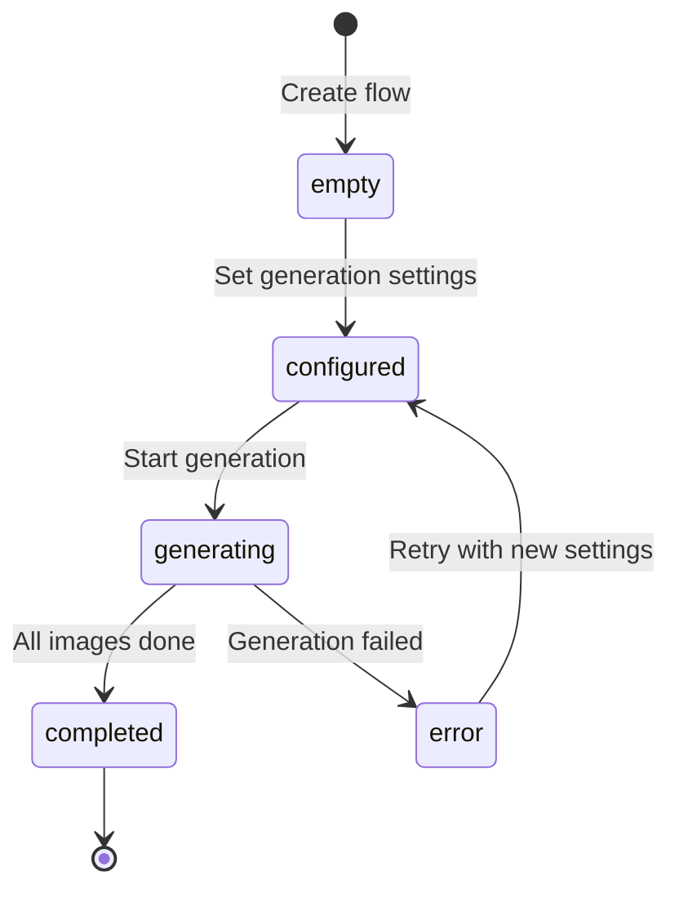
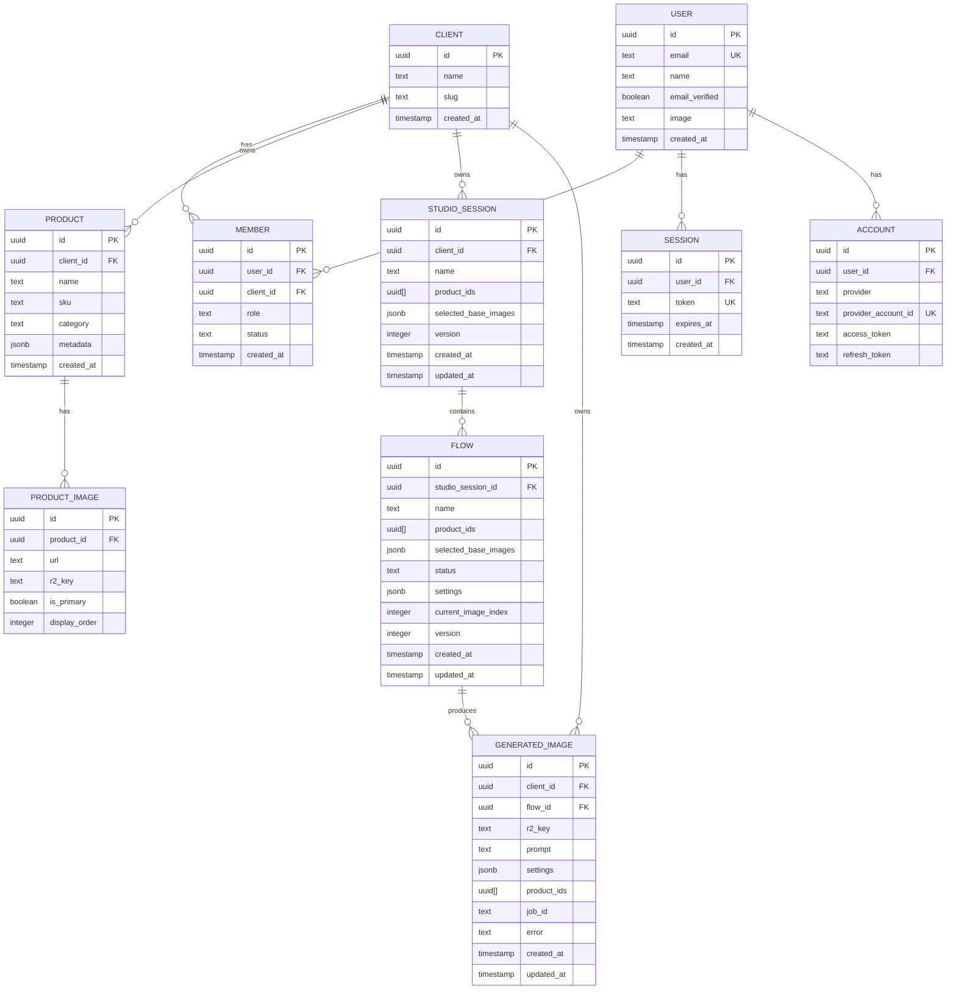

# Design Log #003: Data Model & Terminology

**Status**: Approved
**Created**: 2026-01-10
**Updated**: 2026-01-11
**Author**: Claude
**Related**: Design Log #001 (Architecture), Design Log #002 (Authentication)

---

## Background

The Scenergy Visualizer platform enables clients to generate AI-powered product visualization images. The data model needs to support:
- Multi-product selection in a single generation flow
- Multiple generation attempts (flows) within a studio session
- Persistent tracking of generated images
- Future: Automated product combination strategies

The existing schema (studio_session, flow, generated_image) already supports these requirements and needs no renaming.

## Problem

We need to document the complete data model that:
1. **Clarifies** existing terminology (StudioSession, Flow, GeneratedImage)
2. **Supports** multi-product workflows (user selects 2+ products per flow)
3. **Tracks** generation lifecycle (empty → configured → generating → completed)
4. **Persists** all generated images with full metadata
5. **Enables** future product combination strategies (match by dimension, category pairing)
6. **Integrates** user authentication (Better Auth with multi-tenant support)

## Questions and Answers

### Q1: What's the difference between StudioSession and Flow?
**A**:
- **StudioSession** = User's working environment for a set of products
  - Contains product selection and base image selection
  - Can spawn multiple flows (different attempts)
  - Persists user's workspace state
- **Flow** = A single generation attempt with specific settings
  - References products from parent session
  - Has status lifecycle (empty → configured → generating → completed)
  - Produces N generated images (one per prompt variation)

### Q2: How do we handle multiple products in a single flow?
**A**: Flow supports multi-product natively:
```typescript
interface Flow {
  productIds: string[];  // Can be 1 or many products
  selectedBaseImages: Record<string, string>; // productId → imageId mapping
}
```
- User manually selects which products go together
- All products rendered in same scene
- Future: Auto-generate combinations based on strategies

### Q3: What's the lifecycle of a Flow?
**A**:


### Q4: How do we track individual generated images?
**A**: Each image is a separate record:
```typescript
interface GeneratedImage {
  id: string;
  flowId: string;        // FK to flow (many images per flow)
  productIds: string[];  // Products visible in this image
  r2Key: string;         // Storage path
  settings: FlowGenerationSettings; // Settings used
  jobId: string | null;  // Redis job ID (transient)
}
```
- One flow generates multiple images (different prompts/variations)
- Each image tracks its own settings and products
- JobId links to Redis queue (can be null after completion)

### Q5: How do product combination strategies work (future)?
**A**: Add `combinationStrategy` to Flow schema:
```typescript
type CombinationStrategy =
  | 'manual'              // User selects products (default)
  | 'match_dimensions'    // Auto-pair by dimensions (mattress 1.60m + bed 1.60m)
  | 'category_pairing'    // Auto-pair by category (chair + table)
  | 'one_from_each_group' // Cartesian product of groups

interface Flow {
  combinationStrategy?: CombinationStrategy; // Optional, defaults to 'manual'
  combinationRules?: CombinationRules;       // Strategy-specific rules
}
```
**NOT in MVP** - add later when needed.

### Q6: How do we handle user authentication across clients?
**A**: Multi-tenant model via Better Auth:
- **User** = Individual person (global identity)
- **Member** = User-to-Client association (role, permissions)
- One user can be member of multiple clients
- Sessions are client-scoped (user must select client)

---

## Design

### Core Entities



### Database Schema (TypeScript)

```typescript
// ====================
// Authentication (Better Auth)
// ====================

interface User {
  id: string;
  email: string;
  name: string;
  emailVerified: boolean;
  image?: string;
  createdAt: Date;
  updatedAt: Date;
}

interface Session {
  id: string;
  userId: string;
  token: string;
  expiresAt: Date;
  ipAddress?: string;
  userAgent?: string;
  createdAt: Date;
  updatedAt: Date;
}

interface Account {
  id: string;
  userId: string;
  provider: string;           // 'google', 'github', etc.
  providerAccountId: string;  // OAuth provider's user ID
  accessToken?: string;
  refreshToken?: string;
  expiresAt?: Date;
  createdAt: Date;
  updatedAt: Date;
}

// ====================
// Multi-Tenant
// ====================

interface Client {
  id: string;
  name: string;
  slug: string;
  settings?: ClientSettings;
  createdAt: Date;
  updatedAt: Date;
}

interface ClientSettings {
  generationDefaults?: Partial<FlowGenerationSettings>;
  monthlyGenerationLimit?: number;
  allowedFileTypes?: string[];
}

interface Member {
  id: string;
  userId: string;
  clientId: string;
  role: MemberRole;
  status: MemberStatus;
  createdAt: Date;
  updatedAt: Date;
}

type MemberRole = 'owner' | 'admin' | 'member' | 'viewer';
type MemberStatus = 'active' | 'invited' | 'suspended';

// ====================
// Products
// ====================

interface Product {
  id: string;
  clientId: string;
  name: string;
  sku: string;
  category: string;
  metadata?: ProductMetadata;
  createdAt: Date;
  updatedAt: Date;
}

interface ProductMetadata {
  dimensions?: { width: number; height: number; depth: number; unit: string };
  materials?: string[];
  colors?: string[];
  tags?: string[];
  roomTypes?: string[];
  customFields?: Record<string, unknown>;
}

interface ProductImage {
  id: string;
  productId: string;
  url: string;
  r2Key: string;
  isPrimary: boolean;
  displayOrder: number;
  createdAt: Date;
}

// ====================
// Studio Workflow
// ====================

interface StudioSession {
  id: string;
  clientId: string;
  name: string;
  productIds: string[];  // Products selected for this session
  selectedBaseImages: Record<string, string>; // productId → imageId
  version: number;
  createdAt: Date;
  updatedAt: Date;
}

interface Flow {
  id: string;
  studioSessionId: string;
  name: string | null;
  productIds: string[];  // Multi-product support!
  selectedBaseImages: Record<string, string>; // productId → imageId
  status: FlowStatus;
  settings: FlowGenerationSettings;
  currentImageIndex: number;
  version: number;
  createdAt: Date;
  updatedAt: Date;
}

type FlowStatus =
  | 'empty'        // Just created, no settings
  | 'configured'   // Settings defined, ready to generate
  | 'generating'   // Generation in progress
  | 'completed'    // Generation finished
  | 'error';       // Generation failed

interface GeneratedImage {
  id: string;
  clientId: string;
  flowId: string;           // FK to flow
  r2Key: string;            // Path in R2 storage
  prompt: string;           // Full prompt used
  settings: FlowGenerationSettings; // Settings snapshot
  productIds: string[];     // Products in this image
  jobId: string | null;     // Redis job ID (transient, can be null)
  error: string | null;     // Error message if failed
  createdAt: Date;
  updatedAt: Date;
}

// ====================
// Generation Settings
// ====================

interface FlowGenerationSettings {
  roomType: string;
  style: string;
  lighting: string;
  colorScheme: string;
  cameraAngle: string;
  aspectRatio: string;
  surroundings: string;
  props: string[];
  sceneImageUrl?: string;        // Inspiration image URL
  varietyLevel: number;          // 1-10
  matchProductColors: boolean;
  promptText?: string;           // Custom prompt override
}

// ====================
// FUTURE: Product Combination Strategies
// ====================

// NOT IN MVP - Add when needed
interface FlowWithCombinations extends Flow {
  combinationStrategy?: CombinationStrategy;
  combinationRules?: CombinationRules;
}

type CombinationStrategy =
  | 'manual'              // User selects products (default)
  | 'match_dimensions'    // Auto-pair by dimensions
  | 'category_pairing'    // Auto-pair by category
  | 'one_from_each_group' // Cartesian product of groups
  | 'style_matching';     // Match by style metadata

interface CombinationRules {
  dimensionTolerance?: number;        // For match_dimensions (e.g., ±10cm)
  categoryPairs?: Record<string, string[]>; // For category_pairing
  productGroups?: string[][];         // For one_from_each_group
  styleKeywords?: string[];           // For style_matching
}

// Example: Auto-generate flows for mattress + bed combinations
interface CombinationGenerationRequest {
  studioSessionId: string;
  strategy: CombinationStrategy;
  rules: CombinationRules;
  baseSettings: FlowGenerationSettings;
}
```

### SQL Schema

```sql
-- ====================
-- Authentication
-- ====================
CREATE TABLE users (
  id UUID PRIMARY KEY DEFAULT gen_random_uuid(),
  email TEXT NOT NULL UNIQUE,
  name TEXT NOT NULL,
  email_verified BOOLEAN NOT NULL DEFAULT FALSE,
  image TEXT,
  created_at TIMESTAMPTZ NOT NULL DEFAULT NOW(),
  updated_at TIMESTAMPTZ NOT NULL DEFAULT NOW()
);

CREATE INDEX idx_users_email ON users(email);

CREATE TABLE sessions (
  id UUID PRIMARY KEY DEFAULT gen_random_uuid(),
  user_id UUID NOT NULL REFERENCES users(id) ON DELETE CASCADE,
  token TEXT NOT NULL UNIQUE,
  expires_at TIMESTAMPTZ NOT NULL,
  ip_address TEXT,
  user_agent TEXT,
  created_at TIMESTAMPTZ NOT NULL DEFAULT NOW(),
  updated_at TIMESTAMPTZ NOT NULL DEFAULT NOW()
);

CREATE INDEX idx_sessions_user_id ON sessions(user_id);
CREATE INDEX idx_sessions_token ON sessions(token);

CREATE TABLE accounts (
  id UUID PRIMARY KEY DEFAULT gen_random_uuid(),
  user_id UUID NOT NULL REFERENCES users(id) ON DELETE CASCADE,
  provider TEXT NOT NULL,
  provider_account_id TEXT NOT NULL,
  access_token TEXT,
  refresh_token TEXT,
  expires_at TIMESTAMPTZ,
  created_at TIMESTAMPTZ NOT NULL DEFAULT NOW(),
  updated_at TIMESTAMPTZ NOT NULL DEFAULT NOW(),

  UNIQUE(provider, provider_account_id)
);

CREATE INDEX idx_accounts_user_id ON accounts(user_id);

-- ====================
-- Multi-Tenant
-- ====================
CREATE TABLE members (
  id UUID PRIMARY KEY DEFAULT gen_random_uuid(),
  user_id UUID NOT NULL REFERENCES users(id) ON DELETE CASCADE,
  client_id UUID NOT NULL REFERENCES clients(id) ON DELETE CASCADE,
  role TEXT NOT NULL DEFAULT 'member',
  status TEXT NOT NULL DEFAULT 'active',
  created_at TIMESTAMPTZ NOT NULL DEFAULT NOW(),
  updated_at TIMESTAMPTZ NOT NULL DEFAULT NOW(),

  UNIQUE(user_id, client_id),
  CONSTRAINT valid_role CHECK (role IN ('owner', 'admin', 'member', 'viewer')),
  CONSTRAINT valid_status CHECK (status IN ('active', 'invited', 'suspended'))
);

CREATE INDEX idx_members_user_id ON members(user_id);
CREATE INDEX idx_members_client_id ON members(client_id);

-- ====================
-- Studio Sessions
-- ====================
CREATE TABLE studio_sessions (
  id UUID PRIMARY KEY DEFAULT gen_random_uuid(),
  client_id UUID NOT NULL REFERENCES clients(id) ON DELETE CASCADE,
  name TEXT NOT NULL,
  product_ids UUID[] NOT NULL DEFAULT '{}',
  selected_base_images JSONB NOT NULL DEFAULT '{}',
  version INTEGER NOT NULL DEFAULT 1,
  created_at TIMESTAMPTZ NOT NULL DEFAULT NOW(),
  updated_at TIMESTAMPTZ NOT NULL DEFAULT NOW()
);

CREATE INDEX idx_studio_sessions_client_id ON studio_sessions(client_id);

-- ====================
-- Flows
-- ====================
CREATE TABLE flows (
  id UUID PRIMARY KEY DEFAULT gen_random_uuid(),
  studio_session_id UUID NOT NULL REFERENCES studio_sessions(id) ON DELETE CASCADE,
  name TEXT,
  product_ids UUID[] NOT NULL DEFAULT '{}',
  selected_base_images JSONB NOT NULL DEFAULT '{}',
  status TEXT NOT NULL DEFAULT 'empty',
  settings JSONB,
  current_image_index INTEGER NOT NULL DEFAULT 0,
  version INTEGER NOT NULL DEFAULT 1,
  created_at TIMESTAMPTZ NOT NULL DEFAULT NOW(),
  updated_at TIMESTAMPTZ NOT NULL DEFAULT NOW(),

  CONSTRAINT valid_status CHECK (status IN ('empty', 'configured', 'generating', 'completed', 'error'))
);

CREATE INDEX idx_flows_studio_session_id ON flows(studio_session_id);
CREATE INDEX idx_flows_status ON flows(status);

-- ====================
-- Generated Images
-- ====================
CREATE TABLE generated_images (
  id UUID PRIMARY KEY DEFAULT gen_random_uuid(),
  client_id UUID NOT NULL REFERENCES clients(id) ON DELETE CASCADE,
  flow_id UUID NOT NULL REFERENCES flows(id) ON DELETE CASCADE,
  r2_key TEXT NOT NULL,
  prompt TEXT NOT NULL,
  settings JSONB NOT NULL,
  product_ids UUID[] NOT NULL DEFAULT '{}',
  job_id TEXT,
  error TEXT,
  created_at TIMESTAMPTZ NOT NULL DEFAULT NOW(),
  updated_at TIMESTAMPTZ NOT NULL DEFAULT NOW()
);

CREATE INDEX idx_generated_images_client_id ON generated_images(client_id);
CREATE INDEX idx_generated_images_flow_id ON generated_images(flow_id);
CREATE INDEX idx_generated_images_job_id ON generated_images(job_id) WHERE job_id IS NOT NULL;

-- ====================
-- FUTURE: Inspiration Images (optional)
-- ====================
CREATE TABLE inspiration_images (
  id UUID PRIMARY KEY DEFAULT gen_random_uuid(),
  studio_session_id UUID NOT NULL REFERENCES studio_sessions(id) ON DELETE CASCADE,
  url TEXT NOT NULL,
  r2_key TEXT,
  source TEXT NOT NULL,
  analysis JSONB,
  display_order INTEGER NOT NULL DEFAULT 0,
  created_at TIMESTAMPTZ NOT NULL DEFAULT NOW(),

  CONSTRAINT valid_source CHECK (source IN ('upload', 'unsplash', 'url'))
);

CREATE INDEX idx_inspiration_images_session ON inspiration_images(studio_session_id);
```

### Queue vs. Database Separation

| Aspect | Redis Queue (jobId) | Database (GeneratedImage) |
|--------|---------------------|---------------------------|
| **Purpose** | Transient processing state | Permanent image record |
| **Lifetime** | Minutes to hours | Forever |
| **TTL** | 24 hours after completion | No expiration |
| **Fields** | jobId, status, progress | Full record: r2Key, prompt, settings, products |
| **Query Pattern** | Poll by jobId | List by flow, client, product |
| **Cleanup** | Auto-expires via Redis TTL | Manual deletion only |

**Synchronization**:
1. User starts generation → Create Flow (status: 'generating')
2. For each variation → Enqueue job, get jobId
3. Worker picks up job → Updates progress via Redis
4. Job completes → Worker creates GeneratedImage record
5. All jobs done → Update Flow (status: 'completed')
6. JobId can be stored in GeneratedImage for debugging (optional, can be null)

---

## Implementation Plan

### Phase 1: Authentication Tables (NEW)
1. Create `users` table (Better Auth)
2. Create `sessions` table (Better Auth)
3. Create `accounts` table (OAuth support)
4. Create `members` table (multi-tenant)
5. Run migrations

### Phase 2: Verify Existing Tables
1. Confirm `studio_sessions` schema matches design
2. Confirm `flows` schema matches design
3. Confirm `generated_images` schema matches design
4. Update schemas if needed (minor tweaks only)

### Phase 3: Add Optional Tables
1. Create `inspiration_images` table (optional feature)
2. Add indexes
3. Update Drizzle schemas

### Phase 4: Service Layer
1. Create `StudioSessionService` (CRUD for sessions)
2. Create `FlowService` (CRUD for flows, status management)
3. Create `GeneratedImageService` (CRUD for images)
4. Update `GenerationQueue` to create GeneratedImage records on completion

### Phase 5: FUTURE - Combination Strategies
**NOT IN MVP** - Implement when needed:
1. Add `combination_strategy` column to flows table
2. Add `combination_rules` JSONB column to flows table
3. Create `CombinationEngine` service
4. Add API endpoint: `POST /api/sessions/:id/auto-generate-flows`
5. Implement strategy algorithms:
   - `match_dimensions`: Pair products by size
   - `category_pairing`: Use predefined category pairs
   - `one_from_each_group`: Generate cartesian product
6. Update UI to show "Auto-generate combinations" button

---

## Examples

### ✅ Good: Creating a Multi-Product Flow

```typescript
// apps/visualizer-client/app/api/sessions/[id]/flows/route.ts
import { db } from '@repo/visualizer-db';

export async function POST(req: Request, { params }: { params: { id: string } }) {
  const { productIds } = await req.json();

  const session = await db.studioSessions.findById(params.id);

  // Create new flow with selected products
  const flow = await db.flows.create({
    studioSessionId: session.id,
    name: null,
    productIds, // Multi-product array
    selectedBaseImages: session.selectedBaseImages,
    status: 'empty',
    currentImageIndex: 0,
  });

  return Response.json(flow);
}
```

### ✅ Good: Starting Generation (Creates Queue Jobs + Updates Flow)

```typescript
// apps/visualizer-client/app/api/flows/[id]/generate/route.ts
import { db } from '@repo/visualizer-db';
import { GenerationQueue } from '@repo/visualizer-shared';

export async function POST(req: Request, { params }: { params: { id: string } }) {
  const flow = await db.flows.findById(params.id);
  const queue = new GenerationQueue();

  // Update flow status
  await db.flows.update(flow.id, { status: 'generating' });

  // Enqueue jobs (one per prompt variation)
  const jobIds = [];
  for (let i = 0; i < 4; i++) {
    const jobId = await queue.enqueue({
      flowId: flow.id,
      clientId: flow.clientId,
      productIds: flow.productIds,
      settings: flow.settings,
      variationIndex: i,
    });
    jobIds.push(jobId);
  }

  return Response.json({ success: true, jobIds });
}
```

### ✅ Good: Worker Creates GeneratedImage on Completion

```typescript
// packages/visualizer-worker/src/handlers/image-generation.ts
import { db } from '@repo/visualizer-db';
import { uploadToR2 } from '../utils/r2';

export async function handleImageGeneration(job: Job) {
  const { flowId, clientId, productIds, settings, variationIndex } = job.data;

  try {
    // Generate image (AI service)
    const { imageBuffer, prompt } = await generateImage(settings, variationIndex);

    // Upload to R2
    const r2Key = `clients/${clientId}/flows/${flowId}/${Date.now()}_${variationIndex}.png`;
    await uploadToR2(r2Key, imageBuffer);

    // Create database record
    await db.generatedImages.create({
      clientId,
      flowId,
      r2Key,
      prompt,
      settings,
      productIds,
      jobId: job.id, // Optional: track which job created this
    });

    // Check if all images complete for this flow
    const images = await db.generatedImages.findByFlowId(flowId);
    if (images.length >= 4) {
      await db.flows.update(flowId, { status: 'completed' });
    }

    return { success: true };
  } catch (error) {
    // Update flow with error
    await db.flows.update(flowId, {
      status: 'error',
      error: error.message,
    });
    throw error;
  }
}
```

### ✅ Good: Querying Multi-Product Flows

```typescript
// Find all flows that include a specific product
const flows = await db.flows.findMany({
  where: sql`${flows.productIds} @> ARRAY[${productId}]::uuid[]`,
  orderBy: desc(flows.createdAt),
});

// Get all images for a flow
const images = await db.generatedImages.findMany({
  where: eq(generatedImages.flowId, flowId),
  orderBy: asc(generatedImages.createdAt),
});
```

### ✅ FUTURE: Auto-Generate Combinations (NOT MVP)

```typescript
// FUTURE FEATURE - NOT IN MVP
export async function POST(req: Request, { params }: { params: { id: string } }) {
  const { strategy, rules, baseSettings } = await req.json();

  const session = await db.studioSessions.findById(params.id);
  const products = await db.products.findMany({
    where: inArray(products.id, session.productIds)
  });

  // Generate combinations based on strategy
  const combinations = generateCombinations(products, strategy, rules);

  // Create flow for each combination
  const flows = [];
  for (const combo of combinations) {
    const flow = await db.flows.create({
      studioSessionId: session.id,
      name: `${combo.map(p => p.name).join(' + ')}`,
      productIds: combo.map(p => p.id),
      selectedBaseImages: session.selectedBaseImages,
      status: 'configured',
      settings: baseSettings,
      combinationStrategy: strategy, // FUTURE FIELD
      combinationRules: rules,       // FUTURE FIELD
    });
    flows.push(flow);
  }

  return Response.json({ flows, count: flows.length });
}

function generateCombinations(
  products: Product[],
  strategy: CombinationStrategy,
  rules: CombinationRules
): Product[][] {
  switch (strategy) {
    case 'match_dimensions':
      return matchByDimensions(products, rules.dimensionTolerance);
    case 'category_pairing':
      return pairByCategory(products, rules.categoryPairs);
    case 'one_from_each_group':
      return cartesianProduct(products, rules.productGroups);
    default:
      return [];
  }
}
```

### ❌ Bad: Renaming Tables

```typescript
// ❌ Don't rename existing tables
CREATE TABLE generated_assets ... // Bad - use generated_images
CREATE TABLE collections ...      // Bad - use studio_sessions

// ✅ Use existing names
CREATE TABLE generated_images ... // Good
CREATE TABLE studio_sessions ...  // Good
CREATE TABLE flows ...            // Good
```

---

## Trade-offs

### StudioSession vs. Collection
**Chosen**: StudioSession (existing name)
**Rationale**:
- ✅ Already implemented and working
- ✅ Accurate name (user's working session)
- ✅ Matches UI terminology ("Studio" tab)
- ✅ No migration needed
- ❌ Slightly longer than "Collection"

### Flow vs. Generation
**Chosen**: Flow (existing name)
**Rationale**:
- ✅ Emphasizes workflow nature (configure → generate → complete)
- ✅ Each flow is a single attempt with specific settings
- ✅ Already implemented
- ❌ Could be confused with "flow" in other contexts

### Multi-Product in Flow vs. Separate Records
**Chosen**: Multi-product array in Flow
**Rationale**:
- ✅ Products are generated together in same scene
- ✅ Simpler queries (one flow record)
- ✅ Settings apply to all products equally
- ❌ Can't have different settings per product
- ❌ Array queries require PostgreSQL array operators

### Manual Selection vs. Auto-Combinations
**Chosen**: Manual first, auto-combinations as FUTURE feature
**Rationale**:
- ✅ Simpler MVP (no complex pairing logic)
- ✅ Users have full control
- ✅ Can add strategies incrementally
- ❌ Users must manually create many flows
- ❌ No automation for large product catalogs

### JobId in GeneratedImage vs. Separate Table
**Chosen**: Optional jobId field in GeneratedImage
**Rationale**:
- ✅ Useful for debugging (which job created this image)
- ✅ Can be null (queue jobs expire)
- ✅ No extra table join
- ❌ Field becomes stale after Redis TTL expires

---

## Migration Notes

**No migrations needed** - Starting from scratch with correct schema:

1. Copy existing tables as-is:
   - studio_sessions ✅
   - flows ✅
   - generated_images ✅

2. Add new authentication tables:
   - users
   - sessions
   - accounts
   - members

3. Add optional feature tables:
   - inspiration_images (future)

4. FUTURE: Add combination strategy fields to flows:
   - combination_strategy (enum)
   - combination_rules (JSONB)

---

## Success Criteria

- [x] StudioSession supports multi-product selection
- [x] Flow tracks generation lifecycle (empty → configured → generating → completed)
- [x] GeneratedImage stores all metadata (r2Key, prompt, settings, products)
- [x] Authentication tables support Better Auth + OAuth
- [x] Members table enables multi-tenant access
- [ ] Can create flows with 2+ products
- [ ] Can query all images for a flow
- [ ] Can query all flows for a session
- [ ] Worker creates GeneratedImage on job completion
- [ ] FUTURE: Can auto-generate flows using combination strategies

---

## Open Questions

1. **Combination strategy priority**: Which strategy should be default when multiple match?
   - Proposal: Let user choose, no auto-fallback

2. **Dimension tolerance**: What's reasonable tolerance for "match_dimensions"?
   - Proposal: ±10cm for furniture, ±5cm for smaller items

3. **Max products per flow**: Should we limit how many products in one scene?
   - Proposal: Soft limit of 5 products (UI warning), hard limit of 10

4. **Inspiration image scope**: Should inspiration be per-session or per-flow?
   - Proposal: Per-session (users set overall style, applies to all flows)

5. **Flow naming**: Should auto-generated flows have auto-names?
   - Proposal: Yes - "Mattress 160cm + Bed 160cm" (from combination logic)
