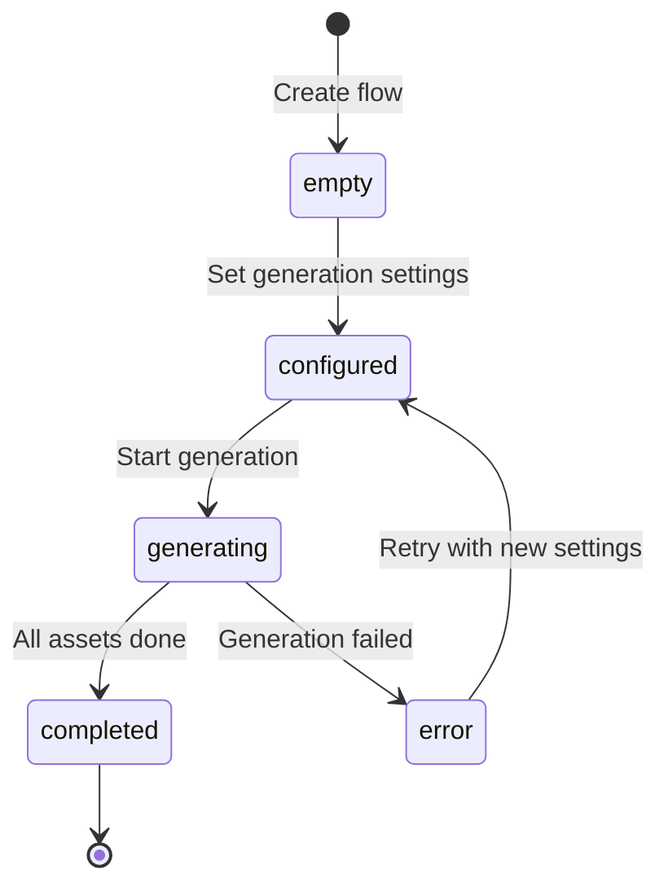
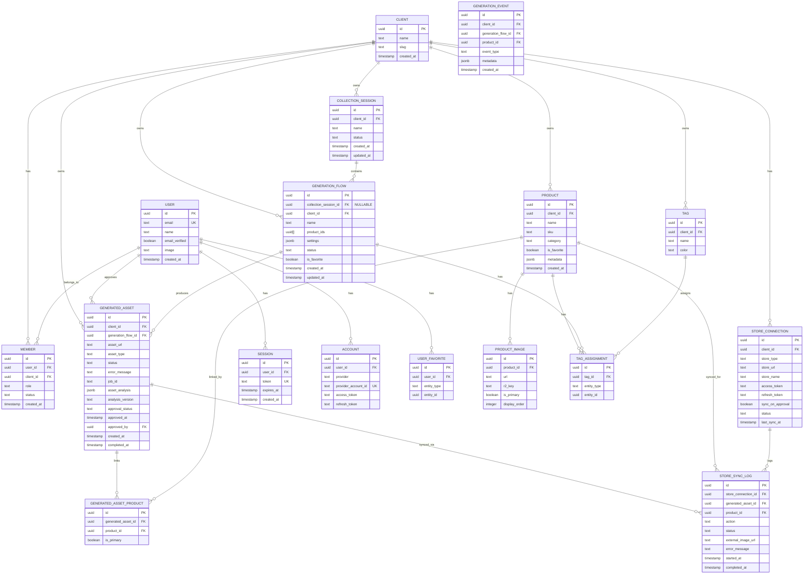

# Design Log #003: Data Model & Terminology

**Status**: Updated
**Created**: 2026-01-10
**Updated**: 2026-01-11
**Author**: Claude
**Related**: Design Log #001 (Architecture), Design Log #002 (Authentication)

---

## Background

The Scenergy Visualizer platform enables clients to generate AI-powered product visualization assets. The data model needs to support:
- Multi-product selection in a single generation flow
- Multiple generation attempts (GenerationFlows) within a CollectionSession
- **Standalone GenerationFlows** for single-product focused editing
- Persistent tracking of generated assets (images, future: video, 3D)
- **Multi-product asset linking** via junction table
- **Favorites and tags** for organization
- **Analytics tracking** for insights
- Future: Automated product combination strategies

**Table renames for clarity** (per Design Log #001):
- `studio_session` → `collection_session`
- `flow` → `generation_flow`
- `generated_image` → `generated_asset` (with `asset_url`, `asset_type`)

## Problem

We need to document the complete data model that:
1. **Defines** updated terminology (CollectionSession, GenerationFlow, GeneratedAsset)
2. **Supports** multi-product workflows (user selects 2+ products per flow)
3. **Enables** standalone GenerationFlows for detailed single-product editing
4. **Tracks** generation lifecycle (empty → configured → generating → completed)
5. **Persists** all generated assets with full metadata as WebP for CDN
6. **Links** assets to multiple products via junction table
7. **Organizes** content with favorites and tags
8. **Tracks** analytics for generation insights
9. **Integrates** user authentication (Better Auth with existing user/session/member tables)
10. **Enables** future product combination strategies (match by dimension, category pairing)

## Questions and Answers

### Q1: What's the difference between CollectionSession and GenerationFlow?
**A**:
- **CollectionSession** = Top-level container for bulk generation workflows
  - Contains product selection and base image selection
  - Can spawn multiple GenerationFlows (different attempts)
  - Optimized for throughput (20-500+ products)
- **GenerationFlow** = A single generation attempt with specific settings
  - Can reference products from parent CollectionSession OR be standalone
  - Has status lifecycle (empty → configured → generating → completed)
  - Produces N generated assets (one per prompt variation)
  - `collection_session_id` is NULLABLE for standalone flows

### Q2: How do we handle multiple products in a single GenerationFlow?
**A**: GenerationFlow supports multi-product natively:
```typescript
interface GenerationFlow {
  productIds: string[];  // Can be 1 or many products
  selectedBaseImages: Record<string, string>; // productId → imageId mapping
}
```
- User manually selects which products go together
- All products rendered in same scene
- Future: Auto-generate combinations based on strategies

### Q3: What's the lifecycle of a GenerationFlow?
**A**:


### Q4: How do we track individual generated assets?
**A**: Each asset is a separate record with multi-product linking:
```typescript
interface GeneratedAsset {
  id: string;
  generationFlowId: string;  // FK to generation_flow
  assetUrl: string;          // WebP URL for CDN (renamed from image_url)
  assetType: 'image' | 'video' | '3d_model'; // Asset type
  settings: GenerationFlowSettings; // Settings used
  jobId: string | null;      // Redis job ID (transient)
}

// Junction table for many-to-many product linking
interface GeneratedAssetProduct {
  generatedAssetId: string;
  productId: string;
  isPrimary: boolean;  // Primary product for this asset
}
```
- One GenerationFlow generates multiple assets (different prompts/variations)
- Each asset can be linked to multiple products via junction table
- Assets are stored as WebP for optimal CDN delivery
- JobId links to Redis queue (can be null after completion)

### Q5: How do product combination strategies work (future)?
**A**: Add `combinationStrategy` to GenerationFlow schema:
```typescript
type CombinationStrategy =
  | 'manual'              // User selects products (default)
  | 'match_dimensions'    // Auto-pair by dimensions (mattress 1.60m + bed 1.60m)
  | 'category_pairing'    // Auto-pair by category (chair + table)
  | 'one_from_each_group' // Cartesian product of groups

interface GenerationFlow {
  combinationStrategy?: CombinationStrategy; // Optional, defaults to 'manual'
  combinationRules?: CombinationRules;       // Strategy-specific rules
}
```
**NOT in MVP** - add later when needed.

### Q6: How do we handle user authentication across clients?
**A**: Multi-tenant model via Better Auth:
- **User** = Individual person (global identity) - **EXISTING TABLE**
- **Session** = Auth session for user - **EXISTING TABLE**
- **Member** = User-to-Client association (role, permissions) - **EXISTING TABLE**
- One user can be member of multiple clients
- Sessions are client-scoped (user must select client)

### Q7: How do standalone GenerationFlows differ from collection flows?
**A**: Same infrastructure, different entry points:

**Collection Flow** (bulk-first):
- Create CollectionSession → select many products → generate in bulk
- GenerationFlow has `collectionSessionId` set

**Standalone GenerationFlow** (detail-first):
- Create GenerationFlow directly → select one product → detailed editing
- GenerationFlow has `collectionSessionId = NULL`
- Rich editing: editor modal, regenerate, mask regions, compare variations
- Accessed from: Home page "New Generation" button OR clicking into a flow from collection

### Q8: How do users organize content with favorites and tags?
**A**: Two complementary systems:

**Favorites** (user-scoped):
```typescript
interface UserFavorite {
  userId: string;
  entityType: 'product' | 'generation_flow';
  entityId: string;
}
```
- Quick access to frequently used items
- Shown in "Recent & Favorites" sections

**Tags** (client-scoped):
```typescript
interface Tag {
  id: string;
  clientId: string;
  name: string;      // e.g., "Summer 2026", "Living Room"
  color?: string;    // Hex color for UI
}

interface TagAssignment {
  tagId: string;
  entityType: 'product' | 'generation_flow';
  entityId: string;
}
```
- Flexible categorization
- Filter by tag in list views
- Bulk tag assignment

### Q9: How do we cache asset analysis for editing?
**A**: Store analysis results on the generated_asset record:

```typescript
interface AssetAnalysis {
  analyzedAt: string;           // Timestamp of analysis
  objects: DetectedObject[];    // Products, props, furniture detected
  colors: ColorPalette;         // Dominant colors in image
  lighting: LightingInfo;       // Natural, artificial, direction
  composition: CompositionInfo; // Rule of thirds, focal points
  masks: AutoMask[];            // AI-detected regions for editing
  version: string;              // Analysis model version
}
```

**Caching strategy**:
- Store `asset_analysis` JSONB + `analysis_version` on generated_asset
- Populated on first edit action (lazy loading)
- Instant retrieval on subsequent edits

**Invalidation**:
- Set to NULL when user edits the image (mask, inpaint, filter)
- Set to NULL when asset is regenerated
- Re-analyze on next edit action
- Version mismatch triggers re-analysis (model upgrade)

### Q10: How do we handle store sync approvals?
**A**: Add approval workflow for images ready to sync to connected stores:

**Approval status** (on generated_asset):
- `pending` - Generated, not yet reviewed
- `approved` - Ready to sync to store
- `rejected` - Won't be synced (stays in Scenergy only)

```typescript
interface GeneratedAsset {
  // ... existing fields
  approvalStatus: 'pending' | 'approved' | 'rejected';
  approvedAt: Date | null;
  approvedBy: string | null;  // User ID
}
```

**Store connection**:
```typescript
interface StoreConnection {
  id: string;
  clientId: string;
  storeType: 'shopify' | 'woocommerce' | 'bigcommerce';
  storeUrl: string;
  accessToken: string;      // Encrypted OAuth token
  refreshToken?: string;
  syncOnApproval: boolean;  // Auto-sync when approved
  status: 'active' | 'disconnected' | 'error';
}
```

**Sync log**:
```typescript
interface StoreSyncLog {
  id: string;
  storeConnectionId: string;
  generatedAssetId: string;
  productId: string;
  action: 'upload' | 'update' | 'delete';
  status: 'pending' | 'success' | 'failed';
  externalImageUrl?: string;  // URL in the store
  errorMessage?: string;
}
```

### Q11: How do users add products to Scenergy?
**A**: **Two methods** - import from store OR upload manually:

**Method 1: Import from Connected Store**
- `product.source = 'imported'`
- Connect store via OAuth
- Import by: Product IDs, Category, or All
- Products get `erp_id` for bidirectional sync
- **Approve for Store** available → syncs to store

**Method 2: Upload Manually**
- `product.source = 'uploaded'`
- Upload product images directly
- Enter product details manually
- No store connection required
- **Download only** → no sync to store

**UI behavior based on source**:
| Product Source | Approve for Store | Download | Sync to Store |
|----------------|-------------------|----------|---------------|
| `imported` | ✓ Available | ✓ Available | ✓ Yes |
| `uploaded` | ✗ Hidden | ✓ Available | ✗ No |

**Subscription limits** (both methods):
| Plan | Max Products |
|------|-------------|
| Starter | 50 |
| Pro | 100 |
| Business | 500 |
| Enterprise | 1,000+ |

**Converting uploaded → imported**:
- Later connect store
- Link product by SKU/ID
- Sets `source = 'imported'` and populates `erp_id`

### Q12: When should products be analyzed for prompt engineering?
**A**: Three strategy options:

| Strategy | When | Best For |
|----------|------|----------|
| On Import | After product import | Large catalogs |
| On Collection | When added to session | Smaller catalogs |
| On Generate | Just before generation | Maximum freshness |

**What's analyzed**:
- Product type (sofa, desk, lamp)
- Materials (leather, wood, metal)
- Color palette
- Style classification
- Best room types
- Scale hints

**Stored in** `product.analysis_data` as JSONB

---

## Design

### Core Entities



### Database Schema (TypeScript)

```typescript
// ====================
// Authentication (Better Auth) - EXISTING TABLES
// ====================

interface User {
  id: string;
  email: string;
  name: string;
  emailVerified: boolean;
  image?: string;
  createdAt: Date;
  updatedAt: Date;
}

interface Session {
  id: string;
  userId: string;
  token: string;
  expiresAt: Date;
  ipAddress?: string;
  userAgent?: string;
  createdAt: Date;
  updatedAt: Date;
}

interface Account {
  id: string;
  userId: string;
  provider: string;           // 'google', 'github', etc.
  providerAccountId: string;  // OAuth provider's user ID
  accessToken?: string;
  refreshToken?: string;
  expiresAt?: Date;
  createdAt: Date;
  updatedAt: Date;
}

// ====================
// Multi-Tenant - EXISTING TABLE
// ====================

interface Client {
  id: string;
  name: string;
  slug: string;
  settings?: ClientSettings;
  createdAt: Date;
  updatedAt: Date;
}

interface ClientSettings {
  generationDefaults?: Partial<GenerationFlowSettings>;
  monthlyGenerationLimit?: number;
  allowedFileTypes?: string[];
}

interface Member {
  id: string;
  userId: string;
  clientId: string;
  role: MemberRole;
  status: MemberStatus;
  createdAt: Date;
  updatedAt: Date;
}

type MemberRole = 'owner' | 'admin' | 'member' | 'viewer';
type MemberStatus = 'active' | 'invited' | 'suspended';

// ====================
// Products
// ====================

interface Product {
  id: string;
  clientId: string;
  name: string;
  sku: string;
  category: string;
  isFavorite: boolean;  // Denormalized for quick queries

  // Product source (determines available actions)
  source: 'imported' | 'uploaded';  // Imported = can sync to store, Uploaded = download only

  // Store import fields (for bidirectional sync - only for source='imported')
  storeConnectionId?: string;    // Which store imported from
  erpId?: string;                // Original product ID in store (for export back)
  erpSku?: string;               // Store SKU
  erpUrl?: string;               // Product URL in store
  importedAt?: Date;             // When imported from store

  // Product analysis (for prompt engineering)
  analysisData?: ProductAnalysis;
  analysisVersion?: string;
  analyzedAt?: Date;

  // Additional store data
  description?: string;
  price?: number;
  metadata?: ProductMetadata;

  createdAt: Date;
  updatedAt: Date;
}

type ProductSource = 'imported' | 'uploaded';

interface ProductAnalysis {
  analyzedAt: string;
  productType: string;           // Sofa, desk, lamp, etc.
  materials: string[];           // Leather, wood, metal, fabric
  colors: ColorPalette;          // Primary and accent colors
  style: string[];               // Modern, rustic, minimalist
  suggestedRoomTypes: string[];  // Living room, bedroom, office
  scaleHints: { width: string; height: string };
  promptKeywords: string[];      // AI-extracted keywords for prompts
  version: string;               // Analysis model version
}

interface ProductMetadata {
  dimensions?: { width: number; height: number; depth: number; unit: string };
  materials?: string[];
  colors?: string[];
  tags?: string[];
  roomTypes?: string[];
  customFields?: Record<string, unknown>;
}

interface ProductImage {
  id: string;
  productId: string;
  url: string;
  r2Key: string;
  isPrimary: boolean;
  displayOrder: number;
  isFromStore: boolean;  // Imported from store vs uploaded
  createdAt: Date;
}

// ====================
// Generation Workflow (RENAMED)
// ====================

interface CollectionSession {
  id: string;
  clientId: string;
  name: string;
  status: CollectionSessionStatus;
  createdAt: Date;
  updatedAt: Date;
}

type CollectionSessionStatus = 'draft' | 'generating' | 'completed';

interface GenerationFlow {
  id: string;
  collectionSessionId: string | null;  // NULLABLE for standalone flows
  clientId: string;
  name: string | null;
  productIds: string[];  // Multi-product support!
  selectedBaseImages: Record<string, string>; // productId → imageId
  status: GenerationFlowStatus;
  settings: GenerationFlowSettings;
  isFavorite: boolean;
  createdAt: Date;
  updatedAt: Date;
}

type GenerationFlowStatus =
  | 'empty'        // Just created, no settings
  | 'configured'   // Settings defined, ready to generate
  | 'generating'   // Generation in progress
  | 'completed'    // Generation finished
  | 'error';       // Generation failed

interface GeneratedAsset {
  id: string;
  clientId: string;
  generationFlowId: string;   // FK to generation_flow
  assetUrl: string;           // WebP URL for CDN (renamed from r2Key/image_url)
  assetType: AssetType;       // Type of asset
  status: AssetStatus;
  errorMessage: string | null;
  jobId: string | null;       // Redis job ID (transient, can be null)

  // Cached analysis for editing (invalidated on edit)
  assetAnalysis: AssetAnalysis | null;
  analysisVersion: string | null;

  // Store sync approval
  approvalStatus: ApprovalStatus;
  approvedAt: Date | null;
  approvedBy: string | null;  // User ID

  createdAt: Date;
  updatedAt: Date;
  completedAt: Date | null;
}

type AssetType = 'image' | 'video' | '3d_model';
type AssetStatus = 'pending' | 'generating' | 'completed' | 'error';
type ApprovalStatus = 'pending' | 'approved' | 'rejected';

interface AssetAnalysis {
  analyzedAt: string;
  objects: DetectedObject[];
  colors: ColorPalette;
  lighting: LightingInfo;
  composition: CompositionInfo;
  masks: AutoMask[];
  version: string;
}

// Junction table for asset-to-product linking
interface GeneratedAssetProduct {
  id: string;
  generatedAssetId: string;
  productId: string;
  isPrimary: boolean;  // Primary product for this asset
  createdAt: Date;
}

// ====================
// Generation Settings
// ====================

interface GenerationFlowSettings {
  roomType: string;
  style: string;
  lighting: string;
  colorScheme: string;
  cameraAngle: string;
  aspectRatio: string;
  surroundings: string;
  props: string[];
  sceneImageUrl?: string;        // Inspiration image URL
  varietyLevel: number;          // 1-10
  matchProductColors: boolean;
  promptText?: string;           // Custom prompt override
}

// ====================
// Organization: Tags & Favorites
// ====================

interface Tag {
  id: string;
  clientId: string;
  name: string;
  color?: string;  // Hex color for UI display
  createdAt: Date;
}

interface TagAssignment {
  id: string;
  tagId: string;
  entityType: 'product' | 'generation_flow';
  entityId: string;
  createdAt: Date;
}

interface UserFavorite {
  id: string;
  userId: string;
  entityType: 'product' | 'generation_flow';
  entityId: string;
  createdAt: Date;
}

// ====================
// Analytics
// ====================

interface GenerationEvent {
  id: string;
  clientId: string;
  generationFlowId?: string;
  productId?: string;
  eventType: 'started' | 'completed' | 'error' | 'viewed';
  metadata?: Record<string, unknown>;
  createdAt: Date;
}

// ====================
// Store Sync
// ====================

interface StoreConnection {
  id: string;
  clientId: string;
  storeType: 'shopify' | 'woocommerce' | 'bigcommerce';
  storeUrl: string;
  storeName?: string;
  accessToken: string;      // Encrypted
  refreshToken?: string;
  tokenExpiresAt?: Date;
  autoSyncEnabled: boolean;
  syncOnApproval: boolean;
  status: 'active' | 'disconnected' | 'error';
  lastSyncAt?: Date;
  createdAt: Date;
  updatedAt: Date;
}

interface StoreSyncLog {
  id: string;
  storeConnectionId: string;
  generatedAssetId: string;
  productId: string;
  action: 'upload' | 'update' | 'delete';
  status: 'pending' | 'success' | 'failed';
  externalImageUrl?: string;  // URL in the store after upload
  errorMessage?: string;
  startedAt: Date;
  completedAt?: Date;
}

// ====================
// FUTURE: Product Combination Strategies
// ====================

// NOT IN MVP - Add when needed
interface GenerationFlowWithCombinations extends GenerationFlow {
  combinationStrategy?: CombinationStrategy;
  combinationRules?: CombinationRules;
}

type CombinationStrategy =
  | 'manual'              // User selects products (default)
  | 'match_dimensions'    // Auto-pair by dimensions
  | 'category_pairing'    // Auto-pair by category
  | 'one_from_each_group' // Cartesian product of groups
  | 'style_matching';     // Match by style metadata

interface CombinationRules {
  dimensionTolerance?: number;        // For match_dimensions (e.g., ±10cm)
  categoryPairs?: Record<string, string[]>; // For category_pairing
  productGroups?: string[][];         // For one_from_each_group
  styleKeywords?: string[];           // For style_matching
}
```

### SQL Schema

```sql
-- ====================
-- Authentication (EXISTING - no changes needed)
-- ====================
-- user, session, account, member tables already exist
-- See Design Log #002 for details

-- ====================
-- Collection Sessions (RENAMED from studio_sessions)
-- ====================
CREATE TABLE collection_session (
  id UUID PRIMARY KEY DEFAULT gen_random_uuid(),
  client_id UUID NOT NULL REFERENCES clients(id) ON DELETE CASCADE,
  name TEXT NOT NULL,
  status TEXT NOT NULL DEFAULT 'draft',
  created_at TIMESTAMPTZ NOT NULL DEFAULT NOW(),
  updated_at TIMESTAMPTZ NOT NULL DEFAULT NOW(),

  CONSTRAINT valid_status CHECK (status IN ('draft', 'generating', 'completed'))
);

CREATE INDEX idx_collection_session_client ON collection_session(client_id);

-- ====================
-- Generation Flows (RENAMED from flows)
-- ====================
CREATE TABLE generation_flow (
  id UUID PRIMARY KEY DEFAULT gen_random_uuid(),
  collection_session_id UUID REFERENCES collection_session(id) ON DELETE CASCADE, -- NULLABLE!
  client_id UUID NOT NULL REFERENCES clients(id) ON DELETE CASCADE,
  name TEXT,
  product_ids UUID[] NOT NULL DEFAULT '{}',
  selected_base_images JSONB NOT NULL DEFAULT '{}',
  status TEXT NOT NULL DEFAULT 'empty',
  settings JSONB,
  is_favorite BOOLEAN NOT NULL DEFAULT FALSE,
  created_at TIMESTAMPTZ NOT NULL DEFAULT NOW(),
  updated_at TIMESTAMPTZ NOT NULL DEFAULT NOW(),

  CONSTRAINT valid_status CHECK (status IN ('empty', 'configured', 'generating', 'completed', 'error'))
);

CREATE INDEX idx_generation_flow_client ON generation_flow(client_id);
CREATE INDEX idx_generation_flow_collection ON generation_flow(collection_session_id);
CREATE INDEX idx_generation_flow_status ON generation_flow(status);
CREATE INDEX idx_generation_flow_favorite ON generation_flow(client_id, is_favorite) WHERE is_favorite = TRUE;

-- ====================
-- Generated Assets (RENAMED from generated_images)
-- ====================
CREATE TABLE generated_asset (
  id UUID PRIMARY KEY DEFAULT gen_random_uuid(),
  client_id UUID NOT NULL REFERENCES clients(id) ON DELETE CASCADE,
  generation_flow_id UUID NOT NULL REFERENCES generation_flow(id) ON DELETE CASCADE,
  asset_url TEXT,                          -- WebP URL for CDN (renamed from image_url)
  asset_type TEXT NOT NULL DEFAULT 'image', -- 'image' | 'video' | '3d_model'
  status TEXT NOT NULL DEFAULT 'pending',
  error_message TEXT,
  job_id TEXT,                             -- Redis job ID (transient)

  -- Cached analysis (for editing without re-analysis)
  asset_analysis JSONB,                    -- Cached analysis results
  analysis_version TEXT,                   -- Version of analysis model used

  -- Store sync approval
  approval_status TEXT NOT NULL DEFAULT 'pending', -- 'pending' | 'approved' | 'rejected'
  approved_at TIMESTAMPTZ,
  approved_by UUID REFERENCES "user"(id),

  created_at TIMESTAMPTZ NOT NULL DEFAULT NOW(),
  updated_at TIMESTAMPTZ NOT NULL DEFAULT NOW(),
  completed_at TIMESTAMPTZ,

  CONSTRAINT valid_asset_type CHECK (asset_type IN ('image', 'video', '3d_model')),
  CONSTRAINT valid_status CHECK (status IN ('pending', 'generating', 'completed', 'error')),
  CONSTRAINT valid_approval_status CHECK (approval_status IN ('pending', 'approved', 'rejected'))
);

CREATE INDEX idx_generated_asset_client ON generated_asset(client_id);
CREATE INDEX idx_generated_asset_flow ON generated_asset(generation_flow_id);
CREATE INDEX idx_generated_asset_job ON generated_asset(job_id) WHERE job_id IS NOT NULL;
CREATE INDEX idx_generated_asset_approval ON generated_asset(client_id, approval_status);

-- ====================
-- Asset-Product Junction (NEW - many-to-many linking)
-- ====================
CREATE TABLE generated_asset_product (
  id UUID PRIMARY KEY DEFAULT gen_random_uuid(),
  generated_asset_id UUID NOT NULL REFERENCES generated_asset(id) ON DELETE CASCADE,
  product_id UUID NOT NULL REFERENCES product(id) ON DELETE CASCADE,
  is_primary BOOLEAN NOT NULL DEFAULT FALSE,
  created_at TIMESTAMPTZ NOT NULL DEFAULT NOW(),

  UNIQUE(generated_asset_id, product_id)
);

CREATE INDEX idx_gap_asset ON generated_asset_product(generated_asset_id);
CREATE INDEX idx_gap_product ON generated_asset_product(product_id);

-- ====================
-- Products (add is_favorite)
-- ====================
ALTER TABLE product ADD COLUMN IF NOT EXISTS is_favorite BOOLEAN NOT NULL DEFAULT FALSE;
CREATE INDEX IF NOT EXISTS idx_product_favorite ON product(client_id, is_favorite) WHERE is_favorite = TRUE;

-- ====================
-- Tags (NEW)
-- ====================
CREATE TABLE tag (
  id UUID PRIMARY KEY DEFAULT gen_random_uuid(),
  client_id UUID NOT NULL REFERENCES clients(id) ON DELETE CASCADE,
  name TEXT NOT NULL,
  color TEXT,                              -- Hex color for UI
  created_at TIMESTAMPTZ NOT NULL DEFAULT NOW(),

  UNIQUE(client_id, name)
);

CREATE INDEX idx_tag_client ON tag(client_id);

-- ====================
-- Tag Assignments (NEW - polymorphic)
-- ====================
CREATE TABLE tag_assignment (
  id UUID PRIMARY KEY DEFAULT gen_random_uuid(),
  tag_id UUID NOT NULL REFERENCES tag(id) ON DELETE CASCADE,
  entity_type TEXT NOT NULL,               -- 'product' | 'generation_flow'
  entity_id UUID NOT NULL,
  created_at TIMESTAMPTZ NOT NULL DEFAULT NOW(),

  UNIQUE(tag_id, entity_type, entity_id),
  CONSTRAINT valid_entity_type CHECK (entity_type IN ('product', 'generation_flow'))
);

CREATE INDEX idx_tag_assignment_entity ON tag_assignment(entity_type, entity_id);
CREATE INDEX idx_tag_assignment_tag ON tag_assignment(tag_id);

-- ====================
-- User Favorites (NEW - polymorphic)
-- ====================
CREATE TABLE user_favorite (
  id UUID PRIMARY KEY DEFAULT gen_random_uuid(),
  user_id UUID NOT NULL REFERENCES "user"(id) ON DELETE CASCADE,
  entity_type TEXT NOT NULL,               -- 'product' | 'generation_flow'
  entity_id UUID NOT NULL,
  created_at TIMESTAMPTZ NOT NULL DEFAULT NOW(),

  UNIQUE(user_id, entity_type, entity_id),
  CONSTRAINT valid_entity_type CHECK (entity_type IN ('product', 'generation_flow'))
);

CREATE INDEX idx_user_favorite_user ON user_favorite(user_id);
CREATE INDEX idx_user_favorite_entity ON user_favorite(entity_type, entity_id);

-- ====================
-- Generation Events (NEW - analytics)
-- ====================
CREATE TABLE generation_event (
  id UUID PRIMARY KEY DEFAULT gen_random_uuid(),
  client_id UUID NOT NULL REFERENCES clients(id) ON DELETE CASCADE,
  generation_flow_id UUID REFERENCES generation_flow(id) ON DELETE SET NULL,
  product_id UUID REFERENCES product(id) ON DELETE SET NULL,
  event_type TEXT NOT NULL,                -- 'started' | 'completed' | 'error' | 'viewed'
  metadata JSONB,
  created_at TIMESTAMPTZ NOT NULL DEFAULT NOW(),

  CONSTRAINT valid_event_type CHECK (event_type IN ('started', 'completed', 'error', 'viewed'))
);

CREATE INDEX idx_event_client ON generation_event(client_id);
CREATE INDEX idx_event_type ON generation_event(event_type);
CREATE INDEX idx_event_created ON generation_event(created_at);

-- ====================
-- Store Connections (NEW)
-- ====================
CREATE TABLE store_connection (
  id UUID PRIMARY KEY DEFAULT gen_random_uuid(),
  client_id UUID NOT NULL REFERENCES clients(id) ON DELETE CASCADE,
  store_type TEXT NOT NULL,                -- 'shopify' | 'woocommerce' | 'bigcommerce'
  store_url TEXT NOT NULL,
  store_name TEXT,
  access_token TEXT NOT NULL,              -- Encrypted OAuth token
  refresh_token TEXT,
  token_expires_at TIMESTAMPTZ,
  auto_sync_enabled BOOLEAN NOT NULL DEFAULT FALSE,
  sync_on_approval BOOLEAN NOT NULL DEFAULT TRUE,
  status TEXT NOT NULL DEFAULT 'active',   -- 'active' | 'disconnected' | 'error'
  last_sync_at TIMESTAMPTZ,
  created_at TIMESTAMPTZ NOT NULL DEFAULT NOW(),
  updated_at TIMESTAMPTZ NOT NULL DEFAULT NOW(),

  UNIQUE(client_id, store_type, store_url),
  CONSTRAINT valid_store_type CHECK (store_type IN ('shopify', 'woocommerce', 'bigcommerce')),
  CONSTRAINT valid_status CHECK (status IN ('active', 'disconnected', 'error'))
);

CREATE INDEX idx_store_connection_client ON store_connection(client_id);

-- ====================
-- Store Sync Log (NEW - audit trail)
-- ====================
CREATE TABLE store_sync_log (
  id UUID PRIMARY KEY DEFAULT gen_random_uuid(),
  store_connection_id UUID NOT NULL REFERENCES store_connection(id) ON DELETE CASCADE,
  generated_asset_id UUID NOT NULL REFERENCES generated_asset(id) ON DELETE CASCADE,
  product_id UUID NOT NULL REFERENCES product(id) ON DELETE CASCADE,
  action TEXT NOT NULL,                    -- 'upload' | 'update' | 'delete'
  status TEXT NOT NULL DEFAULT 'pending',  -- 'pending' | 'success' | 'failed'
  external_image_url TEXT,                 -- URL in the store after upload
  error_message TEXT,
  started_at TIMESTAMPTZ NOT NULL DEFAULT NOW(),
  completed_at TIMESTAMPTZ,

  CONSTRAINT valid_action CHECK (action IN ('upload', 'update', 'delete')),
  CONSTRAINT valid_status CHECK (status IN ('pending', 'success', 'failed'))
);

CREATE INDEX idx_sync_log_store ON store_sync_log(store_connection_id);
CREATE INDEX idx_sync_log_asset ON store_sync_log(generated_asset_id);
CREATE INDEX idx_sync_log_product ON store_sync_log(product_id);

-- ====================
-- FUTURE: Inspiration Images (optional)
-- ====================
CREATE TABLE inspiration_image (
  id UUID PRIMARY KEY DEFAULT gen_random_uuid(),
  collection_session_id UUID NOT NULL REFERENCES collection_session(id) ON DELETE CASCADE,
  url TEXT NOT NULL,
  r2_key TEXT,
  source TEXT NOT NULL,
  analysis JSONB,
  display_order INTEGER NOT NULL DEFAULT 0,
  created_at TIMESTAMPTZ NOT NULL DEFAULT NOW(),

  CONSTRAINT valid_source CHECK (source IN ('upload', 'unsplash', 'url'))
);

CREATE INDEX idx_inspiration_collection ON inspiration_image(collection_session_id);
```

### Queue vs. Database Separation

| Aspect | Redis Queue (jobId) | Database (GeneratedAsset) |
|--------|---------------------|---------------------------|
| **Purpose** | Transient processing state | Permanent asset record |
| **Lifetime** | Minutes to hours | Forever |
| **TTL** | 24 hours after completion | No expiration |
| **Fields** | jobId, status, progress | Full record: assetUrl, assetType, status, productIds |
| **Query Pattern** | Poll by jobId | List by flow, client, product |
| **Cleanup** | Auto-expires via Redis TTL | Manual deletion only |

**Synchronization**:
1. User starts generation → Create GenerationFlow (status: 'generating')
2. For each variation → Enqueue job, get jobId
3. Worker picks up job → Updates progress via Redis
4. Job completes → Worker creates GeneratedAsset record + product links
5. Converts to WebP → Uploads to R2 with CDN headers
6. All jobs done → Update GenerationFlow (status: 'completed')
7. Log GenerationEvent for analytics

---

## Implementation Plan

### Phase 1: Database Migrations
1. Rename `studio_session` → `collection_session`
2. Rename `flow` → `generation_flow` (add nullable `collection_session_id`)
3. Rename `generated_image` → `generated_asset`
4. Rename `image_url` → `asset_url`, add `asset_type` column
5. Create `generated_asset_product` junction table
6. Add `is_favorite` to `product` and `generation_flow`
7. Create `tag` and `tag_assignment` tables
8. Create `user_favorite` table
9. Create `generation_event` table
10. Add `asset_analysis`, `analysis_version` columns to `generated_asset`
11. Add `approval_status`, `approved_at`, `approved_by` columns to `generated_asset`
12. Create `store_connection` table
13. Create `store_sync_log` table

### Phase 2: Update Drizzle Schemas
1. Update collection_session schema
2. Update generation_flow schema (nullable FK)
3. Update generated_asset schema (asset_url, asset_type)
4. Create generated_asset_product schema
5. Add tag, tag_assignment, user_favorite, generation_event schemas
6. Update relations

### Phase 3: Service Layer Updates
1. Rename `StudioSessionService` → `CollectionSessionService`
2. Rename `FlowService` → `GenerationFlowService` (support standalone flows)
3. Rename `GeneratedImageService` → `GeneratedAssetService` (multi-product linking)
4. Create `TagService` (CRUD + assignment)
5. Create `FavoriteService` (toggle favorites)
6. Create `AnalyticsService` (log events, aggregations)
7. Update `AssetGenerationQueue` to create GeneratedAsset + product links
8. Create `AssetAnalysisService` (analyze, cache, invalidate)
9. Create `ApprovalService` (approve/reject assets)
10. Create `StoreConnectionService` (OAuth connect, disconnect, status)
11. Create `StoreSyncService` (sync assets to stores, log results)

### Phase 4: WebP Optimization
1. Add sharp dependency for WebP conversion
2. Update R2 upload to convert to WebP (quality=85)
3. Set CDN cache headers (1 year)
4. Store WebP URL in asset_url

### Phase 5: FUTURE - Combination Strategies
**NOT IN MVP** - Implement when needed:
1. Add `combination_strategy` column to generation_flow table
2. Add `combination_rules` JSONB column
3. Create `CombinationEngine` service
4. Implement strategy algorithms

---

## Examples

### ✅ Good: Creating a Multi-Product GenerationFlow

```typescript
// apps/visualizer-client/app/api/collections/[id]/flows/route.ts
import { db, generationFlow } from '@repo/visualizer-db';

export async function POST(req: Request, { params }: { params: { id: string } }) {
  const { productIds } = await req.json();

  const collection = await db.query.collectionSession.findFirst({
    where: eq(collectionSession.id, params.id),
  });

  // Create new GenerationFlow with selected products
  const flow = await db.insert(generationFlow).values({
    collectionSessionId: collection.id, // Linked to collection
    clientId: collection.clientId,
    productIds, // Multi-product array
    status: 'empty',
  }).returning();

  return Response.json(flow[0]);
}
```

### ✅ Good: Creating a Standalone GenerationFlow

```typescript
// apps/visualizer-client/app/api/generations/route.ts
import { db, generationFlow } from '@repo/visualizer-db';

export async function POST(req: Request) {
  const { productId, settings } = await req.json();
  const user = await getCurrentUser();

  // Standalone GenerationFlow (no collection)
  const flow = await db.insert(generationFlow).values({
    collectionSessionId: null,  // STANDALONE!
    clientId: user.clientId,
    productIds: [productId],
    settings,
    name: `Generation for ${product.name}`,
    status: 'configured',
  }).returning();

  return Response.json({ generationFlowId: flow[0].id });
}
```

### ✅ Good: Starting Generation with Asset + Product Linking

```typescript
// apps/visualizer-client/app/api/flows/[id]/generate/route.ts
import { db, generatedAsset, generatedAssetProduct, generationEvent } from '@repo/visualizer-db';
import { AssetGenerationQueue, WebPOptimizer } from '@repo/visualizer-shared';

export async function POST(req: Request, { params }: { params: { id: string } }) {
  const flow = await db.query.generationFlow.findFirst({
    where: eq(generationFlow.id, params.id),
  });
  const queue = new AssetGenerationQueue({ prefix: 'client' });

  // Update flow status
  await db.update(generationFlow)
    .set({ status: 'generating' })
    .where(eq(generationFlow.id, flow.id));

  // Log analytics event
  await db.insert(generationEvent).values({
    clientId: flow.clientId,
    generationFlowId: flow.id,
    eventType: 'started',
    metadata: { productCount: flow.productIds.length },
  });

  // Enqueue jobs (one per product)
  for (const productId of flow.productIds) {
    const jobId = await queue.enqueue({
      flowId: flow.id,
      clientId: flow.clientId,
      productId,
      settings: flow.settings,
    });

    // Create asset record
    const asset = await db.insert(generatedAsset).values({
      generationFlowId: flow.id,
      clientId: flow.clientId,
      assetType: 'image',
      jobId,
      status: 'pending',
    }).returning();

    // Link asset to product(s)
    await db.insert(generatedAssetProduct).values({
      generatedAssetId: asset[0].id,
      productId,
      isPrimary: true,
    });
  }

  return Response.json({ success: true, generationFlowId: flow.id });
}
```

### ✅ Good: Worker Creates GeneratedAsset with WebP Optimization

```typescript
// packages/visualizer-shared/src/services/generation/worker.ts
import { db, generatedAsset, generationEvent } from '@repo/visualizer-db';
import { WebPOptimizer, R2Uploader } from '../storage';

export async function handleAssetGeneration(job: Job) {
  const { flowId, clientId, productId, settings } = job.data;

  try {
    // Generate image (AI service)
    const { imageBuffer, prompt } = await generateImage(settings);

    // Convert to WebP for CDN
    const webpBuffer = await WebPOptimizer.convert(imageBuffer, { quality: 85 });

    // Upload to R2
    const assetUrl = await R2Uploader.uploadGeneratedAsset(
      clientId,
      flowId,
      job.id,
      webpBuffer
    );

    // Update asset record
    await db.update(generatedAsset)
      .set({
        assetUrl,
        status: 'completed',
        completedAt: new Date(),
      })
      .where(eq(generatedAsset.jobId, job.id));

    // Log completion event
    await db.insert(generationEvent).values({
      clientId,
      generationFlowId: flowId,
      productId,
      eventType: 'completed',
      metadata: { assetUrl, size: webpBuffer.length },
    });

    // Check if all assets complete for this flow
    const pendingAssets = await db.query.generatedAsset.findMany({
      where: and(
        eq(generatedAsset.generationFlowId, flowId),
        eq(generatedAsset.status, 'pending')
      ),
    });

    if (pendingAssets.length === 0) {
      await db.update(generationFlow)
        .set({ status: 'completed' })
        .where(eq(generationFlow.id, flowId));
    }

    return { success: true };
  } catch (error) {
    await db.update(generatedAsset)
      .set({
        status: 'error',
        errorMessage: error.message,
      })
      .where(eq(generatedAsset.jobId, job.id));

    await db.insert(generationEvent).values({
      clientId,
      generationFlowId: flowId,
      productId,
      eventType: 'error',
      metadata: { error: error.message },
    });

    throw error;
  }
}
```

### ✅ Good: Linking Asset to Multiple Products

```typescript
// When an asset can be used for multiple products (e.g., product variants)
const asset = await db.insert(generatedAsset).values({
  generationFlowId: flow.id,
  clientId,
  assetType: 'image',
  assetUrl: webpUrl,
  status: 'completed',
}).returning();

// Link to multiple products via junction table
await db.insert(generatedAssetProduct).values([
  { generatedAssetId: asset[0].id, productId: 'sofa-blue', isPrimary: true },
  { generatedAssetId: asset[0].id, productId: 'sofa-green', isPrimary: false },
  { generatedAssetId: asset[0].id, productId: 'sofa-beige', isPrimary: false },
]);
```

### ✅ Good: Favorites and Tags Usage

```typescript
// Toggle favorite on a GenerationFlow
await db.insert(userFavorite).values({
  userId: user.id,
  entityType: 'generation_flow',
  entityId: generationFlowId,
}).onConflictDoNothing();

// Query favorites
const favorites = await db.query.userFavorite.findMany({
  where: and(
    eq(userFavorite.userId, user.id),
    eq(userFavorite.entityType, 'generation_flow')
  ),
});

// Add tag to product
await db.insert(tagAssignment).values({
  tagId: tagId,
  entityType: 'product',
  entityId: productId,
});

// Query products by tag
const productsWithTag = await db
  .select()
  .from(product)
  .innerJoin(tagAssignment, eq(tagAssignment.entityId, product.id))
  .where(and(
    eq(tagAssignment.tagId, 'summer-2026-tag-id'),
    eq(tagAssignment.entityType, 'product')
  ));
```

### ✅ Good: Querying Assets for a Product (via junction table)

```typescript
// Find all assets linked to a specific product
const productAssets = await db
  .select({
    asset: generatedAsset,
    isPrimary: generatedAssetProduct.isPrimary,
  })
  .from(generatedAsset)
  .innerJoin(generatedAssetProduct, eq(generatedAssetProduct.generatedAssetId, generatedAsset.id))
  .where(eq(generatedAssetProduct.productId, productId))
  .orderBy(desc(generatedAsset.createdAt));

// Find all products linked to a specific asset
const assetProducts = await db
  .select({
    product: product,
    isPrimary: generatedAssetProduct.isPrimary,
  })
  .from(product)
  .innerJoin(generatedAssetProduct, eq(generatedAssetProduct.productId, product.id))
  .where(eq(generatedAssetProduct.generatedAssetId, assetId));
```

### ❌ Bad: Using Old Table Names

```typescript
// ❌ Don't use old table names
CREATE TABLE studio_sessions ...    // Bad - use collection_session
CREATE TABLE flows ...              // Bad - use generation_flow
CREATE TABLE generated_images ...   // Bad - use generated_asset

// ❌ Don't use old column names
image_url TEXT                      // Bad - use asset_url
product_id UUID                     // Bad - use junction table

// ✅ Use new names
CREATE TABLE collection_session ... // Good
CREATE TABLE generation_flow ...    // Good
CREATE TABLE generated_asset ...    // Good
```

### ❌ Bad: Single productId on generated_asset

```typescript
// ❌ Old approach - only one product per asset
CREATE TABLE generated_asset (
  product_id UUID REFERENCES product(id), // Can't share asset!
  ...
);

// ✅ New approach - junction table for many-to-many
// Asset can be linked to multiple products via generated_asset_product
```

---

## Trade-offs

### CollectionSession vs. StudioSession
**Chosen**: CollectionSession (renamed)
**Rationale**:
- ✅ Better describes bulk generation purpose
- ✅ Aligns with "collection flow" terminology
- ✅ Clearer distinction from standalone GenerationFlows
- ❌ Requires migration
- ❌ Need to update all references

### GenerationFlow vs. Flow
**Chosen**: GenerationFlow (renamed)
**Rationale**:
- ✅ More descriptive of purpose
- ✅ Avoids confusion with "flow" in other contexts
- ✅ Clear domain terminology
- ❌ Slightly longer name

### Multi-Product Junction Table vs. Array Column
**Chosen**: Junction table (generated_asset_product)
**Rationale**:
- ✅ Asset can be shared across product variants
- ✅ Supports viewing all assets for a product (reverse lookup)
- ✅ Enables "use this image for these products" UX
- ✅ Primary product designation
- ❌ More complex queries
- ❌ Need to manage junction table entries

### WebP vs. Original Format Storage
**Chosen**: WebP optimized (with optional original)
**Rationale**:
- ✅ Smaller file sizes for CDN delivery
- ✅ Better loading performance on storefronts
- ✅ Universal browser support now
- ❌ Slight quality loss from recompression
- ❌ Need sharp dependency for conversion

### Polymorphic Favorites/Tags vs. Separate Tables
**Chosen**: Polymorphic (entity_type + entity_id)
**Rationale**:
- ✅ Single table for all entity types
- ✅ Easier to add new entity types
- ✅ Consistent API surface
- ❌ No foreign key constraint on entity_id
- ❌ Need to validate entity_type in application

### Nullable collection_session_id vs. Separate Table
**Chosen**: Nullable FK on generation_flow
**Rationale**:
- ✅ Same table for collection and standalone flows
- ✅ Simpler queries and schema
- ✅ Can easily convert standalone to collection flow
- ❌ Nullable FK feels less strict

---

## Migration Notes

**Migrations required** for table renames and new features:

1. **Rename tables**:
   - `studio_session` → `collection_session`
   - `flow` → `generation_flow`
   - `generated_image` → `generated_asset`

2. **Modify columns**:
   - `generation_flow.collection_session_id` - make NULLABLE
   - `generated_asset.image_url` → `asset_url`
   - Add `generated_asset.asset_type` column
   - Add `product.is_favorite`, `generation_flow.is_favorite` columns

3. **Create new tables**:
   - `generated_asset_product` (junction)
   - `tag`
   - `tag_assignment`
   - `user_favorite`
   - `generation_event`

4. **Data migration**:
   - Migrate existing generated_image.product_id to generated_asset_product junction
   - Update all FKs to use new table names

---

## Success Criteria

- [x] CollectionSession supports multi-product selection
- [x] GenerationFlow tracks generation lifecycle (empty → configured → generating → completed)
- [x] GeneratedAsset stores all metadata (assetUrl, assetType, status)
- [x] Authentication uses existing user/session/member tables
- [x] Members table enables multi-tenant access
- [ ] Can create GenerationFlows with 2+ products
- [ ] Can create standalone GenerationFlows (no collection)
- [ ] Assets link to multiple products via junction table
- [ ] Can query all assets for a product (reverse lookup)
- [ ] Worker creates GeneratedAsset with WebP optimization
- [ ] Favorites toggle works for products and flows
- [ ] Tags can be assigned to products and flows
- [ ] Generation events are tracked for analytics
- [ ] Asset analysis is cached on first edit and invalidated on changes
- [ ] Approval status can be set on assets (pending/approved/rejected)
- [ ] Store connections can be established via OAuth
- [ ] Approved assets sync to connected stores automatically
- [ ] Sync history is logged for auditing
- [ ] FUTURE: Can auto-generate flows using combination strategies

---

## Open Questions

1. **Combination strategy priority**: Which strategy should be default when multiple match?
   - Proposal: Let user choose, no auto-fallback

2. **Dimension tolerance**: What's reasonable tolerance for "match_dimensions"?
   - Proposal: ±10cm for furniture, ±5cm for smaller items

3. **Max products per flow**: Should we limit how many products in one scene?
   - Proposal: Soft limit of 5 products (UI warning), hard limit of 10

4. **Inspiration image scope**: Should inspiration be per-session or per-flow?
   - Proposal: Per-session (users set overall style, applies to all flows)

5. **GenerationFlow naming**: Should auto-generated flows have auto-names?
   - Proposal: Yes - "Mattress 160cm + Bed 160cm" (from combination logic)

6. **Analytics retention**: How long to keep generation_event records?
   - Proposal: 90 days detailed, aggregated forever

7. **Tag limits**: Max tags per entity? Max tags per client?
   - Proposal: 20 per entity, 100 per client

8. **Analysis model upgrades**: How to handle cached analysis when AI model changes?
   - Proposal: Track `analysis_version`, lazy re-analyze on version mismatch

9. **Store sync conflicts**: What if store image was updated externally?
   - Proposal: Scenergy is source of truth (overwrite)

10. **Multi-store connections**: Can a client connect multiple stores?
    - Proposal: Yes, one of each type (one Shopify, one WooCommerce, etc.)

11. **Sync retry policy**: How many times to retry failed syncs?
    - Proposal: 3 attempts with exponential backoff, then mark failed
