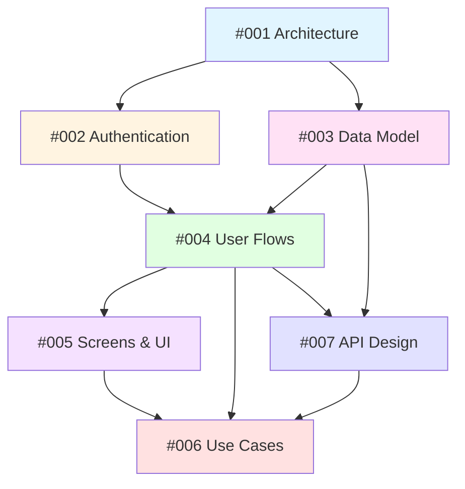

# Visualizer Client Platform - Design Documentation

**Platform**: Epox Visualizer Client (SaaS Product Generation Studio)
**Status**: Design Phase
**Last Updated**: 2026-01-10

---

## Overview

This directory contains comprehensive design documentation for the **visualizer-client** platform - a SaaS application that enables clients to generate AI-powered product visualizations at scale.

The platform allows users to:
- Select products from their catalog (bulk selection: 20-500 products)
- Analyze products with AI to determine optimal room contexts
- Choose inspiration images from multiple sources (upload, Unsplash, generated library)
- Generate hundreds of product images automatically
- Download, organize, and reuse generated assets

## Design Logs

All design documents follow the **Design Log Methodology** (see `/.claude/rules/design-log.md`).

### Core Architecture & Infrastructure

#### [📋 Design Log #001: Architecture & Infrastructure](./001-architecture-infrastructure.md)
**Focus**: System architecture, technology stack, package structure

**Key Topics**:
- High-level architecture diagram (apps, shared package, core packages)
- Package structure (`visualizer-shared`, separation from `scenergy-visualizer`)
- Technology stack (Next.js, Drizzle, Redis, Gemini, S3)
- Data flow for image generation
- Infrastructure components (Redis queue, S3 storage, database)
- Environment configuration

**Key Decisions**:
- ✅ Create `visualizer-shared` package for code reuse
- ✅ Separate apps for admin vs. client (independent deployment)
- ✅ Redis queue + database persistence (dual tracking)
- ✅ Polling for status updates (initially, WebSockets future)

---

### Authentication & Security

#### [🔐 Design Log #002: Authentication & Authorization](./002-authentication-authorization.md)
**Focus**: User authentication, client scoping, security model

**Key Topics**:
- Separate auth tables (`adminUser` vs `user`)
- User-to-client association via `member` table
- Invitation-based signup flow
- Session management and clientId scoping
- Authorization middleware (all queries scoped to user's client)
- Security checklist

**Key Decisions**:
- ✅ Invitation-only signup (MVP, admins invite users)
- ✅ Session cookies (Better Auth) over JWT
- ✅ Single client per user (MVP, multi-client future)
- ✅ Row-level scoping via `WHERE clientId = session.clientId`

**Related Files**:
- Database: `users`, `members`, `sessions` tables
- Middleware: `apps/visualizer-client/middleware.ts`
- Context: `ClientContext.tsx`

---

### Data Model & Terminology

#### [💾 Design Log #003: Data Model & Terminology](./003-data-model-terminology.md)
**Focus**: Database schema, rename "Job" → "GeneratedAsset"

**Key Topics**:
- **Terminology change**: "Job" → "GeneratedAsset" (reflects business value)
- Core entities: `Client`, `Product`, `Collection`, `GeneratedAsset`, `Image`
- Collection workflow tables (`collections`, `inspiration_images`)
- GeneratedAsset lifecycle (draft → pending → generating → completed/error)
- Queue vs. database separation (transient vs. persistent)
- Soft-delete strategy

**Key Decisions**:
- ✅ "GeneratedAsset" is the primary entity (not "Job")
- ✅ Collections are first-class entities
- ✅ Soft-delete with 30-day recovery window
- ✅ JSONB for flexible settings storage
- ✅ Support multiple asset types (image, video, 3d_render)

**Database Schema**:
- 5 new tables: `collections`, `inspiration_images`, `generated_assets`, `users`, `members`
- Comprehensive indexes for performance
- Drizzle ORM schema definitions

---

### User Experience

#### [🔀 Design Log #004: User Flows & Journey](./004-user-flows-journey.md)
**Focus**: End-to-end user workflows, interaction patterns

**Key Topics**:
- **Onboarding flow**: Invitation → signup → first collection (<5 min)
- **Collection creation flow**: 4-step wizard (Select → Analyze → Inspire → Generate)
- **Asset management flow**: Gallery, download, pin, delete
- **Error handling flow**: Network, AI, quota, upload failures
- **Settings flow**: Profile, notifications, defaults

**Key Patterns**:
- Auto-save drafts every 30 seconds
- Real-time polling (every 5s during generation)
- Soft-delete with 10-second undo toast
- Progressive disclosure (advanced settings hidden)
- Bulk operations (multi-select, ZIP download)

**User Personas**:
- Sarah Chen (Furniture Marketing Manager)
- Mike Rodriguez (E-commerce Catalog Manager)
- Alex Thompson (Interior Design Studio)

---

#### [🎨 Design Log #005: Screens & UI Components](./005-screens-ui-components.md)
**Focus**: Screen layouts, component library, responsive design

**Key Topics**:
- **8 screens**: Login, Dashboard, Collections List, Wizard (4 steps), Results, Products, Settings, Errors
- **Core components**: ProductTable, InspirationPicker, GenerationProgress, AssetGallery
- **Design system**: Colors, typography, spacing scales
- **Responsive breakpoints**: Mobile (< 768px), Tablet (768-1024px), Desktop (> 1024px)
- **Accessibility**: WCAG AA compliance

**Component Specifications**:
- ProductTable (virtualized, search, filter, sort, multi-select)
- InspirationPicker (3 tabs: Upload, Unsplash, Library)
- GenerationProgress (real-time updates, per-product status)
- AssetGallery (lightbox, download, pin, delete actions)

**State Management**:
- React Context for global state (ClientContext, ModalContext)
- TanStack Query for server state (caching, polling)

---

### Requirements & Use Cases

#### [📝 Design Log #006: Use Cases & Scenarios](./006-use-cases-scenarios.md)
**Focus**: Detailed use cases, user scenarios, edge cases

**Key Topics**:
- **8 primary use cases**: Onboarding, creating collections, AI analysis, inspiration selection, progress monitoring, downloads, pinning, regeneration
- **4 secondary use cases**: Product management, settings, team collaboration (future), API integration (future)
- **6 edge cases**: Network failures, AI failures, quota limits, invalid uploads, concurrent editing, large datasets

**Example Quantifiable Scenario**:
- User: Sarah (Furniture Marketing Manager)
- Action: Create collection with 45 products
- Time: 19 minutes total (7 min interaction + 12 min generation)
- Output: 180 generated images (45 × 4 variants)
- Success rate: 176/180 (97.8%)
- Cost: $9.00, Storage: 360MB

**Each Use Case Includes**:
- Actor, preconditions, main flow, alternatives, exceptions, postconditions
- Success criteria (measurable)
- Related components (mapped to other design logs)

---

### API & Integration

#### [🔌 Design Log #007: API Design](./007-api-design.md)
**Focus**: REST API specifications, endpoints, security

**Key Topics**:
- **8 API sections**: Auth, Products, Collections, Assets, Images, Analysis, Unsplash, User
- **Complete endpoint specs**: Methods, paths, request/response types, auth, rate limits
- **API patterns**: Pagination (cursor/offset), filtering, sorting, polling, batch operations
- **Security**: CORS, rate limiting, input validation, file upload security
- **Error handling**: RFC 7807 Problem Details format

**Key Endpoints**:
```
POST   /api/auth/signup
GET    /api/products?search=desk&category=furniture
POST   /api/collections
POST   /api/collections/:id/analyze
POST   /api/collections/:id/generate
GET    /api/collections/:id/status
GET    /api/generated-assets?collectionId=...
POST   /api/generated-assets/:id/regenerate
POST   /api/images/upload
GET    /api/unsplash/search?query=modern+office
```

**Rate Limits** (per client):
- Auth endpoints: 5 req/min (prevent brute force)
- Product list: 30 req/min
- Generate: 10 req/hour (prevent abuse)
- Upload: 20 req/min
- Polling: 60 req/min

---

## Design Principles

### 1. Separation of Concerns
- **Admin App** (scenergy-visualizer): Multi-client management, full control
- **Client App** (visualizer-client): Single-client studio, simplified UX
- **Shared Package** (visualizer-shared): Generation logic, no app-specific code

### 2. Progressive Disclosure
- Show simple defaults first
- Hide advanced settings behind "Advanced" toggle
- Guide users through 4-step wizard
- AI fills in sensible values (user just confirms)

### 3. Bulk-First UX
- Designed for 100+ products, not one at a time
- Product table with search, filter, multi-select
- Collection workflow (not individual generation)
- Batch download (ZIP archive)

### 4. Non-Technical Language
- "Warm lighting" not "temperature: 5500K"
- "Modern style" not "embedding vector: [0.23, ...]"
- "Scene inspiration" not "conditioning image"

### 5. Resilient by Default
- Auto-save drafts (resume from any step)
- Soft-delete (30-day recovery)
- Retry logic for network/AI failures
- Graceful fallbacks (metadata-only if AI fails)
- Clear error messages with actionable next steps

### 6. Performance
- Virtual scrolling for large tables (1000+ products)
- Optimistic UI updates
- Skeleton loaders (perceived speed)
- Background processing with notifications
- Efficient polling (5s interval, stops when complete)

---

## Key Terminology Changes

### "Job" → "GeneratedAsset"
The codebase previously used "Job" terminology (ImageGenerationJob, VisualizationJob) to represent work items in the generation queue. We've renamed this to **GeneratedAsset** to reflect the true nature:

| Old Term | New Term | Why |
|----------|----------|-----|
| ImageGenerationJob | GeneratedAsset (type: image) | It's a valuable asset, not just a job |
| Job Queue | Generation Queue | Focuses on action, not temporary work |
| jobId (database) | assetId | Clarifies this is the permanent record |
| jobId (Redis) | jobId | Queue-specific, transient |

**Two Concepts**:
1. **GeneratedAsset** (database) - Permanent, valuable, business entity
2. **QueueJob** (Redis) - Transient, processing metadata

Relationship: `GeneratedAsset.jobId → QueueJob.id` (reference to transient queue job)

---

## Implementation Roadmap

### Phase 1: Foundation (Weeks 1-2)
- [ ] Create `visualizer-shared` package
- [ ] Database migrations (collections, generated_assets, users, members)
- [ ] Extract core services to shared package
- [ ] Set up Better Auth for client users

### Phase 2: Authentication (Week 3)
- [ ] User signup/login flows
- [ ] Invitation system (admin invites users)
- [ ] ClientContext (derive clientId from membership)
- [ ] Authorization middleware

### Phase 3: Product Selection (Week 4)
- [ ] ProductTable component (search, filter, sort, multi-select)
- [ ] Products API with pagination
- [ ] Collection creation (draft mode)
- [ ] Auto-save drafts

### Phase 4: AI Analysis (Week 5)
- [ ] Product analyzer service (metadata → room assignments)
- [ ] Scene analyzer service (images → style/lighting/colors)
- [ ] Unsplash integration
- [ ] InspirationPicker component (Upload, Unsplash, Library tabs)

### Phase 5: Generation (Week 6)
- [ ] GenerationQueue service in shared package
- [ ] Collection → GeneratedAssets mapping
- [ ] Generate API endpoint (enqueue all products)
- [ ] Status polling API

### Phase 6: Asset Management (Week 7)
- [ ] AssetGallery component
- [ ] GenerationProgress component (real-time updates)
- [ ] Download single/bulk (ZIP)
- [ ] Pin/unpin assets
- [ ] Soft-delete with undo

### Phase 7: Polish & Testing (Week 8)
- [ ] Error handling for all edge cases
- [ ] Loading states and skeletons
- [ ] Responsive design testing
- [ ] Accessibility audit (WCAG AA)
- [ ] Performance optimization (virtual scrolling)

### Phase 8: Deployment (Week 9)
- [ ] Environment configuration (staging, production)
- [ ] Database migrations (production)
- [ ] Deploy to Vercel
- [ ] Monitoring and logging setup
- [ ] Load testing

---

## Cross-References

### How the Design Logs Connect



**Reading Order**:
1. **Start here**: #001 (Architecture) - Understand the system
2. **Then**: #002 (Authentication) - How users access it
3. **Then**: #003 (Data Model) - What data we store
4. **Then**: #004 (User Flows) - How users interact
5. **Then**: #005 (Screens) - What they see
6. **Then**: #006 (Use Cases) - Real-world scenarios
7. **Finally**: #007 (API) - Technical integration

**By Role**:
- **Product Managers**: Read #004 (Flows), #006 (Use Cases), #005 (Screens)
- **Engineers**: Read #001 (Architecture), #003 (Data Model), #007 (API)
- **Designers**: Read #005 (Screens), #004 (Flows), #006 (Use Cases)
- **QA**: Read #006 (Use Cases), #004 (Flows), #007 (API)

---

## Open Questions

These questions are tracked across all design logs and need resolution:

1. **Multi-client support** (DL #002): Should users belong to multiple clients?
   - For MVP: Single client per user
   - Future: Client switcher UI

2. **Rate limiting** (DL #001, #007): How to prevent abuse?
   - Proposal: 100 generations/day per client (free tier)
   - Enterprise: Unlimited or higher limits

3. **Webhooks** (DL #001): Notify clients when generation completes?
   - For MVP: No webhooks
   - Future: Webhook support for integrations

4. **Asset versioning** (DL #003): Track versions when regenerating?
   - Proposal: No explicit versioning
   - Just create new asset each time, group by productId in UI

5. **Session duration** (DL #002): How long should sessions last?
   - Proposal: 7 days (remember me), 1 day (default)

6. **Password reset** (DL #002): Implement in MVP?
   - Proposal: Yes, use Better Auth's built-in flow

7. **OAuth providers** (DL #002): Which to support?
   - Proposal: Google (high priority), GitHub (nice-to-have)

---

## Success Criteria

The platform is ready when:

### Technical
- [ ] Both apps (admin, client) generate images using same services
- [ ] No duplicated generation logic
- [ ] All API queries scoped to user's clientId (no data leakage)
- [ ] Can recover queue state from database after Redis restart
- [ ] All design logs implemented as specified

### User Experience
- [ ] New user: Invitation → signup → first collection in <5 minutes
- [ ] Bulk generation: 100 products queued in <30 seconds
- [ ] Progress updates: <10 second latency
- [ ] Error messages: Clear, actionable, non-technical
- [ ] Mobile responsive: All screens work on 375px width

### Performance
- [ ] Product table: Renders 1000+ products smoothly
- [ ] Collection creation: No blocking operations (all async)
- [ ] Asset gallery: Infinite scroll with virtual rendering
- [ ] Generation queue: Processes 10 jobs/minute (Gemini rate limit)

### Security
- [ ] All endpoints validate session
- [ ] All queries filter by clientId
- [ ] Cannot access other clients' data
- [ ] File uploads validated (type, size, virus scan)
- [ ] Rate limiting prevents abuse

---

## Related Documentation

- **Project Rules**: `/.claude/rules/design-log.md` - Design log methodology
- **Architecture Overview**: `/apps/scenergy-visualizer/docs/ARCHITECTURE-OVERVIEW.md` - Existing admin app architecture
- **External Plans**: `/docs/plans/visualizer_client_*.plan.md` - Original planning documents

---

## Contact & Contribution

For questions or clarifications about these design logs:
1. Check if your question is addressed in "Open Questions" section
2. Review related design logs (see Cross-References above)
3. Contact: [Product/Engineering Team]

When updating design logs:
1. Follow the methodology in `/.claude/rules/design-log.md`
2. Update "Last Updated" date in this README
3. Add new logs to the numbered sequence (008, 009, etc.)
4. Update cross-reference diagram if dependencies change
