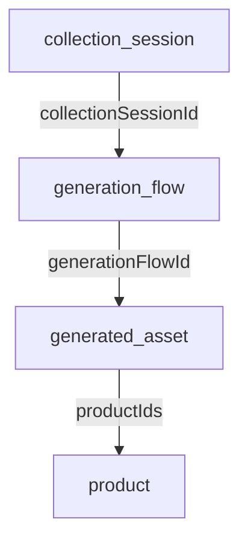

# Design Log 0001: Collection Asset Ownership

## Background
- Collections create per-product generation flows (`generation_flow`) with `collectionSessionId`.
- Generated assets (`generated_asset`) are linked to flows via `generationFlowId`.
- Collection UI shows generated counts and history using collection/product data.

## Problem
- Collection counts can include assets from other collections that share the same products, especially after a collection is deleted.
- Deleting a collection does not offer asset retention options.
- Studio flow history only shows assets for the current flow; users want to optionally see all assets for the products in that flow.

## Questions and Answers
1) Q: Should "keep pinned and approved" keep assets that are pinned **or** approved, or only assets that are both?
   - A: pinned or approved (approved should automatically also be pinned)
2) Q: Should "all generated assets for products in this flow" include videos as well as images?
   - A: yes
3) Q: For collection counts, should `generatedCount` represent **completed** assets only (current dashboard behavior) or **all** assets?
   - A: Proposed: completed assets only.
4) Q: Default delete option in the UI: "delete all assets" or "keep pinned/approved"?
   - A: ask the User and recommend: keep pinned/approved (safer).

## Design
### Ownership Model
- Treat a collection as owning assets whose `generationFlowId` belongs to flows with `collectionSessionId = collection.id`.
- Do not infer ownership by product IDs.

### Collection Counts
- Update collection counts to use assets from collection flows only.
- `generatedCount` = count of assets with `status === 'completed'` for the collection's flow IDs.
- `totalImages` = count of all assets for the collection's flow IDs.
- Affected API routes:
  - `apps/epox-platform/app/api/dashboard/route.ts`
  - `apps/epox-platform/app/api/collections/route.ts`
  - `apps/epox-platform/app/api/collections/[id]/route.ts`

### Collection Deletion Options
- Add delete policy to `DELETE /api/collections/:id` body:
  - `assetPolicy: 'delete_all' | 'keep_pinned_approved'`
- Behavior:
  - `delete_all`: delete all assets where `generationFlowId` is in collection flow IDs.
  - `keep_pinned_approved`: delete only assets that are **not** pinned and **not** approved.
- Deletion removes asset DB records and storage objects, then deletes the collection (flows cascade).

### Studio History Scope Toggle
- Add checkbox on `apps/epox-platform/app/(dashboard)/studio/[id]/page.tsx`:
  - Label: "Show all assets for products in this flow"
- When checked:
  - Query `GET /api/generated-images` with `productIds=[...]` (all products in the flow).
- When unchecked:
  - Keep existing `flowId` query.
- Add new API filter:
  - `productIds` query param (comma-separated) in `GET /api/generated-images`.
  - Update `GeneratedAssetListOptions` to accept `productIds: string[]`.

### Type Signatures (New/Updated)
- `apps/epox-platform/lib/api-client.ts`
  - `interface GeneratedImagesParams { productIds?: string[]; ... }`
  - `deleteCollection(collectionId: string, options?: { assetPolicy?: 'delete_all' | 'keep_pinned_approved' })`
- `packages/visualizer-db/src/repositories/generated-assets.ts`
  - `interface GeneratedAssetListOptions { productIds?: string[]; ... }`

### Diagram

## Implementation Plan
1) API + repository updates
   - Add `productIds` filter support to `GET /api/generated-images`.
   - Extend `GeneratedAssetListOptions` filtering for multiple product IDs.
2) Collection counts
   - Use flow IDs to compute `generatedCount` and `totalImages` in collection list/detail/dashboard.
3) Collection deletion options
   - Update delete dialogs and `apiClient.deleteCollection` to send `assetPolicy`.
   - Implement asset deletion policy in `DELETE /api/collections/[id]`.
4) Studio history toggle
   - Add checkbox and query switching in `apps/epox-platform/app/(dashboard)/studio/[id]/page.tsx`.
5) Tests
   - Update `apps/epox-platform/tests/api/collections.test.ts`.
   - Add/adjust `apps/epox-platform/tests/api/generated-images.test.ts`.

## Examples
✅ Delete collection, keep pinned/approved:
- Asset A: pinned=false, approval=approved -> kept
- Asset B: pinned=true, approval=pending -> kept
- Asset C: pinned=false, approval=pending -> deleted

❌ Delete collection, keep none:
- Asset A: pinned=true, approval=approved -> deleted (only if policy is `delete_all`)

✅ History toggle off:
- `/api/generated-images?flowId=flow_123`

✅ History toggle on:
- `/api/generated-images?productIds=prod_1,prod_2`

## Trade-offs
- Counting assets by flow IDs is accurate but requires extra queries to fetch flow IDs.
- Keeping pinned/approved assets on delete preserves important outputs but can leave orphaned assets with `generationFlowId = null`.

## Implementation Results
- Asset ownership and counts now use collection flow IDs in `/api/collections`, `/api/collections/[id]`, and `/api/dashboard`.
- Collection delete adds `assetPolicy` with UI options; `keep_pinned_approved` keeps assets that are pinned OR approved.
- Studio history toggle added; “Show all assets” includes images and videos for products in the flow.
- Tests: `yarn workspace @repo/epox-platform vitest run tests/api/generated-images.test.ts tests/api/collections.test.ts tests/api/dashboard.test.ts` (34/34 passing).

### Deviations From Design
- None.
