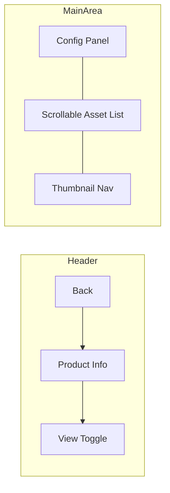
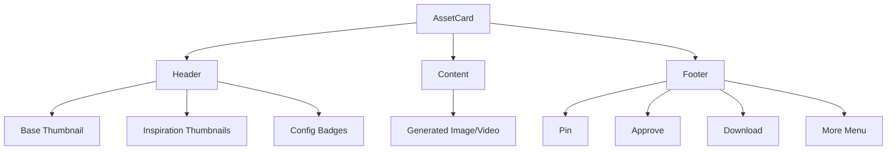

# Design Log #014: Studio UI Redesign

## Background

The current studio UI has:
- Single product studio (`/studio/[id]`) with left config panel, center preview, bottom history gallery
- Collection studio (`/studio/collections/[id]`) with config panel and grid/list of GenerationFlowCards
- History displayed as horizontal thumbnail strip at the bottom

User wants a redesign inspired by Kling AI interface to improve the viewing and navigation experience.

## Problem

1. Current main view shows single image - user wants scrollable list of all generated images/videos
2. History is horizontal at bottom - user wants vertical thumbnail nav on right side
3. No asset card header showing source images and configuration
4. Missing grid view option for generated assets
5. Collection list view doesn't show product-centric browsing with generation history

## Design Requirements

### 1. Gen Flow Page (Single Product Studio)

**Main View - Scrollable Asset List:**
- Replace single image preview with vertical scrollable list of all generated images/videos
- Each image/video in the list has:
  - **Header**: Shows thumbnail of base image + inspiration image + configuration summary
  - **Main content**: The generated image/video (large viewable)
  - **Footer**: Action bar with Pin, Approve, Download, Delete buttons

**Right Thumbnail Nav:**
- Vertical list of thumbnails on far right
- Clicking thumbnail scrolls main view to that asset
- No "selected" state needed - just navigation
- Compact, minimal design

**View Toggle:**
- Toggle between "List View" (scrollable cards) and "Grid View" (gallery grid)
- Grid view shows all images in masonry/grid layout

**Config Panel:**
- Stays the same (left side, collapsible)

### 2. Collection Page List View

**Main View - Product-Centric Scrollable List:**
- Each product shows as a large card in scrollable main view
- Card shows:
  - **Header**: Product thumbnail, product name, configuration info
  - **Main content**: Latest generated image with gallery navigation (chevrons left/right for history)
  - **Footer**: Pin, Approve, Download actions

**Right Product Nav:**
- Vertical list of product thumbnails on right
- Clicking scrolls to that product in main view

**Grid View:**
- Stays the same as current GenerationFlowCard grid

---

## Component Architecture

```
┌──────────────────────────────────────────────────────────────────┐
│ Header                                                           │
├──────────┬───────────────────────────────────────────────┬──────┤
│          │                                               │      │
│  Config  │     Main Scrollable View                      │ Nav  │
│  Panel   │     ┌─────────────────────────────────────┐   │ Bar  │
│          │     │ Asset Card                          │   │      │
│          │     │ ┌─────────────────────────────────┐ │   │ ○    │
│          │     │ │ Header: Base + Insp + Config    │ │   │ ○    │
│          │     │ ├─────────────────────────────────┤ │   │ ○    │
│          │     │ │                                 │ │   │ ○    │
│          │     │ │   Generated Image/Video        │ │   │ ●    │
│          │     │ │                                 │ │   │ ○    │
│          │     │ ├─────────────────────────────────┤ │   │      │
│          │     │ │ Footer: Pin | Approve | DL     │ │   │      │
│          │     │ └─────────────────────────────────┘ │   │      │
│          │     │                                     │   │      │
│          │     │ [Next Asset Card...]                │   │      │
│          │     └─────────────────────────────────────┘   │      │
│          │                                               │      │
└──────────┴───────────────────────────────────────────────┴──────┘
```

---

## New Components

### 1. `AssetCard` Component

For displaying individual generated assets in the main view.

```typescript
interface AssetCardProps {
  asset: GeneratedAsset;
  baseImage?: { url: string; name?: string };
  inspirationImages?: InspirationImage[];
  configuration?: {
    sceneType?: string;
    stylePreset?: string;
    lightingPreset?: string;
    aspectRatio?: string;
    quality?: string;
  };
  onPin?: () => void;
  onApprove?: () => void;
  onDownload?: () => void;
  onDelete?: () => void;
  isPinned?: boolean;
  isApproved?: boolean;
}
```

**Structure:**
- Header: 40-48px height, shows base image thumbnail (24x24), inspiration thumbnails, config badges
- Content: Full-width generated image/video, aspect ratio preserved
- Footer: 40-48px height, action buttons spaced evenly

### 2. `ThumbnailNav` Component

Vertical navigation sidebar for jumping to assets.

```typescript
interface ThumbnailNavProps {
  items: Array<{
    id: string;
    thumbnailUrl: string;
    label?: string;
    isVideo?: boolean;
  }>;
  onItemClick: (id: string) => void;
  activeId?: string; // optional highlight
}
```

**Structure:**
- Fixed width (60-80px)
- Vertical scroll for overflow
- Thumbnails 48x48 rounded
- Subtle hover/click feedback

### 3. `ProductAssetCard` Component (for Collection List View)

Card showing product with gallery navigation through its generation history.

```typescript
interface ProductAssetCardProps {
  product: { id: string; name: string; thumbnailUrl?: string };
  revisions: Revision[];
  currentIndex: number;
  onPrevious: () => void;
  onNext: () => void;
  configuration?: AssetCardConfiguration;
  onPin?: () => void;
  onApprove?: () => void;
  onDownload?: () => void;
}
```

**Structure:**
- Header: Product thumbnail + name + config
- Content: Current revision image with left/right chevron overlays
- Footer: Actions + revision counter (1/5)

---

## Implementation Plan

### Phase 1: Core Components

1. **Create `AssetCard` component**
   - Path: `components/studio/AssetCard.tsx`
   - Header, content, footer structure
   - Action button handlers

2. **Create `ThumbnailNav` component**
   - Path: `components/studio/ThumbnailNav.tsx`
   - Vertical scrollable list
   - Click-to-scroll behavior

3. **Create `ProductAssetCard` component**
   - Path: `components/studio/ProductAssetCard.tsx`
   - Gallery navigation (prev/next)
   - Reuses similar header/footer pattern

### Phase 2: Single Product Studio Redesign

4. **Update `studio/[id]/page.tsx`**
   - Replace center preview with scrollable `AssetCard` list
   - Add `ThumbnailNav` on right side
   - Add view mode toggle (list/grid)
   - Remove bottom history panel
   - Implement scroll-to behavior

### Phase 3: Collection Studio List View

5. **Update `studio/collections/[id]/page.tsx`**
   - Add list view mode using `ProductAssetCard`
   - Add product `ThumbnailNav` on right for list mode
   - Keep existing grid mode with `GenerationFlowCard`

### Phase 4: Polish

6. **Add smooth scroll animations**
7. **Responsive adjustments**
8. **Keyboard navigation support**

---

## Questions

**Q1:** For the grid view, should clicking an image open it in a modal or inline expand?
**A1:** _TBD - likely inline expand within grid with escape to close_

**Q2:** Should the thumbnail nav show asset type (image vs video) indicator?
**A2:** _Yes, small video icon badge on video thumbnails_

**Q3:** In collection list view, should products without generations show a placeholder or be hidden?
**A3:** _Show placeholder with "Generate" CTA button_

**Q4:** Should configuration in header be expandable/collapsible or always visible?
**A4:** _Always visible but truncated, hover for full details via tooltip_

---

## Trade-offs

| Approach | Pros | Cons |
|----------|------|------|
| Scroll-to navigation | Natural, familiar pattern | Requires scroll position management |
| Modal for full view | Clean separation | Extra click, breaks flow |
| Inline expansion | Quick access | Can be jarring, layout shifts |

**Decision:** Use scroll-to navigation for consistency with Kling AI reference.

---

## Examples

### ✅ Good: Asset Card Header
```
┌──────────────────────────────────────────────────────────────┐
│ 🖼️ [Base] 🎨 [Insp1] [Insp2]  │ Living Room • Modern • 2K │
└──────────────────────────────────────────────────────────────┘
```

### ❌ Bad: Cluttered Header
```
┌──────────────────────────────────────────────────────────────┐
│ Base: product.jpg | Inspiration: scene1.jpg, scene2.jpg,    │
│ scene3.jpg | Scene: Living Room | Style: Modern Minimalist  │
│ | Lighting: Natural | Quality: 2K | Aspect: 1:1 | Variants: 4│
└──────────────────────────────────────────────────────────────┘
```

### ✅ Good: Footer Actions
```
┌──────────────────────────────────────────────────────────────┐
│  📌 Pin    │   ✓ Approve    │   ⬇ Download   │   ⋯ More   │
└──────────────────────────────────────────────────────────────┘
```

---

## File Changes Summary

| File | Change Type |
|------|-------------|
| `components/studio/AssetCard.tsx` | **NEW** |
| `components/studio/ThumbnailNav.tsx` | **NEW** |
| `components/studio/ProductAssetCard.tsx` | **NEW** |
| `components/studio/index.ts` | MODIFY (exports) |
| `app/(dashboard)/studio/[id]/page.tsx` | MODIFY (major) |
| `app/(dashboard)/studio/collections/[id]/page.tsx` | MODIFY (add list view) |

---

## Diagrams

### Single Product Studio Layout



### Asset Card Structure



---

## Implementation Results

### Phase 1: Core Components ✅

1. **`shared.tsx`** - Created shared utility components:
   - `ImageThumbnail` - Reusable thumbnail with size variants
   - `InspirationStack` - Stacked inspiration image thumbnails
   - `ConfigBadges` - Configuration summary badges
   - `StatusBadges` - Pin/approval status indicators
   - `AssetActionBar` - Unified action bar with Pin/Approve/Download/More
   - `GalleryNavigation` - Prev/next navigation overlays
   - `VideoOverlay` - Play button and duration for videos
   - `ThumbnailStrip` - Mini thumbnail row for revisions
   - `AssetCardWrapper/Header/Content/Footer` - Card structure components

2. **`AssetCard.tsx`** - Individual generated asset card:
   - Header with base image + inspirations + config badges
   - Full content area with image/video
   - Footer with action buttons
   - Uses shared components for DRY code

3. **`ThumbnailNav.tsx`** - Two variants:
   - `ThumbnailNav` - Simple vertical nav for assets
   - `ProductThumbnailNav` - Product thumbnails with names and counts

4. **`ProductAssetCard.tsx`** - Product card with gallery navigation:
   - Product info header
   - Gallery navigation (prev/next) through revisions
   - Empty state with generate CTA
   - Thumbnail strip in footer

### Phase 2: Single Product Studio ✅

Updated `/studio/[id]/page.tsx`:
- Added view mode toggle (list/grid) in header
- Replaced center preview + bottom history with scrollable main view
- List view: Vertical scrollable `AssetCard` list
- Grid view: Responsive image grid with hover overlays
- Added `ThumbnailNav` on right side (list view only)
- Removed zoom/pan controls (no longer needed with list view)
- Added API routes for pin/approval: `/api/generated-images/[id]/pin`, `/api/generated-images/[id]/approval`

### Phase 3: Collection Studio List View ✅

Updated `/studio/collections/[id]/page.tsx`:
- Matrix view unchanged (uses `GenerationFlowCard`)
- List view now uses `ProductAssetCard` with gallery navigation
- Added `ProductThumbnailNav` on right for product navigation
- Click product thumbnail scrolls to that product in main view

### API Changes

Added to `api-client.ts`:
- `togglePinImage(id)` - Toggle pin status
- `updateImageApproval(id, status)` - Update approval status

Created new routes:
- `POST /api/generated-images/[id]/pin` - Toggle pin
- `POST /api/generated-images/[id]/approval` - Update approval

### Deviations from Design

1. **No inline expand in grid view** - Clicking grid item switches to list view and scrolls to that item (simpler UX)
2. **Video duration hardcoded** - Shows "5s" badge, would need actual video metadata for real duration
3. **Collection list view actions** - Pin/approve shows info toast directing to individual studio (actions are per-revision, not per-product)

### Files Changed

| File | Change |
|------|--------|
| `components/studio/shared.tsx` | NEW - Shared utility components |
| `components/studio/AssetCard.tsx` | NEW - Asset card component |
| `components/studio/ThumbnailNav.tsx` | NEW - Thumbnail navigation |
| `components/studio/ProductAssetCard.tsx` | NEW - Product asset card |
| `components/studio/index.ts` | MODIFIED - Added exports |
| `app/(dashboard)/studio/[id]/page.tsx` | MODIFIED - New layout |
| `app/(dashboard)/studio/collections/[id]/page.tsx` | MODIFIED - List view |
| `app/api/generated-images/[id]/pin/route.ts` | NEW - Pin API |
| `app/api/generated-images/[id]/approval/route.ts` | NEW - Approval API |
| `lib/api-client.ts` | MODIFIED - Added pin/approval methods |
