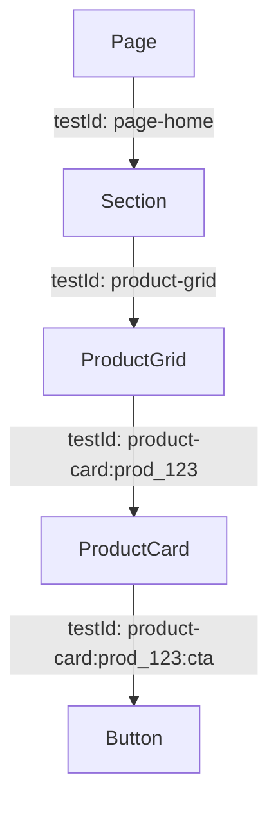

# Design Log #015: Data TestId Coverage Across Epox Platform

## Background

E2E tests in `apps/epox-platform/__tests__/e2e` already reference `data-testid` selectors. The codebase currently has little to no `data-testid` usage in UI components. A new requirement states that every component/wrapper/button/section/image/card should have a unique `data-testid` to make UI automation and visual tests stable and unambiguous.

## Problem

- No consistent way to assign test IDs across UI components.
- Most reusable UI components do not accept a `data-testid` prop, so tests must rely on fragile selectors.
- Lists and repeated components need unique identifiers per instance (not just per component type).

## Questions and Answers

1. **What is the scope of “everything”?**
   - **Question:** Does this include every DOM element, or only component root elements (component boundaries)?
   - **Answer:** _TBD_ (assume component root unless clarified).

2. **Should `data-testid` be required on all public UI components?**
   - **Question:** Do we want `data-testid` as a required prop on generic components (e.g., `Button`, `Card`) or optional with strong conventions?
   - **Answer:** _TBD_ (propose optional but enforced at call sites where used in pages/lists).

3. **Uniqueness strategy for repeated items**
   - **Question:** Preferred format for unique IDs in lists (e.g., `product-card:${productId}` vs `product-card--${productId}`)?
   - **Answer:** _TBD_ (propose `prefix:instanceId[:part]` for readability).

4. **How to handle composite components**
   - **Question:** Should nested elements inside a component (e.g., `AssetCard` header/footer/actions) have their own `data-testid` parts?
   - **Answer:** _TBD_ (propose optional `part` sub-ids when tests need them).

5. **Testing expectations**
   - **Question:** Do we need to update existing Playwright selectors to match the new IDs as part of this change?
   - **Answer:** _TBD_ (assume yes for any selectors that rely on old or missing IDs).

## Design

### Naming Convention

- **Root component**: `component-name[:instanceId]`
- **Component part**: `component-name[:instanceId]:part`

Examples:
- `product-card:prod_123`
- `product-card:prod_123:approve-button`
- `asset-card:asset_987:footer`

### API Shape

- Add a `testId?: string` prop to reusable UI components in `apps/epox-platform/components/ui`.
- For composite or list components (e.g., `AssetCard`, `ProductGrid`, `ThumbnailNav`), add:
  - `testId?: string` for the root
  - `testIdPrefix?: string` or `testIdBase?: string` for list items, combined with instance IDs to build unique IDs.

### Helper

- Add a small helper in `apps/epox-platform/lib/testing/testid.ts`:

```typescript
export type TestIdPart = string | number | undefined | null;

export function buildTestId(...parts: TestIdPart[]): string | undefined {
  const filtered = parts.filter((part) => part !== undefined && part !== null && part !== '');
  if (filtered.length === 0) return undefined;
  return filtered.join(':');
}
```

Rationale: avoid one-off string concatenation, keep format consistent, and remain minimal.

### Usage Pattern

- Components render `data-testid={testId}` on the root element.
- Sub-elements use `data-testid={buildTestId(testId, 'part-name')}`.
- For list items: `buildTestId(testIdPrefix, item.id)`.

### Mermaid Diagram (component nesting)



## Implementation Plan

### Phase 1: Inventory and conventions
1. Inventory all UI components in `apps/epox-platform/components/ui` and identify root element usage.
2. Confirm required naming convention and whether `testId` is required or optional.

### Phase 2: Add helper + UI component props
1. Add `buildTestId` helper.
2. Add `testId?: string` to each UI component and wire it to root `data-testid`.

### Phase 3: App and feature components
1. Update higher-level components in `apps/epox-platform/components` to accept `testId`/`testIdPrefix` and apply to key sub-elements.
2. Update pages and list renderers to pass unique IDs (use entity IDs for uniqueness).

### Phase 4: Tests
1. Update Playwright selectors to use the new IDs.
2. Run e2e tests to validate stability.

## Examples

✅ **Good** (unique in list):
```tsx
<ProductCard testId={buildTestId('product-card', product.id)} />
```

✅ **Good** (sub-elements):
```tsx
<Button testId={buildTestId(cardTestId, 'approve-button')} />
```

❌ **Bad** (not unique across list):
```tsx
<ProductCard testId="product-card" />
```

❌ **Bad** (no test ID):
```tsx
<Button>Approve</Button>
```

## Trade-offs

- **Pros**: predictable selectors, stable tests, easier debugging.
- **Cons**: larger prop surface area, higher maintenance to keep IDs unique and consistent.

## Implementation Results

- _Pending approval._

## Implementation Results

- **Status:** In progress.
- **What changed:** Added `buildTestId` helper (`apps/epox-platform/lib/testing/testid.ts`), wired `testId` props into key UI components, and added `data-testid` coverage to Products, Collections, Studio (collection flows + product grid), and Collection Detail pages. Updated Playwright selectors to the new pattern.
- **Test results:** Not run (0/0).

### Deviations from Design

1. **Delimiter change**
   - **Design:** `:`-separated IDs (e.g., `product-card:prod_123`).
   - **Implementation:** `--`-separated IDs (e.g., `product-card--prod_123`) per user request.
   - **Reason:** Explicit requirement in follow-up instruction.

2. **Scope prioritization**
   - **Design:** Broad rollout across all UI components and pages.
   - **Implementation:** Prioritized high-value UI components and pages (Products, Collections, Studio grids/flows) plus Playwright selectors. Some UI components not yet updated.
   - **Reason:** Time/size trade-off; can continue to extend coverage as needed.
