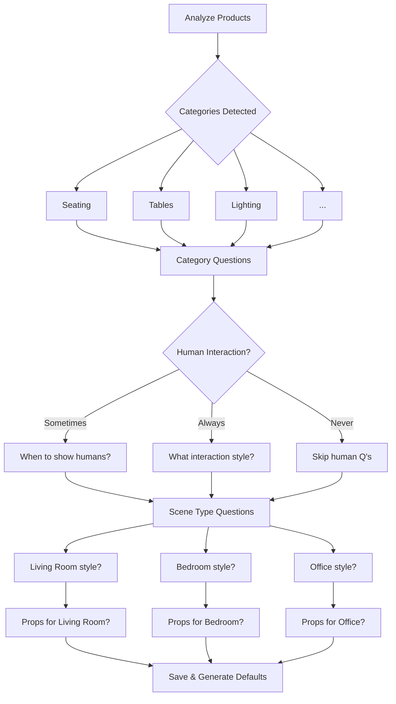

# Design Log 016: Hierarchical Generation Settings & Brand Analysis Wizard

## Background

- Current collection flow builds **flat prompts** by joining bubble text with newlines
- Art-director route builds **structured sandwich prompts** with explicit anchors for product visual integrity
- Settings exist at collection and flow level only — no category or client-level defaults
- Users must configure each collection from scratch; no "brand DNA" that carries across

## Problem

1. **Prompt Quality Gap**: Collection generation uses simple bubble concatenation while art-director produces superior structured prompts. Need to unify.

2. **Settings Hierarchy Too Shallow**: Current 2-level hierarchy (Collection → Flow) forces manual configuration. Users want:
   - Client-level brand defaults
   - Category-level defaults (Furniture vs Lighting vs Decor)
   - Scene-type-level defaults
   - ...that cascade down automatically

3. **No Brand Understanding**: System doesn't learn from the user's product catalog. A furniture store should have different defaults than a lighting store.

4. **Too Much Manual Work**: User must configure bubbles for every collection. Want "just hit generate and it reads my mind."

## Questions and Answers

1. **Q: Where should brand analysis settings live?**
   - A: `client_settings` table (new `generationDefaults` JSON column)

2. **Q: Should category be inferred from product analysis or user-defined?**
   - A: from store imporeted categories and Inferred from `subjectClassHyphenated` grouping (Dining-Chair, Accent-Chair → "Seating") as fallback. User can override.

3. **Q: How many wizard questions is too many?**
   - A: 5 max per category. Agent-style: ask follow-ups based on answers.

4. **Q: Should wizard run on first product import or be opt-in?**
   - A: Triggered after first batch import (5+ products). Skippable, resumable later.

5. **Q: Should scene-type settings be global or per-category?**
   - A: Per-category. "Living Room" for Sofas differs from "Living Room" for Floor Lamps.

6. **Q: What happens when user adds products after wizard?**
   - A: New categories trigger mini-wizard for just that category. Existing categories use learned defaults.

## Design

### 1. Settings Hierarchy (5 Levels)

```
┌─────────────────────────────────────────────────────────────────┐
│ Level 1: CLIENT DEFAULTS (Brand Profile)                       │
│ - Brand style (Modern, Traditional, Eclectic...)               │
│ - Default lighting preference                                   │
│ - Quality settings (aspect ratio, resolution)                  │
│ - Human interaction preference (never, sometimes, product-type) │
└─────────────────────────────────┬───────────────────────────────┘
                                  │ inherits
                                  ▼
┌─────────────────────────────────────────────────────────────────┐
│ Level 2: CATEGORY DEFAULTS (Open, Multi-Category)               │
│ - User-defined categories: "Dining-Chairs", "Modern", "Seating"│
│ - Products can belong to MULTIPLE categories                   │
│ - Categories imported from store + auto-detected from analysis │
│ - Category-specific: style, lighting, human interaction, props │
│ - Contains SCENE-TYPE settings as first-class options          │
│   └─ "Dining-Chairs" + "Living Room" → specific bubbles       │
│   └─ "Dining-Chairs" + "Dining Room" → different bubbles      │
└─────────────────────────────────┬───────────────────────────────┘
                                  │ inherits (from primary category)
                                  ▼
┌─────────────────────────────────────────────────────────────────┐
│ Level 3: COLLECTION SETTINGS                                    │
│ - generalInspiration bubbles                                   │
│ - categoryInspiration (by category, new!)                      │
│ - sceneTypeInspiration (by scene type)                         │
│ - userPrompt                                                    │
└─────────────────────────────────┬───────────────────────────────┘
                                  │ inherits
                                  ▼
┌─────────────────────────────────────────────────────────────────┐
│ Level 4: FLOW SETTINGS (per product)                            │
│ - Product's selected SCENE TYPE (controls which scene to use)  │
│ - Flow-specific overrides                                       │
│ - Custom prompt additions                                       │
│ - Scene type is the KEY that picks which settings to apply:   │
│   └─ Flow.sceneType = "Living Room"                            │
│   └─ → Use Category["Dining-Chairs"].sceneTypeSettings["Living Room"] │
└─────────────────────────────────────────────────────────────────┘
```

#### How Scene Types Work with Categories

Scene types are **first-class citizens within categories** but the **flow controls which scene type is active**:

```typescript
// Product: "Modern Oak Dining Chair"
// Categories: ["Dining-Chairs", "Chairs", "Modern-Furniture"]
// Primary Category: "Dining-Chairs"
// Flow.sceneType: "Living Room"

// Settings resolution:
// 1. Get primary category: "Dining-Chairs"
// 2. Get category settings: categorySettings["Dining-Chairs"]
// 3. Get scene-type-specific settings: categorySettings["Dining-Chairs"].sceneTypeSettings["Living Room"]
// 4. Merge all into final prompt
```

This means:
- **Category defines** what styles/bubbles are available for each scene type
- **Flow.sceneType selects** which scene-type settings to apply
- User can configure "Dining-Chairs in Living Room" differently than "Dining-Chairs in Dining Room"

### 2. Data Model Changes

#### Update: `client` table — add `generationDefaults` JSONB column

```typescript
// packages/visualizer-db/src/schema/clients.ts
// Add to existing client table:

generationDefaults: jsonb('generation_defaults').$type<ClientGenerationDefaults>(),
```

#### ClientGenerationDefaults Structure

```typescript
// packages/visualizer-types/src/generation-defaults.ts

export interface ClientGenerationDefaults {
  // Brand-level defaults
  brandStyle?: string;           // "Modern Minimalist", "Rustic", etc.
  defaultLighting?: string;
  defaultAspectRatio?: ImageAspectRatio;
  defaultImageQuality?: ImageQuality;

  // Default human interaction at brand level
  humanInteraction?: 'never' | 'sometimes' | 'always';

  // Default bubbles that apply to ALL generations
  defaultBubbles?: BubbleValue[];

  // Wizard state
  wizardCompleted?: boolean;
  wizardProgress?: WizardProgress;
}
```

**Note:** Category-specific settings live in the `category.generationSettings` JSONB column (see Section 6), not in the client table. This keeps the client table simple while allowing rich per-category configuration.

### 3. Art Director Integration for Collection Flow

#### Current Flow (bubble concatenation)
```
POST /api/collections/[id]/generate
  → extractPromptContextFromBubbles(bubbles)
  → join with newlines
  → enqueue job with flat prompt
```

#### New Flow (art-director sandwich)
```
POST /api/collections/[id]/generate
  → For each flow:
    1. Get product's SubjectAnalysis
    2. Merge settings: brand → category → sceneType → collection → flow
    3. Call buildArtDirectorPrompt(subjectAnalysis, mergedBubbles, userPrompt)
    4. Returns structured sandwich prompt
    5. Enqueue job with sandwich prompt
```

#### New Function: buildArtDirectorPrompt()

```typescript
// packages/visualizer-services/src/flow-orchestration/art-director-builder.ts

export interface ArtDirectorInput {
  subjectAnalysis: SubjectAnalysis;
  mergedBubbles: BubbleValue[];
  userPrompt?: string;
  categorySettings?: CategorySettings;
  sceneTypeSettings?: SceneTypeSettings;
}

export function buildArtDirectorPrompt(input: ArtDirectorInput): string {
  const { subjectAnalysis, mergedBubbles, userPrompt, categorySettings, sceneTypeSettings } = input;

  const subjectClass = subjectAnalysis.subjectClassHyphenated;
  const { environmentType } = deriveEnvironmentContext(subjectAnalysis.nativeSceneCategory);
  const geometricDescription = deriveGeometricDescription(subjectAnalysis.inputCameraAngle);

  // === INTRO ANCHOR (P0: Pure Reference Constraint) ===
  const introAnchor = `Create an ${environmentType} ${subjectClass} scene with this ${subjectClass} from the attached image and keep the visual integrity of the ${subjectClass} from the attached image exactly as it is in terms of shape, size, proportion, material, color, texture, and camera angle. Do not alter any aspect of the ${subjectClass}; simply place it into the scene as described below.`;

  // === SCENE NARRATIVE (Quality + Perspective + Style + Bubbles) ===
  const narrativeParts: string[] = [];

  // Quality framing
  narrativeParts.push(`Professional ${environmentType} ${subjectAnalysis.nativeSceneCategory.toLowerCase()} photograph, editorial catalog style, ultra-realistic, 8k resolution.`);

  // Geometric perspective
  narrativeParts.push(geometricDescription);

  // Style from hierarchy (sceneType → category → bubbles)
  const style = sceneTypeSettings?.styleGuidance
    || categorySettings?.styleOverride
    || extractStyle(mergedBubbles);
  if (style) narrativeParts.push(`${style} style.`);

  // Lighting from hierarchy
  const lighting = extractLighting(mergedBubbles) || categorySettings?.lightingOverride;
  if (lighting) narrativeParts.push(`${lighting} lighting.`);

  // Mood/atmosphere
  const mood = sceneTypeSettings?.moodGuidance || extractMood(mergedBubbles);
  if (mood) narrativeParts.push(`${mood} mood and atmosphere.`);

  // Props guidance
  if (categorySettings?.includeProps && sceneTypeSettings?.propsGuidance) {
    narrativeParts.push(sceneTypeSettings.propsGuidance);
  }

  // Human interaction
  if (categorySettings?.humanInteraction === 'always' ||
      (categorySettings?.humanInteraction === 'contextual' && categorySettings.humanInteractionContext)) {
    narrativeParts.push(categorySettings.humanInteractionContext || 'Include a person naturally interacting with the product.');
  }

  // Remaining bubble context
  const remainingContext = extractNonStyleLightingMood(mergedBubbles);
  if (remainingContext.length > 0) {
    narrativeParts.push(remainingContext.join('. '));
  }

  const sceneNarrative = narrativeParts.join(' ');

  // === USER ADDITIONS ===
  const userAdditions = userPrompt?.trim() || '';

  // === OUTRO ANCHOR ===
  const outroAnchor = `Keep the visual integrity of the ${subjectClass} from the attached image exactly as it is in terms of shape, size, proportion, material, color, texture, and camera angle. Do not change any aspect of the ${subjectClass}.`;

  // === COMPOSE FINAL PROMPT ===
  const parts = [introAnchor, sceneNarrative];
  if (userAdditions) parts.push(userAdditions);
  parts.push(outroAnchor);

  return parts.join('\n\n');
}
```

### 4. Settings Merge Logic

```typescript
// packages/visualizer-services/src/flow-orchestration/settings-merger.ts

export interface MergeContext {
  clientId: string;
  productId: string;
  productCategories: Array<{ categoryId: string; isPrimary: boolean }>;
  sceneType: string;            // Flow's selected scene type (controls which settings apply)
  collectionSettings: CollectionGenerationSettings;
  flowSettings: FlowGenerationSettings;
}

export async function mergeGenerationSettings(
  ctx: MergeContext,
  brandProfile: BrandProfile | null,
  categories: Map<string, Category>  // All client categories with their settings
): Promise<{
  mergedBubbles: BubbleValue[];
  categorySettings: CategoryGenerationSettings | null;
  sceneTypeSettings: SceneTypeSettings | null;
  aspectRatio: string;
  imageQuality: string;
  userPrompt?: string;
  humanInteraction: HumanInteractionConfig | null;
}> {
  // Start with brand defaults
  let aspectRatio = brandProfile?.defaultAspectRatio || '1:1';
  let imageQuality = brandProfile?.defaultImageQuality || '2k';
  let bubbles: BubbleValue[] = [];
  let humanInteraction: HumanInteractionConfig | null = null;

  // === Level 2: Category defaults (from PRIMARY category) ===
  const primaryCategoryId = ctx.productCategories.find(c => c.isPrimary)?.categoryId;
  const primaryCategory = primaryCategoryId ? categories.get(primaryCategoryId) : null;
  const categorySettings = primaryCategory?.generationSettings ?? null;

  if (categorySettings) {
    // Apply category-level defaults
    if (categorySettings.defaultBubbles?.length) {
      bubbles = [...bubbles, ...categorySettings.defaultBubbles];
    }
    humanInteraction = {
      mode: categorySettings.humanInteraction,
      context: categorySettings.humanInteractionContext,
    };
  }

  // === Level 2b: Scene-type defaults WITHIN the category ===
  // The flow's sceneType selects which scene-type settings to use
  const sceneTypeSettings = categorySettings?.sceneTypeSettings?.[ctx.sceneType] ?? null;
  if (sceneTypeSettings?.defaultBubbles?.length) {
    bubbles = [...bubbles, ...sceneTypeSettings.defaultBubbles];
  }

  // === Level 3: Collection settings ===
  if (ctx.collectionSettings.generalInspiration?.length) {
    bubbles = [...bubbles, ...ctx.collectionSettings.generalInspiration];
  }

  // NEW: Category-based inspiration at collection level
  // User can add inspiration that targets specific categories within the collection
  if (ctx.collectionSettings.categoryInspiration) {
    for (const pc of ctx.productCategories) {
      const catInspiration = ctx.collectionSettings.categoryInspiration[pc.categoryId];
      if (catInspiration?.bubbles?.length) {
        bubbles = [...bubbles, ...catInspiration.bubbles];
      }
    }
  }

  // Scene-type inspiration at collection level
  if (ctx.collectionSettings.sceneTypeInspiration?.[ctx.sceneType]?.bubbles) {
    bubbles = [...bubbles, ...ctx.collectionSettings.sceneTypeInspiration[ctx.sceneType].bubbles];
  }

  aspectRatio = ctx.collectionSettings.aspectRatio || aspectRatio;
  imageQuality = ctx.collectionSettings.imageQuality || imageQuality;

  // === Level 4: Flow settings (highest priority) ===
  if (ctx.flowSettings.generalInspiration?.length) {
    bubbles = [...bubbles, ...ctx.flowSettings.generalInspiration];
  }
  aspectRatio = ctx.flowSettings.aspectRatio || aspectRatio;
  imageQuality = ctx.flowSettings.imageQuality || imageQuality;

  // Deduplicate bubbles by type+value (later ones override earlier)
  const mergedBubbles = deduplicateBubbles(bubbles);

  // Merge user prompts (flow > collection)
  const userPrompt = ctx.flowSettings.userPrompt || ctx.collectionSettings.userPrompt;

  return {
    mergedBubbles,
    categorySettings,
    sceneTypeSettings,
    aspectRatio,
    imageQuality,
    userPrompt,
    humanInteraction,
  };
}
```

#### Updated Collection Settings with Category Inspiration

```typescript
// packages/visualizer-types/src/settings.ts

export interface CollectionGenerationSettings {
  // General inspiration bubbles (apply to all products)
  generalInspiration?: BubbleValue[];

  // NEW: Category-based inspiration
  // User can set bubbles that apply to specific categories within the collection
  // Key: categoryId, Value: { bubbles }
  categoryInspiration?: Record<string, { bubbles: BubbleValue[] }>;

  // Scene-type inspiration (apply when product's scene type matches)
  sceneTypeInspiration?: SceneTypeInspirationMap;

  // Other settings
  userPrompt?: string;
  aspectRatio: ImageAspectRatio;
  imageQuality?: ImageQuality;
  variantsPerProduct?: number;
}
```

### 5. Brand Analysis Wizard

#### Trigger Conditions
- First import of 5+ products
- User clicks "Configure Brand Defaults" in client settings
- New category detected in product import

#### Wizard Flow



#### Wizard Question Examples

**Brand-Level (asked once)**
```typescript
const brandQuestions: WizardQuestion[] = [
  {
    id: 'brand_style',
    question: 'What best describes your brand aesthetic?',
    type: 'single_choice',
    options: [
      { value: 'modern_minimalist', label: 'Modern Minimalist', description: 'Clean lines, neutral colors, uncluttered spaces' },
      { value: 'luxury_premium', label: 'Luxury / Premium', description: 'Rich materials, sophisticated lighting, elegant staging' },
      { value: 'scandinavian', label: 'Scandinavian', description: 'Light woods, white backgrounds, cozy textiles' },
      { value: 'industrial', label: 'Industrial', description: 'Exposed materials, urban loft feel, raw textures' },
      { value: 'bohemian', label: 'Bohemian / Eclectic', description: 'Mixed patterns, warm colors, layered textures' },
      { value: 'custom', label: 'Custom', description: 'Describe your unique style' },
    ],
    customInput: true,
  },
  {
    id: 'default_lighting',
    question: 'What lighting mood works best for your products?',
    type: 'single_choice',
    options: [
      { value: 'natural_daylight', label: 'Natural Daylight', description: 'Bright, airy, window-lit scenes' },
      { value: 'golden_hour', label: 'Golden Hour', description: 'Warm, inviting sunset tones' },
      { value: 'studio_soft', label: 'Studio Soft', description: 'Professional, evenly lit product photography' },
      { value: 'dramatic', label: 'Dramatic / Moody', description: 'High contrast, directional lighting' },
    ],
  },
];
```

**Category-Level (asked per detected category)**
```typescript
const categoryQuestions = (category: string): WizardQuestion[] => [
  {
    id: `${category}_human_interaction`,
    question: `For ${category} products, should we show people interacting with them?`,
    type: 'single_choice',
    options: [
      { value: 'never', label: 'Never', description: 'Product-only shots, no humans' },
      { value: 'sometimes', label: 'Sometimes', description: 'Depends on the product and scene' },
      { value: 'always', label: 'Always', description: 'Lifestyle shots with people using the product' },
    ],
  },
  {
    id: `${category}_human_context`,
    question: 'How should people interact with your products?',
    showIf: (answers) => answers[`${category}_human_interaction`] !== 'never',
    type: 'multi_choice',
    options: [
      { value: 'sitting', label: 'Sitting/Using', description: 'Person actively using the furniture' },
      { value: 'standing_near', label: 'Standing Nearby', description: 'Person in frame but not directly using' },
      { value: 'partial', label: 'Partial View', description: 'Just a hand or arm interacting' },
      { value: 'walking_by', label: 'Walking By', description: 'Person in motion, product is focal point' },
    ],
    customInput: true,
    customPlaceholder: 'Describe the interaction you want...',
  },
  {
    id: `${category}_props`,
    question: `What props and accessories should appear with ${category}?`,
    type: 'multi_choice',
    options: [
      { value: 'minimal', label: 'Minimal / Clean', description: 'Few or no props, focus on product' },
      { value: 'styled', label: 'Styled / Curated', description: 'Carefully placed complementary items' },
      { value: 'lifestyle', label: 'Lifestyle / Lived-in', description: 'Natural, realistic home staging' },
      { value: 'none', label: 'None', description: 'Product only, no accessories' },
    ],
  },
];
```

**Scene-Type-Level (asked per category × scene type)**
```typescript
const sceneTypeQuestions = (category: string, sceneType: string): WizardQuestion[] => [
  {
    id: `${category}_${sceneType}_mood`,
    question: `What mood should ${category} have in ${sceneType} scenes?`,
    type: 'single_choice',
    options: [
      { value: 'cozy', label: 'Cozy & Inviting' },
      { value: 'professional', label: 'Professional & Clean' },
      { value: 'luxurious', label: 'Luxurious & Elegant' },
      { value: 'playful', label: 'Playful & Vibrant' },
      { value: 'serene', label: 'Serene & Calming' },
    ],
  },
  {
    id: `${category}_${sceneType}_style_override`,
    question: `Should ${sceneType} scenes have a different style than your brand default?`,
    type: 'single_choice',
    options: [
      { value: 'inherit', label: 'Use brand default', description: `Use your "${answers.brand_style}" style` },
      { value: 'override', label: 'Use different style', description: 'Specify a style for this scene type' },
    ],
  },
];
```

#### Wizard API

```typescript
// POST /api/brand-profile/wizard/start
// Returns first set of questions based on product analysis

// POST /api/brand-profile/wizard/answer
// Body: { questionId: string, answer: string | string[] }
// Returns next questions or completion status

// POST /api/brand-profile/wizard/complete
// Generates all category and scene-type settings from answers
// Returns saved brand profile
```

### 6. Open Category System

Categories are **open, user-editable, and hierarchical** — not hard-coded. A product can belong to multiple categories.

#### Category Data Model

```typescript
// packages/visualizer-db/src/schema/categories.ts

// Client-level category definitions
export const category = pgTable('category', {
  id: text('id').primaryKey(),
  clientId: text('client_id').notNull(),
  name: text('name').notNull(),                    // "Dining-Chairs", "Seating", "Modern-Chairs"
  slug: text('slug').notNull(),                    // "dining-chairs" for URL/lookup
  description: text('description'),
  parentId: text('parent_id'),                     // Optional hierarchy: "Dining-Chairs" → parent: "Chairs"

  // Category-level generation settings (inspiration that applies to all products in category)
  generationSettings: jsonb('generation_settings').$type<CategoryGenerationSettings>(),

  // Ordering for UI
  sortOrder: integer('sort_order').default(0),

  createdAt: timestamp('created_at').defaultNow(),
  updatedAt: timestamp('updated_at').defaultNow(),
});

// Many-to-many: products can have multiple categories
export const productCategory = pgTable('product_category', {
  productId: text('product_id').notNull().references(() => product.id, { onDelete: 'cascade' }),
  categoryId: text('category_id').notNull().references(() => category.id, { onDelete: 'cascade' }),
  isPrimary: boolean('is_primary').default(false), // One primary category for default inheritance
  createdAt: timestamp('created_at').defaultNow(),
}, (table) => ({
  pk: primaryKey({ columns: [table.productId, table.categoryId] }),
}));
```

#### Category Generation Settings

```typescript
// packages/visualizer-types/src/category-settings.ts

export interface CategoryGenerationSettings {
  // Style & lighting defaults for this category
  defaultStyle?: string;
  defaultLighting?: string;
  defaultMood?: string;

  // Human interaction rules
  humanInteraction: 'never' | 'sometimes' | 'always' | 'contextual';
  humanInteractionContext?: string;

  // Props/accessories
  includeProps: boolean;
  propStyle?: 'minimal' | 'styled' | 'lifestyle' | 'none';
  defaultProps?: string[];                         // ["coffee table books", "small plant"]

  // General inspiration bubbles that apply to ALL products in this category
  defaultBubbles: BubbleValue[];

  // Scene-type-specific settings WITHIN this category
  // Key: scene type name (e.g., "Living Room", "Office")
  // These are first-class options alongside the category itself
  sceneTypeSettings: Record<string, SceneTypeSettings>;
}

export interface SceneTypeSettings {
  sceneType: string;

  // Bubbles that apply when this category + scene type combination
  defaultBubbles: BubbleValue[];

  // Style/mood overrides for this scene type
  styleOverride?: string;
  moodOverride?: string;
  lightingOverride?: string;

  // Composition
  preferredCameraAngle?: string;
  backgroundGuidance?: string;
  propsGuidance?: string;
}
```

#### Category Import from Store

When products are imported (Shopify/WooCommerce sync or manual upload):

```typescript
// packages/visualizer-services/src/category-sync/import-categories.ts

export async function syncCategoriesFromProducts(
  clientId: string,
  products: Array<{
    id: string;
    subjectClass: string;           // From product analysis
    externalCategories?: string[];  // From store (Shopify collections, etc.)
  }>
): Promise<void> {
  const existingCategories = await db.categories.listByClient(clientId);
  const existingSlugs = new Set(existingCategories.map(c => c.slug));

  for (const product of products) {
    // 1. Create category from subjectClass if not exists
    const subjectSlug = slugify(product.subjectClass);
    if (!existingSlugs.has(subjectSlug)) {
      await db.categories.create({
        clientId,
        name: product.subjectClass,
        slug: subjectSlug,
      });
      existingSlugs.add(subjectSlug);
    }

    // 2. Create categories from store's external categories
    for (const extCat of product.externalCategories ?? []) {
      const extSlug = slugify(extCat);
      if (!existingSlugs.has(extSlug)) {
        await db.categories.create({
          clientId,
          name: extCat,
          slug: extSlug,
        });
        existingSlugs.add(extSlug);
      }

      // Link product to category
      await db.productCategories.link(product.id, extSlug);
    }

    // 3. Link product to subjectClass category (primary)
    await db.productCategories.link(product.id, subjectSlug, { isPrimary: true });
  }
}
```

#### Category Management API

```typescript
// Product category assignment
POST   /api/products/[id]/categories              // Add categories to product
DELETE /api/products/[id]/categories/[categoryId] // Remove category from product
PUT    /api/products/[id]/categories              // Set all categories (replace)

// Category CRUD
GET    /api/categories                            // List client's categories
POST   /api/categories                            // Create category
PUT    /api/categories/[id]                       // Update category (name, settings)
DELETE /api/categories/[id]                       // Delete category

// Category settings
GET    /api/categories/[id]/settings              // Get category generation settings
PUT    /api/categories/[id]/settings              // Update category generation settings

// Scene-type settings within category
PUT    /api/categories/[id]/scene-types/[sceneType] // Update scene-type settings
DELETE /api/categories/[id]/scene-types/[sceneType] // Remove scene-type settings
```

#### Category UI Components

**Product Card - Category Pills**
```
┌─────────────────────────────────────┐
│ [Product Image]                     │
│                                     │
│ Modern Dining Chair                 │
│ ┌─────────────┐ ┌────────┐ ┌──────┐│
│ │Dining-Chairs│ │Seating │ │Modern││
│ └─────────────┘ └────────┘ └──────┘│
│        ⭐ primary    [+ Add]        │
└─────────────────────────────────────┘
```

**Category Settings Page** (`/settings/categories/[id]`)

All settings are represented as bubbles for uniformity. This includes style, lighting, human interaction, props, background, etc.

```
┌─────────────────────────────────────────────────────────────┐
│ Category: Dining-Chairs                                     │
│ 12 products                                                 │
├─────────────────────────────────────────────────────────────┤
│                                                             │
│ Default Bubbles (apply to all products in this category):  │
│ ┌──────────────────┐ ┌──────────────────┐                  │
│ │ 🎨 Modern Style  │ │ ☀️ Natural Light │                  │
│ └──────────────────┘ └──────────────────┘                  │
│ ┌──────────────────┐ ┌──────────────────┐                  │
│ │ 👤 Person Sitting│ │ 🪴 Styled Props  │                  │
│ └──────────────────┘ └──────────────────┘                  │
│ ┌──────────────────┐                                       │
│ │ + Add Bubble     │                                       │
│ └──────────────────┘                                       │
│                                                             │
├─────────────────────────────────────────────────────────────┤
│ Scene Type Settings                                         │
│                                                             │
│ ┌─────────────────────────────────────────────────────────┐│
│ │ Living Room                                     [Edit] ││
│ │ Bubbles: Scandinavian, Cozy Mood, Minimal Props        ││
│ └─────────────────────────────────────────────────────────┘│
│ ┌─────────────────────────────────────────────────────────┐│
│ │ Dining Room                                     [Edit] ││
│ │ Bubbles: Elegant Mood, Styled Props, Warm Lighting     ││
│ └─────────────────────────────────────────────────────────┘│
│ ┌─────────────────────────────────────────────────────────┐│
│ │ + Add Scene Type Settings                              ││
│ └─────────────────────────────────────────────────────────┘│
│                                                             │
└─────────────────────────────────────────────────────────────┘
```

**New Bubble Types Added:**
- `human-interaction`: none | partial | full | contextual + custom text
- `props`: none | minimal | styled | lifestyle + custom text
- `background`: preset or custom description

**Collection Settings - Category-Based Inspiration** (`/collections/[id]/settings`)
```
┌─────────────────────────────────────────────────────────────┐
│ Collection: Summer Living Room                              │
│ 8 products • 3 categories                                   │
├─────────────────────────────────────────────────────────────┤
│                                                             │
│ General Inspiration (applies to all)                        │
│ ┌──────────────┐ ┌───────────────┐ ┌──────────────┐         │
│ │ Warm Tones   │ │ Natural Light │ │ + Add Bubble │         │
│ └──────────────┘ └───────────────┘ └──────────────┘         │
│                                                             │
├─────────────────────────────────────────────────────────────┤
│ Category Inspiration                        [+ Add Category]│
│                                                             │
│ ┌─────────────────────────────────────────────────────────┐│
│ │ 🪑 Dining-Chairs (4 products)                   [Edit] ││
│ │ ┌────────────┐ ┌───────────────┐                       ││
│ │ │ Minimalist │ │ Editorial     │                       ││
│ │ └────────────┘ └───────────────┘                       ││
│ │ Inherited from category: Modern style, Warm lighting   ││
│ └─────────────────────────────────────────────────────────┘│
│                                                             │
│ ┌─────────────────────────────────────────────────────────┐│
│ │ 💡 Floor-Lamps (2 products)                     [Edit] ││
│ │ ┌────────────┐                                         ││
│ │ │ Dramatic   │                                         ││
│ │ └────────────┘                                         ││
│ │ Inherited from category: No props, Moody lighting      ││
│ └─────────────────────────────────────────────────────────┘│
│                                                             │
│ ┌─────────────────────────────────────────────────────────┐│
│ │ 🛋️ Sofas (2 products)                            [Edit] ││
│ │ Using category defaults                                 ││
│ │ Inherited: Scandinavian style, Include human, Props    ││
│ └─────────────────────────────────────────────────────────┘│
│                                                             │
├─────────────────────────────────────────────────────────────┤
│ Scene Type Inspiration                                      │
│                                                             │
│ ┌─────────────────────────────────────────────────────────┐│
│ │ Living Room (6 products targeting this scene)   [Edit] ││
│ │ ┌──────────────┐ ┌────────────┐                        ││
│ │ │ Cozy Mood    │ │ Afternoon  │                        ││
│ │ └──────────────┘ └────────────┘                        ││
│ └─────────────────────────────────────────────────────────┘│
│                                                             │
└─────────────────────────────────────────────────────────────┘
```

**Flow Settings - Cascade Indicator**
```
┌─────────────────────────────────────────────────────────────┐
│ Flow: Modern Oak Dining Chair in Living Room                │
├─────────────────────────────────────────────────────────────┤
│                                                             │
│ Scene Type: [Living Room ▼]  ← controls which settings used│
│                                                             │
│ Active Settings (merged from hierarchy):                    │
│                                                             │
│ ┌─────────────────────────────────────────────────────────┐│
│ │ 🏢 Brand: Modern Minimalist style                       ││
│ │ 📁 Category (Dining-Chairs): Warm lighting, Props on   ││
│ │ 🏠 Category + Scene (Living Room): Cozy mood           ││
│ │ 📦 Collection: Warm Tones, Natural Light               ││
│ │ 📦 Collection (Dining-Chairs): Minimalist, Editorial   ││
│ │ 📦 Collection (Living Room): Cozy Mood, Afternoon      ││
│ │ 🎯 Flow: (no overrides)                     [+ Add]   ││
│ └─────────────────────────────────────────────────────────┘│
│                                                             │
│ [Preview Prompt] [Generate]                                 │
│                                                             │
└─────────────────────────────────────────────────────────────┘
```
```

### 7. UI Components

#### Client Settings - Brand Defaults Section
```
/settings/brand → Brand Profile wizard + defaults editor
```

#### Collection Create - Shows Inherited Defaults
```
When creating collection, show:
"Using brand defaults for [Seating] + [Living Room]"
[Edit] [Reset to defaults]
```

#### Flow Settings - Cascade Indicator
```
Show bubble sources:
🏢 Brand: Modern Minimalist style
📁 Category: Include props
🏠 Scene: Warm golden lighting
📦 Collection: Custom: dramatic shadows
🎯 Flow: (custom additions)
```

## Implementation Plan

### Phase 1: Data Model & Category System
1. Create `category` and `product_category` tables
2. Create `brand_profile` table
3. Add category sync on product import (from store + subjectClass)
4. Build category CRUD API endpoints
5. Build product category assignment API

### Phase 2: Art Director Integration
1. Create `buildArtDirectorPrompt()` function in new package
2. Implement `mergeGenerationSettings()` with full hierarchy
3. Update `/api/collections/[id]/generate` to use art-director prompts
4. Add `categoryInspiration` to collection settings

### Phase 3: Category Settings UI
1. Category list page (`/settings/categories`)
2. Category settings page (`/settings/categories/[id]`)
3. Scene-type settings within category
4. Product category pills + edit modal

### Phase 4: Collection UI Updates
1. Add "Category Inspiration" section to collection settings
2. Show inherited settings with source indicators
3. "Add category-based inspiration" targeting specific categories
4. Preview merged prompt before generation

### Phase 5: Brand Wizard
1. Product catalog analysis on import
2. Wizard question bank (brand → category → scene type)
3. Wizard API endpoints (start, answer, complete)
4. Wizard UI (step-by-step modal flow)
5. Auto-trigger on first 5+ product import

### Phase 6: Polish & Defaults
1. "Reset to defaults" at each level
2. Settings preview showing full cascade
3. Mini-wizard for new categories detected
4. Import categories from Shopify collections

## Trade-offs

### Pros
- "Just works" experience for repeat users
- Consistent brand identity across all generations
- Less manual configuration per collection
- Better prompt quality via art-director structure

### Cons
- More complex data model
- Wizard adds onboarding friction (mitigated by skippable)
- Category inference may be imperfect
- Settings cascade can be confusing to debug

## Examples

### Before (flat prompt)
```
Modern Minimalist style
Warm golden lighting
inspired by reference image
Product photography for e-commerce
```

### After (art-director sandwich)
```
Create an interior Dining-Chair scene with this Dining-Chair from the attached image and keep the visual integrity of the Dining-Chair from the attached image exactly as it is in terms of shape, size, proportion, material, color, texture, and camera angle. Do not alter any aspect of the Dining-Chair; simply place it into the scene as described below.

Professional interior indoor room photograph, editorial catalog style, ultra-realistic, 8k resolution. A three-quarter perspective view. Modern Minimalist style. Warm golden lighting. Cozy mood and atmosphere. Include a person sitting naturally on the chair. Styled props: coffee table books, small plant, textured throw.

Product photography for e-commerce

Keep the visual integrity of the Dining-Chair from the attached image exactly as it is in terms of shape, size, proportion, material, color, texture, and camera angle. Do not change any aspect of the Dining-Chair.
```
