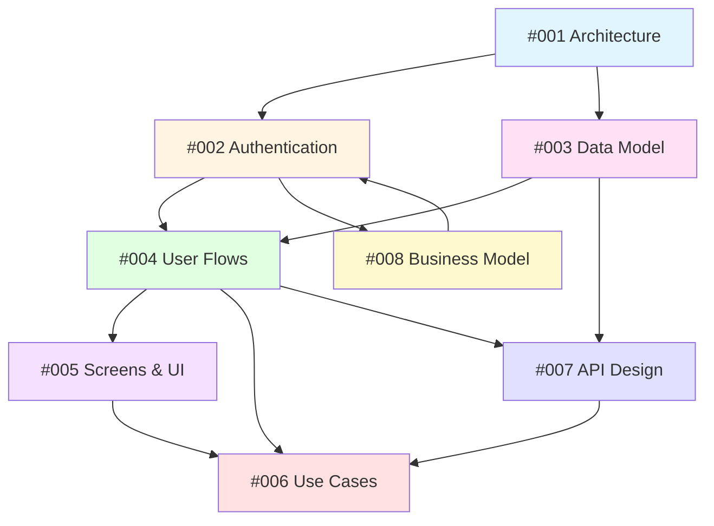

# Visualizer Client Platform - Design Documentation

**Platform**: Epox Visualizer Client (SaaS Product Generation Studio)
**Status**: Design Phase
**Last Updated**: 2026-01-11

---

## Overview

This directory contains comprehensive design documentation for the **visualizer-client** platform - a SaaS application that enables clients to generate AI-powered product visualizations at scale.

The platform allows users to:
- Create studio sessions with multiple products (bulk selection: 20-500 products)
- Configure generation flows with different settings
- Generate hundreds of product images automatically using AI
- Download, organize, and reuse generated images
- **Future**: Automated multi-product combination strategies
- **Future**: Credit-based self-service with subscription tiers

## Design Logs

All design documents follow the **Design Log Methodology** (see `/.claude/rules/design-log.md`).

### Core Architecture & Infrastructure

#### [📋 Design Log #001: Architecture & Infrastructure](./001-architecture-infrastructure.md)
**Focus**: System architecture, technology stack, package structure

**Key Topics**:
- High-level architecture diagram (apps, shared package, core packages)
- Package structure (`visualizer-shared`, separation from `scenergy-visualizer`)
- Technology stack (Next.js, Drizzle, Redis, Gemini, **Cloudflare R2**)
- Data flow for image generation
- Infrastructure components (Redis queue, R2 storage, database)
- Environment configuration

**Key Decisions**:
- ✅ Create `visualizer-shared` package for code reuse
- ✅ Separate apps for admin vs. client (independent deployment)
- ✅ **Reuse existing data model** (StudioSession, Flow, GeneratedImage)
- ✅ **Cloudflare R2** storage (not AWS S3)
- ✅ Redis queue + database persistence (dual tracking)
- ✅ Polling for status updates (initially, WebSockets future)

---

### Authentication & Security

#### [🔐 Design Log #002: Authentication & Authorization](./002-authentication-authorization.md)
**Focus**: User authentication, client scoping, security model, future monetization

**Key Topics**:
- Separate auth tables (`adminUser` vs `user`)
- User-to-client association via `member` table
- Invitation-based signup flow (MVP)
- Session management and clientId scoping
- Authorization middleware (all queries scoped to user's client)
- **Future**: Credit system (Phase 2) and subscriptions (Phase 3)

**Key Decisions**:
- ✅ Invitation-only signup (MVP, admins invite users)
- ✅ Session cookies (Better Auth) over JWT
- ✅ Single client per user (MVP, multi-client future)
- ✅ Row-level scoping via `WHERE clientId = session.clientId`
- 🔜 **Phase 2**: Add credit_balance to members, credit purchase
- 🔜 **Phase 3**: Subscription tiers with store sync

**Future Evolution**:
- Phase 1 (MVP): Invitation-only, no payments
- Phase 2 (Months 4-9): Credit system, self-service signup, 10 free credits
- Phase 3 (Months 10-18): Subscription tiers ($49-$399/mo), store sync

**Related**: Design Log #008 (Business Model & Pricing)

**Related Files**:
- Database: `users`, `members`, `sessions` tables
- Future: `credit_transactions`, `credit_packages`, `subscriptions` tables
- Middleware: `apps/visualizer-client/middleware.ts`
- Context: `ClientContext.tsx`

---

### Data Model & Terminology

#### [💾 Design Log #003: Data Model & Terminology](./003-data-model-terminology.md)
**Focus**: Database schema, entity relationships, **NO renaming needed**

**Key Topics**:
- **Core entities**: StudioSession, Flow, GeneratedImage (existing tables, no changes)
- Multi-product support in Flow via `productIds: string[]`
- Flow lifecycle (empty → configured → generating → completed/error)
- Queue vs. database separation (Redis jobId vs. permanent records)
- Authentication tables (users, members, sessions)
- **Future**: Multi-product combination strategies

**Key Decisions**:
- ✅ **NO renaming** - use existing schema: `studio_session`, `flow`, `generated_image`
- ✅ Flow already supports multi-product (productIds array)
- ✅ Soft-delete with 30-day recovery window
- ✅ JSONB for flexible settings storage
- 🔜 **Future**: Add `combinationStrategy` to Flow (match_dimensions, category_pairing, etc.)

**Important Note**:
- The term "Collection" in user-facing UX may refer to StudioSession
- "Job" refers to transient Redis queue items (jobId field)
- "GeneratedImage" is the permanent database record

**Database Schema**:
- **Existing tables** (reuse as-is): `studio_session`, `flow`, `generated_image`, `product`, `product_image`
- **New tables** (authentication): `users`, `members`, `sessions`, `accounts`
- **Future tables** (monetization): `credit_transactions`, `credit_packages`, `subscriptions`
- **Future tables** (features): `inspiration_images` (optional)

---

### User Experience

#### [🔀 Design Log #004: User Flows & Journey](./004-user-flows-journey.md)
**Focus**: End-to-end user workflows, interaction patterns

**Key Topics**:
- **Onboarding flow**: Invitation → signup → first studio session (<5 min)
- **Studio session creation flow**: 4-step wizard (Select Products → Analyze → Inspire → Generate)
- **Asset management flow**: Gallery, download, pin, delete generated images
- **Error handling flow**: Network, AI, quota, upload failures
- **Settings flow**: Profile, notifications, defaults

**Key Patterns**:
- Auto-save drafts every 30 seconds
- Real-time polling (every 5s during generation)
- Soft-delete with 10-second undo toast
- Progressive disclosure (advanced settings hidden)
- Bulk operations (multi-select, ZIP download)

**User Personas**:
- Sarah Chen (Furniture Marketing Manager) - Seasonal catalogs, 50-100 products
- Mike Rodriguez (E-commerce Catalog Manager) - Large datasets, 1000+ SKUs
- Alex Thompson (Interior Design Studio) - Small curated collections, high customization

---

#### [🎨 Design Log #005: Screens & UI Components](./005-screens-ui-components.md)
**Focus**: Screen layouts, component library, responsive design

**Key Topics**:
- **8 screens**: Login, Dashboard, Sessions List, Wizard (4 steps), Results, Products, Settings, Errors
- **Core components**: ProductTable, InspirationPicker, GenerationProgress, ImageGallery
- **Design system**: Colors, typography, spacing scales
- **Responsive breakpoints**: Mobile (< 768px), Tablet (768-1024px), Desktop (> 1024px)
- **Accessibility**: WCAG AA compliance

**Component Specifications**:
- ProductTable (virtualized, search, filter, sort, multi-select)
- InspirationPicker (3 tabs: Upload, Unsplash, Library)
- GenerationProgress (real-time updates, per-flow status)
- ImageGallery (lightbox, download, pin, delete actions)

**State Management**:
- React Context for global state (ClientContext, ModalContext)
- TanStack Query for server state (caching, polling)

---

### Requirements & Use Cases

#### [📝 Design Log #006: Use Cases & Scenarios](./006-use-cases-scenarios.md)
**Focus**: Detailed use cases, user scenarios, edge cases

**Key Topics**:
- **8 primary use cases**: Onboarding, creating studio sessions, AI analysis, inspiration selection, progress monitoring, downloads, pinning, regeneration
- **4 secondary use cases**: Product management, settings, team collaboration (future), API integration (future)
- **6 edge cases**: Network failures, AI failures, quota limits, invalid uploads, concurrent editing, large datasets

**Example Quantifiable Scenario**:
- User: Sarah (Furniture Marketing Manager)
- Action: Create studio session with 45 products
- Flows: Create 3 flows with different settings
- Time: 19 minutes total (7 min interaction + 12 min generation)
- Output: 180 generated images (45 products × 4 variants per flow = 180 images; 3 flows represent different style settings)
- Success rate: 176/180 (97.8%)
- Cost: $9.00, Storage: 360MB

**Each Use Case Includes**:
- Actor, preconditions, main flow, alternatives, exceptions, postconditions
- Success criteria (measurable)
- Related components (mapped to other design logs)

---

### API & Integration

#### [🔌 Design Log #007: API Design](./007-api-design.md)
**Focus**: REST API specifications, endpoints, security

**Key Topics**:
- **9 API sections**: Auth, Products, **Studio Sessions**, **Flows**, **Generated Images**, Images/Upload, Analysis, Unsplash, User
- **Complete endpoint specs**: Methods, paths, request/response types, auth, rate limits
- **API patterns**: Pagination (cursor/offset), filtering, sorting, polling, batch operations
- **Security**: CORS, rate limiting, input validation, file upload security
- **Error handling**: RFC 7807 Problem Details format

**Key Endpoints**:
```text
POST   /api/auth/signup
GET    /api/products?search=desk&category=furniture
POST   /api/sessions                    # Create studio session
GET    /api/sessions/:id
POST   /api/sessions/:sessionId/flows   # Create flow
POST   /api/flows/:id/generate          # Start generation
GET    /api/flows/:id/status            # Poll progress
GET    /api/flows/:flowId/images        # Get generated images
POST   /api/images/:id/regenerate
POST   /api/images/upload
GET    /api/unsplash/search?query=modern+office
```

**Rate Limits** (per client):
- Auth endpoints: 5 req/min (prevent brute force)
- Product list: 30 req/min
- Generate: 10 req/hour (prevent abuse)
- Upload: 20 req/min
- Polling: 60 req/min

---

### Business Model & Pricing

#### [💰 Design Log #008: Business Model & Pricing Strategy](./008-business-model-pricing.md)
**Focus**: Monetization strategy, pricing tiers, revenue projections

**Key Topics**:
- **Phase 1 (MVP)**: Invitation-only, no payments, validation
- **Phase 2 (Months 4-9)**: Credit system, self-service signup
  - 10 free credits on signup (expires in 30 days)
  - Credit packages: $12 (50 credits), $40 (200 credits), $150 (1000 credits)
  - Target: $10K MRR, 15% conversion rate
- **Phase 3 (Months 10-18)**: Subscription tiers with store sync
  - Basic: $49/mo (100 products, 100 credits/mo)
  - Pro: $149/mo (500 products, 500 credits/mo)
  - Business: $399/mo (2000 products, 2000 credits/mo)
  - Target: $50K MRR, <5% churn
- **Phase 4 (Months 18+)**: Enterprise & agencies
  - Custom pricing starting at $5K/month
  - Agency tier: $499/mo (manage 10 clients)

**Financial Analysis**:
- Cost per generation: $0.05 (Gemini API + R2 + compute)
- Selling price: $0.15-$0.24 per credit
- Target gross margin: **70%**
- LTV:CAC ratio: 8:1 (credits), 119:1 (subscriptions)

**Revenue Projections** (1,000 users, moderate scenario):
- Phase 2: $10,000 MRR
- Phase 3: $28,000 MRR (combined)
- Phase 4: $100,000+ MRR

**Pricing Strategy**:
- ✅ Hybrid model (credits + subscriptions)
- ✅ No credit expiration (purchased credits)
- ✅ Transparent pricing (show cost before generating)
- ✅ Annual discounts (17% = 2 months free)

---

## Design Principles

### 1. Reuse Existing Infrastructure
- **StudioSession** (existing table) serves as the container
- **Flow** (existing table) supports multi-product generation
- **GeneratedImage** (existing table) stores all outputs
- Only add `user`/`member` tables for authentication

### 2. Progressive Disclosure
- Show simple defaults first
- Hide advanced settings behind "Advanced" toggle
- Guide users through 4-step wizard
- AI fills in sensible values (user just confirms)

### 3. Bulk-First UX
- Designed for 100+ products, not one at a time
- Product table with search, filter, multi-select
- Studio session workflow (not individual generation)
- Batch download (ZIP archive)

### 4. Non-Technical Language
- "Warm lighting" not "temperature: 5500K"
- "Modern style" not "embedding vector: [0.23, ...]"
- "Scene inspiration" not "conditioning image"
- "Studio Session" (user-facing) vs. StudioSession (database)

### 5. Resilient by Default
- Auto-save drafts (resume from any step)
- Soft-delete (30-day recovery)
- Retry logic for network/AI failures
- Graceful fallbacks (metadata-only if AI fails)
- Clear error messages with actionable next steps

### 6. Performance
- Virtual scrolling for large tables (1000+ products)
- Optimistic UI updates
- Skeleton loaders (perceived speed)
- Background processing with notifications
- Efficient polling (5s interval, stops when complete)

---

## Key Terminology

### Core Entities

| Term | Definition | Database Table | User-Facing Name |
|------|------------|----------------|------------------|
| **StudioSession** | User's working environment for a set of products | `studio_session` | "Session" or "Studio" |
| **Flow** | Single generation attempt with specific settings | `flow` | "Flow" or "Generation" |
| **GeneratedImage** | Permanent record of a generated image | `generated_image` | "Image" or "Asset" |
| **Product** | Client's catalog item (furniture, decor, etc.) | `product` | "Product" |
| **Member** | User's association with a client | `member` | N/A (backend only) |

### Storage

| Old Term | New Term | Why |
|----------|----------|-----|
| S3 | **Cloudflare R2** | Already in use, lower costs, S3-compatible API |
| S3 bucket | R2 bucket | Terminology alignment |
| s3Key | r2Key | Field naming consistency |

### NO Renaming Needed

The following terms are **already correct** in the existing codebase:
- ✅ `studio_session` (database table)
- ✅ `flow` (database table)
- ✅ `generated_image` (database table)
- ✅ `jobId` (Redis queue identifier, transient)

**Important**: The design logs previously proposed renaming "Job" → "GeneratedAsset", but this is **NOT needed**. The existing schema is correct.

---

## Implementation Roadmap

### Phase 1: Foundation (Weeks 1-2)
- [ ] Create `visualizer-shared` package
- [ ] Database migrations (users, members, sessions, accounts only)
- [ ] Extract core services to shared package (ImageGenerationQueue, prompt builder)
- [ ] Set up Better Auth for client users

### Phase 2: Authentication (Week 3)
- [ ] User signup/login flows
- [ ] Invitation system (admin invites users)
- [ ] ClientContext (derive clientId from membership)
- [ ] Authorization middleware

### Phase 3: Product Selection (Week 4)
- [ ] ProductTable component (search, filter, sort, multi-select)
- [ ] Products API with pagination
- [ ] Studio session creation (draft mode)
- [ ] Auto-save drafts

### Phase 4: AI Analysis (Week 5)
- [ ] Product analyzer service (metadata → room assignments)
- [ ] Scene analyzer service (images → style/lighting/colors)
- [ ] Unsplash integration
- [ ] InspirationPicker component (Upload, Unsplash, Library tabs)

### Phase 5: Generation (Week 6)
- [ ] Reuse ImageGenerationQueue from shared package
- [ ] Flow creation API
- [ ] Generate API endpoint (enqueue for selected products)
- [ ] Status polling API (query flow and generated_image tables)

### Phase 6: Asset Management (Week 7)
- [ ] ImageGallery component
- [ ] GenerationProgress component (real-time updates)
- [ ] Download single/bulk (ZIP)
- [ ] Pin/unpin generated images
- [ ] Soft-delete with undo

### Phase 7: Polish & Testing (Week 8)
- [ ] Error handling for all edge cases
- [ ] Loading states and skeletons
- [ ] Responsive design testing
- [ ] Accessibility audit (WCAG AA)
- [ ] Performance optimization (virtual scrolling)

### Phase 8: Deployment (Week 9)
- [ ] Environment configuration (staging, production)
- [ ] Deploy to Vercel
- [ ] Monitoring and logging setup
- [ ] Load testing

### Phase 9: Credit System (Months 4-9) - FUTURE
- [ ] Add credit_balance to members table
- [ ] Create credit_transactions, credit_packages tables
- [ ] Stripe integration
- [ ] Credit purchase UI
- [ ] Self-service signup (no longer invitation-only)
- [ ] Generation quota checks

### Phase 10: Subscriptions (Months 10-18) - FUTURE
- [ ] Create subscriptions table
- [ ] Stripe subscription webhooks
- [ ] Store sync features (Shopify, WooCommerce)
- [ ] Subscription management UI
- [ ] Monthly credit grants

---

## Cross-References

### How the Design Logs Connect



**Reading Order**:
1. **Start here**: #001 (Architecture) - Understand the system
2. **Then**: #003 (Data Model) - What data we store and how
3. **Then**: #002 (Authentication) - How users access it (+ future monetization)
4. **Then**: #004 (User Flows) - How users interact
5. **Then**: #005 (Screens) - What they see
6. **Then**: #007 (API) - Technical integration details
7. **Then**: #006 (Use Cases) - Real-world scenarios
8. **Finally**: #008 (Business Model) - Monetization strategy

**By Role**:
- **Product Managers**: Read #004 (Flows), #006 (Use Cases), #005 (Screens), #008 (Pricing)
- **Engineers**: Read #001 (Architecture), #003 (Data Model), #007 (API), #002 (Auth)
- **Designers**: Read #005 (Screens), #004 (Flows), #006 (Use Cases)
- **QA**: Read #006 (Use Cases), #004 (Flows), #007 (API)
- **Business/Finance**: Read #008 (Business Model), #002 (Auth - credit system)

---

## Open Questions

These questions are tracked across all design logs and need resolution:

### MVP Questions

1. **Multi-client support** (DL #002): Should users belong to multiple clients?
   - For MVP: Single client per user
   - Future: Client switcher UI (member table already supports this)

2. **Session duration** (DL #002): How long should sessions last?
   - Proposal: 7 days (remember me), 1 day (default)

3. **Password reset** (DL #002): Implement in MVP?
   - Proposal: Yes, use Better Auth's built-in flow

4. **OAuth providers** (DL #002): Which to support?
   - Proposal: Google (high priority), GitHub (nice-to-have)

5. **Flow naming** (DL #003): Should auto-generated flows have auto-names?
   - Proposal: Yes - "Mattress 160cm + Bed 160cm" (from product names)

6. **Max products per flow** (DL #003): Should we limit how many products in one scene?
   - Proposal: Soft limit of 5 products (UI warning), hard limit of 10

### Future Questions (Credit System)

7. **Free tier size** (DL #002, #008): How many free credits on signup?
   - Proposal: 10 credits (expires in 30 days)

8. **Credit expiration** (DL #002, #008): Should purchased credits expire?
   - Proposal: No expiration for purchased credits
   - Subscription credits expire monthly

9. **Negative balances** (DL #002): Allow users to go negative?
   - Proposal: No, hard stop at 0 credits

10. **Refund policy** (DL #008): How to handle credit purchase refunds?
    - Proposal: No refunds if >10% of credits used

### Future Questions (Multi-Product Combinations)

11. **Combination strategy priority** (DL #003): Which strategy as default?
    - Proposal: Let user choose, no auto-fallback

12. **Dimension tolerance** (DL #003): Tolerance for "match_dimensions"?
    - Proposal: ±10cm for furniture, ±5cm for smaller items

---

## Success Criteria

The platform is ready when:

### Technical (MVP)
- [ ] Both apps (admin, client) generate images using same services
- [ ] No duplicated generation logic (ImageGenerationQueue is shared)
- [ ] All API queries scoped to user's clientId (no data leakage)
- [ ] Can recover queue state from database after Redis restart
- [ ] All design logs implemented as specified
- [ ] Existing tables (studio_session, flow, generated_image) work for both apps
- [ ] R2 storage structure is consistent between apps

### User Experience (MVP)
- [ ] New user: Invitation → signup → first studio session in <5 minutes
- [ ] Bulk generation: 100 products selected and flows created in <30 seconds
- [ ] Progress updates: <10 second latency during generation
- [ ] Error messages: Clear, actionable, non-technical
- [ ] Mobile responsive: All screens work on 375px width

### Performance (MVP)
- [ ] Product table: Renders 1000+ products smoothly
- [ ] Studio session creation: No blocking operations (all async)
- [ ] Image gallery: Infinite scroll with virtual rendering
- [ ] Generation queue: Processes 10 jobs/minute (Gemini rate limit)

### Security (MVP)
- [ ] All endpoints validate session
- [ ] All queries filter by clientId
- [ ] Cannot access other clients' data
- [ ] File uploads validated (type, size)
- [ ] Rate limiting prevents abuse

### Future (Credit System - Phase 2)
- [ ] Users can sign up without invitation (self-service)
- [ ] Credit balance displayed in UI
- [ ] Generation blocked when balance = 0
- [ ] Can purchase credit packages via Stripe
- [ ] 15% free-to-paid conversion rate
- [ ] $10K MRR target

### Future (Subscriptions - Phase 3)
- [ ] Users can subscribe to monthly plans
- [ ] Store sync works with Shopify/WooCommerce
- [ ] Monthly credits auto-granted via webhook
- [ ] <5% monthly churn rate
- [ ] $50K MRR target

---

## Related Documentation

- **Project Rules**: `/.claude/rules/design-log.md` - Design log methodology
- **Architecture Overview**: `/apps/scenergy-visualizer/docs/ARCHITECTURE-OVERVIEW.md` - Existing admin app architecture
- **External Plans**: `/docs/plans/visualizer_client_*.plan.md` - Original planning documents

---

## Document History

| Date | Version | Changes |
|------|---------|---------|
| 2026-01-10 | 1.0 | Initial design logs created (#001-#007) |
| 2026-01-11 | 2.0 | **Major update**: Aligned with existing data model, added #008 (Business Model) |

### Version 2.0 Changes (2026-01-11)

**Data Model Alignment**:
- ✅ Removed "GeneratedAsset" concept - use existing `generated_image` table
- ✅ Removed "Collection" concept - use existing `studio_session` table
- ✅ Kept existing Flow model (already supports multi-product)
- ✅ No renaming needed - existing schema is correct

**Storage**:
- ✅ Changed S3 → Cloudflare R2 throughout all logs
- ✅ Updated storage paths to match existing structure

**Future Features**:
- 🔜 Added multi-product combination strategies (FUTURE - not MVP)
- 🔜 Added credit system design (Phase 2 - Design Log #002, #008)
- 🔜 Added subscription tiers (Phase 3 - Design Log #002, #008)

**New Design Log**:
- 📋 Design Log #008: Business Model & Pricing Strategy

---

## Contact & Contribution

For questions or clarifications about these design logs:
1. Check if your question is addressed in "Open Questions" section
2. Review related design logs (see Cross-References above)
3. Contact: [Product/Engineering Team]

When updating design logs:
1. Follow the methodology in `/.claude/rules/design-log.md`
2. Update "Last Updated" date in this README
3. Add new logs to the numbered sequence (009, 010, etc.)
4. Update cross-reference diagram if dependencies change
5. Update "Document History" section with changes
