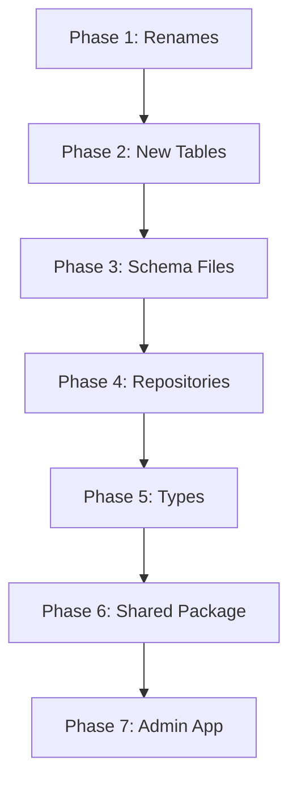

# Implementation Plan #010: Database Migrations & Shared Architecture

**Status**: In Progress
**Created**: 2026-01-12
**Related**: Design Log #001 (Architecture), #003 (Data Model)

---

## Goal

Implement database migrations and shared package architecture so the admin app (scenergy-visualizer) works with the new data model.

**Definition of Done:**
- [ ] Database schema renamed per design logs
- [ ] New tables created per design logs
- [ ] `visualizer-shared` package created with extracted services
- [ ] Admin app updated to use new table names and shared package
- [ ] Admin app runs and basic operations work

---

## Current State Analysis

### Existing Tables (from schema files)
| Current Name | Design Log Target | Action |
|--------------|------------------|--------|
| `studio_session` | `collection_session` | Rename |
| `flow` | `generation_flow` | Rename + make `collection_session_id` nullable |
| `generated_image` | `generated_asset` | Rename + add columns |
| `r2_key` | `asset_url` | Rename column |
| `product` | `product` | Add columns |

### Missing Tables (per Design Log #003)
- `generated_asset_product` - Junction table for multi-product linking
- `tag` - Tags for organization
- `tag_assignment` - Polymorphic tag assignments
- `user_favorite` - User favorites (polymorphic)
- `generation_event` - Analytics events
- `store_connection` - Store OAuth connections
- `store_sync_log` - Sync audit trail
- `inspiration_image` - Inspiration images for sessions

### Services to Extract (from scenergy-visualizer/lib/services/)
- `gemini/` - AI generation service
- `image-generation/queue.ts` - Job queue
- `prompt-builder.ts` - Prompt construction
- `visualization/` - Visualization service
- `redis/client.ts` - Redis client

---

## Implementation Phases

### Phase 1: Database Schema Migrations (Renames)

**1.1 Rename `studio_session` → `collection_session`**
- Rename table
- Update FK references in `message`, `flow`
- Update indexes

**1.2 Rename `flow` → `generation_flow`**
- Rename table
- Make `collection_session_id` nullable (for standalone flows)
- Add `is_favorite` column
- Update FK references in `generated_image`
- Update indexes

**1.3 Rename `generated_image` → `generated_asset`**
- Rename table
- Rename `r2_key` → `asset_url`
- Add `asset_type` column (default: 'image')
- Add `asset_analysis` JSONB column
- Add `analysis_version` column
- Add `approval_status` column (default: 'pending')
- Add `approved_at` column
- Add `approved_by` column
- Update indexes

**1.4 Add columns to `product`**
- Add `is_favorite` boolean
- Add `source` column ('imported' | 'uploaded')
- Add store import fields (erp_id, erp_sku, erp_url, store_connection_id)
- Add analysis fields (analysis_data, analysis_version, analyzed_at)

### Phase 2: New Tables

**2.1 Create `generated_asset_product`**
```sql
CREATE TABLE generated_asset_product (
  id TEXT PRIMARY KEY,
  generated_asset_id TEXT NOT NULL REFERENCES generated_asset(id) ON DELETE CASCADE,
  product_id TEXT NOT NULL REFERENCES product(id) ON DELETE CASCADE,
  is_primary BOOLEAN NOT NULL DEFAULT FALSE,
  created_at TIMESTAMPTZ NOT NULL DEFAULT NOW(),
  UNIQUE(generated_asset_id, product_id)
);
```

**2.2 Create `tag` and `tag_assignment`**

**2.3 Create `user_favorite`**

**2.4 Create `generation_event`**

**2.5 Create `store_connection` and `store_sync_log`**

**2.6 Create `inspiration_image`**

### Phase 3: Update Drizzle Schema Files

Update files in `packages/visualizer-db/src/schema/`:
- `sessions.ts` - Rename exports and table definitions
- `generated-images.ts` → `generated-assets.ts` - Rename file and contents
- Create new schema files for new tables
- Update `index.ts` exports
- Update relations

### Phase 4: Update Repository Layer

Update files in `packages/visualizer-db/src/repositories/`:
- Rename `StudioSessionRepository` → `CollectionSessionRepository`
- Rename `FlowRepository` → `GenerationFlowRepository`
- Rename `GeneratedImageRepository` → `GeneratedAssetRepository`
- Create new repositories for new tables
- Update `facade.ts` and exports

### Phase 5: Update Types Package

Update `packages/visualizer-types/src/`:
- Add new entity types (Tag, TagAssignment, UserFavorite, etc.)
- Rename types to match new table names
- Add type aliases for backward compatibility

### Phase 6: Create Shared Package

Create `packages/visualizer-shared/`:
```
packages/visualizer-shared/
├── package.json
├── tsconfig.json
├── src/
│   ├── index.ts
│   ├── services/
│   │   ├── generation/
│   │   │   ├── queue.ts
│   │   │   ├── gemini-client.ts
│   │   │   └── prompt-builder.ts
│   │   └── storage/
│   │       └── r2-uploader.ts
│   └── types/
│       └── generation.ts
```

### Phase 7: Update Admin App

Update `apps/scenergy-visualizer/`:
- Update imports to use new table/type names
- Update service imports to use shared package
- Update API routes to use renamed repositories
- Test all functionality

---

## Execution Order



---

## Risk Mitigation

1. **Data loss**: Use `ALTER TABLE ... RENAME` instead of DROP/CREATE
2. **Broken references**: Update all FKs before renaming
3. **App downtime**: Make changes backward compatible where possible
4. **Type errors**: Add aliases for old names during transition

---

## Testing Checklist

- [ ] Database migrations apply cleanly
- [ ] Admin app compiles without errors
- [ ] Admin app starts without runtime errors
- [ ] Can list clients
- [ ] Can list products
- [ ] Can create/view collection sessions
- [ ] Can create/view generation flows
- [ ] Image generation works

---

## Files to Modify

### Schema (visualizer-db)
- `packages/visualizer-db/src/schema/sessions.ts`
- `packages/visualizer-db/src/schema/generated-images.ts` → `generated-assets.ts`
- `packages/visualizer-db/src/schema/products.ts`
- `packages/visualizer-db/src/schema/index.ts`
- New: `packages/visualizer-db/src/schema/organization.ts`
- New: `packages/visualizer-db/src/schema/analytics.ts`
- New: `packages/visualizer-db/src/schema/store-sync.ts`

### Repositories (visualizer-db)
- `packages/visualizer-db/src/repositories/studio-sessions.ts` → `collection-sessions.ts`
- `packages/visualizer-db/src/repositories/flows.ts` → `generation-flows.ts`
- `packages/visualizer-db/src/repositories/generated-images.ts` → `generated-assets.ts`
- `packages/visualizer-db/src/repositories/index.ts`
- `packages/visualizer-db/src/facade.ts`

### Types (visualizer-types)
- `packages/visualizer-types/src/domain.ts`
- `packages/visualizer-types/src/database.ts`
- `packages/visualizer-types/src/index.ts`

### New Package (visualizer-shared)
- All files in `packages/visualizer-shared/`

### Admin App (scenergy-visualizer)
- All imports referencing renamed entities
- API routes
- Service imports

