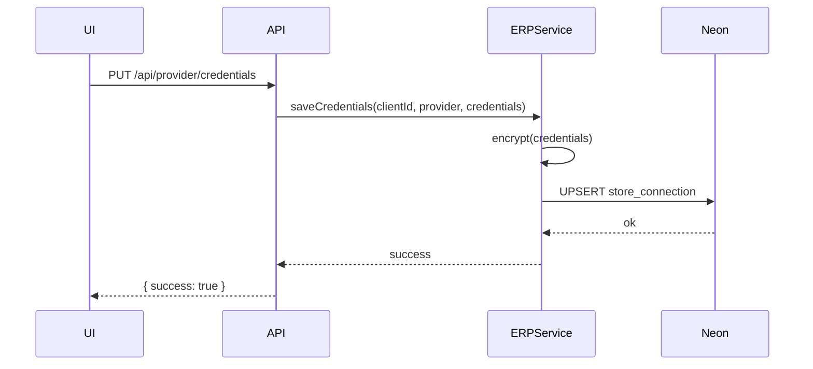
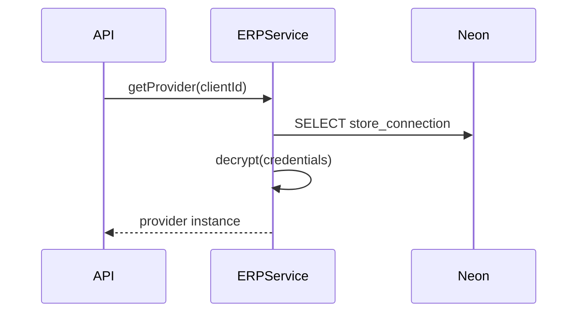

# Design Log #011: Store Connection Credentials in Neon

## Background

- Today, `services/erp-service` stores provider credentials in Supabase Vault via `@scenergy/supabase-service`.
- API routes like `apps/scenergy-visualizer/app/api/provider/credentials/route.ts` call `ERPService.saveCredentials`.
- The target schema (Design Log #001, #003) includes `store_connection` and `store_sync_log`, but `store_connection` currently stores tokens as plain text in `packages/visualizer-db/src/schema/store-sync.ts`.
- Requirement: keep a typed, provider-agnostic credential system, but store everything in Neon with strong at-rest protection.

## Problem

We need a secure, reliable, and extensible credential store in Neon that:

- Supports multiple credential shapes (WooCommerce keys, Shopify OAuth, future ERP providers).
- Keeps secrets encrypted at **rest** and never returned in full to the UI.
- Maintains the same ERPService API so sync/import flows remain stable.

## Questions and Answers

1. **Q: Should we hash tokens “like a JWT”?**  
   **A:** We cannot hash secrets we need to use. We will encrypt credentials and store an integrity tag (AES‑GCM) plus a non-sensitive fingerprint for change detection.

2. **Q: Should credentials live inside `store_connection` or in a separate table?**  
   **A:** Keep a single table (`store_connection`) but store a single encrypted payload + metadata columns. This keeps “one place” while avoiding extra joins.

3. **Q: Do we need to support multiple providers per client?**  
   **A:** Not in the current API. We assume 1 active provider per client; the schema allows multiple rows if needed later.

4. **Q: How do we migrate existing secrets from Supabase Vault?**  
   **A:** No need there is not clients currently

5. **Q: What key management strategy is required?**  
   **A:** Use a single master key from env (base64 32 bytes) + per-record random IV. Store key id/version to enable rotation later.

6. **Q: Can we rely on Neon data masking (beta) instead of encryption?**  
   **A:** No. Masking only affects query output; it does not protect at-rest data. We can optionally enable masking for defense-in-depth, but encryption remains required.

## Design

### Data model (Neon)

Update `store_connection` to replace raw tokens with encrypted payload:

```
store_connection:
  id text pk
  client_id text fk
  store_type text
  store_url text
  store_name text
  credentials_ciphertext text not null  -- base64
  credentials_iv text not null          -- base64 (12 bytes)
  credentials_tag text not null         -- base64 (16 bytes)
  credentials_key_id text not null      -- e.g. "v1"
  credentials_fingerprint text          -- sha256 of plaintext (for change detection)
  token_expires_at timestamptz
  auto_sync_enabled boolean
  sync_on_approval boolean
  status text
  last_sync_at timestamptz
  created_at timestamptz
  updated_at timestamptz
```

Notes:

- `credentials_ciphertext/iv/tag/key_id` replace `access_token/refresh_token`.
- `credentials_fingerprint` is non-sensitive and safe to log for debugging.
- Keep `token_expires_at` for OAuth providers (Shopify).

### Credential payload

Store one JSON payload per connection:

```ts
// services/erp-service/src/types/credentials.ts
export type StoreCredentialsPayload =
  | {
      provider: 'woocommerce';
      baseUrl: string;
      consumerKey: string;
      consumerSecret: string;
      keyId?: number;
      userId?: number;
      keyPermissions?: 'read' | 'write' | 'read_write';
    }
  | { provider: 'shopify'; baseUrl: string; accessToken: string; shopName: string }
  | { provider: 'wix'; baseUrl: string; apiKey: string; siteId: string };

export interface EncryptedCredentials {
  ciphertext: string; // base64
  iv: string; // base64
  tag: string; // base64
  keyId: string; // "v1"
  fingerprint: string;
}
```

### Encryption

Use Node crypto with AES‑256‑GCM (no new dependency):

```ts
encrypt(payload: StoreCredentialsPayload, key: Buffer): EncryptedCredentials
decrypt(enc: EncryptedCredentials, key: Buffer): StoreCredentialsPayload
```

Validation rules:

- `STORE_CREDENTIALS_KEY` must be 32 bytes (base64).
- `baseUrl` must be valid URL.
- Provider-specific required fields must be present.

### Optional: Neon data masking (beta)

If enabled, apply masking rules to the encrypted columns to prevent accidental exposure in ad-hoc queries.
This is additive and does **not** replace encryption.

no need for now.

### API flow (save credentials)



### API flow (read provider)



## Implementation Plan

1. **Schema update**
   - Update `packages/visualizer-db/src/schema/store-sync.ts` with encrypted credential columns.
   - Add migration in `packages/visualizer-db/sql-migrations/001-neon-schema-migration.sql`.

2. **Types**
   - Add `StoreCredentialsPayload` + `EncryptedCredentials` types in `services/erp-service/src/types/credentials.ts`.
   - Align `StoreConnection` types in `packages/visualizer-types` (optional, if shared).

3. **Encryption helpers**
   - New file: `services/erp-service/src/services/credentials-crypto.ts` with `encrypt/decrypt` functions.
   - Use `process.env.STORE_CREDENTIALS_KEY` and `process.env.STORE_CREDENTIALS_KEY_ID`.

4. **Neon credentials store**
   - Replace Supabase vault dependency in `services/erp-service/src/services/credentials-service.ts`.
   - Use `@scenergy/visualizer-db` to read/write `store_connection`.
   - Update `services/erp-service/package.json` to remove `@scenergy/supabase-service`.

5. **API updates**
   - Update `apps/scenergy-visualizer/app/api/provider/credentials/route.ts` validation to accept provider-specific fields.
   - Ensure responses never return full secrets (only provider + baseUrl).

6. **Migration script**
   - One-time script: `services/erp-service/scripts/migrate-vault-to-neon.ts`
   - Steps: read vault secrets → parse `ClientProviderSecret` → encrypt → upsert store_connection.

7. **Tests**
   - Unit tests for encrypt/decrypt and for `CredentialsService` round-trip.
   - Integration test: `ERPService.getProvider` reads from Neon and instantiates correct provider.

## Examples

✅ Good: encrypted storage (no raw tokens in DB)

```sql
-- store_connection row contains ciphertext only
SELECT store_type, store_url, credentials_ciphertext FROM store_connection;
```

❌ Bad: storing raw OAuth tokens in plain text

```sql
ALTER TABLE store_connection ADD COLUMN access_token TEXT; -- Avoid
```

✅ Good: provider-specific validation

```ts
if (provider === 'woocommerce') {
  require(['baseUrl', 'consumerKey', 'consumerSecret']);
}
```

## Trade-offs

- **Encrypted JSON payload vs. per-field columns**
  - ✅ Flexible for new providers
  - ✅ Simple migration from Vault
  - ❌ Harder to query by sub-fields (acceptable for secrets)

- **Single table vs. separate secrets table**
  - ✅ “One place” requested
  - ✅ Fewer joins
  - ❌ Requires careful field-level access control

- **AES‑GCM vs. JWT/JWE**
  - ✅ No new dependencies
  - ✅ Authenticated encryption
  - ❌ Not a standard token format (acceptable; internal storage only)

- **Neon data masking (beta)**
  - ✅ Adds defense-in-depth for admin queries
  - ✅ Can hide ciphertext by default
  - ❌ Beta feature, not a replacement for encryption
