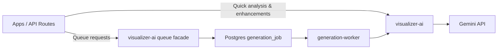

# Design Log #005: Visualizer AI Consolidation

## Background

We currently have Gemini/AI logic duplicated across:

- `packages/visualizer-ai/` (dedicated AI package)
- `packages/visualizer-services/` (AI config/constants/utils, product analysis, rate limit)
- `apps/scenergy-visualizer/lib/services/gemini/` (app-local Gemini service + types/constants/utils)

The generation worker already uses `visualizer-ai`, but some apps still import Gemini via
`visualizer-services` or app-local Gemini code.
Generation jobs are also enqueued directly via `visualizer-db` in app routes, which ties
app code to a specific queue implementation.

## Problem

We want a single source of truth for Gemini/AI logic so:

- All Gemini calls and AI utilities live in `visualizer-ai`
- Apps use `visualizer-ai` directly for quick analysis/enhancement calls
- Long-running generation stays queued through the generation worker
- No duplicated Gemini/AI implementations remain in `visualizer-services`
- Apps do not call `visualizer-db` directly to enqueue AI generation jobs

## Questions and Answers

1. **Q: Should `visualizer-services` keep any AI exports?**  
   A: No. Migrate all AI usage to `visualizer-ai` and remove local AI code from `visualizer-services`.
2. **Q: Should we keep app-local Gemini services?**  
   A: No. Replace them with `visualizer-ai` imports to avoid duplication.

3. **Q: Do we need to move `ProductAnalysisService` to `visualizer-ai`?**  
   A: Yes. It is AI-specific and should live in `visualizer-ai`. `visualizer-services` should re-export it.

4. **Q: Should `visualizer-ai` own the generation queue facade?**  
   A: Yes. Add a small queue facade in `visualizer-ai` that wraps `visualizer-db` inserts so
   apps are abstracted from the queue implementation.

5. **Q: Are any “long jobs” still running direct Gemini calls?**  
   A: `apps/scenergy-visualizer/app/api/visualization` currently uses direct Gemini in a Redis queue.
   It should remain quick but still adhere to Gemini rate limits and use `visualizer-ai` for the model layer.

6. **Q: Do we need to support Vertex AI in app-level usage?**  
   A: `visualizer-ai` already supports Vertex. Apps will inherit that behavior.

## Design

### Architecture



### Core Changes

1. **Move AI-specific services into `visualizer-ai`**
   - Move `ProductAnalysisService` into `packages/visualizer-ai/src/product-analysis/`
   - Reuse `visualizer-ai` config/utilities for all AI prompt and JSON handling

2. **Remove local AI code from `visualizer-services`**
   - Remove `config.ts`, `constants.ts`, `utils.ts`, `rate-limit/`, `product-analysis/`
   - Re-export AI types/functions/services from `visualizer-ai` in `packages/visualizer-services/src/index.ts`

3. **Add generation queue facade in `visualizer-ai`**
   - New module `packages/visualizer-ai/src/generation-queue/`
   - Wraps `visualizer-db` job creation and status lookup

4. **Update apps to use `visualizer-ai` directly**
   - `apps/epox-platform` routes import `getGeminiService` and `RateLimitError` from `visualizer-ai`
   - `apps/scenergy-visualizer` Gemini service replaced by re-exports from `visualizer-ai`

### Type Signatures (examples)

```ts
// packages/visualizer-ai/src/generation-queue/index.ts
enqueueImageGeneration(
  clientId: string,
  payload: ImageGenerationPayload,
  options?: { priority?: number; flowId?: string }
): Promise<{ jobId: string; expectedImageIds: string[] }>;

enqueueVideoGeneration(
  clientId: string,
  payload: VideoGenerationPayload,
  options?: { priority?: number; flowId?: string }
): Promise<{ jobId: string }>;

getJobStatus(jobId: string): Promise<JobStatusResult | null>;
```

```ts
// packages/visualizer-ai/src/product-analysis/service.ts
analyzeProductWithAI(product: ProductAnalysisInput, options?: { forceAI?: boolean }): Promise<AIAnalysisResult>;
```

### Validation Rules

- All AI routes that accept image URLs must continue SSRF validation (no change).
- JSON responses from Gemini must remain strict JSON (no markdown).
- Any AI service added to `visualizer-ai` must use shared config in `packages/visualizer-ai/src/config.ts`.

## Implementation Plan

1. **Add generation queue facade to `visualizer-ai`**
   - Files: `packages/visualizer-ai/src/generation-queue/*`
   - Uses `visualizer-db` schema + repository internally

2. **Move ProductAnalysisService into `visualizer-ai`**
   - Files: `packages/visualizer-ai/src/product-analysis/*`
   - Update imports in `apps/epox-platform/app/api/analyze-products/route.ts`

3. **Remove AI code from `visualizer-services`**
   - Delete or convert to re-exports only
   - Ensure `visualizer-services` still compiles without local AI implementation

4. **Update apps to consume `visualizer-ai`**
   - `apps/epox-platform` routes/tests (analysis + queue)
   - `apps/scenergy-visualizer` Gemini imports/types

5. **Cleanup duplicates**
   - Remove redundant Gemini service files in scenergy app
   - Ensure no Gemini/AI code remains in `visualizer-services`

6. **Tests**
   - Update mocks to target `visualizer-ai`
   - Run tests affected by import changes

7. **Docs**
   - Update `docs/epox-platform-architecture-usage.md` to reflect the new queue facade

## Examples

✅ **Good** (direct AI usage for quick analysis)

```ts
import { getGeminiService } from 'visualizer-ai';
const gemini = getGeminiService();
const analysis = await gemini.analyzeScene(imageUrl);
```

❌ **Bad** (duplicate AI implementation in app)

```ts
import { GeminiService } from '@/lib/services/gemini';
// Local Gemini implementation (remove)
```

✅ **Good** (long job via worker)

```ts
import { enqueueImageGeneration } from 'visualizer-ai';
await enqueueImageGeneration(clientId, payload, { flowId, priority: 100 });
```

## Trade-offs

- **Pros:** One source of truth, smaller app bundles, less duplication.
- **Cons:** `visualizer-ai` gains a `visualizer-db` dependency for queueing; larger migration surface.

## Implementation Results

### Changes

- Added the queue facade in `packages/visualizer-ai/src/generation-queue/index.ts` and exported it from `packages/visualizer-ai/src/index.ts`.
- Moved product analysis into `packages/visualizer-ai/src/product-analysis/`.
- Updated app routes to enqueue jobs via `visualizer-ai` in `apps/epox-platform/app/api/generate-images/route.ts`, `apps/epox-platform/app/api/generate-video/route.ts`, `apps/epox-platform/app/api/collections/[id]/generate/route.ts`, and `apps/epox-platform/app/api/jobs/[id]/route.ts`.
- Removed AI modules from `packages/visualizer-services` (config/constants/utils, rate-limit, product-analysis, visualization, image-generation, testkit) and trimmed exports/dependencies.
- Updated queue-related tests to mock `visualizer-ai` in `apps/epox-platform/tests/api/generate-images.test.ts`, `apps/epox-platform/tests/api/generate-video.test.ts`, `apps/epox-platform/tests/api/collections-generate.test.ts`, and `apps/epox-platform/tests/api/jobs.test.ts`.
- Added a client-safe entrypoint at `packages/visualizer-ai/src/client.ts` and exported it to keep client bundles free of server-only dependencies like `sharp`.
- Updated `apps/scenergy-visualizer` client components to import AI constants/types from `visualizer-ai/client`, and added missing `propPresets` in `apps/scenergy-visualizer/lib/constants.ts`.

### Tests

- Not run (not requested).

### Deviations

- `visualizer-services` no longer re-exports AI APIs; all AI exports were removed instead of keeping a compatibility layer.
- Removed the `visualizer-services` AI testkit/tests rather than relocating them to `visualizer-ai`.

### Summary of Deviations

- AI APIs live only in `visualizer-ai`; `visualizer-services` is now strictly non-AI.
