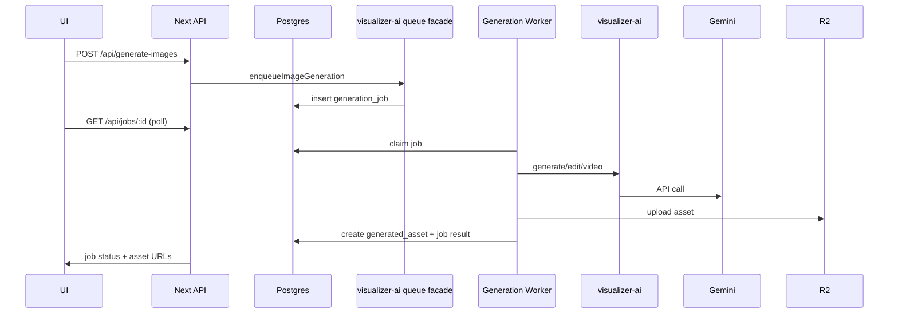

# Epox Platform Architecture and Usage Tree

## Scope
- Focus: `apps/epox-platform` plus the shared packages and services it directly relies on.
- Sources reviewed: `apps/epox-platform/app/api/*`, `apps/epox-platform/lib/services/*`,
  `apps/epox-platform/lib/security/*`, `apps/epox-platform/lib/contexts/auth-context.tsx`,
  `apps/epox-platform/lib/api-client.ts`, `apps/epox-platform/next.config.js`,
  `services/generation-worker/src/*`, `services/erp-service/src/*`, `packages/visualizer-*`.

## Usage Tree (Frontend vs Backend)
```
apps/epox-platform (Next.js app)
  frontend (App Router UI)
    app/(auth)              login, signup pages
    app/(dashboard)         dashboard, products, collections, studio, settings
    components/             layout, modals, studio panels, wizard, UI primitives
    lib/api-client.ts       typed client for API routes
    lib/hooks/*             generation polling, modal, job status
    lib/contexts/           auth-context uses visualizer-auth hooks
    lib/types.ts            re-exports visualizer-types + UI-only types
  backend (API routes + services)
    app/api/products            db + storage
    app/api/products/[id]       db + storage
    app/api/collections         db
    app/api/collections/[id]    db
    app/api/collections/[id]/flows    db
    app/api/collections/[id]/generate db + generation_job
    app/api/generated-images    db + storage (delete)
    app/api/dashboard           db
    app/api/studio              db
    app/api/studio/[id]/settings db
    app/api/jobs/[id]           db (job status)
    app/api/generate-images     visualizer-ai queue facade + security
    app/api/generate-video      visualizer-ai queue facade + security
    app/api/upload              storage + db + visualizer-ai (subject scanner)
    app/api/analyze-products    visualizer-ai (product analysis + gemini)
    app/api/analyze-image       visualizer-ai (gemini)
    app/api/edit-image          visualizer-ai (gemini)
    app/api/remove-background   visualizer-ai (gemini)
    app/api/upscale-image       visualizer-ai (gemini)
    app/api/vision-scanner      visualizer-ai (gemini)
    app/api/enhance-video-prompt visualizer-ai (gemini)
    app/api/art-director        in-app prompt logic + visualizer-types
    app/api/store-connection/*  erp-service (shopify, woocommerce) + db via service
    app/api/explore/search      Unsplash API
    lib/security/*              SSRF validation, auth, rate limiting
    lib/services/*              db, storage, visualizer-ai (gemini + queue), auth, erp, get-auth, prompt-builder

services/generation-worker (background worker)
  processes generation_job from Postgres
  uses visualizer-ai + visualizer-db + visualizer-storage
```

## Architecture Diagram
```mermaid
flowchart LR
  subgraph FE [Frontend]
    UI[Pages + Components]
    APIClient[lib/api-client + hooks]
  end

  subgraph BE [Backend (Next API)]
    Routes[app/api/*]
    Security[lib/security]
    Services[lib/services]
  end

  subgraph Shared [Shared Packages]
    DB[visualizer-db]
    Storage[visualizer-storage]
    AI[visualizer-ai (Gemini + queue facade)]
    Auth[visualizer-auth]
    Types[visualizer-types]
    ERP[@scenergy/erp-service]
  end

  subgraph Worker [Background Worker]
    GenWorker[services/generation-worker]
  end

  subgraph Infra [External Services]
    Postgres[(Neon Postgres)]
    R2[(Cloudflare R2)]
    Gemini[(Google Gemini)]
    Unsplash[(Unsplash API)]
    Shopify[(Shopify)]
    Woo[(WooCommerce)]
  end

  UI --> APIClient --> Routes
  Routes --> Security
  Routes --> Services
  Services --> DB --> Postgres
  Services --> Storage --> R2
  Routes --> AI --> Gemini
  AI --> DB
  Routes --> ERP --> Shopify
  Routes --> ERP --> Woo
  Routes --> Unsplash
  GenWorker --> DB
  GenWorker --> Storage
  GenWorker --> Gemini
```

## Package and Service Usage Map
| Package/Service | Role | Where it is used |
| --- | --- | --- |
| `visualizer-db` | Data access layer (repositories + facade) | Wrapper `apps/epox-platform/lib/services/db.ts`; API routes for products, collections, generated images, dashboard, studio, jobs; auth lookup in `apps/epox-platform/lib/services/get-auth.ts`; generation queueing happens via `visualizer-ai`; background worker `services/generation-worker/src/worker.ts`. |
| `visualizer-storage` | R2/S3 storage facade + paths | Wrapper `apps/epox-platform/lib/services/storage.ts`; `apps/epox-platform/app/api/upload/route.ts`, `apps/epox-platform/app/api/products/route.ts`, `apps/epox-platform/app/api/products/[id]/route.ts`, `apps/epox-platform/app/api/generated-images/route.ts` (delete); worker saves assets in `services/generation-worker/src/worker.ts`. |
| `visualizer-services` | Non-AI services (quota, flow, notification, etc.) | No direct AI usage in `apps/epox-platform` after migration. |
| `visualizer-ai` | Gemini client + generation queue facade | Used by `apps/epox-platform` AI routes and generation enqueue endpoints; used by `services/generation-worker/src/worker.ts`. |
| `visualizer-types` | Shared domain + settings types | API route typing and presets in `apps/epox-platform/app/api/*` and studio UI pages like `apps/epox-platform/app/(dashboard)/studio/[id]/page.tsx` and `apps/epox-platform/app/(dashboard)/studio/collections/[id]/page.tsx`. |
| `visualizer-auth` | Auth server + client hooks | `apps/epox-platform/lib/services/auth.ts`, `apps/epox-platform/lib/services/get-auth.ts`, `apps/epox-platform/lib/contexts/auth-context.tsx`. |
| `@scenergy/erp-service` | Store connection + provider integration | `apps/epox-platform/lib/services/erp.ts`, store connection routes in `apps/epox-platform/app/api/store-connection/*`; uses `visualizer-db` for encrypted credentials. |
| `@repo/design-system` | Shared UI system | Declared in `apps/epox-platform/package.json`; no imports found under `apps/epox-platform/`. |
| `services/generation-worker` | Async job processor | Consumes `generation_job` created by `/api/generate-images` and `/api/generate-video`; stores assets in DB + R2. |
| `services/supabase-service` | Supabase tooling | No direct usage in `apps/epox-platform` found. |

## Key Runtime Flow: Generation Jobs


## Production Launch Improvements and Optimizations
1. Replace placeholder client IDs with real auth in CRUD routes (`/api/products`, `/api/collections`, `/api/generated-images`, `/api/dashboard`) and enforce `withSecurity` so every route is scoped by `clientId`.
2. Move rate limiting from in-memory to shared storage (Upstash/Redis) to support multiple server instances; enable `SECURITY_ENABLE_RATE_LIMITING=true` in production.
3. Ensure the `services/generation-worker` is deployed and monitored (health checks, job failure alerts) since `/api/generate-images` and `/api/generate-video` only enqueue work.
4. Normalize storage URL building in collection flow routes to use `storage.getPublicUrl` (some routes hand-build `R2_PUBLIC_URL`), to avoid mismatched buckets or URL formats.
5. Make heavy AI operations resilient: consider async processing for upload-time subject analysis and add timeouts/retries around Gemini calls so API latency stays predictable.
6. Productionize auth config: set `BETTER_AUTH_SECRET`, `BETTER_AUTH_URL`, and remove dev fallback behavior in `get-auth` and `AuthProvider` before launch.
7. Add observability: structured logs for security events, error tracking (Sentry), and basic metrics for job queue throughput, failure rate, and AI latency.
8. Validate external integrations in prod: `UNSPLASH_ACCESS_KEY`, Shopify credentials, and `STORE_CREDENTIALS_KEY` rotation plan (see `docs/ENVIRONMENT_VARS.md`).
