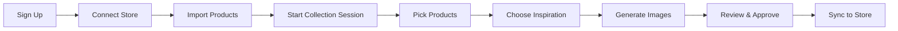
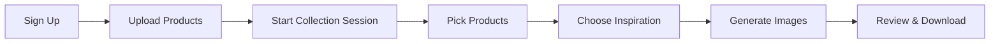

# Product Requirements Document: Scenergy Visualizer Client

**Status**: Living Document  
**Created**: 2026-01-11  
**Last Updated**: 2026-01-18  
**Owner**: Product Team  
**Audience**: Stakeholders, Designers, Business Teams  

---

## Executive Summary

**Scenergy Visualizer** is a SaaS platform that helps Ecom brands generate professional product images using AI. Instead of expensive photoshoots, our clients upload their product catalog and receive hundreds of styled room visualizations in minutes.

### The Problem We're Solving

Traditional product photography is:
- **Expensive**: $500-1,000+ per product for professional photography
- **Slow**: 3-5 weeks from photoshoot to final deliverables
- **Limited**: Same studio setup means limited scene variety
- **Manual**: Requires coordination between photographers, stylists, and editors

### Our Solution

Scenergy Visualizer enables clients to:
- Upload their product catalog once
- Select products and choose inspiration images
- Generate hundreds of AI-styled visualizations in minutes
- Download optimized images ready for their website

**Bottom Line**: What used to cost $50,000 and take 5 weeks can now be done in 20 minutes for a fraction of the cost.

---

## Target Users

### Primary User: Marketing Manager
- **Who**: Marketing professionals at furniture/home goods brands
- **Goal**: Create seasonal catalogs and product imagery efficiently
- **Pain**: Limited budget, long turnaround times, dependency on external vendors
- **Tech Level**: Comfortable with web apps, not a developer

### Secondary User: E-commerce Manager
- **Who**: Catalog operations managers at large retailers
- **Goal**: Keep product imagery consistent and up-to-date across 1,000+ SKUs
- **Pain**: Managing large catalogs, inconsistent vendor imagery, manual processes
- **Tech Level**: Higher technical comfort, works with data imports/exports

### Tertiary User: Small Business Owner
- **Who**: Interior designers and boutique furniture stores
- **Goal**: Create aspirational product imagery for client presentations
- **Pain**: Can't afford professional photography, needs creative control
- **Tech Level**: Prefers simple, guided workflows

---

## Core Concepts

### How It Works (In Plain English)

Think of Scenergy Visualizer like a smart photo studio that understand your products and brand:

```
┌─────────────────────────────────────────────────────────────────┐
│                                                                 │
│  1. UPLOAD           2. INSPIRE           3. GENERATE          │
│  ─────────           ──────────           ────────────          │
│                                                                 │
│  Your products   +   Room images     →    Styled product       │
│  (desk, sofa)        you love             visualizations       │
│                                                                 │
└─────────────────────────────────────────────────────────────────┘
```

### Key Terms (Glossary)

| Term | What It Means |
|------|--------------|
| **Collection Session** | A batch of products you want to generate images for together. Think of it like a photo shoot project—you pick which products to include. |
| **Generation Flow** | A single "creative run" with specific style settings. One Collection Session can have multiple Generation Flows to try different styles. |
| **Generated Asset** | The final image (or future: video, 3D model) that the AI creates. Can be linked to multiple products if they appear together. |
| **Inspiration Image** | A room photo you provide to guide the AI's style (lighting, colors, mood). |
| **Favorites** | Products or Generation Flows you've starred for quick access later. |
| **Approved** | Images marked ready to sync to your connected store. Different from Favorites—this is a business action. |
| **Tags** | Labels you create to organize your products and generations (e.g., "Summer 2026", "Modern Style"). |
| **ERP ID** | Your store's product ID. We save this when importing so we can sync generated images back to the right product. |
| **Credits** | Units for generation. Each image costs 1 credit. Your plan determines how many credits you get per month. |
| **Product Analysis** | AI-powered understanding of your product (type, materials, colors, style, room types) performed on import/upload. Saved on product for future generations. |
| **Prompt Tags** | Tag bubbles representing style attributes (room type, mood, lighting, etc.) that can be added/removed. Reflected in generation prompts as comma-separated values. |
| **Imported Product** | Product brought in from your connected store. Supports approval and sync back to store. |
| **Uploaded Product** | Product added manually. Supports generation and download only (no store sync). |

---

## User Journey

### The Happy Path: From Login to Download

**Path A: With Connected Store**


**Path B: Without Store (Upload Only)**


### Detailed Walkthrough

#### Step 1: Getting Started (5 minutes)
- User receives email invitation from their company admin
- Clicks link, creates password, lands on dashboard
- Prompted to connect their e-commerce store

#### Step 1.5: Connect Store & Import Products (3 minutes)
- User clicks "Connect Store" and selects platform (Shopify, WooCommerce, etc.)
- OAuth flow authenticates with the store
- **Import wizard appears**:
  - **By Product IDs**: Paste specific SKUs or product IDs
  - **By Category**: Select categories from store (e.g., "Sofas", "Tables")
  - **All Products**: Import entire catalog
- System shows product count and subscription limit (e.g., "42 of 100 products available")
- Products imported with all metadata (name, images, description, category)
- **ERP ID saved** for syncing generated images back to store

#### Step 2: Creating a Collection Session (3 minutes)
- User clicks "New Collection Session"
- Names it: "Summer 2026 Living Room Furniture"
- Selects 45 products using checkboxes
- Can filter by category (Sofas, Tables) or room type (Living Room)

#### Step 3: AI Analysis (30 seconds)
- System automatically analyzes selected products
- Detects: "You have mostly Living Room and Bedroom furniture"
- Suggests relevant room styles: "Modern, Contemporary, Scandinavian"

#### Step 4: Choosing Inspiration (2 minutes)
- User picks 3-5 inspiration images that show the mood they want
- Can upload their own, search Unsplash, or reuse favorites from past sessions
- AI analyzes these images for lighting, colors, props, and style

#### Step 5: Generating (10-15 minutes, happens in background)
- User clicks "Generate"
- System creates images for each product using the inspiration style
- User can watch progress or leave—they'll get an email when done
- Images appear in real-time as they complete

#### Step 6: Review & Approve
- Gallery shows all generated images organized by product
- **Side-by-side comparison**: Original product image vs. generated scene
- For each image, user can:
  - **Approve** ✓ - Mark ready for store sync (free)
  - **Edit** ✎ - Open editor to adjust (free)
  - **Regenerate** ↻ - Generate new version (costs 1 credit)
  - **Reject** ✗ - Won't sync to store (stays in library)
- Credit cost clearly displayed before regenerating
- Bulk review mode: swipe through images with keyboard shortcuts

#### Step 7: Sync to Store
- Approved images automatically sync to connected store
- Each image updates the product's imagery in the store using saved ERP ID
- **Platform tracks which images it uploaded** vs images that existed before
- View sync status: pending, synced, failed
- **Store Management Page** shows:
  - Per-product sync status (generated, approved, synced counts)
  - Remove from store action (only for platform-synced images)
  - Sync history and audit trail
- Download option still available for manual use

---

## Getting Products Into Scenergy

You have three ways to add products:

### Option 1: Import from Connected Store
Best for: Users with Shopify, WooCommerce, or BigCommerce stores
- **WooCommerce** (Priority): REST API with Consumer Key/Secret authentication
- **Shopify**: OAuth flow with Admin API
- **BigCommerce**: OAuth flow with catalog API

### Option 2: CSV Bulk Import
Best for: Users with product data in spreadsheets or other systems
- Upload CSV with product details (name, SKU, description, image URLs)
- Column auto-detection and manual mapping
- Batch image download from URLs
- Validation and error reporting

### Option 3: Upload Manually
Best for: Users without a connected store, or products not yet in your store

```
┌─────────────────────────────────────────────────────────────────────┐
│                    ADD PRODUCTS                                      │
├─────────────────────────────────────────────────────────────────────┤
│                                                                      │
│  ┌─────────────────────────┐    ┌─────────────────────────┐         │
│  │  📥 IMPORT FROM STORE   │    │  📤 UPLOAD MANUALLY     │         │
│  │                         │    │                         │         │
│  │  Connect your store     │    │  Upload product images  │         │
│  │  and import products    │    │  and enter details      │         │
│  │                         │    │                         │         │
│  │  ✓ Auto-sync to store   │    │  ✗ No store sync        │         │
│  │  ✓ ERP ID tracking      │    │  ✓ Download only        │         │
│  │  ✓ Bulk import          │    │  ✓ Works offline        │         │
│  │                         │    │                         │         │
│  └─────────────────────────┘    └─────────────────────────┘         │
│                                                                      │
└─────────────────────────────────────────────────────────────────────┘
```

| Feature | Imported Products | Uploaded Products |
|---------|------------------|-------------------|
| Generate images | ✓ | ✓ |
| Download images | ✓ | ✓ |
| Approve for store | ✓ | ✗ (no store connection) |
| Auto-sync to store | ✓ | ✗ |
| ERP ID tracking | ✓ | ✗ |

---

## Importing Products from Your Store

### How Product Import Works

When you connect your e-commerce store, you can import products directly:

```
┌─────────────────────────────────────────────────────────────────────┐
│                    PRODUCT IMPORT WIZARD                             │
├─────────────────────────────────────────────────────────────────────┤
│                                                                      │
│  How would you like to import products?                              │
│                                                                      │
│  ○ By Product IDs                                                    │
│    Paste specific SKUs or product IDs                                │
│                                                                      │
│  ○ By Category                                                       │
│    Select: □ Living Room  □ Bedroom  □ Outdoor  □ Office            │
│                                                                      │
│  ○ All Products                                                      │
│    Import your entire catalog                                        │
│                                                                      │
├─────────────────────────────────────────────────────────────────────┤
│  Your Plan: Pro (100 products max)                                   │
│  Currently imported: 23 products                                     │
│  Available: 77 more products                                         │
└─────────────────────────────────────────────────────────────────────┘
```

### Subscription Limits

| Plan | Max Products | Monthly Generations |
|------|-------------|---------------------|
| **Starter** | 50 | 100 |
| **Pro** | 100 | 1,000 |
| **Business** | 500 | 5,000 |
| **Enterprise** | 1,000+ | Unlimited |

### What Gets Imported

For each product, we import:
- Product name and description
- All product images
- Category and tags
- Price and SKU
- **ERP ID** (for syncing generated images back to your store)

### Product Analysis for Better Results

When products are imported or uploaded, our AI analyzes them to understand:
- **Product type**: Sofa, desk, lamp, etc.
- **Materials**: Leather, wood, metal, fabric
- **Colors**: Primary and accent colors
- **Style**: Modern, rustic, minimalist
- **Best room types**: Living room, bedroom, office

This analysis helps generate more accurate, realistic images.

---

## Uploading Products Manually

### When to Use Manual Upload

- You don't have an e-commerce store yet
- Products aren't listed in your store
- Testing with a few products before connecting store
- Working with custom/prototype products

### How Manual Upload Works

```
┌─────────────────────────────────────────────────────────────────────┐
│                    UPLOAD PRODUCT                                    │
├─────────────────────────────────────────────────────────────────────┤
│                                                                      │
│  Product Name: [Modern Oak Desk                    ]                 │
│                                                                      │
│  Category:     [Desks ▼]                                             │
│                                                                      │
│  Description:  [Minimalist oak desk with...        ]                 │
│                                                                      │
│  Product Images:                                                     │
│  ┌─────┐  ┌─────┐  ┌─────┐  ┌─────┐                                 │
│  │  +  │  │ img │  │ img │  │ img │                                 │
│  │ Add │  │  1  │  │  2  │  │  3  │                                 │
│  └─────┘  └─────┘  └─────┘  └─────┘                                 │
│                                                                      │
│  ⚠️ Note: Uploaded products can only be downloaded.                  │
│     Connect a store to enable auto-sync.                             │
│                                                                      │
│                                        [Cancel]  [Upload Product]    │
└─────────────────────────────────────────────────────────────────────┘
```

### What You Can Do with Uploaded Products

| Action | Available? |
|--------|-----------|
| Generate images | ✓ Yes |
| Edit generated images | ✓ Yes |
| Download images | ✓ Yes |
| Favorite | ✓ Yes |
| Tag | ✓ Yes |
| Approve for Store | ✗ No (no store connection) |
| Sync to Store | ✗ No (connect store first) |

### Converting Uploaded to Imported

If you later connect your store:
1. Go to product settings
2. Click "Link to Store Product"
3. Search for matching product in store
4. Link by SKU or product ID
5. Product now supports store sync!

---

## Two Ways to Generate: Collections vs. Single Flows

### Collection Sessions (Bulk Generation)
**When to use**: You have multiple products to generate at once

```
Collection Session: "Summer Catalog"
├── 45 products selected
├── 3 inspiration images
└── Results: 180 generated images (45 × 4 variants)
```

**Benefits**:
- Efficient for large batches
- Consistent style across all products
- One workflow for many outputs

### Standalone Generation Flows (Single Product Focus)
**When to use**: You want to perfect one product's imagery

```
Single Generation Flow: "Modern Desk Hero Shot"
├── 1 product selected
├── Full editing controls visible
└── Rich interactions: mask areas, adjust prompts, compare versions
```

**Benefits**:
- Deep creative control
- Side-by-side comparisons
- Iterative refinement without affecting other products

**How to access**:
- From a Collection Session, click on any product to focus on it
- Or from the Home page, click "Create New Generation Flow" directly

---

## Reviewing and Approving Generated Images

### The Review Experience

After generation completes, you enter the **Review Phase**—the most important step before images go live on your store.

```
┌─────────────────────────────────────────────────────────────────────┐
│                    REVIEW: Modern Oak Desk                           │
├─────────────────────────────────────────────────────────────────────┤
│                                                                      │
│  ┌─────────────────┐       ┌─────────────────┐                      │
│  │                 │       │                 │                      │
│  │   ORIGINAL      │  ──▶  │   GENERATED     │                      │
│  │   [product      │       │   [product in   │                      │
│  │    on white]    │       │    styled room] │                      │
│  │                 │       │                 │                      │
│  └─────────────────┘       └─────────────────┘                      │
│                                                                      │
│  ← Drag slider to compare →                                          │
│                                                                      │
├─────────────────────────────────────────────────────────────────────┤
│                                                                      │
│  [✓ Approve]   [✎ Edit]   [↻ Regenerate]   [✗ Reject]              │
│                            1 credit                                  │
│                                                                      │
│  Credits remaining: 847 / 1,000                                      │
│                                                                      │
└─────────────────────────────────────────────────────────────────────┘
```

### Review Actions

| Action | Cost | What Happens |
|--------|------|--------------|
| **Approve** ✓ | Free | Image queued for store sync |
| **Edit** ✎ | Free | Open editor for adjustments |
| **Regenerate** ↻ | 1 credit | New image with same/modified settings |
| **Reject** ✗ | Free | Image stays in library, won't sync |
| **Download** ⬇ | Free | Download image to your device |

**Note**: "Approve" is only available for products imported from a connected store. For uploaded products, use "Download" to get your images.

### Bulk Review Mode

For large batches, use keyboard shortcuts:
- **← →** Navigate between images
- **A** Quick approve
- **R** Quick reject
- **E** Open editor
- **Space** Toggle comparison slider

**Progress indicator**: "Reviewed: 23 of 45 • Approved: 18 • Rejected: 5"

### Why Side-by-Side Matters

The comparison view helps you verify:
- Product colors are accurate
- Product is properly placed in scene
- Lighting matches product style
- No artifacts or distortions
- Scale looks realistic

### Credit Transparency

Before any action that costs credits, you see:
- Current credit balance
- Cost of the action
- Balance after action
- When credits reset

---

## Image Delivery: Optimized for the Web

### Why WebP Format?

We automatically convert all generated images to **WebP format** because:

| Benefit | What It Means For You |
|---------|----------------------|
| **50% smaller files** | Your website loads faster |
| **Same visual quality** | Can't tell the difference from JPEG |
| **Browser support** | Works in all modern browsers |
| **CDN-ready** | We host the images—just link to them |

### Storage & Hosting

- All images stored securely in our cloud (Cloudflare R2)
- Each client gets their own private space
- Images organized by collection and date
- You can link directly to our CDN for your website

**Example URLs:**
```
Your product page: 
```

---

## Organizing Your Work

### Favorites ⭐

Mark products or Generation Flows as favorites for quick access:
- Star icon on any item
- "Favorites" section on your dashboard
- Reuse favorited images as inspiration for new sessions

**Use cases**:
- "This desk shot is perfect—I'll use it as inspiration for the whole collection"
- "Keep my best-sellers easily accessible"

### Approved for Store ✓

When you connect your e-commerce store, you can mark images as "Approved for Store":

| Status | Meaning |
|--------|---------|
| **Pending** | Image generated, not yet reviewed |
| **Approved** | Ready to sync to your store |
| **Rejected** | Won't be synced (stays in Scenergy only) |

**Workflow**:
1. Generate images for your products
2. Review the results in the gallery
3. Click "Approve for Store" on the images you want to use
4. Approved images automatically sync to your connected store

**Why two levels (Favorites vs Approved)?**
- **Favorites** = "I like this, save it for later" (personal organization)
- **Approved** = "This is ready to go live on my store" (business action)

### Tags & Categories 🏷️

Create custom labels to organize your work:

| What You Can Tag | Examples |
|-----------------|----------|
| Products | "Premium", "On Sale", "New Arrival" |
| Generation Flows | "Summer 2026", "Website Redesign", "Social Media" |

**Benefits**:
- Filter products quickly when starting a session
- Find past work by campaign or theme
- Track which products have been visualized

---

## Analytics & Insights 📊

### What We Track

We help you understand which generations perform best:

| Metric | What It Tells You |
|--------|------------------|
| **Completion Rate** | How often AI successfully generates images |
| **Generation Time** | How long images take to create |
| **Regeneration Rate** | How often users ask for a redo (quality indicator) |
| **Popular Styles** | Which inspiration styles get used most |
| **Product Coverage** | Which products have been visualized |

### R2 Image View Analytics

We track which generated images are most viewed on your store using Cloudflare R2 analytics:

| Metric | What It Tells You |
|--------|------------------|
| **View Count** | How many times each generated image was fetched from your store |
| **Top Performers** | Which product images get the most customer attention |
| **Store Traffic** | Identified by user-agent from Shopify/WooCommerce/BigCommerce bots |

**Insights Example**: "Your sofa images get 3x more views than desk images - consider generating more sofa scenes"

### Future: Performance Insights (Roadmap)

- A/B testing different styles for the same product
- Recommendations: "Products similar to this one performed well with Modern style"
- Conversion tracking (if store provides sales data)

---

## How the Technology Works (Simplified)

### The Magic Behind Generation

```
┌─────────────────────────────────────────────────────────────────────┐
│                           THE PROCESS                                │
├─────────────────────────────────────────────────────────────────────┤
│                                                                      │
│  1. You select products & inspiration                                │
│          ↓                                                           │
│  2. AI analyzes room styles, lighting, colors                        │
│          ↓                                                           │
│  3. Each product is queued for generation                            │
│          ↓                                                           │
│  4. AI (Google Gemini) creates each image                            │
│          ↓                                                           │
│  5. Images optimized to WebP and stored                              │
│          ↓                                                           │
│  6. You see results and download                                     │
│                                                                      │
└─────────────────────────────────────────────────────────────────────┘
```

### Why It's Fast (Processing in Parallel)

Instead of generating images one-by-one, we process many at once:

```
Traditional approach:          Our approach:
─────────────────────         ─────────────────
Product 1 → wait 30s          Product 1 ──┐
Product 2 → wait 30s          Product 2 ──┤
Product 3 → wait 30s          Product 3 ──┼── All finish in ~30s
Product 4 → wait 30s          Product 4 ──┤
                               Product 5 ──┘
Total: 2 minutes              Total: 30 seconds
```

### Reliability: What Happens If Something Fails?

**Automatic retries**: If the AI fails on one image, we retry up to 3 times
**No lost work**: Your session saves progress—you won't lose anything
**Clear errors**: If something can't be generated, we tell you why and let you retry manually

---

## User Accounts & Access

### Who Can Do What

| Role | Can Create Sessions | Can Generate | Can Delete | Can Manage Users |
|------|-------------------|--------------|-----------|-----------------|
| **Viewer** | No | No | No | No |
| **Editor** | Yes | Yes | Own work only | No |
| **Owner** | Yes | Yes | Everything | Yes |

### How People Get Access

1. **Admin creates account** for the company (done by our team initially)
2. **Admin invites users** via email
3. **Users sign up** using invitation link
4. **Users belong to one company** (can't access other companies' data)

### Authentication: Keeping Things Secure

- Email/password login (minimum 8 characters)
- Session stays active for 7 days
- Password reset via email
- All data isolated by company—you can only see your own products

---

## Data: What We Store and How It's Organized

### The Big Picture

```
┌─────────────────────────────────────────────────────────────────────┐
│                         YOUR COMPANY                                 │
├─────────────────────────────────────────────────────────────────────┤
│                                                                      │
│   PRODUCTS (your catalog)                                            │
│   ├── Modern Desk                                                    │
│   ├── Velvet Sofa                                                    │
│   └── King Bed                                                       │
│                                                                      │
│   COLLECTION SESSIONS (your photo shoot projects)                    │
│   ├── Summer 2026 Catalog                                            │
│   │   ├── Generation Flow #1 (Modern style)                          │
│   │   │   ├── Generated Asset: desk-modern-01.webp                   │
│   │   │   ├── Generated Asset: sofa-modern-01.webp                   │
│   │   │   └── Generated Asset: bed-modern-01.webp                    │
│   │   └── Generation Flow #2 (Rustic style)                          │
│   │       └── ...more generated assets                               │
│   └── Holiday Sale Campaign                                          │
│       └── ...                                                        │
│                                                                      │
│   STANDALONE FLOWS (not part of a collection)                        │
│   └── Desk Hero Shot Experiment                                      │
│       └── Generated Asset: desk-hero-v3.webp                         │
│                                                                      │
└─────────────────────────────────────────────────────────────────────┘
```

### Key Relationships

| This... | Connects to... | Example |
|---------|---------------|---------|
| Product | Generated Assets | One desk can appear in many generated images |
| Collection Session | Generation Flows | One session can try multiple styles |
| Generation Flow | Generated Assets | One flow produces multiple outputs |
| Generated Asset | Products | One image can feature multiple products (e.g., desk + chair together) |

### Multi-Product Assets

A single generated image can showcase multiple products together:

```
Generated Asset: "office-scene-01.webp"
├── Features Product: Modern Desk
├── Features Product: Office Chair
└── Features Product: Desk Lamp
```

This is tracked so you can find all images containing any specific product.

---

## Design Decisions: Why We Built It This Way

### Decision 1: WebP Format for All Generated Images
**What we decided**: Convert all AI-generated images to WebP format

**Why**:
- 50% smaller file sizes = faster website loading for clients
- Quality is visually identical to JPEG
- Clients can link directly to our CDN without re-processing

**Trade-off considered**: Some older browsers don't support WebP, but we provide fallbacks and all modern browsers (99%+ of users) support it.

---

### Decision 2: Collection Sessions vs. Standalone Flows
**What we decided**: Support both bulk generation (Collections) and single-product focus (Standalone Flows)

**Why**:
- Bulk: Efficient for catalog work (45 products at once)
- Single: Better for hero shots and iterative refinement

**Trade-off considered**: More complexity, but serves different real-world use cases.

---

### Decision 3: Linking Assets to Multiple Products
**What we decided**: A single generated image can be tagged with multiple products

**Why**:
- Room scenes often show multiple products together
- Clients want to find "all images containing my bestseller sofa"
- Future: Enables product combinations and bundles

**Trade-off considered**: More complex data model, but matches real catalog needs.

---

### Decision 4: Favorites and Tags for Organization
**What we decided**: Add user favorites and custom tags

**Why**:
- Large catalogs need organization
- Users want to reuse successful imagery as inspiration
- Tags enable filtering across campaigns and seasons

**Trade-off considered**: Adds UI complexity, but essential for power users.

---

### Decision 5: Background Processing with Progress Updates
**What we decided**: Generations run in background, user can leave the page

**Why**:
- Generation takes 10-15 minutes for large batches
- Users shouldn't have to watch a progress bar
- Email notification when complete

**Trade-off considered**: More complex than blocking UI, but much better experience.

---

### Decision 6: Soft-Delete Everything
**What we decided**: When users delete items, we keep them for 30 days before permanent deletion

**Why**:
- Prevents accidental data loss
- Users can undo mistakes
- Provides audit trail

**Trade-off considered**: Uses more storage, but safety is worth it.

---

### Decision 7: Separate "Approved" Status from Favorites
**What we decided**: Images have both "Favorite" (personal) and "Approved" (business) statuses

**Why**:
- "Favorite" = "I like this" (personal organization)
- "Approved" = "Push this to my live store" (business action with consequences)
- Clear audit trail: who approved what, when
- Prevents accidental pushes to production

**Trade-off considered**: Users learn two concepts, but the distinction is important for business-critical actions.

---

### Decision 8: Cache Image Analysis for Fast Editing
**What we decided**: When AI analyzes an image for editing, save the results

**Why**:
- Analysis takes 5-10 seconds (too slow to repeat)
- Results don't change unless the image changes
- Instant editing after first analysis

**When cache is cleared**:
- User applies an edit (mask, filter, inpaint)
- Image is regenerated
- We upgrade our AI analysis model

**Trade-off considered**: Uses database storage, but worth it for UX.

---

### Decision 9: Save ERP ID for Bidirectional Store Sync
**What we decided**: Store the original product ID from the e-commerce platform

**Why**:
- Enables syncing generated images back to the exact product
- No manual mapping required
- Supports future automated workflows

**Trade-off considered**: Adds complexity, but essential for seamless store integration.

---

### Decision 10: Subscription-Based Product Limits
**What we decided**: Limit imported products by subscription tier (50/100/500/1000+)

**Why**:
- Fair pricing model (pay for what you use)
- Prevents abuse of free tier
- Clear upgrade path as catalogs grow

**Trade-off considered**: Users may want more products on lower tiers, but the tiered model aligns value with pricing.

---

### Decision 11: Analyze Products for Better Prompts
**What we decided**: AI analyzes products to understand type, materials, colors, style

**Why**:
- Better prompt engineering = more accurate generations
- Auto-select appropriate room types
- Match product colors with scene
- Reduces regeneration rate

**When analysis happens**: Configurable—on import, on collection creation, or on generate.

**Trade-off considered**: Analysis has compute cost, but reduces wasted credits from poor generations.

---

## Business Model

### Phase 1: Invitation-Only (Current)

| Aspect | Details |
|--------|---------|
| **Access** | By invitation only |
| **Pricing** | Custom per client |
| **Goal** | Validate product-market fit with select partners |

### Phase 2: Credit-Based Self-Service (Future)

| Plan | Monthly Credits | Price |
|------|----------------|-------|
| **Starter** | 100 generations | Free |
| **Pro** | 1,000 generations | $49/month |
| **Business** | 5,000 generations | $199/month |
| **Enterprise** | Unlimited | Custom |

One credit = one generated image. Unused credits expire monthly.

### Phase 3: Store Sync Subscriptions (Roadmap)

Automatic syncing with e-commerce platforms:
- Connect Shopify/WooCommerce/BigCommerce via OAuth
- New products automatically get visualized
- **Approved images automatically sync to your store product pages**
- View sync status and history in Scenergy

**How Store Sync Works**:
```
1. Connect Store     →  One-time OAuth setup (takes 2 minutes)
2. Generate Images   →  Normal workflow
3. Review & Approve  →  Mark images "Approved for Store"
4. Auto-Sync         →  Images appear on your product pages
5. Track Status      →  See what's synced, pending, failed
```

---

## Success Metrics

### How We Know It's Working

| Metric | Target | Why It Matters |
|--------|--------|---------------|
| **Time to First Generation** | < 5 minutes | Onboarding is smooth |
| **Generation Success Rate** | > 95% | AI is reliable |
| **User Retention (30-day)** | > 60% | Users find value |
| **Sessions per User per Month** | > 2 | Regular usage |
| **Support Tickets per 100 Generations** | < 1 | Platform is intuitive |

### Quality Indicators

| Signal | What It Tells Us |
|--------|-----------------|
| Low regeneration rate | Users happy with first output |
| High favorite rate | Users creating reusable inspiration |
| Bulk downloads | Users finding images usable |
| Return users | Platform delivers ongoing value |

---

## Roadmap Overview

### Now: MVP (Q1 2026)
- ✅ Collection Sessions (bulk generation)
- ✅ Standalone Generation Flows
- ✅ WebP optimization
- ✅ Favorites and Tags
- ✅ Basic analytics
- ✅ Download (single and bulk ZIP)
- ✅ Cached image analysis for fast editing
- ✅ Approval workflow for store sync

### Next: Enhanced Experience (Q2 2026)
- Store sync (Shopify, WooCommerce, BigCommerce)
- Team collaboration (real-time editing)
- In-image editing (mask and regenerate areas)
- Video generation (product turntables)
- Improved inspiration analysis

### Later: Platform Expansion (Q3-Q4 2026)
- Store sync (Shopify, WooCommerce)
- API access for developers
- 3D model generation
- A/B testing tools
- Advanced analytics dashboard

---

## Appendix: Screen-by-Screen Overview

### 1. Dashboard (Home)
**Purpose**: Quick overview and starting point

**Shows**:
- Recent Collection Sessions
- Quick stats (products, generations, usage)
- "Create New Session" button
- Favorites section

---

### 2. Products Library
**Purpose**: Browse and manage product catalog

**Shows**:
- Searchable/filterable table of all products
- Product images, names, categories
- Quick actions: view, tag, favorite
- **Source badge**: "Imported" (can sync) or "Uploaded" (download only)
- Filter by source: All | Imported | Uploaded
- Analysis status indicator (analyzed, pending)

---

### 2.5 Product Import Wizard
**Purpose**: Import products from connected store

**Steps**:
1. **Select Import Method** → By IDs, By Category, or All Products
2. **Choose Products** → Preview products to import (with limit indicator)
3. **Confirm Import** → Show what will be imported, subscription limit
4. **Import Progress** → Real-time progress, analysis status

---

### 2.6 Manual Product Upload
**Purpose**: Add products without a store connection

**Shows**:
- Product name, category, description fields
- Image upload area (drag & drop or browse)
- SKU field (optional)
- Price field (optional)
- Clear note: "This product can only be downloaded (no store sync)"

**After upload**:
- Product appears in library with "Uploaded" badge
- Full generation capabilities available
- Download option (no "Approve for Store")

---

### 3. Collection Session Wizard
**Purpose**: Guide user through bulk generation

**Steps**:
1. **Select Products** → Checkboxes, filters, search
2. **AI Analysis + Q&A Form** → AI analyzes products and presents prompt tags (room type, mood, style, lighting) as clickable bubbles. User can add/remove tags to customize the generation prompt.
3. **Choose Inspiration** → Upload, Unsplash, or Library
4. **Generate** → Review final prompt (reflects tags as comma-separated values), launch generation

**Prompt Tags Q&A Form**:
```
┌─────────────────────────────────────────────────────────────────────┐
│                    STYLE YOUR GENERATION                             │
├─────────────────────────────────────────────────────────────────────┤
│                                                                      │
│  Based on your products, we suggest:                                 │
│                                                                      │
│  Room Type:    [Living Room ✓] [Bedroom] [Office ✓] [+ Add]         │
│  Mood:         [Cozy ✓] [Modern] [Minimalist ✓] [+ Add]             │
│  Lighting:     [Natural ✓] [Warm] [Dramatic] [+ Add]                │
│  Style:        [Scandinavian ✓] [Industrial] [Bohemian] [+ Add]     │
│                                                                      │
│  Click tags to toggle. Add custom tags with [+ Add].                 │
│                                                                      │
│  Prompt Preview:                                                     │
│  "living room, office, cozy, minimalist, natural lighting,          │
│   scandinavian style"                                                │
│                                                                      │
└─────────────────────────────────────────────────────────────────────┘
```

---

### 4. Generation Results Gallery
**Purpose**: View, download, manage generated images

**Shows**:
- Grid of generated images
- Filters by product, room, approval status
- Actions: download, favorite, regenerate, delete
- Progress bar during generation
- "Review All" button to enter bulk review mode

---

### 4.5 Review & Approve Modal
**Purpose**: Efficiently review and approve generated images

**Shows**:
- Side-by-side: Original product vs. Generated scene
- Comparison slider (drag to compare)
- Action buttons: Approve, Edit, Regenerate (with credit cost), Reject
- Current credit balance
- Progress: "15 of 45 reviewed"
- Keyboard shortcuts for fast navigation

---

### 5. Single Generation Flow View
**Purpose**: Deep focus on one product

**Shows**:
- Large preview of current image
- Settings editor (style, lighting, props)
- Regenerate with modifications
- Version comparison (before/after)
- Masking tools (future)

**Smart Editing**: When you open an image to edit, the AI analyzes it once and remembers what it found (objects, colors, lighting). The next time you edit the same image, it loads instantly—no waiting. If you make changes to the image, the analysis refreshes automatically.

**Presets & Smart Defaults**: The system helps you work faster through:

| Feature | How It Works |
|---------|--------------|
| **User Presets** | Save your favorite settings (scene type, mood, lighting, style) as named presets. Apply with one click. |
| **Auto-Remember** | System remembers your last settings per context (product, category, collection, scene type). Priority: Product > Collection > Category > Scene Type. |
| **Smart Toast** | "Using your previous settings for Sofas" notification when auto-loading. "Reset to defaults" link available. |

---

### 6. Settings
**Purpose**: User preferences and account

**Tabs**:
- **Profile**: Name, email, photo
- **Notifications**: Email preferences
- **Defaults**: Preferred generation settings
- **Account**: Password, usage, billing

---

## Appendix: FAQ for Stakeholders

### Q: How is this different from stock photography?
**A**: Stock photos are generic. Our images feature YOUR products in styled settings. They're unique to your brand and catalog.

### Q: Can we use these images commercially?
**A**: Yes, you own full rights to all generated images. Use them on your website, in ads, catalogs—anywhere.

### Q: What if the AI generates something weird?
**A**: You can regenerate with different settings or delete unwanted images. The AI is trained to produce professional, realistic results, but you have full control over what you keep.

### Q: How do we handle seasonal updates?
**A**: Create a new Collection Session for each season. Tag them appropriately. Old sessions remain accessible for reference.

### Q: Is our data secure?
**A**: Yes. Each company's data is completely isolated. We use industry-standard encryption and security practices. Your products and images are only visible to your team.

### Q: What happens if we cancel our subscription?
**A**: You can download all your generated images before cancellation. After 30 days of cancellation, data is permanently deleted.

---

## Document Revision History

| Date | Version | Changes | Author |
|------|---------|---------|--------|
| 2026-01-11 | 1.0 | Initial PRD created | Product Team |
| 2026-01-11 | 1.1 | Added: Cached image analysis, Approval workflow for store sync, Store sync details | Product Team |
| 2026-01-11 | 1.2 | Added: Product import from stores (by IDs/category/all), subscription limits, ERP ID for sync, product analysis for prompts, detailed review/approval experience with side-by-side comparison and credit costs | Product Team |
| 2026-01-12 | 1.3 | Added: Prompt Tags Q&A form in Collection Session Wizard, reordered flow phases | Product Team |
| 2026-01-18 | 1.4 | Added: CSV bulk import, R2 image view analytics, Store Management Page with sync tracking, Presets & Auto-Remember system, WooCommerce as priority store | Product Team |

---

*This document is the source of truth for non-technical understanding of Scenergy Visualizer. For technical implementation details, see Design Logs #001-008 in the same folder.*

