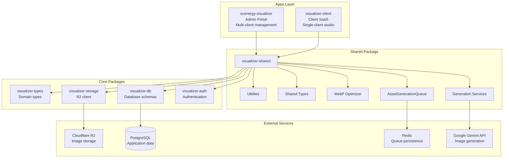
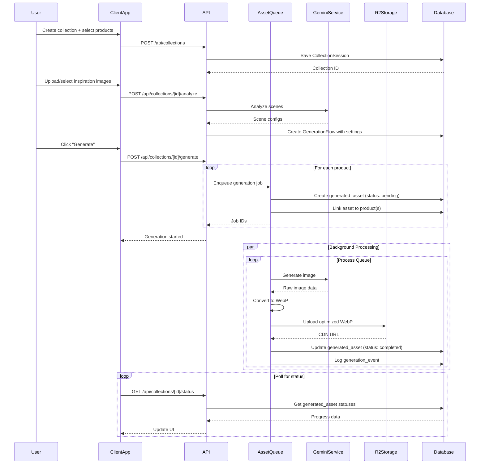
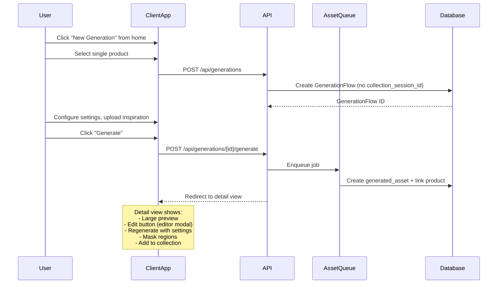

# Design Log #001: Architecture & Infrastructure

**Status**: Draft
**Created**: 2026-01-10
**Updated**: 2026-01-11

---

## Background

We're building `visualizer-client` - a SaaS platform for individual clients to generate AI-powered product visualizations at scale. This platform will:

- Serve as a client-facing studio (vs. `scenergy-visualizer` which is admin-facing)
- Allow bulk generation of product images (20-500+ products per session) via **Collection Sessions**
- Support single-product **GenerationFlows** with detailed editing capabilities
- Use AI to analyze products and match them with appropriate room contexts
- Support multiple inspiration sources (upload, Unsplash, previous generations)
- **Reuse existing infrastructure** from `scenergy-visualizer` including CollectionSession, GenerationFlow, and asset generation systems
- Host generated assets on R2 CDN for direct use in client storefronts

## Problem

Currently, `scenergy-visualizer` is an admin portal with:

- Multi-client management (URL pattern: `/[clientId]/...`)
- Admin authentication (`adminUser` table)
- Full access to all client data
- Direct manipulation of products, images, and settings
- Existing data model: CollectionSession → GenerationFlow → generated_asset

We need a separate client-facing app that:

- Is scoped to a single client per user
- Has simplified, bulk-first UX for collections
- Supports detailed single-product generation with advanced editing
- Uses standard user authentication (existing `user`, `session`, `member` tables)
- **Reuses existing CollectionSession/GenerationFlow infrastructure**
- Shares common code with the admin portal
- Uses the same Cloudflare R2 storage structure with WebP optimization for CDN delivery

## Questions and Answers

### Q1: Should we create a shared package or duplicate code?

**A**: Create `packages/visualizer-shared` to house:

- Shared types and interfaces
- Generation services (Gemini, R2, WebP optimization)
- Queue management logic (reuse existing AssetGenerationQueue)
- Reusable React components (where applicable)

This prevents drift and ensures both apps use the same generation logic.

### Q2: How do we handle authentication differences?

**A**: Abstract authentication at the app level:

- Admin app: Uses `visualizer-auth` with `adminUser` table
- Client app: Uses `visualizer-auth` with existing `user`, `session`, and `member` tables (already in place)
- Shared package: Receives `clientId` from app context, doesn't care about auth source

### Q3: Should API routes be shared or duplicated?

**A**: Hybrid approach:

- Core generation logic → Move to shared package as services
- API routes → App-specific (different auth, different scoping)
- Both apps call same underlying services

### Q4: Where should the generation queue live?

**A**: Reuse existing `AssetGenerationQueue` from shared package:

- Both apps import and use the same queue implementation
- Redis keys are prefixed by app (`admin:` vs `client:`)
- Same job processing, same status polling
- Queue already exists in scenergy-visualizer, just needs to be moved to shared package

### Q5: How do we handle database access?

**A**: Both apps use `visualizer-db` with **existing schema**:

- Same tables: `collection_session`, `generation_flow`, `generated_asset`, `product`, `product_image`
- Row-level scoping via `clientId` column
- Client app: WHERE clientId = user.activeClientId
- Admin app: WHERE clientId = [selected client]
- **Existing tables**: `user`, `session`, `member` already exist for client authentication

### Q6: What's the relationship between CollectionSession and GenerationFlow?

**A**: Use existing data model (already implemented):

- **CollectionSession**: Top-level container for bulk generation workflows
- **GenerationFlow**: Generation configuration supporting multiple products
- **generated_asset**: Individual outputs linked to generationFlowId and multiple productIds (via junction table)
- Client app creates CollectionSessions → GenerationFlows → generated_assets
- Each GenerationFlow can have `productIds: string[]` (already supported)
- GenerationFlows can exist standalone (without a CollectionSession) for single-product focused work

### Q7: Should we use S3 or R2 for storage?

**A**: Use existing **Cloudflare R2** infrastructure:

- Already configured in scenergy-visualizer
- Same bucket structure for consistency
- Environment vars: `R2_BUCKET`, `R2_PUBLIC_URL`, `R2_ACCESS_KEY_ID`, `R2_SECRET_ACCESS_KEY`
- S3-compatible API, easier migration path

### Q8: How do single-product GenerationFlows differ from collection flows?

**A**: Two entry points, same underlying infrastructure:

**Collection Flow** (bulk-first):

- Create CollectionSession → select many products → generate in bulk
- Table/matrix view of all GenerationFlows
- Optimized for throughput (20-500+ products)

**Single GenerationFlow** (detail-first):

- Create standalone GenerationFlow → select one product → detailed editing
- Accessed from: Home page "New Generation" button OR clicking into a GenerationFlow from collection view
- Rich editing capabilities:
  - Editor modal for adjustments
  - Regenerate with modified settings
  - Mask regions for targeted prompts
  - Compare variations side-by-side
- Can optionally be added to a CollectionSession later

**Data model**:

- `generation_flow.collection_session_id` is NULLABLE
- Standalone flows have `collection_session_id = NULL`

### Q9: What format should generated assets use for CDN hosting?

**A**: **Optimized WebP** for production assets:

- Generated assets stored as WebP (smaller size, better quality for web)
- Users embed R2 URLs directly in their storefront product pages
- Automatic optimization pipeline:
  1. Gemini outputs raw image
  2. Convert to WebP with quality=100
  3. Store in R2 with proper cache headers
  4. CDN URL ready for storefront use

**Storage structure**:

```text
/{assetId}.webp        # Optimized for web (default)
/{assetId}_original.png # Original quality (optional, for downloads)
```

### Q10: How do users organize and access favorite items?

**A**: Add **favorites** system for quick access:

- Products can be favorited → appear in "Favorites" filter on product list
- GenerationFlows can be favorited → appear in "Recent & Favorites" on home
- Database: `user_favorite` junction table (user_id, entity_type, entity_id)

**UX locations**:

- Home page: "Recent Generations" section shows favorites first
- Product picker: "Favorites" tab/filter
- Collection view: Star icon on GenerationFlow cards

### Q11: How do users categorize products and generations?

**A**: Add **tags** system for flexible organization:

- Products can have multiple tags (e.g., "Summer 2026", "Best Sellers", "Outdoor")
- GenerationFlows can have tags (e.g., "Living Room", "Modern", "Holiday Campaign")
- Tags are client-scoped (each client has their own tags)
- Database: `tag` table + junction tables

**UX**:

- Tag chips displayed on cards
- Filter by tag in list views
- Bulk tag assignment in collection view

### Q12: Should we track analytics for generations?

**A**: Yes, add **basic analytics** for insights:

**Tracked metrics**:

- Generation counts per product/flow
- Generation success/error rates
- Asset views (via R2 access logs or lightweight tracking)
- Most generated products
- Popular scene types/settings

**Implementation**:

- Store event data in `generation_event` table
- Aggregate in background job for dashboards
- Future: integrate with R2 analytics for CDN metrics

**UX**:

- Dashboard card: "Your top performing products this week"
- Product detail: generation history & stats
- GenerationFlow detail: performance metrics

### Q13: Should we cache analysis data on generated assets?

**A**: Yes, **cache analysis on the generated_asset record** to avoid re-analyzing every edit:

**Problem**:

- When users edit a generated asset, we analyze the image to understand its content
- Re-analyzing on every edit is slow and wasteful (AI call takes 5-10 seconds)
- Analysis results are stable unless the image itself changes

**Solution**:

- Store `asset_analysis` JSONB column on `generated_asset` table
- Populated after first analysis (triggered by edit action)
- Contains: detected objects, colors, lighting, composition, masks, etc.

**Invalidation**:

- Set `asset_analysis = NULL` when:
  - User applies an edit (mask, inpaint, filter)
  - Asset is regenerated
- Trigger re-analysis on next edit action

**Data structure**:

```typescript
interface AssetAnalysis {
  analyzedAt: string; // Timestamp of analysis
  objects: DetectedObject[]; // Products, props, furniture detected
  colors: ColorPalette; // Dominant colors in image
  lighting: LightingInfo; // Natural, artificial, direction
  composition: CompositionInfo; // Rule of thirds, focal points
  masks: AutoMask[]; // AI-detected regions for editing
  version: string; // Analysis model version
}
```

### Q14: How do users add products to Scenergy?

**A**: **Two methods** - import from store OR upload manually:

**Method 1: Import from Connected Store**

- Connect store via OAuth (Shopify, WooCommerce, BigCommerce)
- Import by: Product IDs, Category, or All
- Products get ERP ID for bidirectional sync
- Approved images can sync back to store

**Method 2: Upload Manually**

- Upload product images directly
- Enter product details (name, category, description)
- No store connection required
- **Only download available** (no sync to store)

**Product source stored on `product.source`**:

- `'imported'` - From connected store (has `erp_id`, can sync)
- `'uploaded'` - Manual upload (no `erp_id`, download only)

**Subscription limits** (apply to both methods):
| Plan | Max Products |
|------|-------------|
| Starter | 50 |
| Pro | 100 |
| Business | 500 |
| Enterprise | 1,000+ |

**Import data stored** (imported products only):

- `product.erp_id` - Original product ID from store (for bidirectional sync)
- `product.erp_sku` - Store SKU
- `product.erp_url` - Product URL in store
- `product.store_connection_id` - Which store this came from

**Bidirectional sync** (imported products only):

```
Store → Scenergy:  Import products with ERP ID
Scenergy → Store:  Export approved images back using ERP ID
```

**UI behavior**:

- Imported products: Show "Approve for Store" button
- Uploaded products: Show "Download" button (no approve option)
- Uploaded products can be linked to store later if store is connected

### Q15: When should products be analyzed for prompt engineering?

**A**: **Three analysis strategy options**:

| Strategy          | When                               | Best For                               |
| ----------------- | ---------------------------------- | -------------------------------------- |
| **On Import**     | Immediately after product import   | Large catalogs, consistent analysis    |
| **On Collection** | When added to a Collection Session | Smaller catalogs, on-demand            |
| **On Generate**   | Just before generation             | Maximum freshness, fewer upfront costs |

**What's analyzed**:

- **Product type detection**: Sofa, desk, lamp, etc.
- **Material/texture**: Leather, wood, metal, fabric
- **Color palette**: Primary and accent colors
- **Style classification**: Modern, rustic, minimalist, etc.
- **Dimensions/scale**: Size relative to room elements
- **Best room types**: Living room, bedroom, office, etc.

**Stored on `product.analysis_data`** (JSONB):

```typescript
interface ProductAnalysis {
  analyzedAt: string;
  productType: string;
  materials: string[];
  colors: ColorPalette;
  style: string[];
  suggestedRoomTypes: string[];
  scaleHints: { width: string; height: string };
  promptKeywords: string[]; // AI-extracted keywords for prompts
  version: string; // Analysis model version
}
```

**Usage in prompt engineering**:

- Auto-select appropriate room types
- Match product colors with scene colors
- Scale product correctly in scene
- Include material-specific lighting

**Default strategy**: "On Collection" (balanced performance/freshness)

### Q16: How do we handle store sync approvals?

**A**: Add **"Approved" status** for images ready to sync to connected stores:

**Workflow**:

1. Client connects their store (Shopify, WooCommerce) via OAuth
2. Generated assets have `approval_status`: `pending` | `approved` | `rejected`
3. User reviews generated images and marks them as "Approved for Store"
4. Approved images sync to the connected store's product images
5. Sync updates the product's base image URL in the store

**Approval flow**:

```
Generated → [User reviews] → Approved → [Sync job] → Live on Store
                           → Rejected (stays local)
```

**UX locations**:

- Gallery view: "Approve for Store" button (appears when store connected)
- Bulk action: "Approve Selected" for batch approval
- Filter: "Approved", "Pending", "Rejected" tabs
- Store sync dashboard: View what's been synced, pending, failed

**Database**:

- `generated_asset.approval_status`: 'pending' | 'approved' | 'rejected'
- `generated_asset.approved_at`: Timestamp of approval
- `generated_asset.approved_by`: User ID who approved
- `store_sync_log`: Track sync attempts and results

**Store connection table**:

- `store_connection`: Stores OAuth tokens, store type, sync settings

### Q17: How does the review and approval experience work?

**A**: **Side-by-side review UI** for easy approval decisions:

**Review Modal Layout**:

```
┌─────────────────────────────────────────────────────────────────────┐
│                    Review Generated Image                            │
├─────────────────────────────────────────────────────────────────────┤
│                                                                      │
│  ┌─────────────────┐       ┌─────────────────┐                      │
│  │   ORIGINAL      │       │   GENERATED     │                      │
│  │   Product       │  vs   │   Scene         │                      │
│  │   Image         │       │   Image         │                      │
│  │                 │       │                 │                      │
│  │   [zoom]        │       │   [zoom]        │                      │
│  └─────────────────┘       └─────────────────┘                      │
│                                                                      │
│  Product: Modern Oak Desk                                            │
│  Style: Scandinavian Living Room                                     │
│                                                                      │
├─────────────────────────────────────────────────────────────────────┤
│                                                                      │
│  [✓ Approve]   [✎ Edit]   [↻ Regenerate (1 credit)]   [✗ Reject]   │
│                                                                      │
└─────────────────────────────────────────────────────────────────────┘
```

**Actions with credit costs**:

| Action                        | Credits | Description                             |
| ----------------------------- | ------- | --------------------------------------- |
| **Approve**                   | 0       | Mark as ready for store sync            |
| **Edit**                      | 0       | Open editor modal (mask, adjust)        |
| **Regenerate**                | 1       | Generate new version with same settings |
| **Regenerate (new settings)** | 1       | Generate with modified prompt/style     |
| **Reject**                    | 0       | Mark as not approved (stays in library) |

**Bulk review mode**:

- Swipe through images with keyboard (← →)
- Quick actions: A (approve), R (reject), E (edit)
- Filter: Show only pending
- Stats: "15 of 45 reviewed"

**Smart comparison features**:

- Slider overlay (drag to compare original vs generated)
- Zoom sync (zoom both images together)
- Color picker (verify product color accuracy)
- Fullscreen mode

**Credit display in UI**:

```
┌────────────────────────────┐
│  Your Credits: 847/1000    │
│  ████████████░░░░ 85%      │
│  Resets: Jan 15, 2026      │
└────────────────────────────┘
```

---

## Design

### High-Level Architecture



### Package Structure

```text
monorepo/
├── apps/
│   ├── scenergy-visualizer/        # Admin portal (existing)
│   │   ├── app/
│   │   │   ├── [clientId]/         # Multi-client routes
│   │   │   └── api/
│   │   └── lib/
│   │       └── admin-specific/     # Admin-only features
│   │
│   └── visualizer-client/          # Client SaaS (new)
│       ├── app/
│       │   ├── collections/        # Bulk workflow (CollectionSessions)
│       │   ├── generations/        # Single GenerationFlow view
│       │   │   └── [flowId]/       # Detailed editing view
│       │   ├── products/
│       │   ├── settings/
│       │   └── api/                # Client-scoped API
│       └── lib/
│           ├── auth/               # User auth wrapper
│           └── contexts/           # ClientContext
│
├── packages/
│   ├── visualizer-shared/          # NEW: Shared code
│   │   ├── src/
│   │   │   ├── services/
│   │   │   │   ├── generation/
│   │   │   │   │   ├── queue.ts              # AssetGenerationQueue
│   │   │   │   │   ├── gemini-client.ts
│   │   │   │   │   ├── webp-optimizer.ts     # WebP conversion
│   │   │   │   │   └── prompt-builder.ts
│   │   │   │   ├── analysis/
│   │   │   │   │   ├── product-analyzer.ts
│   │   │   │   │   └── scene-analyzer.ts
│   │   │   │   └── storage/
│   │   │   │       └── r2-uploader.ts
│   │   │   ├── types/
│   │   │   │   ├── generation.ts            # GenerationFlowSettings
│   │   │   │   ├── collection-session.ts
│   │   │   │   └── settings.ts
│   │   │   └── utils/
│   │   │       ├── prompt-helpers.ts
│   │   │       └── validators.ts
│   │   ├── package.json
│   │   └── tsconfig.json
│   │
│   ├── visualizer-auth/            # Existing (user/session/member already present)
│   ├── visualizer-db/              # Existing (schema updates for renames)
│   ├── visualizer-storage/         # Existing (R2 client + WebP optimization)
│   └── visualizer-types/           # Existing
```

### Technology Stack

| Layer                | Technology                     | Notes                                        |
| -------------------- | ------------------------------ | -------------------------------------------- |
| **Frontend**         | Next.js 16 (App Router)        | Both apps                                    |
| **UI Library**       | shadcn/ui + Tailwind           | Consistent design system                     |
| **State Management** | React Context + TanStack Query | Server state with React Query                |
| **Authentication**   | Better Auth                    | `visualizer-auth` package                    |
| **Database**         | PostgreSQL via Drizzle ORM     | `visualizer-db` package                      |
| **Object Storage**   | Cloudflare R2                  | `visualizer-storage` package (S3-compatible) |
| **Queue/Cache**      | Redis                          | Job queue + rate limiting                    |
| **AI Provider**      | Google Gemini API              | Image generation + analysis                  |
| **Image Search**     | Unsplash API                   | Inspiration images                           |
| **Deployment**       | Vercel                         | Both apps independently deployed             |

### Data Flow: Asset Generation



### Data Flow: Single GenerationFlow (Standalone)



### Infrastructure Components

#### 1. Redis Queue Architecture

```typescript
// Queue key structure (AssetGenerationQueue)
admin:asset:jobs:{jobId}           // Admin app jobs
client:asset:jobs:{jobId}          // Client app jobs
admin:asset:queue                  // Admin job queue (list)
client:asset:queue                 // Client job queue (list)

// Job TTL
- Pending/Generating: No expiration (until processed)
- Completed: 24 hours
- Error: 24 hours

// Job payload includes asset type for future video/3D support
{
  clientId: string,
  generationFlowId: string,
  productIds: string[],
  assetType: 'image' | 'video' | '3d_model',
  settings: GenerationFlowSettings
}
```

#### 2. R2 Storage Structure

```text
r2://bucket-name/
├── clients/
│   └── {clientId}/
│       ├── products/
│       │   └── {productId}/
│       │       └── media/
│       │           └── images/
│       │               ├── base/
│       │               │   └── {imageId}.png      # PNG for AI (with transparency)
│       │               └── preview/
│       │                   └── {imageId}.jpg      # JPEG for UI (white background)
│       ├── collections/
│       │   └── {collectionId}/
│       │       └── assets/
│       │           └── {assetId}.webp             # WebP optimized for CDN
│       └── generations/
│           └── {generationFlowId}/
│               └── assets/
│                   ├── {assetId}.webp             # WebP for storefront (default)
│                   └── {assetId}_original.png     # Original quality (downloads)
```

**Asset format**: WebP with quality=85 for optimal CDN delivery. Users embed these URLs directly in their storefronts.

#### 3. Database Schema

**Core tables** (renamed for clarity):

```sql
-- CollectionSession table (renamed from studio_session)
-- Top-level container for bulk generation workflows
CREATE TABLE collection_session (
  id UUID PRIMARY KEY DEFAULT gen_random_uuid(),
  client_id UUID NOT NULL REFERENCES clients(id),
  name TEXT NOT NULL,
  status TEXT NOT NULL,           -- 'draft' | 'generating' | 'completed'
  created_at TIMESTAMPTZ NOT NULL DEFAULT NOW(),
  updated_at TIMESTAMPTZ NOT NULL DEFAULT NOW()
);

-- GenerationFlow table (renamed from flow)
-- Stores generation configuration, supports multiple products
-- Can exist standalone (collection_session_id = NULL) for single-product flows
CREATE TABLE generation_flow (
  id UUID PRIMARY KEY DEFAULT gen_random_uuid(),
  collection_session_id UUID REFERENCES collection_session(id), -- NULLABLE for standalone
  client_id UUID NOT NULL REFERENCES clients(id),

  -- Flow configuration
  name TEXT,
  product_ids TEXT[],             -- Products to generate for
  settings JSONB,                 -- GenerationFlowSettings
  is_favorite BOOLEAN DEFAULT FALSE,

  created_at TIMESTAMPTZ NOT NULL DEFAULT NOW(),
  updated_at TIMESTAMPTZ NOT NULL DEFAULT NOW()
);

-- generated_asset table (renamed from generated_image)
-- Individual generation outputs - supports multiple asset types
CREATE TABLE generated_asset (
  id UUID PRIMARY KEY DEFAULT gen_random_uuid(),
  generation_flow_id UUID REFERENCES generation_flow(id),
  client_id UUID NOT NULL REFERENCES clients(id),

  -- Asset metadata
  status TEXT NOT NULL,           -- 'pending' | 'generating' | 'completed' | 'error'
  asset_url TEXT,                 -- WebP URL for CDN (renamed from image_url)
  asset_type TEXT NOT NULL DEFAULT 'image', -- 'image' | 'video' | '3d_model'
  error_message TEXT,

  -- Queue metadata
  job_id TEXT,                    -- Redis job ID (transient)

  -- Cached analysis (for editing without re-analysis)
  asset_analysis JSONB,           -- Cached analysis results (invalidated on edit)
  analysis_version TEXT,          -- Version of analysis model used

  -- Store sync approval
  approval_status TEXT DEFAULT 'pending',  -- 'pending' | 'approved' | 'rejected'
  approved_at TIMESTAMPTZ,
  approved_by UUID REFERENCES "user"(id),

  created_at TIMESTAMPTZ NOT NULL DEFAULT NOW(),
  updated_at TIMESTAMPTZ NOT NULL DEFAULT NOW(),
  completed_at TIMESTAMPTZ
);

-- Junction table: generated_asset ↔ product (many-to-many)
-- Allows a single asset to be associated with multiple products
CREATE TABLE generated_asset_product (
  id UUID PRIMARY KEY DEFAULT gen_random_uuid(),
  generated_asset_id UUID NOT NULL REFERENCES generated_asset(id) ON DELETE CASCADE,
  product_id UUID NOT NULL REFERENCES product(id) ON DELETE CASCADE,
  is_primary BOOLEAN DEFAULT FALSE, -- Primary product for this asset
  created_at TIMESTAMPTZ NOT NULL DEFAULT NOW(),

  UNIQUE(generated_asset_id, product_id)
);

CREATE INDEX idx_gap_asset ON generated_asset_product(generated_asset_id);
CREATE INDEX idx_gap_product ON generated_asset_product(product_id);

-- Product table (existing - add store import and analysis fields)
CREATE TABLE product (
  id UUID PRIMARY KEY DEFAULT gen_random_uuid(),
  client_id UUID NOT NULL REFERENCES clients(id),
  name TEXT NOT NULL,
  is_favorite BOOLEAN DEFAULT FALSE,

  -- Product source (determines available actions)
  source TEXT NOT NULL DEFAULT 'uploaded', -- 'imported' | 'uploaded'

  -- Store import fields (for bidirectional sync - only for source='imported')
  store_connection_id UUID REFERENCES store_connection(id), -- Which store imported from
  erp_id TEXT,                    -- Original product ID in store (for export back)
  erp_sku TEXT,                   -- Store SKU
  erp_url TEXT,                   -- Product URL in store
  imported_at TIMESTAMPTZ,        -- When imported from store

  -- Product analysis (for prompt engineering)
  analysis_data JSONB,            -- ProductAnalysis object
  analysis_version TEXT,          -- Analysis model version
  analyzed_at TIMESTAMPTZ,        -- When last analyzed

  -- Metadata from store or manual entry
  description TEXT,
  category TEXT,
  price DECIMAL(10,2),
  metadata JSONB,                 -- Additional store data

  created_at TIMESTAMPTZ NOT NULL DEFAULT NOW(),
  updated_at TIMESTAMPTZ NOT NULL DEFAULT NOW(),

  CONSTRAINT valid_source CHECK (source IN ('imported', 'uploaded'))
);

CREATE INDEX idx_product_erp ON product(store_connection_id, erp_id);
CREATE INDEX idx_product_analyzed ON product(client_id, analyzed_at);
CREATE INDEX idx_product_source ON product(client_id, source);

-- product_image table (existing)
CREATE TABLE product_image (
  id UUID PRIMARY KEY DEFAULT gen_random_uuid(),
  product_id UUID NOT NULL REFERENCES product(id),
  image_url TEXT NOT NULL,
  is_from_store BOOLEAN DEFAULT FALSE, -- Imported from store vs uploaded
  -- ... other fields
);
```

**Organization tables** (new):

```sql
-- Tags for organizing products and generation flows
CREATE TABLE tag (
  id UUID PRIMARY KEY DEFAULT gen_random_uuid(),
  client_id UUID NOT NULL REFERENCES clients(id),
  name TEXT NOT NULL,
  color TEXT,                     -- Hex color for UI
  created_at TIMESTAMPTZ NOT NULL DEFAULT NOW(),

  UNIQUE(client_id, name)
);

-- Tag assignments (polymorphic)
CREATE TABLE tag_assignment (
  id UUID PRIMARY KEY DEFAULT gen_random_uuid(),
  tag_id UUID NOT NULL REFERENCES tag(id) ON DELETE CASCADE,
  entity_type TEXT NOT NULL,      -- 'product' | 'generation_flow'
  entity_id UUID NOT NULL,
  created_at TIMESTAMPTZ NOT NULL DEFAULT NOW(),

  UNIQUE(tag_id, entity_type, entity_id)
);

CREATE INDEX idx_tag_entity ON tag_assignment(entity_type, entity_id);

-- User favorites (polymorphic)
CREATE TABLE user_favorite (
  id UUID PRIMARY KEY DEFAULT gen_random_uuid(),
  user_id UUID NOT NULL REFERENCES "user"(id) ON DELETE CASCADE,
  entity_type TEXT NOT NULL,      -- 'product' | 'generation_flow'
  entity_id UUID NOT NULL,
  created_at TIMESTAMPTZ NOT NULL DEFAULT NOW(),

  UNIQUE(user_id, entity_type, entity_id)
);

CREATE INDEX idx_favorite_user ON user_favorite(user_id);
CREATE INDEX idx_favorite_entity ON user_favorite(entity_type, entity_id);
```

**Analytics tables** (new):

```sql
-- Generation events for analytics
CREATE TABLE generation_event (
  id UUID PRIMARY KEY DEFAULT gen_random_uuid(),
  client_id UUID NOT NULL REFERENCES clients(id),
  generation_flow_id UUID REFERENCES generation_flow(id),
  product_id UUID REFERENCES product(id),
  event_type TEXT NOT NULL,       -- 'started' | 'completed' | 'error' | 'viewed'
  metadata JSONB,                 -- Additional event data
  created_at TIMESTAMPTZ NOT NULL DEFAULT NOW()
);

CREATE INDEX idx_event_client ON generation_event(client_id);
CREATE INDEX idx_event_type ON generation_event(event_type);
CREATE INDEX idx_event_created ON generation_event(created_at);
```

**Store sync tables** (new):

```sql
-- Connected e-commerce stores
CREATE TABLE store_connection (
  id UUID PRIMARY KEY DEFAULT gen_random_uuid(),
  client_id UUID NOT NULL REFERENCES clients(id),

  -- Store details
  store_type TEXT NOT NULL,       -- 'shopify' | 'woocommerce' | 'bigcommerce'
  store_url TEXT NOT NULL,        -- https://mystore.myshopify.com
  store_name TEXT,                -- Display name

  -- OAuth credentials (encrypted)
  access_token TEXT NOT NULL,
  refresh_token TEXT,
  token_expires_at TIMESTAMPTZ,

  -- Sync settings
  auto_sync_enabled BOOLEAN DEFAULT FALSE,
  sync_on_approval BOOLEAN DEFAULT TRUE,

  -- Status
  status TEXT DEFAULT 'active',   -- 'active' | 'disconnected' | 'error'
  last_sync_at TIMESTAMPTZ,

  created_at TIMESTAMPTZ NOT NULL DEFAULT NOW(),
  updated_at TIMESTAMPTZ NOT NULL DEFAULT NOW(),

  UNIQUE(client_id, store_type, store_url)
);

-- Sync history for auditing
CREATE TABLE store_sync_log (
  id UUID PRIMARY KEY DEFAULT gen_random_uuid(),
  store_connection_id UUID NOT NULL REFERENCES store_connection(id),
  generated_asset_id UUID NOT NULL REFERENCES generated_asset(id),
  product_id UUID NOT NULL REFERENCES product(id),

  -- Sync details
  action TEXT NOT NULL,           -- 'upload' | 'update' | 'delete'
  status TEXT NOT NULL,           -- 'pending' | 'success' | 'failed'
  external_image_url TEXT,        -- URL in the store (after upload)
  error_message TEXT,

  -- Timing
  started_at TIMESTAMPTZ NOT NULL DEFAULT NOW(),
  completed_at TIMESTAMPTZ
);

CREATE INDEX idx_sync_log_store ON store_sync_log(store_connection_id);
CREATE INDEX idx_sync_log_asset ON store_sync_log(generated_asset_id);
```

**Authentication tables** (already exist - no changes needed):

```sql
-- user, session, member tables already exist in visualizer-auth
-- No new tables needed for authentication
```

### Shared Package API

```typescript
// packages/visualizer-shared/src/index.ts
export * from './services/generation/queue';
export * from './services/generation/gemini-client';
export * from './services/generation/prompt-builder';
export * from './services/generation/webp-optimizer';
export * from './services/analysis/product-analyzer';
export * from './services/analysis/scene-analyzer';
export * from './types/generation';
export * from './types/collection-session';
export * from './types/settings';

// Core service exports
export { AssetGenerationQueue } from './services/generation/queue';
export { WebPOptimizer } from './services/generation/webp-optimizer';
export { ProductAnalyzer } from './services/analysis/product-analyzer';
export { SceneAnalyzer } from './services/analysis/scene-analyzer';
export { PromptBuilder } from './services/generation/prompt-builder';

// Types
export type { GenerationFlowSettings } from './types/generation';
export type { AssetType } from './types/asset';
```

### Environment Configuration

Both apps need these environment variables:

```bash
# Database
DATABASE_URL=postgresql://...

# Redis
REDIS_URL=redis://...

# Cloudflare R2
R2_BUCKET=epox-visualizer
R2_PUBLIC_URL=https://...
R2_ACCESS_KEY_ID=...
R2_SECRET_ACCESS_KEY=...
R2_ENDPOINT=https://...  # Cloudflare R2 endpoint

# Google Gemini
GEMINI_API_KEY=...

# Unsplash (client app only)
UNSPLASH_ACCESS_KEY=...

# Better Auth
BETTER_AUTH_SECRET=...
BETTER_AUTH_URL=http://localhost:3000

# App-specific
APP_ENV=admin|client  # Determines Redis key prefix
```

---

## Implementation Plan

### Phase 1: Create Shared Package Foundation

1. Create `packages/visualizer-shared` directory
2. Set up package.json with dependencies
3. Configure TypeScript
4. Create basic directory structure

### Phase 2: Extract Core Services

1. Move **AssetGenerationQueue** from scenergy-visualizer to shared package
2. Move Gemini client to shared package
3. Move prompt builder (reuse existing) to shared package
4. Extract R2 upload utilities with **WebP optimization**
5. Create analyzer services (product, scene)

### Phase 3: Extract Shared Types

1. Move generation types (**GenerationFlowSettings**, etc.)
2. Export CollectionSession types (renamed from StudioSession)
3. Export GenerationFlow types (renamed from Flow)
4. Add AssetType enum ('image' | 'video' | '3d_model')
5. Export all types from shared package

### Phase 4: Database Migrations

1. Rename `studio_session` → `collection_session`
2. Rename `flow` → `generation_flow` (add nullable `collection_session_id`)
3. Rename `generated_image` → `generated_asset`
4. Rename `image_url` → `asset_url`, add `asset_type` column
5. Create `generated_asset_product` junction table (many-to-many)
6. Create `tag` and `tag_assignment` tables
7. Create `user_favorite` table
8. Create `generation_event` table
9. Add `is_favorite` to product and generation_flow
10. Add `asset_analysis`, `analysis_version` columns to generated_asset (cached analysis)
11. Add `approval_status`, `approved_at`, `approved_by` columns to generated_asset (store sync)
12. Create `store_connection` table (OAuth + sync settings)
13. Create `store_sync_log` table (sync audit trail)

### Phase 5: Create Client App Structure

1. Initialize Next.js app in `apps/visualizer-client`
2. Set up authentication with Better Auth (use existing user/session/member)
3. Create ClientContext for user → clientId mapping
4. Configure environment variables (R2, Redis, Gemini)

### Phase 6: Build API Layer

1. Product listing/filtering API (reuse existing queries)
2. CollectionSession CRUD API
3. GenerationFlow CRUD API (support standalone + collection-attached)
4. Product analysis API (analyze products for prompt engineering)
5. Scene analysis API
6. Generation trigger API (uses AssetGenerationQueue)
7. Status polling API (queries generated_asset table)
8. Favorites API (toggle favorite for products/flows)
9. Tags API (CRUD + assignment)
10. Analytics API (generation events + aggregates)
11. Asset analysis API (get/invalidate cached analysis)
12. Approval API (approve/reject assets for store sync)
13. Store connection API (OAuth connect, disconnect, status)
14. Store sync API (trigger sync, get sync status/history)
15. **Product import API** (import by IDs, category, or all from connected store)
16. **Product import status API** (get import progress, handle limits)
17. **Review UI data API** (side-by-side comparison data, credit cost info)

### Phase 7: Build UI Components

(See Design Log #005 for details)

**Collection View**:

- Table/matrix of GenerationFlows
- Bulk actions, progress indicators

**Single GenerationFlow View** (new):

- Detailed editing modal
- Regenerate with settings
- Region masking for targeted prompts
- Side-by-side comparison

**Home Page**:

- "New Generation" quick action
- Recent & Favorite GenerationFlows section
- Analytics dashboard cards

### Phase 8: Refactor Admin App

1. Update scenergy-visualizer to import from visualizer-shared
2. Remove duplicated code (AssetGenerationQueue, prompt builder)
3. Test that admin app still works with shared services
4. Verify R2 storage paths remain consistent
5. Update to use renamed tables

---

## Examples

### ✅ Good: Collection Flow - Bulk Generation

```typescript
// apps/visualizer-client/app/api/collections/[id]/generate/route.ts
import { AssetGenerationQueue, WebPOptimizer } from '@repo/visualizer-shared';
import { db } from '@repo/visualizer-db';

export async function POST(req: Request, { params }: { params: { id: string } }) {
  const { selectedProductIds, flowSettings } = await req.json();
  const collection = await db.query.collectionSession.findFirst({
    where: eq(collectionSession.id, params.id),
  });

  const [genFlow] = await db
    .insert(generationFlow)
    .values({
      collectionSessionId: collection.id,
      clientId: collection.clientId,
      productIds: selectedProductIds,
      settings: flowSettings,
    })
    .returning();

  const queue = new AssetGenerationQueue({ prefix: 'client' });

  for (const productId of genFlow.productIds) {
    const jobId = await queue.enqueue({
      clientId: collection.clientId,
      productId,
      generationFlowId: genFlow.id,
      settings: genFlow.settings,
    });

    // Create asset record
    const asset = await db
      .insert(generatedAsset)
      .values({
        generationFlowId: genFlow.id,
        clientId: collection.clientId,
        assetType: 'image',
        jobId,
        status: 'pending',
      })
      .returning();

    // Link asset to product(s)
    await db.insert(generatedAssetProduct).values({
      generatedAssetId: asset.id,
      productId,
      isPrimary: true,
    });
  }

  return Response.json({ success: true, generationFlowId: genFlow.id });
}
```

### ✅ Good: Standalone GenerationFlow - Single Product Focus

```typescript
// apps/visualizer-client/app/api/generations/route.ts
export async function POST(req: Request) {
  const { productId, settings } = await req.json();

  // Standalone GenerationFlow (no collection)
  const genFlow = await db
    .insert(generationFlow)
    .values({
      collectionSessionId: null, // Standalone!
      clientId: user.clientId,
      productIds: [productId],
      settings,
      name: `Generation for ${product.name}`,
    })
    .returning();

  // Same queue processing as collection flow
  const queue = new AssetGenerationQueue({ prefix: 'client' });
  // ... enqueue job

  return Response.json({ generationFlowId: genFlow.id });
}
```

### ✅ Good: Using R2 Storage with WebP Optimization

```typescript
// packages/visualizer-shared/src/services/storage/r2-uploader.ts
import { S3Client, PutObjectCommand } from '@aws-sdk/client-s3';
import sharp from 'sharp';

export class R2Uploader {
  private client: S3Client;

  constructor() {
    this.client = new S3Client({
      region: 'auto',
      endpoint: process.env.R2_ENDPOINT,
      credentials: {
        accessKeyId: process.env.R2_ACCESS_KEY_ID!,
        secretAccessKey: process.env.R2_SECRET_ACCESS_KEY!,
      },
    });
  }

  async uploadGeneratedAsset(clientId: string, generationFlowId: string, assetId: string, buffer: Buffer) {
    // Optimize to WebP for CDN delivery
    const webpBuffer = await sharp(buffer).webp({ quality: 85 }).toBuffer();

    const key = `clients/${clientId}/generations/${generationFlowId}/assets/${assetId}.webp`;

    await this.client.send(
      new PutObjectCommand({
        Bucket: process.env.R2_BUCKET,
        Key: key,
        Body: webpBuffer,
        ContentType: 'image/webp',
        CacheControl: 'public, max-age=31536000', // 1 year cache
      })
    );

    return `${process.env.R2_PUBLIC_URL}/${key}`;
  }
}
```

### ✅ Good: Linking Asset to Multiple Products

```typescript
// When an asset can be used for multiple products (e.g., product variants)
const asset = await db
  .insert(generatedAsset)
  .values({
    generationFlowId: genFlow.id,
    clientId,
    assetType: 'image',
    assetUrl: webpUrl,
    status: 'completed',
  })
  .returning();

// Link to multiple products
await db.insert(generatedAssetProduct).values([
  { generatedAssetId: asset.id, productId: 'sofa-blue', isPrimary: true },
  { generatedAssetId: asset.id, productId: 'sofa-green', isPrimary: false },
  { generatedAssetId: asset.id, productId: 'sofa-beige', isPrimary: false },
]);
```

### ❌ Bad: Single productId on generated_asset

```typescript
// ❌ Old approach - only one product per asset
CREATE TABLE generated_image (
  product_id UUID REFERENCES products(id), // Can't share asset!
  ...
);

// ✅ New approach - junction table for many-to-many
// Asset can be linked to multiple products via generated_asset_product
```

### ❌ Bad: Hardcoding App-Specific Logic in Shared Package

```typescript
// packages/visualizer-shared/src/services/queue.ts
export class AssetGenerationQueue {
  async enqueue(request: GenerationRequest) {
    // ❌ Don't check auth in shared package
    const isAdmin = await checkAdminAuth();

    // ❌ Don't hardcode app logic
    if (appType === 'admin') {
      // different logic
    }
  }
}
```

### ✅ Good: App-Specific Logic in App Layer

```typescript
// apps/visualizer-client/lib/contexts/ClientContext.tsx
export function ClientProvider({ children }: { children: React.ReactNode }) {
  const { user } = useAuth();

  // App-specific: derive clientId from user's membership (existing table)
  const membership = await db.query.member.findFirst({
    where: eq(member.userId, user.id),
  });

  const clientId = membership?.clientId;

  return (
    <ClientContext.Provider value={{ clientId }}>
      {children}
    </ClientContext.Provider>
  );
}
```

### ✅ Good: Favorites and Tags Usage

```typescript
// Toggle favorite on a GenerationFlow
await db
  .insert(userFavorite)
  .values({
    userId: user.id,
    entityType: 'generation_flow',
    entityId: generationFlowId,
  })
  .onConflictDoNothing();

// Query favorites
const favorites = await db.query.userFavorite.findMany({
  where: and(eq(userFavorite.userId, user.id), eq(userFavorite.entityType, 'generation_flow')),
});

// Add tag to product
await db.insert(tagAssignment).values({
  tagId: tagId,
  entityType: 'product',
  entityId: productId,
});

// Query products by tag
const productsWithTag = await db
  .select()
  .from(product)
  .innerJoin(tagAssignment, eq(tagAssignment.entityId, product.id))
  .where(and(eq(tagAssignment.tagId, 'summer-2026-tag-id'), eq(tagAssignment.entityType, 'product')));
```

### ✅ Good: Cached Asset Analysis for Editing

```typescript
// apps/visualizer-client/app/api/assets/[id]/analyze/route.ts
export async function POST(req: Request, { params }: { params: { id: string } }) {
  const asset = await db.query.generatedAsset.findFirst({
    where: eq(generatedAsset.id, params.id),
  });

  // Check if we have cached analysis that's still valid
  if (asset.assetAnalysis && asset.analysisVersion === CURRENT_ANALYSIS_VERSION) {
    return Response.json({ analysis: asset.assetAnalysis, cached: true });
  }

  // No cached analysis or version mismatch - run analysis
  const analysis = await geminiClient.analyzeImage(asset.assetUrl);

  // Cache the analysis on the asset
  await db
    .update(generatedAsset)
    .set({
      assetAnalysis: analysis,
      analysisVersion: CURRENT_ANALYSIS_VERSION,
    })
    .where(eq(generatedAsset.id, params.id));

  return Response.json({ analysis, cached: false });
}

// Invalidate analysis when asset is edited
export async function invalidateAnalysis(assetId: string) {
  await db
    .update(generatedAsset)
    .set({
      assetAnalysis: null,
      analysisVersion: null,
    })
    .where(eq(generatedAsset.id, assetId));
}
```

### ✅ Good: Approval Workflow for Store Sync

```typescript
// apps/visualizer-client/app/api/assets/approve/route.ts
export async function POST(req: Request) {
  const { assetIds, action } = await req.json(); // action: 'approve' | 'reject'
  const user = await getAuthUser();

  // Update approval status
  await db
    .update(generatedAsset)
    .set({
      approvalStatus: action === 'approve' ? 'approved' : 'rejected',
      approvedAt: new Date(),
      approvedBy: user.id,
    })
    .where(inArray(generatedAsset.id, assetIds));

  // If approving and store connection exists with sync_on_approval, trigger sync
  if (action === 'approve') {
    const storeConnection = await db.query.storeConnection.findFirst({
      where: and(
        eq(storeConnection.clientId, user.clientId),
        eq(storeConnection.syncOnApproval, true),
        eq(storeConnection.status, 'active')
      ),
    });

    if (storeConnection) {
      await storeSyncQueue.enqueue({
        storeConnectionId: storeConnection.id,
        assetIds,
        action: 'upload',
      });
    }
  }

  return Response.json({ success: true, updated: assetIds.length });
}

// Query assets by approval status
const approvedAssets = await db.query.generatedAsset.findMany({
  where: and(eq(generatedAsset.clientId, clientId), eq(generatedAsset.approvalStatus, 'approved')),
});
```

---

## Trade-offs

### Shared Package vs. Monolithic

**Chosen**: Shared package
**Rationale**:

- ✅ Single source of truth for generation logic
- ✅ Easier to keep admin and client apps in sync
- ✅ Can version and test shared code independently
- ❌ More complex dependency management
- ❌ Need to avoid app-specific logic in shared package

### Redis vs. Database for Queue

**Chosen**: Redis with database persistence (existing pattern)
**Rationale**:

- ✅ Fast queue operations
- ✅ TTL-based cleanup for transient data
- ✅ Database stores permanent records (generated_asset)
- ✅ Can rebuild queue from database if Redis fails
- ❌ Two sources of truth (need sync strategy)

### Separate Apps vs. Single App with Roles

**Chosen**: Separate apps
**Rationale**:

- ✅ Clearer separation of concerns
- ✅ Can deploy independently
- ✅ Different UX optimized for each persona
- ✅ Easier to reason about permissions
- ❌ More deployment complexity
- ❌ Some code duplication in routing

### Polling vs. WebSockets for Status Updates

**Chosen**: Polling (initially)
**Rationale**:

- ✅ Simpler to implement
- ✅ Works with serverless (Vercel)
- ✅ No connection management needed
- ❌ More API requests
- ❌ Slight delay in status updates
- 🔄 Future: Can add WebSocket support later

### R2 vs. S3

**Chosen**: Cloudflare R2 (already in use)
**Rationale**:

- ✅ Already configured in scenergy-visualizer
- ✅ S3-compatible API (easy migration if needed)
- ✅ Lower egress costs
- ✅ Better integration with Cloudflare ecosystem
- ✅ Existing storage structure already proven

### Renamed Tables vs. Keep Original Names

**Chosen**: Rename tables for clarity (collection_session, generation_flow, generated_asset)
**Rationale**:

- ✅ Names match domain language (collection, generation)
- ✅ Clearer for new developers
- ✅ Supports future asset types (video, 3D) with asset_type column
- ✅ Junction table enables multi-product assets
- ❌ Requires migration of existing data
- ❌ Need to update all references in codebase

### Single productId vs. Multi-product Junction Table

**Chosen**: Junction table (generated_asset_product)
**Rationale**:

- ✅ Asset can be shared across product variants
- ✅ Supports viewing all assets for a product (reverse lookup)
- ✅ Enables "use this image for these products" UX
- ❌ More complex queries
- ❌ Need to manage junction table entries

### WebP vs. Original Format Storage

**Chosen**: WebP optimized (with optional original)
**Rationale**:

- ✅ Smaller file sizes for CDN delivery
- ✅ Better loading performance on storefronts
- ✅ Universal browser support now
- ❌ Slight quality loss from recompression
- ❌ Need sharp dependency for conversion

### Cached Analysis vs. On-Demand Analysis

**Chosen**: Cache analysis on generated_asset record
**Rationale**:

- ✅ Instant access to analysis data on subsequent edits
- ✅ Saves 5-10 seconds per edit interaction
- ✅ Reduces AI API costs
- ✅ Simple invalidation (set to NULL on edit)
- ❌ Slightly larger database rows (JSONB column)
- ❌ Need to track analysis version for model upgrades

### Approval Status vs. Favorite-Only

**Chosen**: Separate approval_status for store sync
**Rationale**:

- ✅ Clear separation: "I like this" (favorite) vs. "Sync to store" (approved)
- ✅ Business-critical action deserves explicit approval
- ✅ Audit trail (approved_by, approved_at)
- ✅ Enables workflow: generate → review → approve → sync
- ❌ Additional UI state to manage
- ❌ Users must learn two concepts

---

## Open Questions

1. **Multi-client support**: Should a single user be able to belong to multiple clients?
   - For MVP: Single client per user
   - Future: Support client switching (member table supports this)

2. **Rate limiting**: How to prevent abuse?
   - Proposal: 100 generations/day per client on free tier
   - Enterprise: Unlimited or higher limits

3. **Webhooks**: Should we notify clients when generation completes?
   - For MVP: No webhooks, just in-app notifications
   - Future: Webhook support for integrations

4. **Video/3D support**: When do we add other asset types?
   - Not in MVP
   - asset_type column ready for 'video' | '3d_model'
   - Same generation_flow infrastructure

5. **Analytics depth**: How detailed should generation analytics be?
   - MVP: Basic counts and success rates
   - Future: R2 access logs for CDN view tracking
   - Consider: GDPR implications of detailed tracking

6. **Tag hierarchy**: Should tags support nesting/categories?
   - MVP: Flat tags only
   - Future: Parent-child relationships if needed

7. **Favorite sync**: Should favorites sync across user devices?
   - Current: Stored in database, auto-syncs
   - No additional work needed

8. **Asset versioning**: Should we keep history of regenerated assets?
   - MVP: Overwrite previous versions
   - Future: Version history with rollback

9. **Analysis model upgrades**: How to handle cached analysis when AI model changes?
   - Track `analysis_version` on each asset
   - Background job to re-analyze when version mismatch detected
   - Or: lazy re-analysis on next edit

10. **Store sync conflicts**: What if store image was updated externally?
    - MVP: Scenergy is source of truth (overwrite)
    - Future: Conflict detection and resolution UI

11. **Bulk approval**: Should approvals trigger immediate sync or batch?
    - MVP: Immediate sync per asset (async via queue)
    - Future: Batch sync at scheduled times

12. **Product import conflicts**: What if a product already exists when re-importing?
    - Proposal: Update existing product by ERP ID
    - Option: Ask user to merge or skip

13. **Analysis strategy default**: Which product analysis timing is default?
    - Proposal: "On Collection" (balanced performance/freshness)
    - Can be configured per client in settings

14. **Over-limit handling**: What happens when user tries to import more than subscription allows?
    - Proposal: Show limit, prompt upgrade, allow partial import
    - Don't silently fail

15. **Credit rollover**: Should unused credits roll over?
    - MVP: No, credits expire monthly
    - Future: Consider rollover for annual plans

---

## Success Criteria

- [ ] Both apps can generate assets using the same underlying services
- [ ] No duplicated generation logic between apps (AssetGenerationQueue is shared)
- [ ] Client app authenticates users via existing user/session/member tables
- [ ] Admin app retains all existing functionality (with renamed tables)
- [ ] Shared package has <5% coupling to specific app concerns
- [ ] All generation jobs persist to database (generated_asset table)
- [ ] Can recover queue state from database after Redis restart
- [ ] R2 storage structure is consistent between apps with WebP optimization
- [ ] Renamed tables (collection_session, generation_flow, generated_asset) work for both apps
- [ ] Generated assets link to multiple products via junction table
- [ ] Standalone GenerationFlows work without a CollectionSession
- [ ] Users can favorite products and generation flows
- [ ] Tags can be assigned to products and generation flows
- [ ] Basic generation analytics are tracked
- [ ] Asset analysis is cached and invalidated on edit
- [ ] Approval workflow enables marking assets for store sync
- [ ] Store connections (OAuth) can be established and managed
- [ ] Approved assets sync to connected stores automatically
- [ ] Products can be imported from connected stores (by IDs, category, or all)
- [ ] ERP ID is stored on products for bidirectional sync
- [ ] Subscription limits enforce max product counts per tier
- [ ] Product analysis data is stored for prompt engineering
- [ ] Side-by-side review UI shows original vs generated images
- [ ] Credit costs are displayed before regeneration actions
