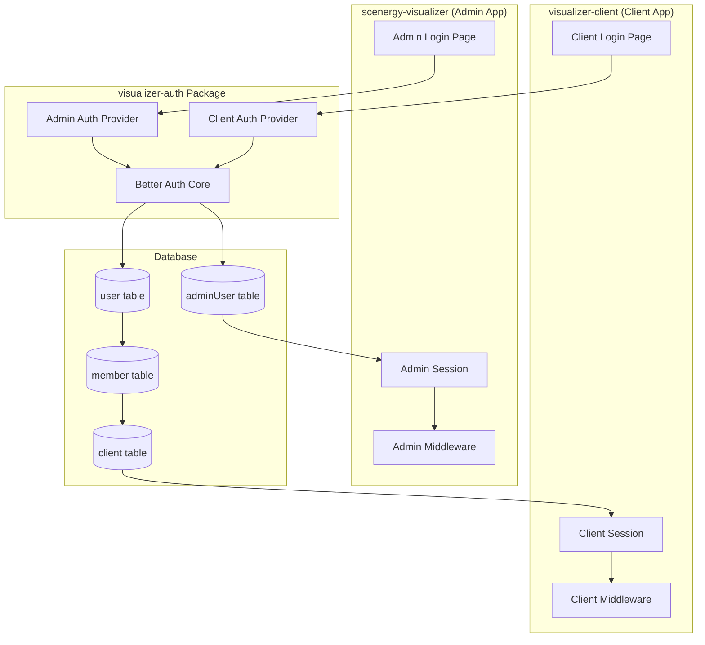
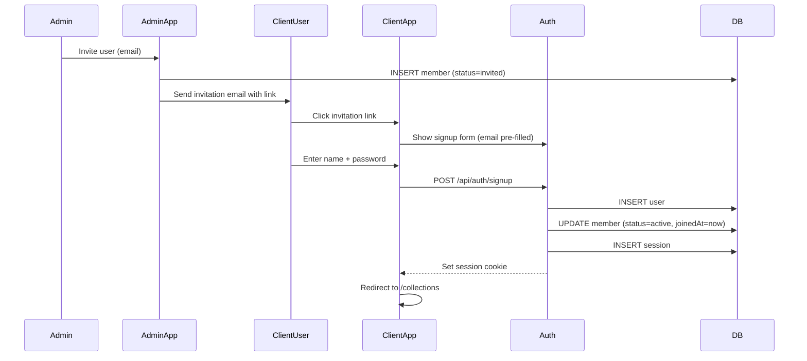
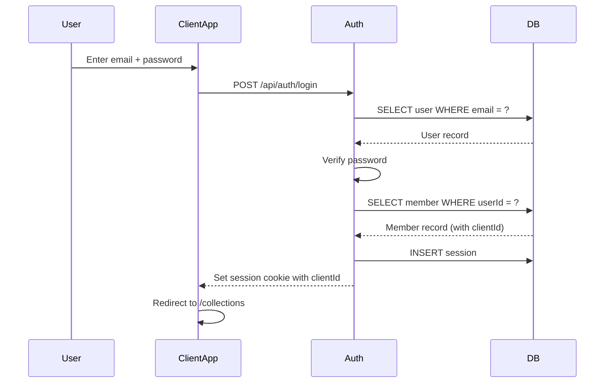
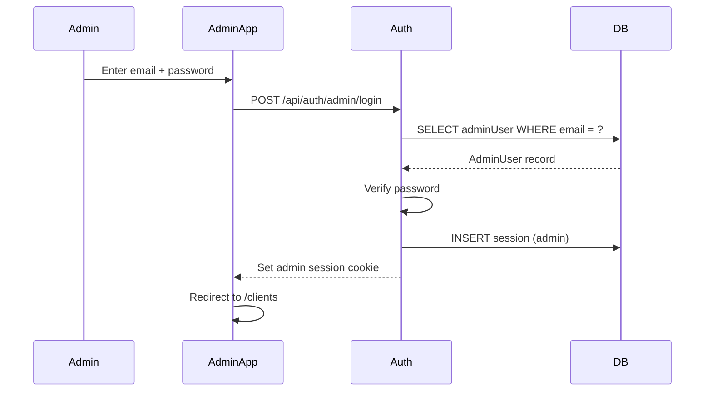
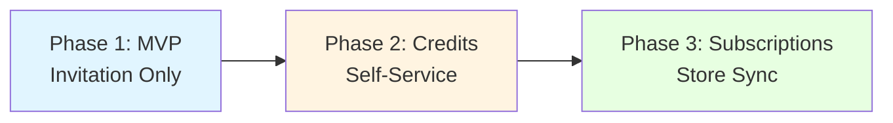
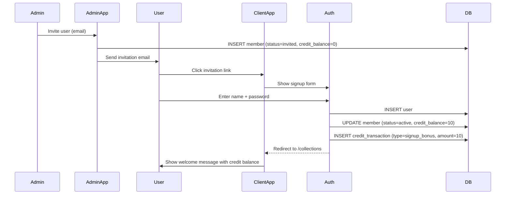
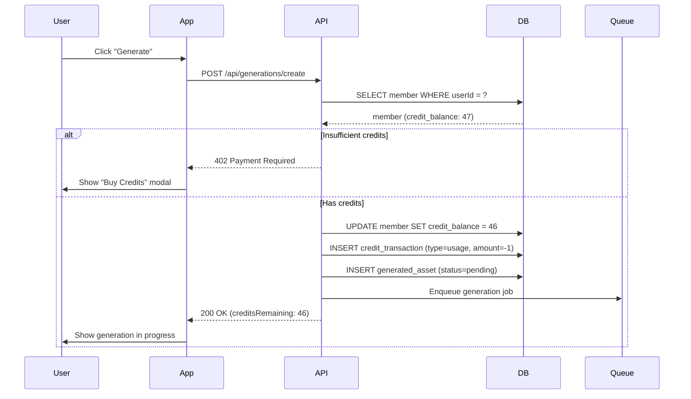

# Design Log #002: Authentication & Authorization

**Status**: Draft
**Created**: 2026-01-10
**Updated**: 2026-01-11
**Author**: Claude
**Related**: Design Log #001 (Architecture), Design Log #008 (Business Model & Pricing)

---

## Background

The platform has two distinct user personas:

1. **Admins** - Internal team managing multiple clients (scenergy-visualizer app)
2. **Client Users** - External users who belong to a single client (visualizer-client app)

Currently, only admin authentication exists via the `adminUser` table. We need to add client user authentication while keeping both systems isolated.

## Problem

We need an authentication and authorization system that:

- Supports two different user types without mixing concerns
- Uses the existing `visualizer-auth` package (Better Auth)
- Scopes all data access to the authenticated user's client
- Prevents cross-client data leakage
- Supports future features (team collaboration, role-based access)

## Questions and Answers

### Q1: Should we use separate auth tables or a unified user table with roles?

**A**: Separate tables:

- `adminUser` - Existing, for internal team
- `user` - New, for client users

**Rationale**:

- Different access patterns (admins see all clients, users see one)
- Different feature sets (admins manage clients, users generate)
- Easier to secure (no accidental role confusion)
- Cleaner separation for future auth requirements

### Q2: How do we handle user-to-client association?

**A**: Use `member` table (many-to-many):

```
user ↔ member ↔ client
```

- MVP: One user = one client (one membership)
- Future: One user can belong to multiple clients (multiple memberships)
- The `member` record can store role information (`owner`, `editor`, `viewer`)

### Q3: Should client users be able to create clients?

**A**: No, not in MVP:

- Admins create clients via scenergy-visualizer
- Admins invite users to clients
- Users receive invitation email → sign up → auto-associated with client

Future: Self-service client creation with billing

### Q4: How do we prevent client users from accessing other clients' data?

**A**: Multi-layered approach:

1. **App-level**: ClientContext provides activeClientId from session
2. **API-level**: All queries filtered by `WHERE clientId = session.activeClientId`
3. **Database-level**: Row-level security policies (future enhancement)
4. **Middleware**: Authentication middleware validates clientId matches user's membership

### Q5: What happens if a user belongs to multiple clients?

**A**: For MVP:

- User must have exactly one membership
- Reject signup/login if user has 0 or 2+ memberships
- Error message: "Please contact support"

Future phase:

- Client switcher in UI
- `session.activeClientId` to track current client
- Update endpoint to switch between clients

---

## Design

### Authentication Architecture



### Database Schema

```typescript
// Existing tables (for reference)
interface Client {
  id: string;
  name: string;
  slug: string;
  createdAt: Date;
  updatedAt: Date;
}

interface AdminUser {
  id: string;
  email: string;
  name: string;
  passwordHash: string;
  createdAt: Date;
  updatedAt: Date;
}

// New tables
interface User {
  id: string;
  email: string;
  name: string;
  emailVerified: boolean;
  image?: string;
  createdAt: Date;
  updatedAt: Date;
}

interface Member {
  id: string;
  userId: string; // FK: user.id
  clientId: string; // FK: client.id
  role: 'owner' | 'editor' | 'viewer';
  status: 'active' | 'invited' | 'suspended';
  invitedBy?: string; // FK: adminUser.id
  invitedAt?: Date;
  joinedAt?: Date;
  createdAt: Date;
  updatedAt: Date;
  // FUTURE: Add credit_balance for Phase 2 (credit system)
  creditBalance?: number; // Track credits at member level
}

interface Session {
  id: string;
  userId: string;
  expiresAt: Date;
  createdAt: Date;
}

interface Account {
  id: string;
  userId: string;
  provider: 'credentials' | 'google' | 'github';
  providerAccountId: string;
  // OAuth fields...
}
```

### SQL Schema

```sql
-- Users table (client users)
CREATE TABLE users (
  id UUID PRIMARY KEY DEFAULT gen_random_uuid(),
  email TEXT UNIQUE NOT NULL,
  name TEXT NOT NULL,
  email_verified BOOLEAN DEFAULT FALSE,
  image TEXT,
  created_at TIMESTAMPTZ NOT NULL DEFAULT NOW(),
  updated_at TIMESTAMPTZ NOT NULL DEFAULT NOW()
);

-- Members table (user ↔ client association)
CREATE TABLE members (
  id UUID PRIMARY KEY DEFAULT gen_random_uuid(),
  user_id UUID NOT NULL REFERENCES users(id) ON DELETE CASCADE,
  client_id UUID NOT NULL REFERENCES clients(id) ON DELETE CASCADE,
  role TEXT NOT NULL DEFAULT 'editor',
  status TEXT NOT NULL DEFAULT 'invited',
  invited_by UUID REFERENCES admin_users(id),
  invited_at TIMESTAMPTZ,
  joined_at TIMESTAMPTZ,
  created_at TIMESTAMPTZ NOT NULL DEFAULT NOW(),
  updated_at TIMESTAMPTZ NOT NULL DEFAULT NOW(),
  -- FUTURE: Add for Phase 2 (credit system)
  -- credit_balance INTEGER DEFAULT 0,

  UNIQUE(user_id, client_id)
);

-- Better Auth sessions
CREATE TABLE sessions (
  id UUID PRIMARY KEY DEFAULT gen_random_uuid(),
  user_id UUID NOT NULL REFERENCES users(id) ON DELETE CASCADE,
  expires_at TIMESTAMPTZ NOT NULL,
  created_at TIMESTAMPTZ NOT NULL DEFAULT NOW()
);

-- Better Auth accounts (for OAuth)
CREATE TABLE accounts (
  id UUID PRIMARY KEY DEFAULT gen_random_uuid(),
  user_id UUID NOT NULL REFERENCES users(id) ON DELETE CASCADE,
  provider TEXT NOT NULL,
  provider_account_id TEXT NOT NULL,
  access_token TEXT,
  refresh_token TEXT,
  expires_at TIMESTAMPTZ,
  token_type TEXT,
  scope TEXT,
  created_at TIMESTAMPTZ NOT NULL DEFAULT NOW(),
  updated_at TIMESTAMPTZ NOT NULL DEFAULT NOW(),

  UNIQUE(provider, provider_account_id)
);

-- Indexes
CREATE INDEX idx_members_user_id ON members(user_id);
CREATE INDEX idx_members_client_id ON members(client_id);
CREATE INDEX idx_members_status ON members(status);
CREATE INDEX idx_sessions_user_id ON sessions(user_id);
CREATE INDEX idx_sessions_expires_at ON sessions(expires_at);
```

### Role Definitions

| Role       | Permissions                                                          |
| ---------- | -------------------------------------------------------------------- |
| **owner**  | Full access: manage products, generate images, invite users, billing |
| **editor** | Create/edit collections, generate images, manage products            |
| **viewer** | View collections, download images (read-only)                        |

MVP: Only `editor` role implemented. All invited users are editors.

Future: Add owner/viewer roles with permission checks.

### Authentication Flows

#### 1. Client User Signup (Invitation-based)



#### 2. Client User Login



#### 3. Admin Login (Existing)



### Session Structure

#### Client User Session

```typescript
interface ClientSession {
  userId: string;
  email: string;
  name: string;
  clientId: string; // From member record
  role: 'owner' | 'editor' | 'viewer';
  expiresAt: Date;
}
```

#### Admin Session

```typescript
interface AdminSession {
  adminUserId: string;
  email: string;
  name: string;
  expiresAt: Date;
  // No clientId - admins access all clients via URL params
}
```

### Authorization Middleware

#### Client App Middleware

```typescript
// apps/visualizer-client/middleware.ts
import { getSession } from '@repo/visualizer-auth/client';

export async function middleware(request: NextRequest) {
  const session = await getSession(request);

  // Require auth for all routes except /login, /signup
  if (!session && !isPublicRoute(request)) {
    return NextResponse.redirect(new URL('/login', request.url));
  }

  // Validate user has exactly one client membership
  if (session && !session.clientId) {
    return NextResponse.redirect(new URL('/error/no-client', request.url));
  }

  // Inject clientId into request headers for API routes
  const requestHeaders = new Headers(request.headers);
  requestHeaders.set('x-client-id', session.clientId);

  return NextResponse.next({
    request: {
      headers: requestHeaders,
    },
  });
}
```

#### API Route Authorization

```typescript
// apps/visualizer-client/app/api/collections/route.ts
import { getSession } from '@repo/visualizer-auth/client';
import { db } from '@repo/visualizer-db';

export async function GET(request: Request) {
  const session = await getSession(request);

  if (!session) {
    return Response.json({ error: 'Unauthorized' }, { status: 401 });
  }

  // Get collections ONLY for this user's client
  const collections = await db.collections.findMany({
    where: {
      clientId: session.clientId, // 🔒 Critical: scope to user's client
    },
  });

  return Response.json(collections);
}
```

### ClientContext Provider

```typescript
// apps/visualizer-client/lib/contexts/ClientContext.tsx
'use client';

import { createContext, useContext, ReactNode } from 'react';
import { useSession } from '@repo/visualizer-auth/client';

interface ClientContextValue {
  clientId: string;
  role: 'owner' | 'editor' | 'viewer';
  loading: boolean;
}

const ClientContext = createContext<ClientContextValue | null>(null);

export function ClientProvider({ children }: { children: ReactNode }) {
  const { data: session, isLoading } = useSession();

  if (isLoading) {
    return <div>Loading...</div>;
  }

  if (!session?.clientId) {
    throw new Error('User not associated with a client');
  }

  return (
    <ClientContext.Provider
      value={{
        clientId: session.clientId,
        role: session.role,
        loading: false,
      }}
    >
      {children}
    </ClientContext.Provider>
  );
}

export function useClient() {
  const context = useContext(ClientContext);
  if (!context) {
    throw new Error('useClient must be used within ClientProvider');
  }
  return context;
}
```

### Security Checklist

- [ ] All API routes validate session exists
- [ ] All database queries filter by `clientId = session.clientId`
- [ ] No client can access another client's data
- [ ] Session cookies are httpOnly and secure
- [ ] CSRF tokens on all mutations
- [ ] Rate limiting on auth endpoints (prevent brute force)
- [ ] Email verification required before full access
- [ ] Password requirements enforced (min 8 chars, complexity)
- [ ] Failed login attempts logged and monitored
- [ ] Sessions expire after 7 days (configurable)

---

## Implementation Plan

### Phase 1: Database Setup

1. Create `users` table migration
2. Create `members` table migration
3. Create `sessions` table migration
4. Create `accounts` table migration (OAuth support)
5. Run migrations in dev environment

### Phase 2: Auth Package Configuration

1. Configure Better Auth for client users
2. Set up email provider (for invitations)
3. Configure OAuth providers (Google, GitHub) - optional
4. Create auth client helpers (`getSession`, `login`, `signup`)

### Phase 3: Client App Auth Implementation

1. Create `/login` page with form
2. Create `/signup` page (invitation flow)
3. Implement auth API routes (`/api/auth/[...all]`)
4. Set up middleware for route protection
5. Create ClientContext provider

### Phase 4: Invitation System

1. Admin UI: Invite user form (in scenergy-visualizer)
2. API: Create member with `status=invited`
3. Email service: Send invitation with signup link
4. Signup flow: Pre-fill email, validate invitation token
5. Activate member on successful signup

### Phase 5: Security Hardening

1. Add CSRF protection
2. Add rate limiting
3. Add session expiration
4. Add email verification
5. Audit all API routes for clientId scoping

### Phase 6: Testing

1. Unit tests for auth helpers
2. Integration tests for login/signup flows
3. E2E tests for invitation flow
4. Security tests (attempt cross-client access)

---

## Examples

### ✅ Good: Proper Client Scoping

```typescript
// API route that correctly scopes to user's client
export async function GET(request: Request) {
  const session = await getSession(request);

  const products = await db.products.findMany({
    where: {
      clientId: session.clientId, // ✅ Always scope to user's client
    },
  });

  return Response.json(products);
}
```

### ❌ Bad: Missing Client Scoping

```typescript
// Dangerous! Returns ALL products across ALL clients
export async function GET(request: Request) {
  const session = await getSession(request);

  const products = await db.products.findMany(); // ❌ No where clause!

  return Response.json(products);
}
```

### ✅ Good: Using ClientContext

```typescript
'use client';

import { useClient } from '@/lib/contexts/ClientContext';

export function CollectionList() {
  const { clientId } = useClient();

  // TanStack Query automatically includes clientId in cache key
  const { data: collections } = useQuery({
    queryKey: ['collections', clientId],
    queryFn: () => fetchCollections(clientId),
  });

  return <div>...</div>;
}
```

### ✅ Good: Invitation Email Template

```tsx
// Email sent when admin invites a user
export function InvitationEmail({ clientName, inviterName, signupLink }: Props) {
  return (
    <Email>
      <h1>You've been invited to {clientName}</h1>
      <p>{inviterName} has invited you to join their team on Epox Visualizer.</p>
      <p>Create your account to start generating beautiful product visualizations.</p>
      <Button href={signupLink}>Accept Invitation</Button>
      <p>This invitation expires in 7 days.</p>
    </Email>
  );
}
```

---

## Trade-offs

### Invitation-Only vs. Self-Service Signup

**Chosen**: Invitation-only (MVP)
**Rationale**:

- ✅ Admins control who joins
- ✅ Prevents spam/abuse
- ✅ Ensures user-client association is correct
- ❌ Extra step for onboarding
- ❌ Requires admin involvement

Future: Self-service with billing integration

### JWT vs. Session Cookies

**Chosen**: Session cookies (Better Auth default)
**Rationale**:

- ✅ Can revoke sessions server-side
- ✅ Smaller cookie size
- ✅ Easier to add session metadata (clientId)
- ❌ Database hit on each request
- ❌ Harder to scale horizontally

Mitigation: Use Redis for session storage

### Single Client vs. Multi-Client per User

**Chosen**: Single client (MVP)
**Rationale**:

- ✅ Simpler UX (no client switcher)
- ✅ Simpler auth logic
- ✅ Clearer scoping
- ❌ Less flexible for users who work with multiple brands
- 🔄 Easy to add multi-client support later (just update member table query)

---

## Future Evolution to Credit System

**Note**: This section outlines the future monetization path. For MVP, the platform remains invitation-only with no credits or payments. See Design Log #008 (Business Model & Pricing) for complete pricing strategy.

### Phase Overview



### Phase 1: MVP - Invitation Only (Months 1-3)

**Current Implementation** (as documented above):

- Admin manually invites users to clients
- No payment infrastructure
- No credit tracking
- Focus on product validation

**Goals**:

- Validate product-market fit
- Collect pricing feedback
- Measure usage patterns

### Phase 2: Credit-Based System (Months 4-9)

**Overview**:

- Users sign up and receive 10 free credits
- 1 credit = 1 image generation
- Users purchase credit packages as needed
- Self-service, no admin involvement

#### Database Schema Changes

**Add credit_balance to members table**:

```sql
ALTER TABLE members
ADD COLUMN credit_balance INTEGER DEFAULT 0;
```

**New tables for credit system**:

```sql
-- Track credit transactions (purchases, usage, refunds)
CREATE TABLE credit_transactions (
  id UUID PRIMARY KEY DEFAULT gen_random_uuid(),
  member_id UUID NOT NULL REFERENCES members(id) ON DELETE CASCADE,
  amount INTEGER NOT NULL,  -- Can be negative (usage) or positive (purchase)
  balance_after INTEGER NOT NULL,
  type TEXT NOT NULL,  -- 'signup_bonus' | 'purchase' | 'subscription' | 'usage' | 'refund'
  reference_id UUID,  -- Links to payment, generation, etc.
  description TEXT,
  metadata JSONB,
  created_at TIMESTAMPTZ NOT NULL DEFAULT NOW()
);

-- Credit packages available for purchase
CREATE TABLE credit_packages (
  id UUID PRIMARY KEY DEFAULT gen_random_uuid(),
  name TEXT NOT NULL,
  credits INTEGER NOT NULL,
  price_cents INTEGER NOT NULL,
  active BOOLEAN DEFAULT TRUE,
  sort_order INTEGER DEFAULT 0,
  created_at TIMESTAMPTZ NOT NULL DEFAULT NOW(),
  updated_at TIMESTAMPTZ NOT NULL DEFAULT NOW()
);

-- Indexes
CREATE INDEX idx_credit_transactions_member_id ON credit_transactions(member_id);
CREATE INDEX idx_credit_transactions_created_at ON credit_transactions(created_at);
CREATE INDEX idx_credit_transactions_type ON credit_transactions(type);
```

#### Initial Credit Packages

Based on Design Log #008:

| Package    | Credits | Price | Price per Credit | Target Segment             |
| ---------- | ------- | ----- | ---------------- | -------------------------- |
| Free Trial | 10      | $0    | $0               | New signups (auto-granted) |
| Starter    | 50      | $12   | $0.24            | Hobbyists, small brands    |
| Pro        | 200     | $40   | $0.20            | Growing brands             |
| Business   | 1,000   | $150  | $0.15            | Agencies, large catalogs   |

**Seeding credit packages**:

```sql
INSERT INTO credit_packages (name, credits, price_cents, sort_order) VALUES
  ('Starter', 50, 1200, 1),
  ('Pro', 200, 4000, 2),
  ('Business', 1000, 15000, 3);
```

#### Updated Authentication Flow

**Signup flow changes**:



**Generation flow with credits**:



#### Updated Session Structure

```typescript
interface ClientSession {
  userId: string;
  email: string;
  name: string;
  clientId: string;
  role: 'owner' | 'editor' | 'viewer';
  creditBalance: number; // NEW: Include for quick access
  expiresAt: Date;
}
```

#### UI Changes

**Credit display in header**:

```tsx
<Header>
  <Logo />
  <Nav />
  <CreditDisplay balance={session.creditBalance} />
  <UserMenu />
</Header>
```

**Pre-generation confirmation**:

```tsx
// Show modal when credits < 10
{
  creditBalance < 10 && (
    <ConfirmationModal>
      <p>This will use 1 credit.</p>
      <p>You have {creditBalance} credits remaining.</p>
      <Button>Continue</Button>
      <Link href="/pricing">Buy More Credits</Link>
    </ConfirmationModal>
  );
}
```

**Low balance warning**:

```tsx
// Show banner when credits < 5
{
  creditBalance < 5 && (
    <Banner variant="warning">
      Low balance: {creditBalance} credits remaining.
      <Link href="/pricing">Buy more →</Link>
    </Banner>
  );
}
```

### Phase 3: Subscription Tiers (Months 10-18)

**Overview**:

- Add subscription plans with recurring monthly credits
- Include store sync features (Shopify, WooCommerce)
- Tiered by product catalog size
- Annual discounts available (17% off)

#### Subscription Tables

```sql
CREATE TABLE subscriptions (
  id UUID PRIMARY KEY DEFAULT gen_random_uuid(),
  member_id UUID NOT NULL REFERENCES members(id) ON DELETE CASCADE,
  tier TEXT NOT NULL,  -- 'basic' | 'pro' | 'business'
  status TEXT NOT NULL,  -- 'active' | 'canceled' | 'past_due' | 'trialing'
  stripe_subscription_id TEXT UNIQUE,
  stripe_customer_id TEXT,
  monthly_credits INTEGER NOT NULL,
  max_products_sync INTEGER,
  current_period_start TIMESTAMPTZ NOT NULL,
  current_period_end TIMESTAMPTZ NOT NULL,
  cancel_at_period_end BOOLEAN DEFAULT FALSE,
  canceled_at TIMESTAMPTZ,
  created_at TIMESTAMPTZ NOT NULL DEFAULT NOW(),
  updated_at TIMESTAMPTZ NOT NULL DEFAULT NOW()
);

-- Indexes
CREATE INDEX idx_subscriptions_member_id ON subscriptions(member_id);
CREATE INDEX idx_subscriptions_status ON subscriptions(status);
CREATE INDEX idx_subscriptions_stripe_subscription_id ON subscriptions(stripe_subscription_id);
```

#### Subscription Tiers

Based on Design Log #008:

| Tier     | Products | Price/Month | Included Credits/Mo | Overage      | Target          |
| -------- | -------- | ----------- | ------------------- | ------------ | --------------- |
| Basic    | 100      | $49         | 100                 | $0.20/credit | Small stores    |
| Pro      | 500      | $149        | 500                 | $0.18/credit | Growing brands  |
| Business | 2,000    | $399        | 2,000               | $0.15/credit | Large retailers |

**Key features**:

- Monthly credits expire at end of period (don't roll over)
- Can purchase additional credit packs if needed
- Store sync automation included
- Annual plans available (save 17%)

#### Credit Allocation Strategy

**Priority order** (when deducting credits):

1. Use expiring subscription credits first
2. Then use oldest purchased credits (FIFO)
3. Then use free/bonus credits

**Implementation**:

```typescript
async function deductCredits(memberId: string, amount: number) {
  // 1. Check subscription credits (expire monthly)
  const subscription = await db.subscriptions.findActive(memberId);
  if (subscription && subscription.creditsRemaining > 0) {
    // Use subscription credits first
    await db.subscriptions.deductCredits(subscription.id, amount);
  } else {
    // 2. Use purchased credits (non-expiring)
    await db.members.update(memberId, {
      creditBalance: member.creditBalance - amount,
    });
  }

  // Record transaction
  await db.creditTransactions.create({
    memberId,
    amount: -amount,
    type: 'usage',
    balanceAfter: newBalance,
  });
}
```

#### Monthly Credit Grant (Webhook)

```typescript
// apps/visualizer-client/app/api/webhooks/stripe/route.ts
export async function POST(req: Request) {
  const event = stripe.webhooks.constructEvent(/* ... */);

  if (event.type === 'invoice.payment_succeeded') {
    const invoice = event.data.object;
    const subscription = await db.subscriptions.findByStripeId(invoice.subscription);

    // Grant monthly credits (reset to full amount)
    await db.subscriptions.update(subscription.id, {
      creditsRemaining: subscription.monthlyCredits,
      currentPeriodStart: new Date(invoice.period_start * 1000),
      currentPeriodEnd: new Date(invoice.period_end * 1000),
    });

    // Log transaction
    await db.creditTransactions.create({
      memberId: subscription.memberId,
      amount: subscription.monthlyCredits,
      type: 'subscription',
      description: `Monthly credits for ${subscription.tier} plan`,
      balanceAfter: subscription.monthlyCredits,
    });
  }

  return Response.json({ received: true });
}
```

### Migration Strategy

**Phase 1 → Phase 2 (MVP to Credits)**:

1. Deploy credit tables via migration
2. Backfill existing members with 50 free credits (one-time)
3. Enable credit purchase UI
4. Enable self-signup (no longer invitation-only)
5. Monitor conversion rate (free → paid)

**Phase 2 → Phase 3 (Credits to Subscriptions)**:

1. Deploy subscription tables
2. Create Stripe subscription products
3. Add subscription UI
4. Email high-usage credit users with subscription offer
5. Enable store sync features for subscribers

### Pricing Strategy Summary

See Design Log #008 for complete details.

**Key principles**:

- Start with generous free tier (10 credits) to drive signups
- Credit pricing at 4-5x cost ($0.20-$0.25 per credit)
- Subscriptions provide better value (encourage upgrade)
- Annual plans offer 17% discount (2 months free)

**Revenue projections** (moderate scenario, 12 months):

- Phase 2 (Credits): $10,000 MRR
- Phase 3 (Subscriptions): $28,000 MRR (combined)
- Target: $50,000 MRR by month 18

### Authorization Changes

**Current** (MVP):

```typescript
// API routes just check session exists
const session = await getSession(request);
if (!session) {
  return Response.json({ error: 'Unauthorized' }, { status: 401 });
}
```

**Future** (with credits):

```typescript
// API routes also check credit balance
const session = await getSession(request);
if (!session) {
  return Response.json({ error: 'Unauthorized' }, { status: 401 });
}

// Check credits before generation
if (session.creditBalance < 1) {
  return Response.json(
    {
      error: 'Insufficient credits',
      balance: 0,
      purchaseUrl: '/pricing',
    },
    { status: 402 }
  ); // 402 Payment Required
}
```

### Open Questions for Credit System

1. **Should we allow negative balances?**
   - Proposal: No, hard stop at 0 credits (prevent debt)

2. **What happens to unused subscription credits?**
   - Proposal: They expire monthly (don't roll over)
   - Rationale: Encourages usage, maximizes revenue

3. **How do we handle refunds for credit purchases?**
   - Proposal: No refunds if >10% of credits used
   - Rationale: Prevents abuse

4. **Should we notify users when credits are low?**
   - Proposal: Yes, email when balance drops below 10
   - Also show in-app banner at <5 credits

5. **Can users transfer credits between clients?**
   - Proposal: No, credits are tied to member (user + client)
   - Rationale: Prevents gaming the system

---

## Open Questions

1. **Password reset flow**: Should we implement it in MVP?
   - Proposal: Yes, use Better Auth's built-in reset flow

2. **OAuth providers**: Which ones to support?
   - Proposal: Google (high priority), GitHub (nice-to-have)

3. **Session duration**: How long should sessions last?
   - Proposal: 7 days (remember me), 1 day (default)

4. **Email verification**: Required or optional?
   - Proposal: Required (mark as unverified until email clicked)

5. **Member deactivation**: What happens to their generated assets?
   - Proposal: Assets remain (owned by client), but user loses access

---

## Success Criteria

- [ ] Client users can sign up via invitation link
- [ ] Client users can log in and see only their client's data
- [ ] All API routes properly scope queries by clientId
- [ ] Cannot access other clients' data via URL manipulation
- [ ] Admins can invite users to clients
- [ ] Email invitations are sent and work correctly
- [ ] Password reset flow works
- [ ] Sessions expire and require re-login
- [ ] All auth flows work on both localhost and production domains
