# Design Log #004: User Flows & Journey Planning

**Status**: Draft
**Created**: 2026-01-10
**Updated**: 2026-01-12
**Author**: Claude
**Related**: Design Log #001 (Architecture), Design Log #002 (Authentication), Design Log #003 (Data Model)

---

## Background

The `visualizer-client` platform is a SaaS studio for non-technical users to generate AI-powered product visualizations at scale. The user experience must be:
- **Intuitive** - Minimal learning curve, progressive disclosure
- **Guided** - Clear steps, smart defaults, helpful feedback
- **Forgiving** - Easy error recovery, undo actions, clear error messages
- **Fast** - Responsive UI, optimistic updates, background processing

This design log maps out the complete user journey from first login to managing hundreds of generated images across multiple studio sessions.

## Problem

We need to design user flows that:
1. **Onboard new users** efficiently (invitation → first session in <5 minutes)
2. **Guide bulk generation** through a multi-step wizard without overwhelming users
3. **Handle errors gracefully** (network failures, AI errors, quota limits)
4. **Manage assets at scale** (view, filter, download, pin, delete 100s of images)
5. **Provide settings control** without cluttering the main workflow

## Questions and Answers

### Q1: Should onboarding be separate from session creation, or combined?
**A**: Combined, but with smart defaults:
- Skip product selection if client has <20 products (auto-select all)
- Skip inspiration if user wants quick test (use defaults)
- Progressive: "Create First Session" → "Create Session" (different CTAs)

### Q2: How do we handle users who abandon mid-flow?
**A**: Auto-save drafts:
- StudioSession status: `draft` → saves progress automatically
- User can return to `/sessions/[id]/edit` to resume
- Show "Resume Draft" card on dashboard
- Auto-delete drafts older than 7 days

### Q3: What happens if AI analysis fails?
**A**: Graceful degradation:
- Step 2 (Analyze): If AI fails → use metadata-only fallback
- Step 3 (Inspiration): If scene analysis fails → allow manual settings
- Step 4 (Generate): If product generation fails → mark flow as error, continue queue

### Q4: Should users see generation progress in real-time or just get notified?
**A**: Hybrid approach:
- Real-time: If user stays on results page (polling every 5s)
- Notification: Browser notification when user switches tabs
- Email: Optional summary email when flow completes

### Q5: How do we prevent accidental deletions?
**A**: Multiple safeguards:
- Soft-delete with 30-day recovery window
- Confirmation modal for destructive actions
- "Undo" toast notification for 10 seconds
- Separate "Trash" view to review deleted items

### Q6: Should the 4-step wizard be separate pages or a single page with tabs?
**A**: Separate pages with URL state:
- `/sessions/new/select` → `/analyze` → `/inspire` → `/generate`
- Back/forward browser navigation works
- Can bookmark/share specific step
- Clearer progress indication

---

## Design

### User Journey Map

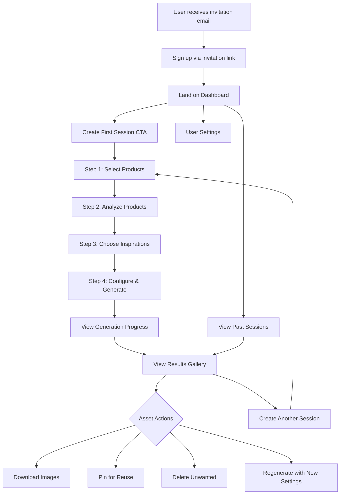

---

## Flow 1: Onboarding Flow

### Overview
From invitation email to first studio session created.

### User Story
> "As a new user, I want to quickly understand the platform and generate my first product images without feeling overwhelmed."

### Flow Diagram

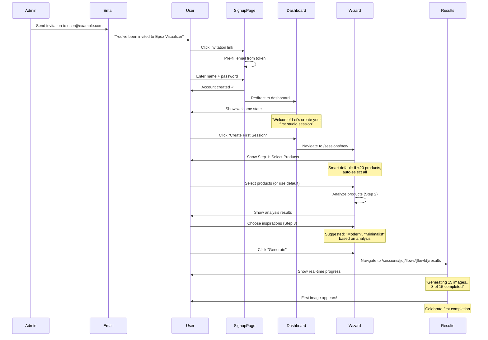

### Step-by-Step Breakdown

#### Step 1: Invitation Email
**Trigger**: Admin invites user from scenergy-visualizer

**Email Content**:
```text
Subject: You've been invited to Epox Visualizer

Hi there!

[Admin Name] has invited you to join [Client Name] on Epox Visualizer -
the easiest way to create beautiful product images with AI.

[Accept Invitation Button]

This invitation expires in 7 days.
```

**Email Data**:
- `invitationToken` - Validates signup (signed JWT)
- `email` - Pre-fills signup form
- `clientId` - Associates user with client
- `invitedBy` - Tracks who sent invite

#### Step 2: Signup Page
**URL**: `/signup?token={invitationToken}`

**Page State**:
```typescript
interface SignupPageState {
  token: string;
  email: string;           // Pre-filled from token
  clientName: string;      // Decoded from token
  inviterName: string;     // Decoded from token
  loading: boolean;
  error: string | null;
}
```

**Form Fields**:
- Email (read-only, pre-filled)
- Full Name (required)
- Password (required, min 8 chars)
- Confirm Password (required, must match)

**Validation**:
- ✅ Token is valid and not expired
- ✅ Password meets requirements
- ✅ Passwords match
- ✅ Email not already registered

**Success Actions**:
1. Create user record
2. Update member status: `invited` → `active`
3. Create session
4. Redirect to `/` (dashboard)

**Error States**:
- Invalid/expired token → Show "Contact admin for new invitation"
- Email already exists → Show "Account exists, try logging in"
- Network error → Show retry button

#### Step 3: Dashboard (First-Time User)
**URL**: `/`

**Empty State UI**:
```text
┌────────────────────────────────────────────────────────┐
│  Welcome to Epox Visualizer!                          │
│                                                        │
│ Let's create your first studio session.               │
│ It only takes a few minutes.                          │
│                                                        │
│    [Create Your First Session]                        │
│                                                        │
│ Or watch a 2-minute tutorial →                        │
└────────────────────────────────────────────────────────┘

Your Products (15)
┌──────────┐ ┌──────────┐ ┌──────────┐
│  Desk    │ │  Chair   │ │  Sofa    │
│  Modern  │ │  Office  │ │  Velvet  │
└──────────┘ └──────────┘ └──────────┘
```

**Navigation Options**:
- Primary CTA: "Create Your First Session" (large, prominent)
- Secondary: "View Products" (link)
- Secondary: "Account Settings" (top-right)

#### Step 4-7: Studio Session Creation Wizard
See **Flow 2: Main Studio Session Creation Flow** below

---

## Flow 2: Main Studio Session Creation Flow

### Overview
4-step wizard for bulk product visualization generation.

### User Story
> "As a user, I want to select multiple products, let AI analyze them, choose inspiration images, and generate hundreds of product visualizations with minimal manual configuration."

### Wizard Navigation

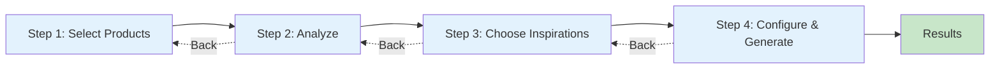

**Progress Indicator** (shown on all steps):
```text
┌──────────────────────────────────────────────────────┐
│  ① Select  ──  ② Analyze  ──  ③ Inspire  ──  ④ Generate │
│  ✓          →   ○           ○            ○        │
└──────────────────────────────────────────────────────┘
```

### Data Model: StudioSession → Flow → GeneratedImage

```typescript
// Step 1-3: StudioSession is created and configured
interface StudioSession {
  id: string;
  clientId: string;
  name: string;
  productIds: string[];  // Selected products
  selectedBaseImages: Record<string, string>;  // productId → baseImageUrl
  status: 'draft' | 'configured' | 'active' | 'archived';
  createdAt: Date;
  updatedAt: Date;
}

// Step 4: Flow is created within the session
interface Flow {
  id: string;
  studioSessionId: string;
  productIds: string[];  // Can be subset or all from session
  status: 'empty' | 'configured' | 'generating' | 'completed' | 'error';
  settings: FlowGenerationSettings;
  createdAt: Date;
  updatedAt: Date;
}

// Step 4+: Images are generated for the flow
interface GeneratedImage {
  id: string;
  flowId: string;
  r2Key: string;  // R2 storage path
  productIds: string[];  // Products featured in this image
  status: 'pending' | 'generating' | 'completed' | 'error';
  settings: FlowGenerationSettings;  // Snapshot of settings used
  jobId: string | null;  // Redis job ID (transient)
  errorMessage: string | null;
  pinned: boolean;
  deletedAt: Date | null;
  createdAt: Date;
  completedAt: Date | null;
}

interface FlowGenerationSettings {
  // Prompt Tags (from Q&A form - primary configuration)
  promptTags: PromptTags;

  // Legacy/derived settings
  style: string;
  lighting: string;
  colorScheme: string;
  surroundings: string;
  props: string[];
  sceneImageUrl: string;
  aspectRatio: '1:1' | '16:9' | '9:16';
  varietyLevel: number;  // 1-10
  matchProductColors: boolean;
  roomType: string;
  cameraAngle: string;
  promptText: string;  // Generated from promptTags
}

interface PromptTags {
  roomType: string[];     // ["living room", "office"]
  mood: string[];         // ["cozy", "minimalist"]
  lighting: string[];     // ["natural", "warm"]
  style: string[];        // ["scandinavian", "modern"]
  custom: string[];       // User-defined custom tags
}
```

### Step 1: Select Products

**URL**: `/sessions/new/select`

**Page Layout**:
```text
┌────────────────────────────────────────────────────────┐
│ Create New Studio Session                             │
│                                                        │
│ Step 1 of 4: Select Products                          │
├────────────────────────────────────────────────────────┤
│                                                        │
│ 🔍 Search products...    [Category ▼] [Room Type ▼]   │
│                                                        │
├───┬───────┬──────────────┬─────────┬──────────────────┤
│ ☑ │ Image │ Name         │ SKU     │ Category         │
├───┼───────┼──────────────┼─────────┼──────────────────┤
│ ☑ │       │ Modern Desk  │ DSK-001 │ Furniture        │
│ ☑ │       │ Velvet Sofa  │ SOF-042 │ Furniture        │
│ ☐ │       │ Bath Vanity  │ VAN-103 │ Fixtures         │
│ ☑ │       │ King Bed     │ BED-077 │ Furniture        │
└───┴───────┴──────────────┴─────────┴──────────────────┘

                    [3 selected]  [Next: Analyze →]
```

**Features**:
- **Search**: Free-text across name, SKU, description
- **Filters**: Category, Room Type, Tags, Date Added
- **Sort**: Name, SKU, Category, Date (asc/desc)
- **Selection**:
  - Checkbox per row
  - "Select All" header checkbox
  - Shift-click for range selection
  - Selected count badge
- **Validation**: Must select at least 1 product

**State Management**:
```typescript
interface SelectProductsState {
  searchQuery: string;
  filters: {
    categories: string[];
    roomTypes: string[];
    tags: string[];
  };
  sortBy: 'name' | 'sku' | 'category' | 'createdAt';
  sortOrder: 'asc' | 'desc';
  selectedProductIds: string[];
  products: Product[];
  loading: boolean;
  page: number;
  totalPages: number;
}
```

**Actions**:
- "Next: Analyze →" - Creates StudioSession draft, navigates to Step 2
- "Cancel" - Returns to dashboard (draft saved if any products selected)

**Smart Behaviors**:
- If client has <20 products → Auto-select all by default
- If user previously created sessions → Pre-select same category
- Save draft every 30 seconds (auto-save indicator)

**API Call**:
```typescript
// POST /api/studio-sessions
const session = await createStudioSession({
  productIds: selectedProductIds,
  status: 'draft'
});
```

### Step 2: Analyze Products

**URL**: `/sessions/[sessionId]/analyze`

**Flow**:
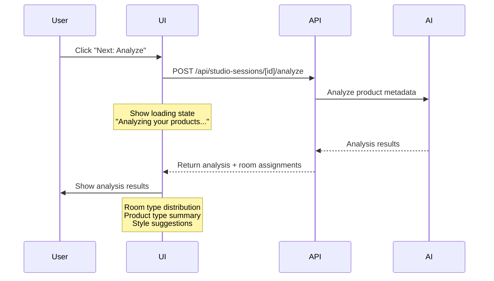

**Loading State**:
```text
┌────────────────────────────────────────────────────────┐
│ Step 2 of 4: Analyzing Your Products                  │
│                                                        │
│         AI is analyzing your selection...             │
│                                                        │
│         ▓▓▓▓▓▓▓▓░░░░░░░░  60%                         │
│                                                        │
│         • Understanding product types                  │
│         • Detecting room contexts                      │
│         • Suggesting inspiration styles                │
└────────────────────────────────────────────────────────┘
```

**Results Display with Q&A Form (Prompt Tags)**:
```text
┌────────────────────────────────────────────────────────┐
│ Step 2 of 4: Analysis Results + Style Your Generation │
│                                                        │
│ We analyzed 3 products. Now customize your style:     │
│                                                        │
│ ─────────────────────────────────────────────────────  │
│                                                        │
│ Room Type                                              │
│ [Living Room ✓] [Office ✓] [Bedroom] [Outdoor] [+ Add]│
│                                                        │
│ Mood                                                   │
│ [Cozy ✓] [Modern] [Minimalist ✓] [Elegant] [+ Add]    │
│                                                        │
│ Lighting                                               │
│ [Natural ✓] [Warm] [Dramatic] [Soft] [+ Add]          │
│                                                        │
│ Style                                                  │
│ [Scandinavian ✓] [Industrial] [Bohemian] [+ Add]      │
│                                                        │
│ Custom Tags                                            │
│ [high ceilings ✓] [wooden floors ✓] [+ Add]           │
│                                                        │
│ ─────────────────────────────────────────────────────  │
│                                                        │
│ Prompt Preview:                                        │
│ "living room, office, cozy, minimalist, natural       │
│  lighting, scandinavian style, high ceilings,         │
│  wooden floors"                                        │
│                                                        │
│         [← Back]              [Next: Inspire →]        │
└────────────────────────────────────────────────────────┘
```

**Q&A Form Behavior**:
- AI suggests initial tags based on product analysis
- User clicks tag bubbles to toggle on/off (✓ = selected)
- User can add custom tags with [+ Add] button
- Prompt preview updates in real-time as tags change
- Tags are stored as `PromptTags` object on flow settings

**Tag Categories**:
| Category | Pre-filled Examples | Purpose |
|----------|-------------------|---------|
| Room Type | Living Room, Office, Bedroom | Where the product is placed |
| Mood | Cozy, Modern, Minimalist, Elegant | Emotional feel of the scene |
| Lighting | Natural, Warm, Dramatic, Soft | Light source and quality |
| Style | Scandinavian, Industrial, Bohemian | Design aesthetic |
| Custom | (user-defined) | Specific requests like "high ceilings" |

**Prompt Generation**:
```typescript
function buildPromptFromTags(tags: PromptTags): string {
  return [
    ...tags.roomType,
    ...tags.mood,
    ...tags.lighting.map(l => `${l} lighting`),
    ...tags.style.map(s => `${s} style`),
    ...tags.custom,
  ].filter(Boolean).join(", ");
}
// Result: "living room, office, cozy, minimalist, natural lighting, scandinavian style, high ceilings, wooden floors"
```

**Analysis Data Structure**:
```typescript
interface ProductAnalysisResult {
  roomTypeDistribution: {
    Office: 1;
    "Living Room": 1;
    Bedroom: 1;
  };
  productTypes: ["Desk", "Sofa", "Bed"];
  dominantCategory: "Furniture";
  suggestedStyles: ["Modern", "Contemporary", "Minimalist"];
  recommendedInspirationKeywords: [
    "modern home office",
    "contemporary living room",
    "minimalist bedroom"
  ];
  productRoomAssignments: {
    "product-1-id": "Office";
    "product-2-id": "Living Room";
    "product-3-id": "Bedroom";
  };
  analyzedAt: Date;
}
```

**Error Handling**:
If AI analysis fails:
```text
┌────────────────────────────────────────────────────────┐
│ ⚠️  AI Analysis Unavailable                            │
│                                                        │
│ We couldn't analyze your products automatically,       │
│ but you can still continue using basic settings.       │
│                                                        │
│         [Try Again]        [Continue with Defaults →]  │
└────────────────────────────────────────────────────────┘
```

### Step 3: Choose Inspirations

**URL**: `/sessions/[sessionId]/inspire`

**Page Layout**:
```text
┌────────────────────────────────────────────────────────┐
│ Step 3 of 4: Choose Inspiration Images                │
│                                                        │
│ Select 1-5 images to inspire the style and mood       │
│ of your generated product images.                      │
│                                                        │
│  [Upload]  [Unsplash]  [My Library]                   │
├────────────────────────────────────────────────────────┤
│                                                        │
│  Suggested for your session:                          │
│  Based on: Office, Living Room, Bedroom, Modern       │
│                                                        │
│  ┌─────────┐ ┌─────────┐ ┌─────────┐ ┌─────────┐    │
│  │ Modern  │ │ Living  │ │ Bedroom │ │ Office  │    │
│  │ Office  │ │ Room    │ │ Minimal │ │ Setup   │    │
│  │         │ │ Cozy    │ │         │ │         │    │
│  │    +    │ │    +    │ │    +    │ │    +    │    │
│  └─────────┘ └─────────┘ └─────────┘ └─────────┘    │
│                                                        │
│  Selected (2 of 5):                                   │
│  ┌─────────┐ ┌─────────┐                             │
│  │ ✓       │ │ ✓       │  [Clear All]                │
│  │ Modern  │ │ Living  │                              │
│  └─────────┘ └─────────┘                             │
│                                                        │
│         [← Back]              [Next: Generate →]      │
└────────────────────────────────────────────────────────┘
```

#### Tab 1: Upload

**Features**:
- Drag & drop zone (supports multi-file)
- Click to browse
- Image preview with remove button
- Max 5 images total
- Supported formats: JPG, PNG, WebP
- Max 10MB per image
- Auto-compress if >5MB

**Upload Flow**:
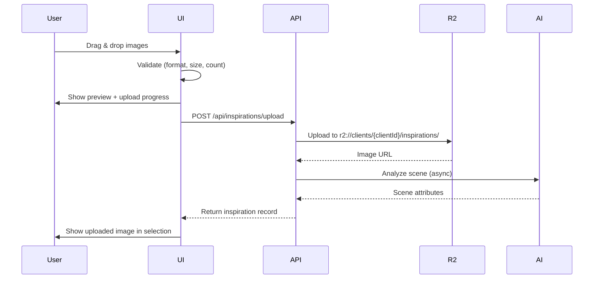

**Error States**:
- File too large: "Image must be under 10MB. Try compressing it first."
- Wrong format: "Only JPG, PNG, and WebP images are supported."
- Too many files: "You can select up to 5 inspiration images."
- Upload failed: "Upload failed. Check your connection and try again."

#### Tab 2: Unsplash

**Features**:
- Pre-populated search from Step 2 analysis
- Search by keyword
- Infinite scroll
- Image preview on hover
- "Use This" button to select
- Attribution shown (Unsplash requires it)

**Search Suggestions** (from analysis):
```typescript
// From Step 2: recommendedInspirationKeywords
const suggestions = [
  "modern home office",
  "contemporary living room",
  "minimalist bedroom"
];
```

**UI**:
```text
┌────────────────────────────────────────────────────────┐
│ Search Unsplash                                        │
│ 🔍 modern home office               [Search]           │
│                                                        │
│ Try these: [modern home office] [contemporary living] │
│                                                        │
│ ┌──────────┐ ┌──────────┐ ┌──────────┐ ┌──────────┐ │
│ │          │ │          │ │          │ │          │ │
│ │  Modern  │ │  Minimal │ │  Scandi  │ │  Indust- │ │
│ │  Office  │ │  Desk    │ │  Work-   │ │  rial    │ │
│ │          │ │          │ │  space   │ │  Loft    │ │
│ │  [Use]   │ │  [Use]   │ │  [Use]   │ │  [Use]   │ │
│ └──────────┘ └──────────┘ └──────────┘ └──────────┘ │
│                                                        │
│ Photo by [Photographer] on Unsplash                   │
└────────────────────────────────────────────────────────┘
```

**API Integration**:
```typescript
// GET /api/unsplash/search?q={query}
interface UnsplashSearchResponse {
  results: Array<{
    id: string;
    urls: {
      regular: string;
      small: string;
      thumb: string;
    };
    user: {
      name: string;
      links: { html: string };
    };
    links: { download_location: string };
  }>;
  total: number;
  total_pages: number;
}
```

#### Tab 3: My Library

**Features**:
- Show previously generated images marked as "pinned"
- Filter by room type (from Step 2 analysis)
- Grid view with checkboxes
- Preview on click
- Only show images from current client

**UI**:
```text
┌────────────────────────────────────────────────────────┐
│ Your Pinned Images                                     │
│                                                        │
│ Filter: [All Rooms ▼]                                  │
│                                                        │
│ ┌──────────┐ ┌──────────┐ ┌──────────┐               │
│ │ ✓        │ │          │ │          │               │
│ │ Modern   │ │ Bedroom  │ │ Living   │               │
│ │ Office   │ │ Minimal  │ │ Room     │               │
│ │          │ │          │ │          │               │
│ │ From:    │ │ From:    │ │ From:    │               │
│ │ Dec 15   │ │ Dec 10   │ │ Dec 8    │               │
│ └──────────┘ └──────────┘ └──────────┘               │
│                                                        │
│ No pinned images yet? Pin your favorite generated     │
│ images to reuse them as inspiration.                  │
└────────────────────────────────────────────────────────┘
```

**Query**:
```sql
SELECT * FROM generated_images
WHERE flow_id IN (
  SELECT id FROM flows
  WHERE studio_session_id IN (
    SELECT id FROM studio_sessions
    WHERE client_id = $clientId
  )
)
  AND pinned = TRUE
  AND deleted_at IS NULL
  AND status = 'completed'
ORDER BY created_at DESC;
```

**Smart Filtering**:
```typescript
// If Step 2 detected "Office, Living Room, Bedroom"
// Show filter chips: [All] [Office] [Living Room] [Bedroom]
const relevantRoomTypes = Object.keys(analysis.roomTypeDistribution);
```

### Step 4: Configure & Generate

**URL**: `/sessions/[sessionId]/generate`

**Page Layout** (Review & Confirm):
```text
┌────────────────────────────────────────────────────────┐
│ Step 4 of 4: Ready to Generate                        │
│                                                        │
│ Review your session settings:                         │
│                                                        │
│ ✓ Products Selected: 3                                │
│   Modern Desk, Velvet Sofa, King Bed                  │
│                                                        │
│ ✓ Inspiration Images: 2                               │
│   [thumbnail] [thumbnail]                              │
│                                                        │
│ ✓ Estimated Time: 3-5 minutes                         │
│   We'll generate 3 high-quality product images.       │
│                                                        │
│ Advanced Settings (Optional)                          │
│ ▼ Show advanced options                               │
│                                                        │
│         [← Back]           [Generate 3 Images →]       │
└────────────────────────────────────────────────────────┘
```

**Advanced Settings** (collapsed by default):
```text
┌────────────────────────────────────────────────────────┐
│ Advanced Settings                                      │
│                                                        │
│ Aspect Ratio:  ○ Square (1:1)  ⦿ Landscape (16:9)     │
│ Variety Level: [═══════░░░] 7/10                      │
│ Match Product Colors: ☑ Yes                           │
│                                                        │
│ ℹ️  These are automatically set based on your          │
│    inspirations. Only change if needed.               │
└────────────────────────────────────────────────────────┘
```

**Generation Flow**:
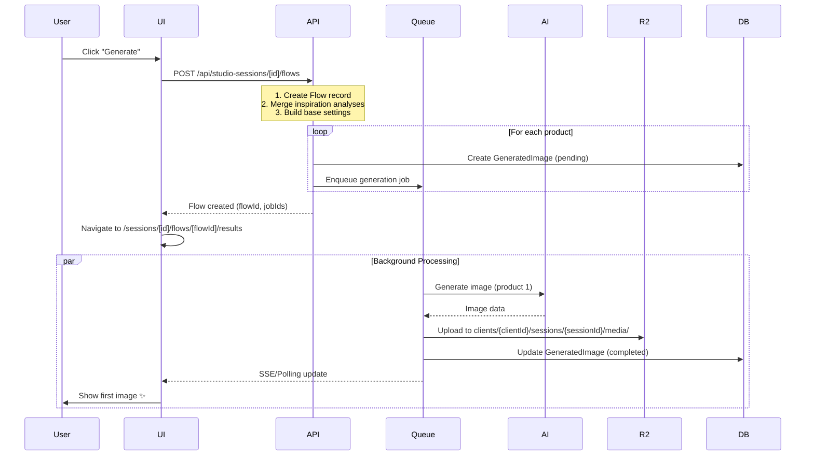

**What Happens on "Generate"**:
1. **Create Flow**: New Flow record linked to StudioSession
2. **Merge Scene Analyses**: Combine all inspiration image analyses
3. **Build Base Settings**: Create `FlowGenerationSettings` template
4. **Create Images**: One `GeneratedImage` per product
5. **Assign Rooms**: Use Step 2 analysis for per-product `roomType`
6. **Enqueue Jobs**: Add to Redis generation queue
7. **Update Statuses**: StudioSession → `active`, Flow → `generating`
8. **Navigate**: Redirect to results page

**Flow Creation**:
```typescript
// POST /api/studio-sessions/[sessionId]/flows
const flow = await createFlow({
  studioSessionId: session.id,
  productIds: session.productIds,  // All products from session
  status: 'configured',
  settings: mergeInspirationAnalyses(inspirationImages)
});

// Update session status
await updateStudioSession(session.id, { status: 'active' });
```

**Base Settings Construction**:
```typescript
// Merge 2 inspiration images into unified settings
const baseSettings: FlowGenerationSettings = {
  // From inspiration analysis
  style: 'Modern Minimalist',
  lighting: 'Natural Light',
  colorScheme: 'Neutral Tones',
  surroundings: 'Moderate',
  props: ['Plants', 'Books'],
  sceneImageUrl: inspirationImages[0].url, // Primary

  // From user advanced settings
  aspectRatio: '16:9',
  varietyLevel: 7,
  matchProductColors: true,

  // Per-product (filled in next step)
  roomType: '', // Will be set per product
  cameraAngle: 'Eye Level',
  promptText: '', // Auto-generated per product
};
```

**Per-Product Final Settings**:
```typescript
// For "Modern Desk" (productId: desk-1)
const deskImageSettings: FlowGenerationSettings = {
  ...baseSettings,
  roomType: 'Office', // From Step 2 analysis
  promptText: 'Professional modern office with the desk as the focal point, natural lighting, neutral tones, plants and books as props',
};

// Create GeneratedImage record
const generatedImage = await createGeneratedImage({
  flowId: flow.id,
  productIds: ['desk-1'],
  settings: deskImageSettings,
  status: 'pending',
  r2Key: `clients/${clientId}/sessions/${sessionId}/media/${imageId}.jpg`
});
```

**R2 Storage Path**:
```text
r2://epox-visualizer/
  clients/
    {clientId}/
      sessions/
        {sessionId}/
          media/
            {generatedImageId}.jpg
          inspirations/
            {inspirationId}.jpg
```

---

## Flow 3: Asset Management Flow

### Overview
Viewing, filtering, downloading, pinning, and deleting generated images.

### Results Gallery Page

**URL**: `/sessions/[sessionId]/flows/[flowId]/results`

**Page Layout**:
```text
┌────────────────────────────────────────────────────────┐
│ ← Back to Sessions                                     │
│                                                        │
│ Session: "Modern Furniture Set"                       │
│ Flow: #1 - Status: Generating... 3 of 3 completed     │
│                                                        │
│ [Download All]  [Pin Selected]  [Delete Selected]     │
│                                                        │
│ Filter: [All ▼] [Office] [Living Room] [Bedroom]      │
│ Sort: [Recent ▼]                                       │
│                                                        │
├────────────────────────────────────────────────────────┤
│                                                        │
│ ┌──────────────┐  ┌──────────────┐  ┌──────────────┐ │
│ │ ☑            │  │ ☐            │  │ ☐            │ │
│ │              │  │              │  │              │ │
│ │  Modern Desk │  │ Velvet Sofa  │  │  King Bed    │ │
│ │              │  │              │  │              │ │
│ │  Office      │  │ Living Room  │  │  Bedroom     │ │
│ │              │  │              │  │              │ │
│ │ [Download]   │  │ [Download]   │  │ [Download]   │ │
│ │ [📌 Pin]     │  │ [📌 Pin]     │  │ [📌 Pin]     │ │
│ │ [🔄 Redo]    │  │ [🔄 Redo]    │  │ [🔄 Redo]    │ │
│ │ [🗑️ Delete]  │  │ [🗑️ Delete]  │  │ [🗑️ Delete]  │ │
│ └──────────────┘  └──────────────┘  └──────────────┘ │
│                                                        │
└────────────────────────────────────────────────────────┘
```

### Real-Time Progress Updates

**Polling Strategy**:
```typescript
// Poll every 5 seconds while status is 'generating'
const { data: images } = useQuery({
  queryKey: ['generated-images', flowId],
  queryFn: () => fetchFlowImages(flowId),
  refetchInterval: (data) => {
    const hasGenerating = data?.some(
      image => ['pending', 'generating'].includes(image.status)
    );
    return hasGenerating ? 5000 : false; // 5s or stop polling
  },
});
```

**Progress States**:

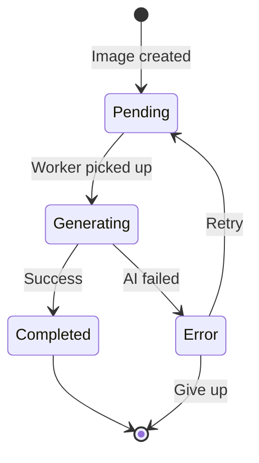

**UI States**:

1. **Pending**:
```text
┌──────────────┐
│ ⏳ Pending   │
│              │
│  Queued...   │
└──────────────┘
```

2. **Generating**:
```text
┌──────────────┐
│ ⚙️ Generating │
│              │
│  ████░░░░ 60%│
└──────────────┘
```

3. **Completed**:
```text
┌──────────────┐
│ ✓            │
│   [Image]    │
│  Modern Desk │
│  [Actions]   │
└──────────────┘
```

4. **Error**:
```text
┌──────────────┐
│ ⚠️ Failed     │
│              │
│  [View Error]│
│  [Retry]     │
└──────────────┘
```

### Flow Status Updates

**Flow Status Progression**:
```typescript
type FlowStatus = 'empty' | 'configured' | 'generating' | 'completed' | 'error';

// empty → Flow created, no settings yet
// configured → Settings applied, ready to generate
// generating → At least one image is pending/generating
// completed → All images completed successfully
// error → All images completed, but some failed
```

**Auto-Update Flow Status**:
```typescript
// After each GeneratedImage status change
async function updateFlowStatus(flowId: string) {
  const images = await getFlowImages(flowId);

  const allCompleted = images.every(img => img.status === 'completed');
  const anyError = images.some(img => img.status === 'error');
  const anyGenerating = images.some(img =>
    ['pending', 'generating'].includes(img.status)
  );

  let flowStatus: FlowStatus;
  if (allCompleted && !anyError) {
    flowStatus = 'completed';
  } else if (anyGenerating) {
    flowStatus = 'generating';
  } else if (anyError) {
    flowStatus = 'error';
  } else {
    flowStatus = 'configured';
  }

  await updateFlow(flowId, { status: flowStatus });
}
```

### Asset Actions

#### 1. Download Single Image

**Flow**:
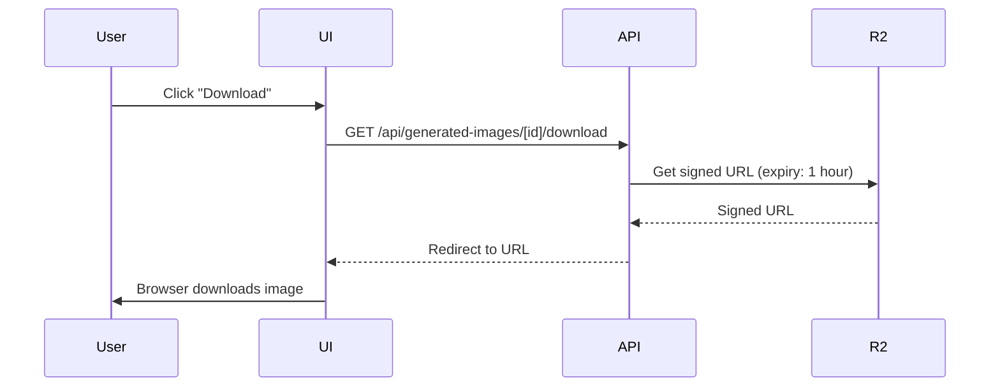

**Filename Format**:
```text
{product-name}_{room-type}_{timestamp}.jpg
Examples:
- modern_desk_office_20260110_143052.jpg
- velvet_sofa_living_room_20260110_143053.jpg
```

#### 2. Download All (Bulk)

**Flow**:
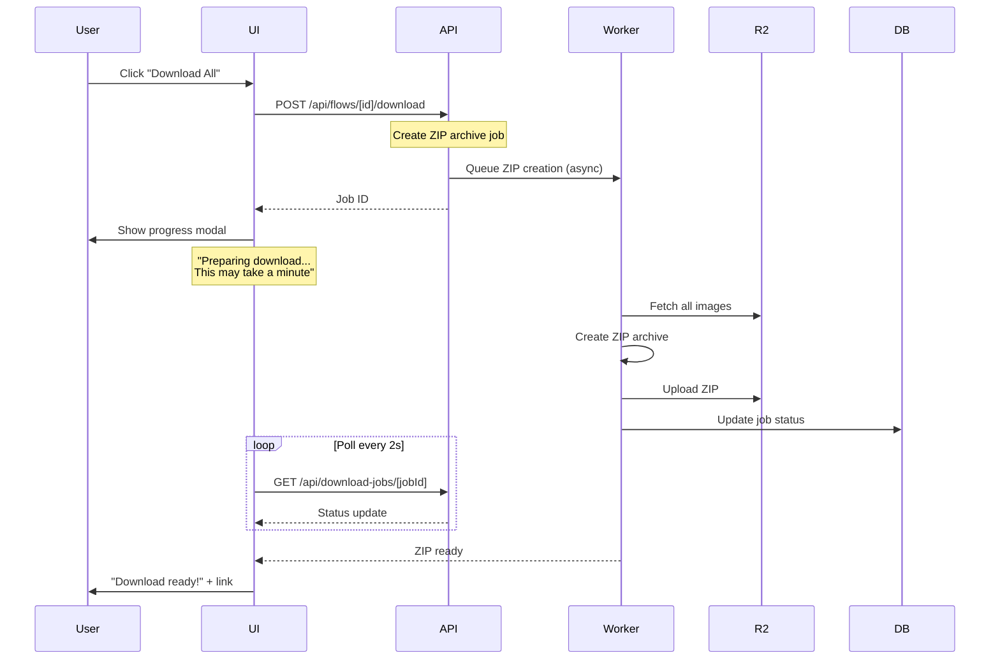

**Download Modal**:
```text
┌────────────────────────────────────────┐
│ Preparing Your Download                │
│                                        │
│ ████████████████░░░░  75%              │
│                                        │
│ Packaging 3 images...                  │
│                                        │
│ This may take up to a minute.          │
│                                        │
│            [Cancel]                    │
└────────────────────────────────────────┘
```

**Success State**:
```text
┌────────────────────────────────────────┐
│ Download Ready! ✓                      │
│                                        │
│ Your ZIP file (2.4 MB) is ready.       │
│                                        │
│        [Download ZIP]                  │
│                                        │
│ Link expires in 24 hours.              │
└────────────────────────────────────────┘
```

#### 3. Pin for Reuse

**Action**:
```typescript
// Toggle pin status
async function togglePin(imageId: string) {
  await fetch(`/api/generated-images/${imageId}`, {
    method: 'PATCH',
    body: JSON.stringify({ pinned: true }),
  });

  // Optimistic update
  queryClient.setQueryData(['images'], (old) =>
    old.map(image =>
      image.id === imageId
        ? { ...image, pinned: true }
        : image
    )
  );

  toast.success('Pinned! You can now use this as inspiration.');
}
```

**UI Feedback**:
```text
Before:
[📌 Pin]

After (pinned):
[📌 Pinned] ← Blue background, check icon

Hover (to unpin):
[📌 Unpin]
```

#### 4. Regenerate with Different Settings

**Flow**:
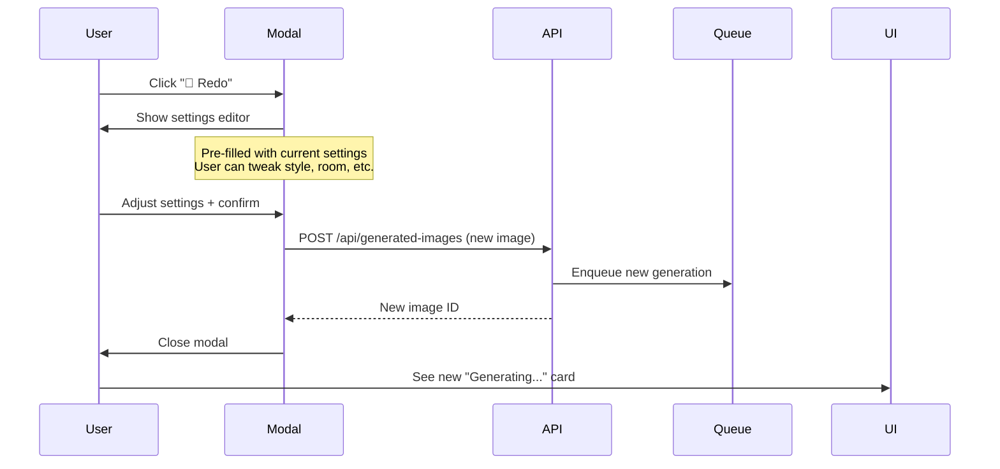

**Regenerate Modal**:
```text
┌────────────────────────────────────────────────────────┐
│ Regenerate "Modern Desk"                      ✕        │
├────────────────────────────────────────────────────────┤
│                                                        │
│ Original Settings:                                     │
│   Room: Office                                         │
│   Style: Modern Minimalist                             │
│   Lighting: Natural Light                              │
│                                                        │
│ Adjust Settings:                                       │
│                                                        │
│ Room Type:  [Office ▼]                                 │
│ Style:      [Modern Minimalist ▼]                      │
│ Lighting:   [Natural Light ▼]                          │
│                                                        │
│ Custom Prompt (optional):                              │
│ ┌────────────────────────────────────────────────────┐ │
│ │                                                    │ │
│ └────────────────────────────────────────────────────┘ │
│                                                        │
│         [Cancel]              [Regenerate →]           │
└────────────────────────────────────────────────────────┘
```

**What Happens**:
1. Create new `GeneratedImage` record
2. Copy settings from original, apply user changes
3. Enqueue new generation job
4. Original image remains (keep for comparison)
5. Both shown in gallery, sorted by newest first

#### 5. Delete Image

**Confirmation Modal**:
```text
┌────────────────────────────────────────┐
│ Delete "Modern Desk"?                  │
│                                        │
│ This image will be moved to trash.     │
│ You can recover it for 30 days.        │
│                                        │
│    [Cancel]        [Delete]            │
└────────────────────────────────────────┘
```

**Action**:
```typescript
async function deleteImage(imageId: string) {
  await fetch(`/api/generated-images/${imageId}`, {
    method: 'DELETE',
  });

  // Soft-delete: sets deletedAt timestamp
  // Image removed from gallery immediately
  // R2 object marked for deletion after 30 days

  toast.success(
    'Deleted. Undo?',
    {
      action: {
        label: 'Undo',
        onClick: () => undoDelete(imageId),
      },
      duration: 10000, // 10 seconds to undo
    }
  );
}
```

**Undo Flow**:
```typescript
async function undoDelete(imageId: string) {
  await fetch(`/api/generated-images/${imageId}/restore`, {
    method: 'POST',
  });

  // Sets deletedAt = null
  toast.success('Restored!');
}
```

**Trash View** (future enhancement):
```text
┌────────────────────────────────────────────────────────┐
│ Trash                                                  │
│                                                        │
│ Items deleted in the last 30 days:                    │
│                                                        │
│ ┌──────────────┐  ┌──────────────┐                    │
│ │              │  │              │                    │
│ │  Modern Desk │  │ Velvet Sofa  │                    │
│ │              │  │              │                    │
│ │ Deleted:     │  │ Deleted:     │                    │
│ │ 2 days ago   │  │ 5 days ago   │                    │
│ │              │  │              │                    │
│ │ [Restore]    │  │ [Restore]    │                    │
│ │ [Delete Now] │  │ [Delete Now] │                    │
│ └──────────────┘  └──────────────┘                    │
│                                                        │
│                         [Empty Trash]                  │
└────────────────────────────────────────────────────────┘
```

### Filtering & Sorting

**Filters**:
- Room Type (Office, Living Room, Bedroom, etc.)
- Status (All, Completed, Generating, Failed)
- Pinned (Show only pinned)
- Date Range (Last 7 days, Last 30 days, Custom)

**Sort Options**:
- Recent (newest first)
- Oldest
- Product Name (A-Z)
- Room Type

**Filter State**:
```typescript
interface GalleryFilters {
  roomTypes: string[];
  status: GeneratedImageStatus[];
  pinnedOnly: boolean;
  dateRange: {
    start: Date | null;
    end: Date | null;
  };
  sortBy: 'createdAt' | 'productName' | 'roomType';
  sortOrder: 'asc' | 'desc';
}
```

---

## Flow 4: Error Handling Flows

### Overview
Graceful error handling at every step of the journey.

### Error Categories

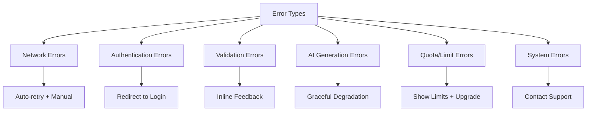

### 1. Network Errors

**Scenarios**:
- API request fails (timeout, 500 error, network offline)
- File upload interrupted
- WebSocket/polling disconnected

**Handling**:
```typescript
// Automatic retry with exponential backoff
const { data, error, refetch } = useQuery({
  queryKey: ['products'],
  queryFn: fetchProducts,
  retry: 3,
  retryDelay: (attemptIndex) => Math.min(1000 * 2 ** attemptIndex, 30000),
});

// User-facing error
if (error) {
  return (
    <ErrorState
      title="Connection Error"
      message="We couldn't load your products. Check your internet connection."
      action={{ label: 'Try Again', onClick: refetch }}
    />
  );
}
```

**UI Example**:
```text
┌────────────────────────────────────────┐
│ ⚠️ Connection Error                    │
│                                        │
│ We couldn't load your products.        │
│ Check your internet connection.        │
│                                        │
│         [Try Again]                    │
└────────────────────────────────────────┘
```

### 2. Authentication Errors

**Scenarios**:
- Session expired
- Invalid token
- User logged out in another tab

**Handling**:
```typescript
// Middleware catches 401 responses
if (response.status === 401) {
  // Clear local session
  clearSession();

  // Redirect to login with return URL
  router.push(`/login?returnTo=${encodeURIComponent(currentPath)}`);

  toast.error('Session expired. Please log in again.');
}
```

**Modal Approach** (less disruptive):
```text
┌────────────────────────────────────────┐
│ Session Expired                        │
│                                        │
│ Your session has expired for security. │
│ Please log in again to continue.       │
│                                        │
│         [Log In]                       │
└────────────────────────────────────────┘
```

### 3. Validation Errors

**Scenarios**:
- Step 1: No products selected
- Step 3: No inspiration images selected
- Step 4: Invalid settings

**Handling**:
```typescript
// Inline validation
interface FormErrors {
  selectedProducts?: string;
  inspirationImages?: string;
  settings?: Record<string, string>;
}

// Example: Step 1 validation
const errors: FormErrors = {};

if (selectedProductIds.length === 0) {
  errors.selectedProducts = 'Please select at least one product';
}

if (selectedProductIds.length > 100) {
  errors.selectedProducts = 'Maximum 100 products per session';
}
```

**UI Feedback**:
```text
┌────────────────────────────────────────────────────────┐
│ Step 1: Select Products                               │
│                                                        │
│ ⚠️ Please select at least one product                  │
│                                                        │
│ [Product table here...]                                │
│                                                        │
│                 [Next: Analyze →]  (disabled)          │
└────────────────────────────────────────────────────────┘
```

### 4. AI Generation Errors

**Scenarios**:
- Gemini API error
- Content policy violation
- Timeout (>2 minutes)
- Invalid product image

**Per-Image Error Handling**:
```typescript
interface GeneratedImage {
  status: 'error';
  errorMessage: string;
  errorCode: 'GEMINI_ERROR' | 'TIMEOUT' | 'POLICY_VIOLATION' | 'INVALID_IMAGE';
}
```

**Error Card UI**:
```text
┌──────────────┐
│ ⚠️ Failed     │
│              │
│ Modern Desk  │
│              │
│ AI generation│
│ timed out.   │
│              │
│ [Retry]      │
│ [Details]    │
└──────────────┘
```

**Error Details Modal**:
```text
┌────────────────────────────────────────────────────────┐
│ Generation Error Details                      ✕        │
├────────────────────────────────────────────────────────┤
│                                                        │
│ Product: Modern Desk (SKU: DSK-001)                    │
│ Error: Generation timeout                              │
│                                                        │
│ What happened:                                         │
│ The AI took longer than 2 minutes to generate this     │
│ image. This sometimes happens with complex scenes.     │
│                                                        │
│ What you can do:                                       │
│ • Try regenerating with simpler settings               │
│ • Remove complex props or effects                      │
│ • Contact support if this keeps happening              │
│                                                        │
│ Error ID: err_2026011014305212345                      │
│ (Include this if contacting support)                   │
│                                                        │
│         [Close]              [Retry]                   │
└────────────────────────────────────────────────────────┘
```

**Auto-Retry Logic**:
```typescript
// For transient errors (timeout, rate limit), auto-retry
if (error.code === 'TIMEOUT' || error.code === 'RATE_LIMIT') {
  if (retryCount < 3) {
    await sleep(Math.min(1000 * 2 ** retryCount, 30000));
    await retryGeneration(imageId);
  } else {
    markAsFailed(imageId, 'Max retries exceeded');
  }
}
```

**Batch Error Summary**:
```text
┌────────────────────────────────────────────────────────┐
│ Flow #1: "Modern Furniture Set"                       │
│                                                        │
│ ⚠️ 2 of 10 images failed to generate                   │
│                                                        │
│ • Modern Desk (timeout)                                │
│ • King Bed (content policy)                            │
│                                                        │
│         [Retry Failed]        [View Details]           │
└────────────────────────────────────────────────────────┘
```

### 5. Quota/Limit Errors

**Scenarios**:
- Monthly generation limit reached
- Storage limit exceeded
- Rate limit hit (too many requests)

**Quota Error UI**:
```text
┌────────────────────────────────────────────────────────┐
│ Monthly Limit Reached                                  │
│                                                        │
│ You've used 100 of 100 monthly generations.            │
│                                                        │
│ Your limit resets on Feb 1, 2026.                      │
│                                                        │
│ Upgrade to Pro for unlimited generations:             │
│                                                        │
│   Current: Free (100/month)                            │
│   Pro: Unlimited ($49/month)                           │
│                                                        │
│         [Upgrade to Pro]                               │
│                                                        │
│ Or wait 14 days for your limit to reset.              │
└────────────────────────────────────────────────────────┘
```

**Rate Limit (Temporary)**:
```text
┌────────────────────────────────────────┐
│ ⚠️ Slow Down                            │
│                                        │
│ You're making requests too quickly.    │
│ Please wait 30 seconds and try again.  │
│                                        │
│ Time remaining: 00:28                  │
└────────────────────────────────────────┘
```

**Proactive Quota Warning** (before hitting limit):
```text
┌────────────────────────────────────────┐
│ ℹ️  Approaching Monthly Limit           │
│                                        │
│ 90 of 100 generations used (90%)       │
│                                        │
│ [View Usage]  [Upgrade]  [Dismiss]     │
└────────────────────────────────────────┘
```

### 6. System Errors

**Scenarios**:
- Database connection lost
- R2 upload failed
- Redis queue unavailable
- Unknown server error (500)

**Generic Error Page**:
```text
┌────────────────────────────────────────────────────────┐
│                    ⚠️ Something Went Wrong              │
│                                                        │
│            We encountered an unexpected error.         │
│       Our team has been notified and is investigating. │
│                                                        │
│                 Error ID: err_20260110143052           │
│                                                        │
│                    [Back to Dashboard]                 │
│                    [Contact Support]                   │
│                                                        │
│ If this keeps happening, please contact support        │
│ and include the error ID above.                        │
└────────────────────────────────────────────────────────┘
```

**Error Reporting** (to logging service):
```typescript
// Automatically log to Sentry/LogRocket
function handleError(error: Error, context: ErrorContext) {
  // Log to monitoring service
  logger.error(error, {
    userId: session.userId,
    clientId: session.clientId,
    route: context.route,
    action: context.action,
    timestamp: new Date(),
  });

  // Show user-friendly message
  toast.error('Something went wrong. Our team has been notified.');
}
```

---

## Flow 5: Settings Flow

### Overview
User account and client settings management.

### Settings Navigation

**URL**: `/settings`

**Tab Structure**:
```text
┌────────────────────────────────────────────────────────┐
│ Settings                                               │
│                                                        │
│ [Profile] [Notifications] [Defaults] [Account]        │
├────────────────────────────────────────────────────────┤
│                                                        │
│ [Active tab content]                                   │
│                                                        │
└────────────────────────────────────────────────────────┘
```

### Tab 1: Profile

**URL**: `/settings/profile`

**Fields**:
```text
┌────────────────────────────────────────────────────────┐
│ Profile Settings                                       │
│                                                        │
│ Full Name                                              │
│ ┌────────────────────────────────────────────────────┐ │
│ │ John Doe                                           │ │
│ └────────────────────────────────────────────────────┘ │
│                                                        │
│ Email                                                  │
│ ┌────────────────────────────────────────────────────┐ │
│ │ john@example.com                                   │ │
│ └────────────────────────────────────────────────────┘ │
│ ✓ Verified                                             │
│                                                        │
│ Profile Photo (Optional)                               │
│ ┌──────────┐                                           │
│ │  [JD]    │  [Upload Photo]  [Remove]                │
│ └──────────┘                                           │
│                                                        │
│ Client                                                 │
│ Acme Furniture Co.                                     │
│ (Contact admin to change)                              │
│                                                        │
│              [Cancel]        [Save Changes]            │
└────────────────────────────────────────────────────────┘
```

**Actions**:
- Update name → PATCH `/api/user/profile`
- Change email → Requires verification
- Upload photo → POST `/api/user/photo` → R2

### Tab 2: Notifications

**URL**: `/settings/notifications`

**Preferences**:
```text
┌────────────────────────────────────────────────────────┐
│ Notification Settings                                  │
│                                                        │
│ Email Notifications                                    │
│ ☑ Generation completed                                 │
│ ☑ Generation failed (errors)                           │
│ ☐ Weekly usage summary                                 │
│ ☐ Tips and best practices                              │
│                                                        │
│ Browser Notifications                                  │
│ ☑ Generation completed (when tab inactive)             │
│ ☐ Low quota warning                                    │
│                                                        │
│ Frequency                                              │
│ ⦿ Real-time    ○ Daily digest    ○ Never              │
│                                                        │
│              [Cancel]        [Save Changes]            │
└────────────────────────────────────────────────────────┘
```

**Settings Object**:
```typescript
interface NotificationSettings {
  email: {
    generationCompleted: boolean;
    generationFailed: boolean;
    weeklyUsageSummary: boolean;
    tipsAndBestPractices: boolean;
  };
  browser: {
    generationCompleted: boolean;
    lowQuotaWarning: boolean;
  };
  frequency: 'realtime' | 'daily' | 'never';
}
```

### Tab 3: Generation Defaults

**URL**: `/settings/defaults`

**Purpose**: Pre-fill wizard settings for faster session creation

**Settings**:
```text
┌────────────────────────────────────────────────────────┐
│ Default Generation Settings                            │
│                                                        │
│ These settings will pre-fill the session wizard.      │
│ You can always change them when creating sessions.    │
│                                                        │
│ Aspect Ratio                                           │
│ ⦿ Square (1:1)    ○ Landscape (16:9)    ○ Portrait    │
│                                                        │
│ Variety Level                                          │
│ [═══════░░░] 7/10                                      │
│ Higher = more creative variations                      │
│                                                        │
│ Match Product Colors                                   │
│ ☑ Yes, use product colors in scene                     │
│                                                        │
│ Preferred Style                                        │
│ ┌────────────────────────────────────────────────────┐ │
│ │ Modern Minimalist                      ▼           │ │
│ └────────────────────────────────────────────────────┘ │
│                                                        │
│              [Reset to Defaults]  [Save Changes]       │
└────────────────────────────────────────────────────────┘
```

**Data Structure**:
```typescript
interface DefaultGenerationSettings {
  aspectRatio: '1:1' | '16:9' | '9:16';
  varietyLevel: number; // 1-10
  matchProductColors: boolean;
  preferredStyle?: string;
}
```

### Tab 4: Account

**URL**: `/settings/account`

**Sections**:
```text
┌────────────────────────────────────────────────────────┐
│ Account Settings                                       │
│                                                        │
│ Password                                               │
│ ••••••••                      [Change Password]        │
│ Last changed: 30 days ago                              │
│                                                        │
│ ─────────────────────────────────────────────────────  │
│                                                        │
│ Usage & Quota                                          │
│ Plan: Free                                             │
│ This month: 45 of 100 generations used (45%)          │
│ Resets: Feb 1, 2026                                    │
│                                                        │
│                     [Upgrade to Pro]                   │
│                                                        │
│ ─────────────────────────────────────────────────────  │
│                                                        │
│ Danger Zone                                            │
│ [Delete Account]                                       │
│ Permanently delete your account and all data.          │
│                                                        │
└────────────────────────────────────────────────────────┘
```

**Change Password Flow**:
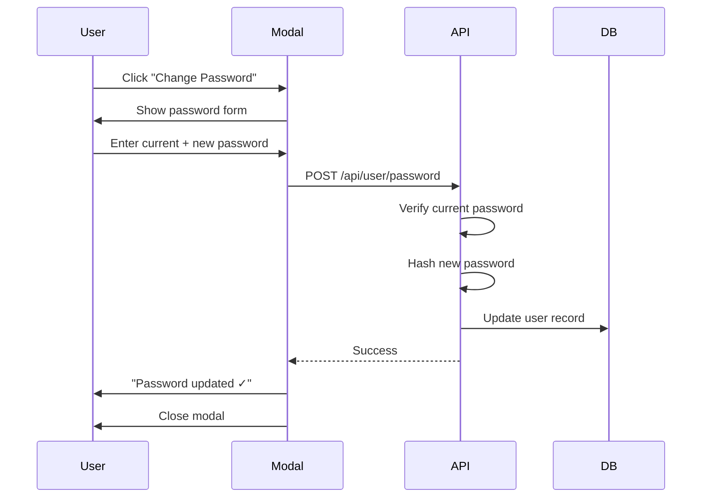

**Delete Account Flow**:
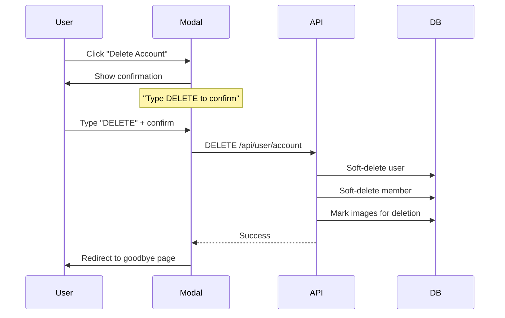

---

## Implementation Plan

### Phase 1: Onboarding (Week 1)
1. Create invitation email template
2. Build signup page with token validation
3. Implement dashboard empty state
4. Add "Create First Session" CTA
5. Test invitation → signup → dashboard flow

### Phase 2: Session Wizard - Step 1 (Week 2)
1. Build product table component
2. Implement search, filter, sort
3. Add multi-select with checkboxes
4. Create draft auto-save logic (StudioSession status: 'draft')
5. Add "Next" navigation

### Phase 3: Session Wizard - Step 2 (Week 2)
1. Implement product analysis API
2. Build loading state UI
3. Create results display component
4. Add error fallback (metadata-only)
5. Test analysis flow

### Phase 4: Session Wizard - Step 3 (Week 3)
1. Build inspiration picker tabs
2. Implement upload functionality (R2)
3. Integrate Unsplash API
4. Build library view (pinned images)
5. Add scene analysis

### Phase 5: Session Wizard - Step 4 (Week 3)
1. Build review/confirm page
2. Implement advanced settings (collapsible)
3. Create Flow creation logic
4. Create generation trigger (GeneratedImage records)
5. Build progress indicator
6. Test end-to-end wizard

### Phase 6: Results Gallery (Week 4)
1. Build gallery grid layout
2. Implement real-time polling
3. Add filter and sort controls
4. Create image action buttons
5. Test progress updates
6. Implement Flow status auto-update

### Phase 7: Asset Actions (Week 4)
1. Implement single download (R2 signed URLs)
2. Build bulk download (ZIP from R2)
3. Add pin/unpin functionality
4. Create regenerate modal
5. Implement soft-delete + undo

### Phase 8: Error Handling (Week 5)
1. Add network error handling
2. Implement auth error redirects
3. Build validation feedback
4. Create AI error UI (per-image and batch)
5. Add quota limit warnings
6. Implement Flow error status handling

### Phase 9: Settings (Week 5)
1. Build settings layout with tabs
2. Implement profile settings
3. Add notification preferences
4. Create generation defaults
5. Build account management

### Phase 10: Polish & Testing (Week 6)
1. Add loading skeletons
2. Implement optimistic updates
3. Add success animations
4. E2E testing all flows
5. Accessibility audit

---

## Examples

### ✅ Good: Clear Progress Indication

```typescript
// Wizard with clear progress
interface WizardStep {
  id: string;
  label: string;
  path: string;
  status: 'completed' | 'current' | 'upcoming';
}

const steps: WizardStep[] = [
  { id: '1', label: 'Select', path: '/select', status: 'completed' },
  { id: '2', label: 'Analyze', path: '/analyze', status: 'current' },
  { id: '3', label: 'Inspire', path: '/inspire', status: 'upcoming' },
  { id: '4', label: 'Generate', path: '/generate', status: 'upcoming' },
];

function ProgressIndicator({ steps }: { steps: WizardStep[] }) {
  return (
    <div className="flex items-center justify-between">
      {steps.map((step, index) => (
        <div key={step.id} className="flex items-center">
          <StepCircle step={step} />
          {index < steps.length - 1 && <StepConnector />}
        </div>
      ))}
    </div>
  );
}
```

### ✅ Good: Optimistic Updates

```typescript
// Update UI immediately, rollback on error
async function pinImage(imageId: string) {
  // Optimistic update
  queryClient.setQueryData(['images'], (old) =>
    old.map(image =>
      image.id === imageId ? { ...image, pinned: true } : image
    )
  );

  try {
    await api.updateImage(imageId, { pinned: true });
    toast.success('Pinned!');
  } catch (error) {
    // Rollback
    queryClient.setQueryData(['images'], (old) =>
      old.map(image =>
        image.id === imageId ? { ...image, pinned: false } : image
      )
    );
    toast.error('Failed to pin. Try again.');
  }
}
```

### ✅ Good: Graceful Error Recovery

```typescript
// AI analysis fails → fallback to metadata
async function analyzeProducts(productIds: string[]) {
  try {
    const analysis = await ai.analyzeProductMetadata(productIds);
    return analysis;
  } catch (error) {
    logger.warn('AI analysis failed, using metadata fallback', error);

    // Fallback: basic analysis from product metadata
    return {
      roomTypeDistribution: extractRoomTypesFromMetadata(productIds),
      suggestedStyles: ['Modern'], // Generic default
      productRoomAssignments: assignRoomsByCategory(productIds),
    };
  }
}
```

### ❌ Bad: No Error Feedback

```typescript
// ❌ Silent failure, user confused
async function generateImages() {
  try {
    await api.createFlow(sessionId);
  } catch (error) {
    // Nothing shown to user! Bad!
    console.error(error);
  }
}

// ✅ Clear error message
async function generateImages() {
  try {
    await api.createFlow(sessionId);
    toast.success('Generation started!');
  } catch (error) {
    toast.error('Failed to start generation. Please try again.');
    logger.error('Flow creation failed', error);
  }
}
```

### ❌ Bad: No Loading State

```typescript
// ❌ No indication that something is happening
function ProductList() {
  const { data } = useQuery(['products'], fetchProducts);

  return <Table data={data} />; // Shows nothing while loading
}

// ✅ Clear loading feedback
function ProductList() {
  const { data, isLoading } = useQuery(['products'], fetchProducts);

  if (isLoading) {
    return <TableSkeleton rows={10} />;
  }

  return <Table data={data} />;
}
```

---

## Trade-offs

### Multi-Page Wizard vs. Single-Page Tabs
**Chosen**: Multi-page wizard (separate URLs)
**Rationale**:
- ✅ Back/forward navigation works
- ✅ Can bookmark specific step
- ✅ Clearer mental model (linear progress)
- ✅ Easier to implement conditional steps
- ❌ Slightly more routing complexity
- ❌ Page transitions (mitigated with loading states)

### Real-Time Polling vs. WebSockets
**Chosen**: Polling (5-second interval)
**Rationale**:
- ✅ Simpler implementation
- ✅ Works with serverless (Vercel)
- ✅ No connection management
- ✅ Degrades gracefully if user goes offline
- ❌ More API requests
- ❌ Slight delay in updates (5s max)

### Auto-Save Drafts vs. Manual Save
**Chosen**: Auto-save every 30 seconds
**Rationale**:
- ✅ Never lose progress
- ✅ Can resume if browser crashes
- ✅ Less cognitive load (no save button)
- ❌ More database writes
- ❌ Need conflict resolution if editing from multiple tabs

### Soft-Delete vs. Hard-Delete
**Chosen**: Soft-delete with 30-day recovery
**Rationale**:
- ✅ Prevents accidental data loss
- ✅ Can undo within 10 seconds (toast)
- ✅ 30-day recovery window
- ❌ Need to filter `WHERE deletedAt IS NULL`
- ❌ Database grows (mitigated by cron cleanup)

### Inline Errors vs. Error Page
**Chosen**: Hybrid (inline for validation, page for system errors)
**Rationale**:
- ✅ Inline: Immediate feedback, doesn't break flow
- ✅ Page: Clear for catastrophic errors
- ✅ Context-appropriate
- ❌ Need to design both patterns

### StudioSession → Flow Relationship
**Chosen**: One-to-many (session can have multiple flows)
**Rationale**:
- ✅ Allows iterating on settings without recreating session
- ✅ Clean separation: session = products + inspirations, flow = generation run
- ✅ Can track generation history per session
- ❌ Slightly more complex data model
- ❌ Need to manage flow status separately

---

## Open Questions

1. **Onboarding tutorial**: Should we show an interactive tutorial on first login?
   - Proposal: Optional 2-minute video + "Skip" button
   - Track completion, show again if skipped

2. **Session templates**: Should we offer pre-made templates (e.g., "Modern Furniture", "Outdoor Session")?
   - Proposal: Phase 2 feature
   - Admins can create templates per client

3. **Bulk regeneration**: Should users be able to regenerate an entire flow with new settings?
   - Proposal: Yes, add "Regenerate Flow" button
   - Creates new flow in same session with new settings

4. **Asset sharing**: Should users be able to share individual images or sessions via link?
   - Proposal: Phase 2 feature
   - Generate signed URL, expires in 7 days

5. **Keyboard shortcuts**: Should power users have keyboard shortcuts (e.g., "G" for generate)?
   - Proposal: Yes, but subtle (no modal on load)
   - Show shortcuts in settings

6. **Multiple flows per session**: How should UI handle viewing multiple flows in one session?
   - Proposal: Flow switcher dropdown in results page
   - Show all flows in session detail page

---

## Success Criteria

- [ ] New user can sign up and create first session in <5 minutes
- [ ] Wizard auto-saves progress, can resume if abandoned
- [ ] All error states have clear, actionable messages
- [ ] Real-time progress updates work without page refresh
- [ ] Can download single or bulk images (ZIP from R2)
- [ ] Pin/unpin images for reuse as inspiration
- [ ] Soft-delete with 10-second undo works
- [ ] Settings persist across sessions
- [ ] All flows tested on mobile (responsive)
- [ ] Accessibility: keyboard navigation works throughout
- [ ] Page load time <2 seconds (with skeleton loaders)
- [ ] 95%+ of generations complete without user intervention
- [ ] Flow status accurately reflects image statuses
- [ ] StudioSession → Flow → GeneratedImage hierarchy clear in UI
