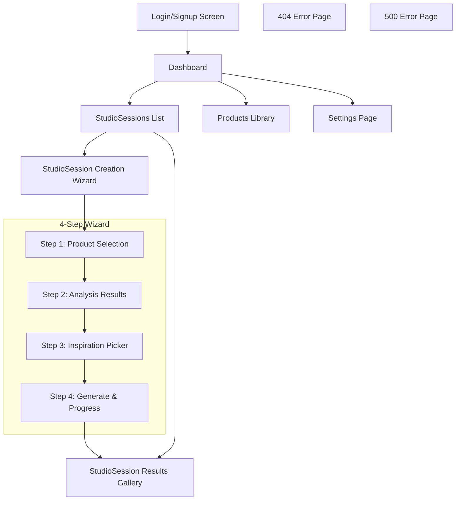

# Design Log #005: Screens & UI Components

**Status**: Draft
**Created**: 2026-01-10
**Updated**: 2026-01-12
**Author**: Claude
**Related**: Design Log #001 (Architecture), Design Log #003 (Data Model)

---

## Background

The `visualizer-client` platform requires a complete UI/UX design covering every screen and component in the flow-based bulk generation workflow. This design must:
- Support non-technical users generating 20-500+ products per studio session
- Provide a progressive, wizard-style workflow
- Reuse components where possible from existing admin portal
- Be fully responsive (desktop-first, mobile-compatible)
- Follow modern SaaS UX patterns

## Problem

We need detailed specifications for:
1. **8 main screens** - Login, Dashboard, Sessions, Flow Creation, Flow Detail, Results, Products, Settings, Errors
2. **Core UI components** - ProductTable, InspirationPicker, GenerationProgress, ImageGallery
3. **Shared components** - Modals, filters, search bars, pagination, etc.
4. **Responsive behavior** - Desktop (1440px), tablet (768px), mobile (375px)
5. **State management** - What data each screen/component needs
6. **User interactions** - Click flows, keyboard shortcuts, drag-and-drop

## Questions and Answers

### Q1: Should we build a multi-step wizard or separate pages?
**A**: Dedicated flow creation pages with clear navigation:
- Flow creation: Select products from session
- Flow settings: Configure generation parameters
- Benefits: Clear workflow, progress tracking, deep-linking

### Q2: How do we handle the product table with 1000+ products?
**A**: Server-side pagination + virtualization:
- Initial load: 50 products
- Virtual scrolling for 100+ visible items
- Server-side filtering/sorting via API
- Client-side selection state

### Q3: Should inspiration picker tabs be separate routes or client-side tabs?
**A**: Client-side tabs within flow settings:
- Single URL, tab state in local component
- All tabs share same selection state (0-5 images)
- Simpler UX, no page refresh

### Q4: What's the responsive breakpoint strategy?
**A**: Three breakpoints:
- Desktop: ≥1024px (primary experience)
- Tablet: 768px-1023px (simplified, two-column)
- Mobile: <768px (single column, stacked)

### Q5: How do we show real-time generation progress?
**A**: Polling + optimistic updates:
- Poll `/api/flows/[id]/status` every 2s during generation
- WebSocket upgrade path for future
- Progress bar + live count (e.g., "23/150 completed")

---

## Design

### Screen Architecture



---

## Screen Specifications

### 1. Login/Signup Screen

**Route**: `/login`

**Purpose**: Authenticate users via Better Auth

**Layout**:
```text
┌─────────────────────────────────────────────────────────────┐
│                                                             │
│                      [Logo]                                 │
│                                                             │
│              Welcome to Scenergy Studio                     │
│          Generate beautiful product visuals at scale        │
│                                                             │
│   ┌──────────────────────────────────────────────────┐     │
│   │  Email                                           │     │
│   │  ┌────────────────────────────────────────────┐  │     │
│   │  │ you@company.com                            │  │     │
│   │  └────────────────────────────────────────────┘  │     │
│   │                                                  │     │
│   │  Password                                        │     │
│   │  ┌────────────────────────────────────────────┐  │     │
│   │  │ ••••••••                                   │  │     │
│   │  └────────────────────────────────────────────┘  │     │
│   │                                                  │     │
│   │  [Forgot password?]                              │     │
│   │                                                  │     │
│   │  ┌────────────────────────────────────────────┐  │     │
│   │  │         Sign In                            │  │     │
│   │  └────────────────────────────────────────────┘  │     │
│   │                                                  │     │
│   │  ─────────────── or ───────────────             │     │
│   │                                                  │     │
│   │  [Sign in with Google]                           │     │
│   │                                                  │     │
│   │  Don't have an account? [Sign up]               │     │
│   └──────────────────────────────────────────────────┘     │
│                                                             │
└─────────────────────────────────────────────────────────────┘
```

**Components**:
- `LoginForm` - Email/password inputs
- `SocialAuthButtons` - Google OAuth
- `FormInput` - Reusable text input
- `Button` - Primary CTA

**State**:
```typescript
interface LoginState {
  email: string;
  password: string;
  isLoading: boolean;
  error: string | null;
}
```

**Interactions**:
- Form validation on blur and submit
- Enter key submits form
- Error messages inline below inputs
- Loading spinner in button during auth
- Redirect to dashboard on success

**Responsive**:
- Desktop: Centered card, 400px width
- Mobile: Full-width form, no card

---

### 2. Dashboard (Home Page)

**Route**: `/`

**Purpose**: Quick access to recent studioSessions, stats, and navigation

**Layout**:
```text
┌─────────────────────────────────────────────────────────────────────┐
│ [Logo]  StudioSessions  Products  Settings          [User Menu ▼]     │
├─────────────────────────────────────────────────────────────────────┤
│                                                                     │
│  Welcome back, Sarah                                                │
│                                                                     │
│  ┌──────────────┐  ┌──────────────┐  ┌──────────────┐             │
│  │   127        │  │   12         │  │   1,234      │             │
│  │   Products   │  │   StudioSessions│  │   Generated  │             │
│  └──────────────┘  └──────────────┘  └──────────────┘             │
│                                                                     │
│  Recent StudioSessions                            [+ New StudioSession]   │
│  ┌─────────────────────────────────────────────────────────────┐   │
│  │ Summer Furniture StudioSession           Updated 2h ago        │   │
│  │ 45 products • 180 images generated    [View Results]        │   │
│  ├─────────────────────────────────────────────────────────────┤   │
│  │ Office Catalog 2026                   Updated 1d ago        │   │
│  │ 23 products • 92 images generated     [View Results]        │   │
│  ├─────────────────────────────────────────────────────────────┤   │
│  │ Bathroom Fixtures                     Updated 3d ago        │   │
│  │ 12 products • 48 images generated     [View Results]        │   │
│  └─────────────────────────────────────────────────────────────┘   │
│                                                                     │
│  Quick Actions                                                      │
│  [Browse All StudioSessions]  [Upload Products]  [View Settings]      │
│                                                                     │
└─────────────────────────────────────────────────────────────────────┘
```

**Components**:
- `AppShell` - Top nav + sidebar layout
- `StatCard` - Metric display (products count, etc.)
- `StudioSessionCard` - Recent studioSession item
- `EmptyState` - When no studioSessions exist

**State**:
```typescript
interface DashboardData {
  user: User;
  stats: {
    totalProducts: number;
    totalStudioSessions: number;
    totalGenerated: number;
  };
  recentStudioSessions: StudioSession[];
  isLoading: boolean;
}
```

**Data Requirements**:
- `GET /api/dashboard` - Returns stats + recent studioSessions
- Cached for 5 minutes

**Interactions**:
- Click studioSession card → Navigate to results
- "+ New StudioSession" → Start wizard
- Stat cards animate on load

**Responsive**:
- Desktop: 3-column stats, list view studioSessions
- Tablet: 2-column stats, list view
- Mobile: Stacked stats, compact studioSession cards

---

### 3. StudioSessions List

**Route**: `/studioSessions`

**Purpose**: Browse all studioSessions, filter by status

**Layout**:
```text
┌─────────────────────────────────────────────────────────────────────┐
│ [Logo]  StudioSessions  Products  Settings          [User Menu ▼]     │
├─────────────────────────────────────────────────────────────────────┤
│                                                                     │
│  StudioSessions                                    [+ New StudioSession]  │
│                                                                     │
│  🔍 Search...           [All ▼] [Sort: Recent ▼]                   │
│                                                                     │
│  ┌─────────────────────────────────────────────────────────────┐   │
│  │ ┌─────────┐                                                 │   │
│  │ │ [img]   │  Summer Furniture StudioSession                    │   │
│  │ └─────────┘  45 products • Completed • Updated 2h ago       │   │
│  │              180/180 images generated                       │   │
│  │              [View Results] [Download All]                  │   │
│  ├─────────────────────────────────────────────────────────────┤   │
│  │ ┌─────────┐                                                 │   │
│  │ │ [img]   │  Office Catalog 2026                            │   │
│  │ └─────────┘  23 products • Generating... • Updated 5m ago   │   │
│  │              15/92 images generated                         │   │
│  │              [View Progress] [Cancel]                       │   │
│  ├─────────────────────────────────────────────────────────────┤   │
│  │ ┌─────────┐                                                 │   │
│  │ │ [img]   │  Bathroom Fixtures                              │   │
│  │ └─────────┘  12 products • Draft • Updated 3d ago           │   │
│  │              Not started                                    │   │
│  │              [Continue Editing] [Delete]                    │   │
│  └─────────────────────────────────────────────────────────────┘   │
│                                                                     │
│  Showing 3 of 12 studioSessions     [1] 2 3 4 → Next                  │
│                                                                     │
└─────────────────────────────────────────────────────────────────────┘
```

**Components**:
- `SearchBar` - Full-text search
- `FilterDropdown` - Status filter (All, Draft, Generating, Completed)
- `SortDropdown` - Sort options (Recent, Name, Product Count)
- `StudioSessionListItem` - Row display
- `Pagination` - Page controls

**State**:
```typescript
interface StudioSessionsListState {
  studioSessions: StudioSession[];
  searchQuery: string;
  filterStatus: StudioSessionStatus | 'all';
  sortBy: 'recent' | 'name' | 'productCount';
  page: number;
  pageSize: number;
  total: number;
  isLoading: boolean;
}
```

**Data Requirements**:
- `GET /api/studioSessions?search=&status=&sort=&page=&limit=`
- Returns paginated results

**Interactions**:
- Search debounced 300ms
- Filter/sort triggers new API call
- Click row → Navigate to studioSession detail or wizard
- Delete → Confirmation modal
- Generating studioSessions show live progress (polling)

**Responsive**:
- Desktop: Grid view (2 columns)
- Tablet: List view (1 column)
- Mobile: Compact cards, hide thumbnails

---

### 4. StudioSession Creation Wizard

**Route**: `/studioSessions/new?step={1-4}`

**Purpose**: 4-step guided workflow to create studioSession

**Shared Wizard Shell**:
```text
┌─────────────────────────────────────────────────────────────────────┐
│ [Logo]  StudioSessions  Products  Settings          [User Menu ▼]     │
├─────────────────────────────────────────────────────────────────────┤
│                                                                     │
│  Create StudioSession                              [Save Draft] [Exit] │
│                                                                     │
│  ┌───────────────────────────────────────────────────────────────┐ │
│  │ ①────② ─── ③ ─── ④                                           │ │
│  │ Select  Analyze  Inspire  Generate                            │ │
│  └───────────────────────────────────────────────────────────────┘ │
│                                                                     │
│  [STEP CONTENT AREA]                                                │
│                                                                     │
│  ┌──────────────────────────────────────────────────────────────┐  │
│  │                                                              │  │
│  │  (Step-specific content renders here)                        │  │
│  │                                                              │  │
│  └──────────────────────────────────────────────────────────────┘  │
│                                                                     │
│              [← Back]                    [Continue →]               │
│                                                                     │
└─────────────────────────────────────────────────────────────────────┘
```

**Wizard State**:
```typescript
interface WizardState {
  step: 1 | 2 | 3 | 4;
  studioSessionId: string | null; // Created on step 1
  studioSession: Partial<StudioSession>;
  canProceed: boolean; // Validation for current step
  isSaving: boolean;
}
```

---

#### Step 1: Product Selection Table

**Route**: `/studioSessions/new?step=1`

**Purpose**: Select products for the studioSession

**Layout**:
```text
┌─────────────────────────────────────────────────────────────────────┐
│  Select Products                                                    │
│                                                                     │
│  🔍 Search products...  [Category ▼] [Room Type ▼] [Clear Filters] │
│                                                                     │
│  ┌─────────────────────────────────────────────────────────────┐   │
│  │ ☑ │ Thumbnail │ Name           │ SKU     │ Category │ Rooms │   │
│  ├───┼───────────┼────────────────┼─────────┼──────────┼───────┤   │
│  │ ☑ │ [img]     │ Modern Desk    │ DSK-001 │ Furniture│ Office│   │
│  │ ☐ │ [img]     │ Velvet Sofa    │ SOF-042 │ Furniture│ Living│   │
│  │ ☑ │ [img]     │ Bathroom Vanity│ VAN-103 │ Fixtures │ Bath  │   │
│  │ ☑ │ [img]     │ King Bed Frame │ BED-077 │ Furniture│ Bedroom│  │
│  │ ☐ │ [img]     │ Office Chair   │ CHR-201 │ Furniture│ Office│   │
│  └─────────────────────────────────────────────────────────────┘   │
│                                                                     │
│  3 of 127 products selected                                         │
│                                                                     │
│  [Select All] [Select None] [Select Filtered (45)]                 │
│                                                                     │
│  Showing 5 of 127 products        [1] 2 3 4 ... 26 → Next          │
│                                                                     │
│              [← Back to StudioSessions]         [Continue →]           │
└─────────────────────────────────────────────────────────────────────┘
```

**Components**:
- `ProductTable` - Main table with virtualization
- `FilterBar` - Search + dropdowns
- `ProductRow` - Checkbox + product info
- `SelectionControls` - Bulk selection buttons
- `Pagination` - Page navigation

**State**:
```typescript
interface ProductSelectionState {
  products: Product[]; // Current page
  selectedIds: Set<string>; // All selected across pages
  searchQuery: string;
  filters: {
    categories: string[];
    roomTypes: string[];
  };
  sortBy: keyof Product;
  sortDir: 'asc' | 'desc';
  page: number;
  pageSize: number;
  total: number;
}
```

**Data Requirements**:
- `GET /api/products?search=&category=&roomType=&sort=&page=&limit=`
- Returns: `{ products: Product[], total: number }`

**Interactions**:
- **Search**: Debounced 300ms, triggers API call
- **Filter**: Dropdown selection triggers API call
- **Sort**: Click column header to sort
- **Select**:
  - Click checkbox to select/deselect
  - Shift+click for range selection
  - "Select All" selects all filtered results (not just current page)
- **Keyboard**:
  - Arrow keys navigate rows
  - Space toggles selection
  - Enter proceeds to next step

**Validation**:
- Must select at least 1 product
- Warning if <10 or >500 selected
- "Continue" button disabled until valid

**Responsive**:
- Desktop: Full table (6 columns)
- Tablet: Hide Category column
- Mobile: Card view (thumbnail + name + checkbox)

---

#### Step 2: Analysis Results + Q&A Form (Prompt Tags)

**Route**: `/studioSessions/new?step=2`

**Purpose**: Show AI analysis of selected products AND let user customize style via prompt tags

**Layout**:
```text
┌─────────────────────────────────────────────────────────────────────┐
│  Product Analysis + Style Your Generation                          │
│                                                                     │
│  [🔄 Analyzing products...]  (Shows during API call)                │
│                                                                     │
│  ✓ Analysis Complete                                                │
│                                                                     │
│  ─────────────────────────────────────────────────────────────────  │
│                                                                     │
│  STYLE YOUR GENERATION (Prompt Tags)                                │
│  Based on your products, we suggest the following. Click to toggle: │
│                                                                     │
│  Room Type                                                          │
│  [Living Room ✓] [Bedroom ✓] [Office] [Outdoor] [Bathroom] [+ Add] │
│                                                                     │
│  Mood                                                               │
│  [Cozy ✓] [Modern] [Minimalist ✓] [Elegant] [Rustic] [+ Add]       │
│                                                                     │
│  Lighting                                                           │
│  [Natural ✓] [Warm] [Dramatic] [Soft] [Bright] [+ Add]             │
│                                                                     │
│  Style                                                              │
│  [Scandinavian ✓] [Industrial] [Bohemian] [Mid-Century] [+ Add]    │
│                                                                     │
│  Custom Tags                                                        │
│  [high ceilings ✓] [wooden floors ✓] [+ Add Custom]                │
│                                                                     │
│  ─────────────────────────────────────────────────────────────────  │
│                                                                     │
│  📝 Prompt Preview                                                  │
│  ┌──────────────────────────────────────────────────────────────┐  │
│  │ "living room, bedroom, cozy, minimalist, natural lighting,   │  │
│  │  scandinavian style, high ceilings, wooden floors"           │  │
│  └──────────────────────────────────────────────────────────────┘  │
│                                                                     │
│  ─────────────────────────────────────────────────────────────────  │
│                                                                     │
│  📊 Product Summary                                                 │
│  Selected: 45 products • Types: Sofas, Beds, Desks, Chairs         │
│                                                                     │
│              [← Back]                            [Continue →]       │
└─────────────────────────────────────────────────────────────────────┘
```

**Prompt Tags Component**:
```typescript
interface PromptTagsFormProps {
  initialTags: PromptTags;       // AI-suggested tags
  onChange: (tags: PromptTags) => void;
  suggestedTags: {              // From product analysis
    roomType: string[];
    mood: string[];
    lighting: string[];
    style: string[];
  };
}

interface PromptTags {
  roomType: string[];     // ["living room", "bedroom"]
  mood: string[];         // ["cozy", "minimalist"]
  lighting: string[];     // ["natural"]
  style: string[];        // ["scandinavian"]
  custom: string[];       // ["high ceilings", "wooden floors"]
}
```

**Tag Bubble Behavior**:
- ✓ (checked) = tag is selected (included in prompt)
- Click to toggle on/off
- [+ Add] opens input to add custom tag in that category
- Prompt preview updates in real-time

**Prompt Generation**:
```typescript
function buildPromptFromTags(tags: PromptTags): string {
  return [
    ...tags.roomType,
    ...tags.mood,
    ...tags.lighting.map(l => `${l} lighting`),
    ...tags.style.map(s => `${s} style`),
    ...tags.custom,
  ].filter(Boolean).join(", ");
}
// Result: "living room, bedroom, cozy, minimalist, natural lighting, scandinavian style, high ceilings, wooden floors"
```

**Components**:
- `AnalysisLoadingState` - Spinner + message
- `AnalysisResults` - Display panel
- `RoomTypeChart` - Horizontal bar chart
- `KeywordList` - Tag-style list

**State**:
```typescript
interface AnalysisState {
  isAnalyzing: boolean;
  analysis: ProductAnalysisResult | null;
  error: string | null;
}
```

**Data Requirements**:
- `POST /api/studioSessions/[id]/analyze`
- Input: `{ productIds: string[] }`
- Output: `ProductAnalysisResult`

**Interactions**:
- Auto-triggers analysis on step load
- Shows loading state during API call (2-5s)
- Error state with retry button
- No user edits allowed (read-only display)
- "Continue" enabled once analysis completes

**Responsive**:
- Desktop: Side-by-side layout (chart left, details right)
- Mobile: Stacked layout

---

#### Step 3: Inspiration Picker (Tabbed Interface)

**Route**: `/studioSessions/new?step=3`

**Purpose**: Select 0-5 inspiration images from 3 sources

**Layout**:
```text
┌─────────────────────────────────────────────────────────────────────┐
│  Choose Inspiration Images (0-5 selected)                           │
│                                                                     │
│  ┌──────────────────────────────────────────────────────────────┐  │
│  │ [Upload] [Unsplash] [My Library]                             │  │
│  ├──────────────────────────────────────────────────────────────┤  │
│  │                                                              │  │
│  │  [TAB CONTENT - See below for each tab]                      │  │
│  │                                                              │  │
│  └──────────────────────────────────────────────────────────────┘  │
│                                                                     │
│  Selected Images (2)                                                │
│  ┌────────────┐  ┌────────────┐                                    │
│  │ [img]      │  │ [img]      │                                    │
│  │ Unsplash   │  │ Upload     │                                    │
│  │ [✕ Remove] │  │ [✕ Remove] │                                    │
│  └────────────┘  └────────────┘                                    │
│                                                                     │
│  [Clear All Selections]                                             │
│                                                                     │
│              [← Back]                            [Continue →]       │
└─────────────────────────────────────────────────────────────────────┘
```

#### Tab 1: Upload

```text
┌──────────────────────────────────────────────────────────────────┐
│  Upload Your Own Images                                          │
│                                                                  │
│  ┌────────────────────────────────────────────────────────────┐ │
│  │                                                            │ │
│  │         📁                                                 │ │
│  │                                                            │ │
│  │    Drag and drop images here                              │ │
│  │    or click to browse                                     │ │
│  │                                                            │ │
│  │    Max 5 images • JPG, PNG • Max 10MB each                │ │
│  │                                                            │ │
│  └────────────────────────────────────────────────────────────┘ │
│                                                                  │
│  Uploaded (1)                                                    │
│  ┌────────────┐                                                  │
│  │ [img]      │                                                  │
│  │ photo.jpg  │                                                  │
│  │ [✓ Select] │                                                  │
│  └────────────┘                                                  │
└──────────────────────────────────────────────────────────────────┘
```

#### Tab 2: Unsplash

```text
┌──────────────────────────────────────────────────────────────────┐
│  Search Unsplash                                                 │
│                                                                  │
│  Suggested for your studioSession:                                 │
│  [modern living room] [contemporary bedroom] [minimalist office] │
│                                                                  │
│  🔍 Search photos...                                             │
│                                                                  │
│  ┌────────────┐  ┌────────────┐  ┌────────────┐  ┌────────────┐│
│  │ [img]      │  │ [img]      │  │ [img]      │  │ [img]      ││
│  │ Modern     │  │ Cozy       │  │ Minimal    │  │ Bright     ││
│  │ Living Room│  │ Bedroom    │  │ Office     │  │ Kitchen    ││
│  │ [+ Select] │  │ [+ Select] │  │ [+ Select] │  │ [+ Select] ││
│  └────────────┘  └────────────┘  └────────────┘  └────────────┘│
│                                                                  │
│  [Load More]                                                     │
└──────────────────────────────────────────────────────────────────┘
```

#### Tab 3: My Library (Pinned Generated Images)

```text
┌──────────────────────────────────────────────────────────────────┐
│  Your Pinned Images                                              │
│                                                                  │
│  Filter by room: [All ▼]                                         │
│                                                                  │
│  ┌────────────┐  ┌────────────┐  ┌────────────┐                 │
│  │ [img]      │  │ [img]      │  │ [img]      │                 │
│  │ Sofa in    │  │ Bed in     │  │ Desk in    │                 │
│  │ Living Room│  │ Bedroom    │  │ Office     │                 │
│  │ [+ Select] │  │ [+ Select] │  │ [+ Select] │                 │
│  └────────────┘  └────────────┘  └────────────┘                 │
│                                                                  │
│  No pinned images yet? Generate studioSessions to build your        │
│  library of reusable scenes.                                     │
└──────────────────────────────────────────────────────────────────┘
```

**Components**:
- `InspirationPicker` - Parent container
- `UploadTab` - Drag-drop file upload
- `UnsplashTab` - Search + gallery
- `LibraryTab` - Filtered gallery of pinned images
- `SelectedImagesPreview` - Bottom panel showing selections
- `ImageCard` - Thumbnail with select button

**State**:
```typescript
interface InspirationPickerState {
  activeTab: 'upload' | 'unsplash' | 'library';
  selectedImages: InspirationImage[]; // Max 5

  // Upload tab
  uploadedFiles: File[];
  uploadProgress: Record<string, number>;

  // Unsplash tab
  unsplashQuery: string;
  unsplashResults: UnsplashPhoto[];
  unsplashPage: number;

  // Library tab
  pinnedImages: GeneratedImage[];
  libraryFilter: string; // Room type filter
}
```

**Data Requirements**:
- **Upload**: `POST /api/upload` - Returns image URL
- **Unsplash**: `GET /api/unsplash/search?q=&page=` - Proxied Unsplash API
- **Library**: `GET /api/generated-images?pinned=true&clientId=` - Returns pinned images

**Interactions**:
- **Upload tab**:
  - Drag-drop or click to browse
  - Shows upload progress
  - Click uploaded image to select
- **Unsplash tab**:
  - Click suggested keyword chip to auto-search
  - Manual search debounced 300ms
  - Click image to select
  - Infinite scroll or "Load More" button
- **Library tab**:
  - Filter dropdown by room type
  - Click image to select
- **All tabs**:
  - Selected images appear in bottom panel
  - Click "Remove" to deselect
  - Max 5 selections (disable select buttons when limit reached)
  - Can proceed with 0-5 images (optional step)

**Validation**:
- 0-5 images (warn if 0, but allow)
- Show count: "2 of 5 selected"
- Uploaded images must be valid formats

**Responsive**:
- Desktop: 4-column grid
- Tablet: 3-column grid
- Mobile: 2-column grid

---

#### Step 4: Generation Launch & Progress

**Route**: `/studioSessions/new?step=4`

**Purpose**: Review settings and launch generation, show progress

**Layout (Pre-Launch)**:
```text
┌─────────────────────────────────────────────────────────────────────┐
│  Ready to Generate                                                  │
│                                                                     │
│  StudioSession Summary                                                 │
│  ┌──────────────────────────────────────────────────────────────┐  │
│  │  Name: Summer Furniture StudioSession                           │  │
│  │  Products: 45                                                │  │
│  │  Inspiration Images: 3                                       │  │
│  │  Estimated Images: 180 (45 products × 4 variants)            │  │
│  │  Estimated Time: ~15 minutes                                 │  │
│  └──────────────────────────────────────────────────────────────┘  │
│                                                                     │
│  Generation Settings                                                │
│  ┌──────────────────────────────────────────────────────────────┐  │
│  │  Aspect Ratio: 1:1 (Square)                    [Edit]        │  │
│  │  Variants per Product: 4                        [Edit]        │  │
│  │  Variety Level: 5 (Medium)                      [Edit]        │  │
│  │  Match Product Colors: Yes                      [Edit]        │  │
│  └──────────────────────────────────────────────────────────────┘  │
│                                                                     │
│  Scene Configuration (from AI analysis)                             │
│  ┌──────────────────────────────────────────────────────────────┐  │
│  │  Style: Modern Minimalist                                    │  │
│  │  Lighting: Natural Light                                     │  │
│  │  Color Scheme: Neutral Tones                                 │  │
│  │  Surroundings: Moderate                                      │  │
│  │  Props: Plants, Books                                        │  │
│  └──────────────────────────────────────────────────────────────┘  │
│                                                                     │
│              [← Back]                   [🚀 Generate StudioSession]    │
└─────────────────────────────────────────────────────────────────────┘
```

**Layout (During Generation)**:
```text
┌─────────────────────────────────────────────────────────────────────┐
│  Generating StudioSession...                                           │
│                                                                     │
│  ┌──────────────────────────────────────────────────────────────┐  │
│  │  Summer Furniture StudioSession                                 │  │
│  │                                                              │  │
│  │  Progress: 23 of 180 images completed (13%)                  │  │
│  │  ████░░░░░░░░░░░░░░░░░░░░░░░░░░░░░░░░░░░░░░                 │  │
│  │                                                              │  │
│  │  Estimated time remaining: ~12 minutes                       │  │
│  │                                                              │  │
│  │  Recent completions:                                         │  │
│  │  ✓ Modern Desk - Living Room (4/4 variants)                  │  │
│  │  ✓ Velvet Sofa - Living Room (3/4 variants)                  │  │
│  │  ⟳ King Bed Frame - Bedroom (generating...)                  │  │
│  └──────────────────────────────────────────────────────────────┘  │
│                                                                     │
│  [Pause Generation] [Cancel Generation]                            │
│                                                                     │
│  You can safely leave this page. We'll email you when complete.    │
│                                                                     │
└─────────────────────────────────────────────────────────────────────┘
```

**Components**:
- `GenerationSummary` - Pre-launch review
- `SettingsEditor` - Inline edits (opens modal)
- `GenerationProgress` - Progress bar + status
- `RecentCompletions` - Live updates of completed products
- `Button` - Launch/Pause/Cancel

**State**:
```typescript
interface GenerationState {
  isGenerating: boolean;
  progress: {
    completed: number;
    total: number;
    percentage: number;
  };
  recentCompletions: Array<{
    productId: string;
    productName: string;
    status: 'completed' | 'generating' | 'error';
    variantsCompleted: number;
    variantsTotal: number;
  }>;
  estimatedTimeRemaining: number; // seconds
}
```

**Data Requirements**:
- `POST /api/studioSessions/[id]/generate` - Starts generation
- `GET /api/studioSessions/[id]/status` - Polls every 2s during generation

**Interactions**:
- **Pre-launch**:
  - Click "Edit" on any setting → Opens modal to adjust
  - "Generate StudioSession" → Confirms and starts
- **During generation**:
  - Progress bar updates every 2s
  - Recent completions list updates in real-time
  - "Pause" → Stops enqueuing new jobs (current jobs finish)
  - "Cancel" → Shows confirmation, stops all jobs
- **Post-generation**:
  - Auto-redirects to results gallery when 100% complete
  - Or "View Results" button appears

**Validation**:
- Must have valid settings
- Can't launch if already generating

**Responsive**:
- Desktop: Full layout
- Mobile: Stacked, simplified recent completions

---

### 5. StudioSession Detail/Results Gallery

**Route**: `/studioSessions/[id]` or `/studioSessions/[id]/results`

**Purpose**: View generated images, download, refine, pin

**Layout**:
```text
┌─────────────────────────────────────────────────────────────────────┐
│ [Logo]  StudioSessions  Products  Settings          [User Menu ▼]     │
├─────────────────────────────────────────────────────────────────────┤
│                                                                     │
│  ← Back to StudioSessions                                              │
│                                                                     │
│  Summer Furniture StudioSession                        [⚙️ Settings ▼] │
│  45 products • 180 images generated • Updated 2h ago                │
│                                                                     │
│  [All Products ▼] [Room: All ▼] [Sort: Product ▼]  [Download All]  │
│                                                                     │
│  ┌──────────────────────────────────────────────────────────────┐  │
│  │ Modern Desk (4 images)                                       │  │
│  │ ┌──────┐  ┌──────┐  ┌──────┐  ┌──────┐                      │  │
│  │ │[img] │  │[img] │  │[img] │  │[img] │                      │  │
│  │ │ ⭐📌  │  │ ⭐📌  │  │ ⭐📌  │  │ ⭐📌  │                      │  │
│  │ │[⬇️]  │  │[⬇️]  │  │[⬇️]  │  │[⬇️]  │                      │  │
│  │ └──────┘  └──────┘  └──────┘  └──────┘                      │  │
│  ├──────────────────────────────────────────────────────────────┤  │
│  │ Velvet Sofa (4 images)                                       │  │
│  │ ┌──────┐  ┌──────┐  ┌──────┐  ┌──────┐                      │  │
│  │ │[img] │  │[img] │  │[img] │  │[img] │                      │  │
│  │ │ ⭐📌  │  │ ⭐📌  │  │ ⭐📌  │  │ ⭐📌  │                      │  │
│  │ │[⬇️]  │  │[⬇️]  │  │[⬇️]  │  │[⬇️]  │                      │  │
│  │ └──────┘  └──────┘  └──────┘  └──────┘                      │  │
│  └──────────────────────────────────────────────────────────────┘  │
│                                                                     │
│  [Load More]                                                        │
│                                                                     │
└─────────────────────────────────────────────────────────────────────┘
```

**Image Actions (Hover State)**:
```text
┌──────────┐
│ [img]    │
│ ⭐ ⭐ ⭐  │ ← Star rating (1-5)
│ 📌 Pin   │ ← Pin to library
│ ⬇️ Download│
│ 🔄 Regenerate│
│ 🗑️ Delete │
└──────────┘
```

**Components**:
- `ImageGallery` - Main gallery container
- `ProductGroup` - Grouped by product
- `ImageCard` - Individual image with actions
- `FilterBar` - Product/room filters
- `BulkActions` - Select multiple for batch operations
- `ImageModal` - Lightbox view

**State**:
```typescript
interface ResultsGalleryState {
  studioSession: StudioSession;
  images: GeneratedImage[];
  filters: {
    productId: string | null;
    roomType: string | null;
    status: ImageStatus | null;
  };
  sortBy: 'product' | 'date' | 'rating';
  selectedImageIds: Set<string>;
  isLoading: boolean;
}
```

**Data Requirements**:
- `GET /api/studioSessions/[id]` - StudioSession details
- `GET /api/generated-images?studioSessionId=&productId=&roomType=` - Images

**Interactions**:
- **View**: Click image → Opens lightbox modal
- **Star**: Click star icon → Rate 1-5 stars
- **Pin**: Click pin icon → Pin to library (makes available in Step 3 of wizard)
- **Download**: Click download → Downloads image
- **Regenerate**: Click regenerate → Re-generates that specific product with same settings
- **Delete**: Click delete → Confirmation, soft-deletes image
- **Bulk actions**:
  - Select multiple images (checkbox mode)
  - "Download Selected", "Pin Selected", "Delete Selected"
- **Filter/Sort**: Updates gallery view

**Validation**:
- Regenerate requires sufficient credits/quota

**Responsive**:
- Desktop: 4 images per row
- Tablet: 3 images per row
- Mobile: 2 images per row, simplified actions

---

### 6. Products Library

**Route**: `/products`

**Purpose**: Manage product catalog (view, upload, edit, delete)

**Layout**:
```text
┌─────────────────────────────────────────────────────────────────────┐
│ [Logo]  StudioSessions  Products  Settings          [User Menu ▼]     │
├─────────────────────────────────────────────────────────────────────┤
│                                                                     │
│  Products                                          [+ Add Products] │
│                                                                     │
│  🔍 Search...           [Category ▼] [Room Type ▼] [Clear]         │
│                                                                     │
│  ┌──────────────────────────────────────────────────────────────┐  │
│  │ Thumbnail │ Name           │ SKU     │ Category  │ Room Types│  │
│  ├───────────┼────────────────┼─────────┼───────────┼───────────┤  │
│  │ [img]     │ Modern Desk    │ DSK-001 │ Furniture │ Office    │  │
│  │           │ [Edit] [Delete]                                  │  │
│  ├───────────┼────────────────┼─────────┼───────────┼───────────┤  │
│  │ [img]     │ Velvet Sofa    │ SOF-042 │ Furniture │ Living Rm │  │
│  │           │ [Edit] [Delete]                                  │  │
│  ├───────────┼────────────────┼─────────┼───────────┼───────────┤  │
│  │ [img]     │ Bathroom Vanity│ VAN-103 │ Fixtures  │ Bathroom  │  │
│  │           │ [Edit] [Delete]                                  │  │
│  └──────────────────────────────────────────────────────────────┘  │
│                                                                     │
│  Showing 3 of 127 products        [1] 2 3 4 ... 26 → Next          │
│                                                                     │
└─────────────────────────────────────────────────────────────────────┘
```

**Components**:
- `ProductsTable` - Full table view
- `FilterBar` - Search + filters
- `ProductRow` - Row with actions
- `AddProductModal` - Upload CSV or individual product
- `EditProductModal` - Edit product details

**State**:
```typescript
interface ProductsLibraryState {
  products: Product[];
  searchQuery: string;
  filters: {
    categories: string[];
    roomTypes: string[];
  };
  page: number;
  pageSize: number;
  total: number;
  isLoading: boolean;
}
```

**Data Requirements**:
- `GET /api/products?search=&category=&roomType=&page=&limit=`
- `POST /api/products` - Add product
- `PATCH /api/products/[id]` - Update product
- `DELETE /api/products/[id]` - Soft-delete product

**Interactions**:
- Search, filter, paginate (same as Step 1)
- "Add Products" → Opens modal with:
  - Upload CSV (bulk import)
  - Add single product (form)
- "Edit" → Opens modal to edit product details
- "Delete" → Confirmation modal, soft-deletes

**Responsive**:
- Desktop: Full table
- Mobile: Card view

---

### 7. Settings Page

**Route**: `/settings`

**Purpose**: Client settings, user profile, billing, API keys

**Layout**:
```text
┌─────────────────────────────────────────────────────────────────────┐
│ [Logo]  StudioSessions  Products  Settings          [User Menu ▼]     │
├─────────────────────────────────────────────────────────────────────┤
│                                                                     │
│  Settings                                                           │
│                                                                     │
│  ┌─────────────────┐  ┌─────────────────────────────────────────┐ │
│  │ [Profile]       │  │  Profile                                │ │
│  │  Account        │  │                                         │ │
│  │  Client         │  │  Name: Sarah Johnson                    │ │
│  │  Billing        │  │  Email: sarah@company.com               │ │
│  │  API Keys       │  │  Password: ••••••••  [Change]           │ │
│  │  Notifications  │  │                                         │ │
│  └─────────────────┘  │  [Save Changes]                         │ │
│                       └─────────────────────────────────────────┘ │
│                                                                     │
└─────────────────────────────────────────────────────────────────────┘
```

**Sections**:
- **Profile**: Name, email, password
- **Account**: Delete account (danger zone)
- **Client**: Company name, logo, default settings
- **Billing**: Plan, usage, payment method
- **API Keys**: Generate/revoke API keys
- **Notifications**: Email preferences

**Components**:
- `SettingsSidebar` - Navigation
- `ProfileSection` - User details form
- `BillingSection` - Plan + usage
- `APIKeysSection` - Key management
- `DangerZone` - Account deletion

**State**:
```typescript
interface SettingsState {
  activeSection: 'profile' | 'account' | 'client' | 'billing' | 'api' | 'notifications';
  user: User;
  client: Client;
  isSaving: boolean;
}
```

**Data Requirements**:
- `GET /api/settings` - All settings
- `PATCH /api/settings` - Update settings

**Interactions**:
- Click sidebar item → Shows section
- Edit form → "Save Changes" button
- API Keys: "Generate New Key" → Shows key once
- Danger Zone: "Delete Account" → Multi-step confirmation

**Responsive**:
- Desktop: Sidebar + content
- Mobile: Stacked, no sidebar (accordion or tabs)

---

### 8. Error Pages

#### 404 Not Found

**Route**: Any invalid route

**Layout**:
```text
┌─────────────────────────────────────────────────────────────────────┐
│                                                                     │
│                           404                                       │
│                                                                     │
│                    Page Not Found                                   │
│                                                                     │
│         The page you're looking for doesn't exist.                  │
│                                                                     │
│              [← Back to Dashboard]                                  │
│                                                                     │
└─────────────────────────────────────────────────────────────────────┘
```

#### 500 Server Error

**Route**: On server error

**Layout**:
```text
┌─────────────────────────────────────────────────────────────────────┐
│                                                                     │
│                           500                                       │
│                                                                     │
│                  Something Went Wrong                               │
│                                                                     │
│         We're working to fix the issue. Please try again.           │
│                                                                     │
│         [Retry] [Contact Support]                                   │
│                                                                     │
└─────────────────────────────────────────────────────────────────────┘
```

**Components**:
- `ErrorPage` - Generic error layout
- `ErrorIllustration` - SVG illustration

---

## UI Component Library

### Core Components

#### 1. ProductTable

**Purpose**: Searchable, filterable, sortable product table with multi-select

**Props**:
```typescript
interface ProductTableProps {
  products: Product[];
  selectedIds: Set<string>;
  onSelectionChange: (ids: Set<string>) => void;
  onSearch: (query: string) => void;
  onFilter: (filters: ProductFilters) => void;
  onSort: (field: keyof Product, dir: 'asc' | 'desc') => void;
  page: number;
  pageSize: number;
  total: number;
  onPageChange: (page: number) => void;
  isLoading?: boolean;
}
```

**Features**:
- Virtual scrolling for 100+ rows
- Checkbox selection (single, shift-range, select-all)
- Column sorting (click header)
- Inline filters (dropdowns)
- Search debounced 300ms
- Keyboard navigation (arrow keys, space, enter)

**Responsive**:
- Desktop: Full table
- Mobile: Card view

---

#### 2. InspirationPicker

**Purpose**: Tabbed interface to select images from 3 sources

**Props**:
```typescript
interface InspirationPickerProps {
  selectedImages: InspirationImage[];
  maxImages: number; // Default 5
  onSelectionChange: (images: InspirationImage[]) => void;
  suggestedKeywords?: string[]; // For Unsplash tab
  clientId: string; // For library tab
}
```

**Features**:
- 3 tabs: Upload, Unsplash, Library
- Selection limit enforcement
- Preview panel showing selected images
- Remove/clear actions

**Sub-components**:
- `UploadTab` - Drag-drop file upload
- `UnsplashTab` - Search + gallery
- `LibraryTab` - Pinned images gallery

---

#### 3. GenerationProgress

**Purpose**: Real-time progress tracking for studioSession generation

**Props**:
```typescript
interface GenerationProgressProps {
  studioSessionId: string;
  totalImages: number;
  completedImages: number;
  onComplete?: () => void;
  showRecentCompletions?: boolean;
}
```

**Features**:
- Progress bar (0-100%)
- Live updates (polls every 2s)
- Estimated time remaining
- Recent completions list
- Pause/cancel buttons

**State**:
- Uses TanStack Query for polling
- Auto-stops polling when 100% complete

---

#### 4. ImageGallery

**Purpose**: Display generated images with actions (star, pin, download, delete)

**Props**:
```typescript
interface ImageGalleryProps {
  images: GeneratedImage[];
  groupBy?: 'product' | 'room' | 'date';
  onStar: (imageId: string, rating: number) => void;
  onPin: (imageId: string, pinned: boolean) => void;
  onDownload: (imageId: string) => void;
  onRegenerate: (imageId: string) => void;
  onDelete: (imageId: string) => void;
}
```

**Features**:
- Grid layout (responsive columns)
- Grouped display (optional)
- Image hover actions
- Lightbox modal on click
- Bulk selection mode

**Sub-components**:
- `ImageCard` - Individual image card
- `ImageModal` - Lightbox view

---

#### 5. FilterBar

**Purpose**: Search input + filter dropdowns

**Props**:
```typescript
interface FilterBarProps {
  searchQuery: string;
  onSearchChange: (query: string) => void;
  filters: Array<{
    key: string;
    label: string;
    options: Array<{ value: string; label: string }>;
    value: string | string[];
  }>;
  onFilterChange: (key: string, value: string | string[]) => void;
  onClearAll: () => void;
}
```

**Features**:
- Debounced search input
- Multi-select dropdowns
- "Clear All" button
- Active filter count badge

---

#### 6. Modal

**Purpose**: Generic modal/dialog component

**Props**:
```typescript
interface ModalProps {
  isOpen: boolean;
  onClose: () => void;
  title: string;
  children: React.ReactNode;
  size?: 'sm' | 'md' | 'lg' | 'full';
  footer?: React.ReactNode;
}
```

**Features**:
- Overlay backdrop
- ESC key to close
- Click outside to close
- Focus trap
- Scroll lock on body

**Variants**:
- `ConfirmModal` - Confirm/cancel actions
- `FormModal` - Form in modal
- `ImageModal` - Lightbox for images

---

#### 7. Button

**Purpose**: Primary button component

**Props**:
```typescript
interface ButtonProps {
  children: React.ReactNode;
  variant?: 'primary' | 'secondary' | 'danger' | 'ghost';
  size?: 'sm' | 'md' | 'lg';
  isLoading?: boolean;
  disabled?: boolean;
  onClick?: () => void;
  type?: 'button' | 'submit';
  icon?: React.ReactNode;
}
```

**Variants**:
- Primary: Blue, high emphasis
- Secondary: Gray outline
- Danger: Red, destructive
- Ghost: Transparent, low emphasis

---

#### 8. FormInput

**Purpose**: Text input with label and validation

**Props**:
```typescript
interface FormInputProps {
  label: string;
  type?: 'text' | 'email' | 'password' | 'number';
  value: string;
  onChange: (value: string) => void;
  error?: string;
  placeholder?: string;
  required?: boolean;
  disabled?: boolean;
}
```

**Features**:
- Label with optional required indicator
- Error state with message
- Disabled state
- Focus styles

---

#### 9. Dropdown

**Purpose**: Select dropdown

**Props**:
```typescript
interface DropdownProps {
  options: Array<{ value: string; label: string }>;
  value: string | string[];
  onChange: (value: string | string[]) => void;
  placeholder?: string;
  multiple?: boolean;
  searchable?: boolean;
}
```

**Features**:
- Single or multi-select
- Optional search
- Keyboard navigation
- Custom option rendering

---

#### 10. Pagination

**Purpose**: Page navigation

**Props**:
```typescript
interface PaginationProps {
  currentPage: number;
  totalPages: number;
  onPageChange: (page: number) => void;
  showPageNumbers?: boolean;
  pageSize?: number;
  total?: number;
}
```

**Features**:
- First/prev/next/last buttons
- Page number buttons (with ellipsis)
- "Showing X of Y" text

---

## State Management Strategy

### Global State (React Context)

```typescript
// DataContext - App-wide state
interface DataContextState {
  user: User | null;
  client: Client | null;
  isAuthenticated: boolean;
  logout: () => void;
}

// ModalContext - Modal management
interface ModalContextState {
  modals: Map<string, boolean>;
  openModal: (id: string) => void;
  closeModal: (id: string) => void;
}

// ToastContext - Notifications
interface ToastContextState {
  toasts: Toast[];
  addToast: (message: string, type: 'success' | 'error' | 'info') => void;
  removeToast: (id: string) => void;
}
```

### Server State (TanStack Query)

```typescript
// Example queries
const productsQuery = useQuery({
  queryKey: ['products', filters, page],
  queryFn: () => fetchProducts(filters, page),
  staleTime: 5 * 60 * 1000, // 5 minutes
});

const studioSessionQuery = useQuery({
  queryKey: ['studioSession', studioSessionId],
  queryFn: () => fetchStudioSession(studioSessionId),
});

// Polling for generation progress
const progressQuery = useQuery({
  queryKey: ['studioSession-progress', studioSessionId],
  queryFn: () => fetchStudioSessionProgress(studioSessionId),
  refetchInterval: (data) =>
    data?.status === 'generating' ? 2000 : false, // Poll every 2s
});
```

### Local State (useState)

Use for:
- Form inputs
- UI toggles (tabs, accordions)
- Transient state (hover, focus)
- Wizard step navigation

---

## Responsive Design Specification

### Breakpoints

```scss
$breakpoints: (
  'mobile': 0px,        // 0-767px
  'tablet': 768px,      // 768-1023px
  'desktop': 1024px,    // 1024px+
  'wide': 1440px,       // 1440px+
);
```

### Layout Patterns

**Desktop (≥1024px)**:
- AppShell with sidebar navigation (240px fixed width)
- Multi-column layouts (2-4 columns)
- Full data tables
- Hover states and tooltips

**Tablet (768-1023px)**:
- Collapsible sidebar (hamburger menu)
- 2-column layouts
- Simplified tables (fewer columns)
- Touch-friendly buttons (44px min)

**Mobile (<768px)**:
- No sidebar (fullscreen content)
- Single column layouts
- Card views instead of tables
- Bottom action bars
- Swipe gestures

### Typography Scale

```scss
$font-sizes: (
  'xs': 12px,
  'sm': 14px,
  'base': 16px,
  'lg': 18px,
  'xl': 20px,
  '2xl': 24px,
  '3xl': 30px,
  '4xl': 36px,
);
```

### Spacing Scale

```scss
$spacing: (
  'xs': 4px,
  'sm': 8px,
  'md': 16px,
  'lg': 24px,
  'xl': 32px,
  '2xl': 48px,
  '3xl': 64px,
);
```

---

## Design System

### Color Palette

```scss
// Primary (Brand Blue)
$primary-50: #eff6ff;
$primary-500: #3b82f6;
$primary-600: #2563eb;
$primary-700: #1d4ed8;

// Neutral (Gray)
$neutral-50: #f9fafb;
$neutral-100: #f3f4f6;
$neutral-200: #e5e7eb;
$neutral-500: #6b7280;
$neutral-700: #374151;
$neutral-900: #111827;

// Success (Green)
$success-500: #10b981;

// Error (Red)
$error-500: #ef4444;

// Warning (Yellow)
$warning-500: #f59e0b;
```

### Component Styling

```scss
// Button
.button {
  padding: $spacing-sm $spacing-md;
  border-radius: 6px;
  font-weight: 500;
  transition: all 0.2s;

  &--primary {
    background: $primary-600;
    color: white;

    &:hover {
      background: $primary-700;
    }
  }

  &--secondary {
    background: transparent;
    border: 1px solid $neutral-300;
    color: $neutral-700;

    &:hover {
      background: $neutral-50;
    }
  }
}

// Card
.card {
  background: white;
  border: 1px solid $neutral-200;
  border-radius: 8px;
  padding: $spacing-lg;
  box-shadow: 0 1px 3px rgba(0, 0, 0, 0.1);
}

// Input
.input {
  width: 100%;
  padding: $spacing-sm $spacing-md;
  border: 1px solid $neutral-300;
  border-radius: 6px;
  font-size: $font-size-base;

  &:focus {
    outline: none;
    border-color: $primary-500;
    box-shadow: 0 0 0 3px rgba(59, 130, 246, 0.1);
  }

  &--error {
    border-color: $error-500;
  }
}
```

---

## Accessibility (a11y)

### Requirements

- **Keyboard Navigation**: All interactive elements accessible via keyboard
- **Focus States**: Visible focus indicators (outline or ring)
- **ARIA Labels**: Proper labels for screen readers
- **Color Contrast**: WCAG AA compliance (4.5:1 for text)
- **Alt Text**: All images have descriptive alt text
- **Form Labels**: All inputs have associated labels
- **Skip Links**: "Skip to main content" link
- **Semantic HTML**: Use proper heading hierarchy (h1 → h2 → h3)

### Examples

```tsx
// Good: Button with ARIA label
<button aria-label="Delete product" onClick={handleDelete}>
  <TrashIcon />
</button>

// Good: Input with label
<label htmlFor="email">Email</label>
<input id="email" type="email" />

// Good: Modal with focus trap
<Modal isOpen={isOpen} onClose={onClose} aria-labelledby="modal-title">
  <h2 id="modal-title">Confirm Delete</h2>
  {/* ... */}
</Modal>
```

---

## Performance Optimization

### Strategies

1. **Code Splitting**: Lazy-load routes and heavy components
2. **Image Optimization**: Next.js Image component with lazy loading
3. **Virtualization**: Virtual scrolling for long lists (react-window)
4. **Debouncing**: Search inputs debounced 300ms
5. **Caching**: TanStack Query caches API responses
6. **Pagination**: Limit initial data loads to 50 items
7. **Optimistic Updates**: Update UI before API response

### Examples

```tsx
// Lazy-load wizard steps
const Step1 = lazy(() => import('./steps/ProductSelection'));
const Step2 = lazy(() => import('./steps/AnalysisResults'));
const Step3 = lazy(() => import('./steps/InspirationPicker'));
const Step4 = lazy(() => import('./steps/GenerationProgress'));

// Virtual scrolling for product table
<FixedSizeList
  height={600}
  itemCount={products.length}
  itemSize={60}
  width="100%"
>
  {ProductRow}
</FixedSizeList>

// Debounced search
const debouncedSearch = useDebouncedCallback(
  (query: string) => setSearchQuery(query),
  300
);
```

---

## Implementation Plan

### Phase 1: Foundation (Week 1)
1. Set up Next.js app structure
2. Implement authentication (Login screen)
3. Create AppShell layout
4. Build Dashboard screen
5. Create design system (Button, Input, Modal, etc.)

### Phase 2: Product Management (Week 2)
1. Build ProductTable component
2. Implement Products Library screen
3. Add search, filter, sort functionality
4. Create Add/Edit Product modals

### Phase 3: StudioSessions List (Week 3)
1. Build StudioSessions List screen
2. Implement filters and search
3. Add pagination
4. Create StudioSessionCard component

### Phase 4: Wizard - Steps 1-2 (Week 4)
1. Build wizard shell with progress indicator
2. Implement Step 1: Product Selection (reuse ProductTable)
3. Build Step 2: Analysis Results display
4. Integrate with analysis API

### Phase 5: Wizard - Steps 3-4 (Week 5)
1. Build InspirationPicker component (all 3 tabs)
2. Integrate Unsplash API
3. Implement Step 4: Generation launch
4. Build GenerationProgress component

### Phase 6: Results Gallery (Week 6)
1. Build ImageGallery component
2. Implement Results screen
3. Add image actions (star, pin, download, delete)
4. Create ImageModal lightbox

### Phase 7: Settings & Polish (Week 7)
1. Build Settings screen
2. Implement error pages
3. Add loading states and skeletons
4. Responsive design refinements
5. Accessibility audit

### Phase 8: Testing & Deployment (Week 8)
1. Unit tests for components
2. Integration tests for wizard flow
3. E2E tests for critical paths
4. Performance optimization
5. Deploy to production

---

## Examples

### ✅ Good: Reusable Component

```tsx
// components/common/Button.tsx
interface ButtonProps {
  children: React.ReactNode;
  variant?: 'primary' | 'secondary' | 'danger';
  isLoading?: boolean;
  onClick?: () => void;
}

export function Button({
  children,
  variant = 'primary',
  isLoading,
  onClick
}: ButtonProps) {
  return (
    <button
      className={`button button--${variant}`}
      onClick={onClick}
      disabled={isLoading}
      aria-busy={isLoading}
    >
      {isLoading ? <Spinner /> : children}
    </button>
  );
}
```

### ✅ Good: Server State with TanStack Query

```tsx
// hooks/useProducts.ts
export function useProducts(filters: ProductFilters, page: number) {
  return useQuery({
    queryKey: ['products', filters, page],
    queryFn: () => fetchProducts(filters, page),
    staleTime: 5 * 60 * 1000,
    keepPreviousData: true, // Keep old data while fetching new
  });
}

// Usage in component
function ProductsPage() {
  const [filters, setFilters] = useState({});
  const [page, setPage] = useState(1);
  const { data, isLoading } = useProducts(filters, page);

  return (
    <div>
      <FilterBar filters={filters} onFilterChange={setFilters} />
      {isLoading ? <Spinner /> : <ProductTable products={data.products} />}
      <Pagination page={page} onPageChange={setPage} total={data.total} />
    </div>
  );
}
```

### ✅ Good: Responsive Layout

```tsx
// components/Dashboard.tsx
export function Dashboard() {
  return (
    <div className="dashboard">
      {/* Stats - 3 cols desktop, 2 tablet, 1 mobile */}
      <div className="stats">
        <StatCard label="Products" value={127} />
        <StatCard label="StudioSessions" value={12} />
        <StatCard label="Generated" value={1234} />
      </div>

      {/* StudioSessions list */}
      <div className="studioSessions">
        {studioSessions.map(c => <StudioSessionCard key={c.id} studioSession={c} />)}
      </div>
    </div>
  );
}

// dashboard.module.scss
.dashboard {
  padding: $spacing-lg;
}

.stats {
  display: grid;
  grid-template-columns: repeat(3, 1fr);
  gap: $spacing-lg;

  @media (max-width: $tablet) {
    grid-template-columns: repeat(2, 1fr);
  }

  @media (max-width: $mobile) {
    grid-template-columns: 1fr;
  }
}
```

### ❌ Bad: Hardcoded Routes

```tsx
// ❌ Don't hardcode URLs
<a href="/studioSessions/new?step=1">Start</a>

// ✅ Use Next.js Link with constants
import { ROUTES } from '@/lib/constants';

<Link href={ROUTES.studioSessions.new(1)}>Start</Link>

// lib/constants.ts
export const ROUTES = {
  studioSessions: {
    list: '/studioSessions',
    new: (step: number) => `/studioSessions/new?step=${step}`,
    detail: (id: string) => `/studioSessions/${id}`,
  },
};
```

### ❌ Bad: Props Drilling

```tsx
// ❌ Don't drill props through many levels
<Wizard>
  <Step1 user={user} client={client} settings={settings} />
  <Step2 user={user} client={client} settings={settings} />
</Wizard>

// ✅ Use context for shared data
<DataProvider>
  <Wizard>
    <Step1 />
    <Step2 />
  </Wizard>
</DataProvider>

// Inside Step1
function Step1() {
  const { user, client } = useDataContext();
  // ...
}
```

---

## Trade-offs

### Wizard: Multi-Page vs. Single-Page
**Chosen**: Single-page with URL state (`?step=1-4`)
**Rationale**:
- ✅ Persistent state across steps
- ✅ Progress indicator in one place
- ✅ Easier back/forward navigation
- ✅ Can deep-link to specific step
- ❌ More complex state management
- ❌ Larger initial bundle size (can mitigate with lazy loading)

### Product Table: Client vs. Server Pagination
**Chosen**: Server-side pagination
**Rationale**:
- ✅ Handles 1000+ products efficiently
- ✅ Reduces initial page load
- ✅ Filters/sorts on server (more powerful)
- ❌ More API calls
- ❌ Slight delay on page change

### Generation Progress: Polling vs. WebSockets
**Chosen**: Polling (initially)
**Rationale**:
- ✅ Simpler to implement
- ✅ Works with serverless (Vercel)
- ✅ No connection management
- ❌ More API requests
- ❌ 2-second delay in updates
- 🔄 Can upgrade to WebSockets later

### State Management: Context vs. Redux
**Chosen**: React Context + TanStack Query
**Rationale**:
- ✅ Lighter weight
- ✅ TanStack Query handles server state well
- ✅ Less boilerplate
- ✅ Built-in to React
- ❌ Less tooling (Redux DevTools)
- ❌ Context can cause unnecessary re-renders (mitigate with splitting contexts)

### Styling: CSS Modules vs. Tailwind
**Chosen**: SCSS Modules (to match existing admin portal)
**Rationale**:
- ✅ Consistency with existing codebase
- ✅ More control over styles
- ✅ Easier theming
- ❌ More verbose than Tailwind
- ❌ Larger CSS bundle (can mitigate with purging)

---

## Open Questions

1. **Image download format**: Should users download original or optimized images?
   - Proposal: Offer both options (original JPG, optimized WebP)

2. **Bulk selection limit**: How many images can be selected at once for bulk actions?
   - Proposal: 100 images max (prevent memory issues)

3. **Wizard auto-save**: Should wizard progress auto-save as draft?
   - Proposal: Yes, save to database every 30 seconds + on step change

4. **Mobile app**: Should we build native mobile app or PWA?
   - Proposal: Start with responsive web, consider PWA later

5. **Offline mode**: Should generation work offline?
   - Proposal: No offline mode (requires API calls to Gemini)

6. **Keyboard shortcuts**: What shortcuts should we support?
   - Proposal:
     - `/` to focus search
     - `N` to create new studioSession
     - `ESC` to close modals
     - Arrow keys for navigation

---

## Success Criteria

- [ ] All 8 screens designed and implemented
- [ ] All core components (ProductTable, InspirationPicker, etc.) built and tested
- [ ] Responsive design works on desktop, tablet, mobile
- [ ] Wizard flow completes end-to-end (select → analyze → inspire → generate)
- [ ] Real-time progress tracking during generation
- [ ] Results gallery displays all generated images with actions
- [ ] Accessibility audit passes WCAG AA
- [ ] Page load times <2s on desktop, <3s on mobile
- [ ] No layout shift (CLS <0.1)
- [ ] All interactive elements keyboard-accessible
- [ ] Design system documented and reusable

---

## References

- Design Log #001: Architecture & Infrastructure
- Design Log #003: Data Model & Terminology
- Plan: `/docs/plans/visualizer_client_studio_42cad7f0.plan.md`
- Existing components: `/apps/scenergy-visualizer/components/`
- [shadcn/ui](https://ui.shadcn.com/)
- [TanStack Query](https://tanstack.com/query/latest)
- [Radix UI](https://www.radix-ui.com/)
