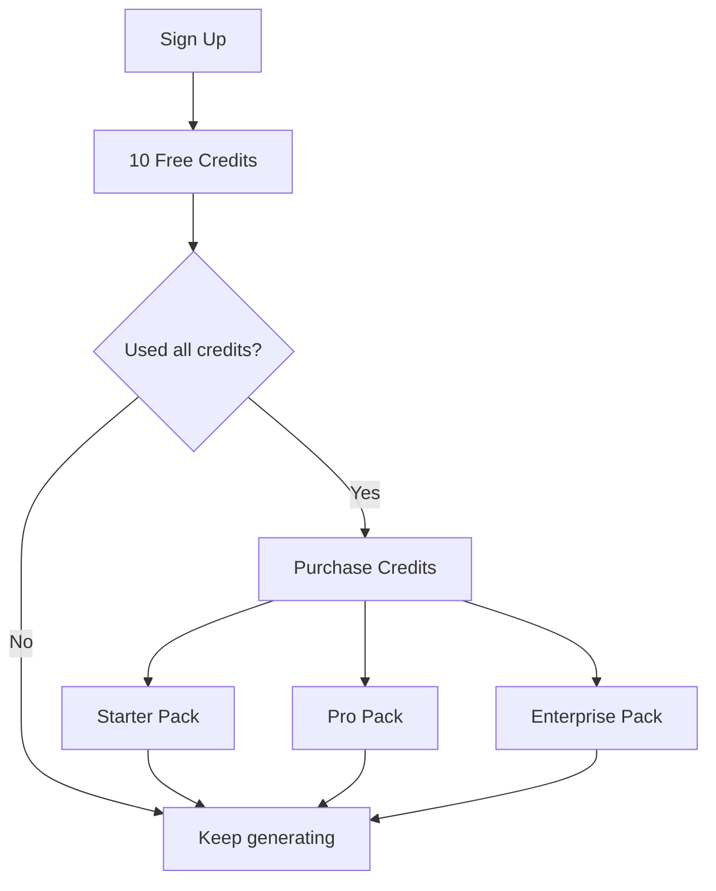
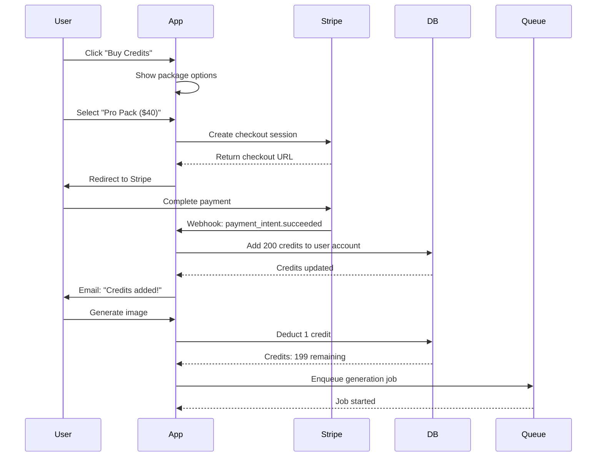
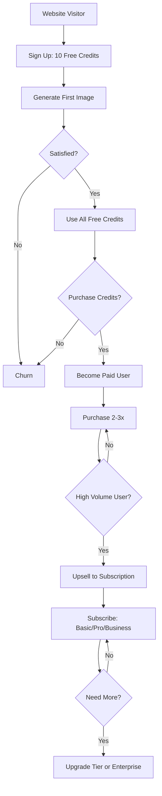

# Design Log #008: Business Model & Pricing Strategy

**Status**: Draft
**Created**: 2026-01-11
**Author**: Claude
**Related**: Design Log #001 (Architecture), Design Log #002 (Authentication), Design Log #003 (Data Model)

---

## Background

The visualizer-client platform is an AI-powered product visualization tool that generates photorealistic lifestyle images of furniture and home decor products using the Gemini API. The platform enables brands to:
- Generate unlimited variations of product scenes
- Create bulk visualizations for entire product catalogs
- Integrate with e-commerce platforms (Shopify, WooCommerce)
- Reuse successful compositions as inspiration

The current MVP operates on an invitation-only basis with no monetization. To build a sustainable business, we need a clear pricing strategy that:
1. Covers infrastructure costs (Gemini API, storage, compute)
2. Provides a clear path from free trial to paid conversion
3. Scales with customer value (more products = more revenue)
4. Balances accessibility (low entry barrier) with profitability

## Problem

We need to design a multi-phase business model that:

1. **Supports MVP validation** (Phase 1: Invitation-only)
   - No payment infrastructure yet
   - Limited free tier to control costs
   - Collect feedback on willingness to pay

2. **Enables self-service growth** (Phase 2: Credit-based)
   - Users can sign up and pay without sales calls
   - Transparent, predictable pricing
   - Low friction for small purchases
   - Scalable revenue as usage grows

3. **Captures enterprise value** (Phase 3: Store sync subscriptions)
   - Recurring revenue for platform integration features
   - Tiered based on product catalog size
   - Justifies higher price with automation value

4. **Optimizes unit economics**
   - Cost per generation (Gemini API + storage + compute)
   - Target gross margin (60-70%)
   - Customer acquisition cost (CAC) recovery time (<6 months)
   - Lifetime value (LTV) optimization

5. **Prevents abuse**
   - Rate limiting
   - Fair use policies
   - Fraud detection

## Questions and Answers

### Q1: What is the cost per image generation?

**A**: Cost breakdown (as of 2026-01):

| Cost Component | Amount | Notes |
|----------------|--------|-------|
| S3 storage | $0.023/GB/month | Average 3MB per image = $0.00007/image/month |
| CloudFront CDN | $0.085/GB transfer | Average 3MB = $0.00025 per view |
| Database writes | $0.0001 per write | Negligible |
| Worker compute | $0.005 per generation | BullMQ worker processing |
| **Total per generation** | **$0.045 - $0.065** | Depends on Gemini model |

**Assumptions**:
- Using Gemini imagen-3.0-generate-001 (standard quality)
- Images stored for 12 months on average
- Each image viewed 10 times on average (CDN cost: $0.0025)
- **Total first-year cost per image: ~$0.05**

**Target pricing**: Sell at 4-5x cost = $0.20-$0.25 per generation for healthy margins.

### Q2: Should credits expire?

**A**: No expiration for purchased credits, but enforce expiration on free/bonus credits.

**Rationale**:
- ✅ Non-expiring credits increase perceived value and reduce purchase friction
- ✅ Industry standard (AWS credits, Anthropic credits don't expire)
- ✅ Users prefer "bank" model over "subscription waste"
- ✅ Reduces refund requests and customer service burden
- ❌ May lead to unused credit accumulation (opportunity cost)

**Implementation**:
- **Purchased credits**: Never expire
- **Free trial credits**: Expire after 30 days
- **Promotional credits**: Expire per campaign terms
- **Subscription credits**: Expire monthly (don't roll over)

### Q3: What's the optimal free tier size?

**A**: 10 free credits on signup (non-expiring for first 30 days).

**Rationale**:
- 10 generations = enough to test 2-3 products with variations
- Cost to business: 10 × $0.05 = $0.50 per signup
- Target conversion rate: 15% (industry average for freemium SaaS)
- Acceptable CAC: $3.33 if free tier costs $0.50 and conversion is 15%

**Comparison**:
| Free Tier | Cost per User | Conversion (est.) | Effective CAC |
|-----------|---------------|-------------------|---------------|
| 5 credits | $0.25 | 8% | $3.13 |
| 10 credits | $0.50 | 15% | $3.33 |
| 20 credits | $1.00 | 18% | $5.56 |
| 50 credits | $2.50 | 22% | $11.36 |

**Chosen**: 10 credits balances conversion with cost.

### Q4: How should we price store sync subscriptions?

**A**: Flat monthly fee based on product catalog size, includes base credits.

**Rationale**:
- E-commerce brands value automation and scale
- Product count is a clear proxy for business size and willingness to pay
- Subscription creates predictable MRR
- Bundled credits encourage usage and reduce churn

**Pricing tiers** (see Design section for details):
- Basic: Up to 100 products
- Pro: Up to 500 products
- Enterprise: Up to 2,000+ products

### Q5: Should we offer annual discounts?

**A**: Yes, 20% discount for annual prepayment (2 months free).

**Rationale**:
- ✅ Improves cash flow
- ✅ Reduces monthly churn
- ✅ Industry standard (most SaaS offers 15-20% annual discount)
- ✅ Locks in customers for 12 months (higher LTV)

**Implementation**:
- Monthly: $X/month, cancel anytime
- Annual: $X × 10/year (17% discount), billed annually

### Q6: How do we prevent abuse?

**A**: Multi-layer rate limiting and fair use policies.

**Rate limits**:
| Tier | Generations/hour | Generations/day | Concurrent jobs |
|------|-----------------|----------------|-----------------|
| Free | 5 | 20 | 1 |
| Starter | 20 | 100 | 2 |
| Pro | 50 | 500 | 5 |
| Enterprise | 100 | 2,000 | 10 |

**Fair use policy**:
- No reselling of generated images
- No automated scraping or bulk generation for resale
- No sharing of account credentials
- Storage limits: 10GB (Free), 50GB (Starter), 500GB (Pro), 5TB (Enterprise)

**Abuse detection**:
- Flag accounts with >90% failed generations (possible attack)
- Flag accounts sharing IP addresses (credential sharing)
- Manual review for accounts exceeding 1,000 generations/day

### Q7: What pricing model is best for our market?

**A**: Hybrid model: Credits (consumption) + Subscription (platform features).

**Comparison**:

| Model | Pros | Cons | Best For |
|-------|------|------|----------|
| Pure credits | Simple, no commitment | No recurring revenue | Small/sporadic users |
| Pure subscription | Predictable MRR | High commitment barrier | Enterprise only |
| Hybrid (chosen) | MRR + usage revenue, flexible | More complex | Multi-segment market |
| Pay-per-image | Zero commitment | No customer lock-in | Commodity pricing |

**Why hybrid wins**:
- Free tier → Credits: Low commitment, self-service
- Credits → Subscription: Value proven, ready for platform features
- Subscription: Recurring revenue + higher engagement
- Both: Capture hobbyists (credits) and professionals (subscriptions)

### Q8: How should we price for agencies/resellers?

**A**: Phase 4 feature - Agency tier with white-label and multi-client support.

**Proposal**:
- Agency plan: $499/month
  - Manage up to 10 client accounts
  - 500 base credits/month
  - White-label reports (remove branding)
  - Priority support
  - API access for automation

**Revenue model**:
- Agencies pay flat fee for platform access
- Each client gets separate billing (agency can charge markup)
- Volume discounts for >1,000 credits/month (10% off)

---

## Design

### Phase 1: MVP - Invitation Only (Months 1-3)

**Features**:
- Admin manually invites users to clients
- Each user gets 50 free generations
- No payment infrastructure
- Track usage to understand willingness to pay

**Goals**:
- Validate product-market fit
- Collect pricing feedback surveys
- Measure generation frequency and patterns
- Identify power users (early enterprise prospects)

**Metrics to track**:
- Generations per user per month
- Feature usage (bulk generate, inspiration, store sync beta)
- Completion rate (% of started generations that complete)
- Net Promoter Score (NPS)

**Exit criteria**:
- 20+ active users
- 70%+ users say they'd pay
- Identify pricing range from surveys

---

### Phase 2: Credit-Based Self-Service (Months 4-9)

#### Credit System Design

**Credit Definition**:
- **1 credit = 1 image generation**
- Credits are account-level (not per-client, if user belongs to multiple clients)
- Credits deducted when generation starts (not on completion)
- Failed generations refund credits automatically

#### Pricing Tiers



| Package | Credits | Price | Price per Credit | Discount | Target Segment |
|---------|---------|-------|------------------|----------|----------------|
| Free Trial | 10 | $0 | $0 | - | New signups |
| Starter | 50 | $12 | $0.24 | 0% | Hobbyists, small brands |
| Pro | 200 | $40 | $0.20 | 17% | Growing brands |
| Business | 1,000 | $150 | $0.15 | 38% | Agencies, large catalogs |
| Enterprise | Custom | Custom | $0.10-0.12 | 50%+ | Fortune 500, high volume |

**Pricing rationale**:
- Starter: Entry point, minimal commitment ($12 is impulse buy range)
- Pro: Best value per credit (most popular tier expected)
- Business: Volume discount, targets agencies
- Enterprise: Custom quotes for >1,000 credits/month

**Revenue projections**:

| Scenario | Users | Avg Credits/User/Mo | Avg Revenue/User/Mo | MRR | ARR |
|----------|-------|---------------------|---------------------|-----|-----|
| Conservative | 100 | 50 | $12 | $1,200 | $14,400 |
| Moderate | 500 | 100 | $20 | $10,000 | $120,000 |
| Optimistic | 1,000 | 150 | $30 | $30,000 | $360,000 |

**Assumptions**:
- 20% of signups convert to paid (industry avg: 15-25%)
- Average customer buys credits 2x per month
- 30% buy Starter, 50% buy Pro, 15% buy Business, 5% Enterprise

#### Cost Analysis

| Revenue Scenario | Monthly Revenue | COGS (30%) | Gross Profit | Gross Margin |
|-----------------|----------------|------------|--------------|--------------|
| Conservative | $1,200 | $360 | $840 | 70% |
| Moderate | $10,000 | $3,000 | $7,000 | 70% |
| Optimistic | $30,000 | $9,000 | $21,000 | 70% |

**COGS breakdown** (30% of revenue):
- Gemini API: 60% of COGS
- AWS (S3, CloudFront, RDS): 25% of COGS
- Worker compute: 10% of COGS
- Other (monitoring, auth): 5% of COGS

**Operating expenses** (not included in gross margin):
- Engineering: $15,000/month (2 engineers)
- Marketing: $5,000/month
- Infrastructure overhead: $2,000/month
- Total OpEx: $22,000/month

**Break-even**: ~$31,500 MRR (at 70% gross margin → $22,050 gross profit)

#### Payment Flow



#### UI/UX for Pricing

**Transparent pricing**:
- Show credit cost before generating (e.g., "This will use 1 credit. You have 49 remaining.")
- Pre-generation confirmation modal for low balance (<10 credits)
- "Low balance" banner when <5 credits remaining
- One-click "Buy More Credits" button in header

**Credit display**:
```text
┌─────────────────────────────┐
│ Credits: 47                 │
│ ○○○○○○○○○○ 47%             │
│ [Buy More]                  │
└─────────────────────────────┘
```

**Package selection UI**:
```text
┌─────────────────────────────────────────────────────────┐
│                    Choose Your Plan                     │
├─────────────┬─────────────┬─────────────┬──────────────┤
│   Starter   │     Pro     │  Business   │  Enterprise  │
│             │  BEST VALUE │             │              │
├─────────────┼─────────────┼─────────────┼──────────────┤
│  50 credits │ 200 credits │1,000 credits│Custom pricing│
│             │             │             │              │
│    $12      │     $40     │    $150     │  Contact us  │
│  $0.24 each │  $0.20 each │  $0.15 each │  $0.10 each  │
│             │  Save 17%   │  Save 38%   │  Save 50%+   │
├─────────────┼─────────────┼─────────────┼──────────────┤
│ [Purchase]  │ [Purchase]  │ [Purchase]  │ [Contact]    │
└─────────────┴─────────────┴─────────────┴──────────────┘
```

---

### Phase 3: Store Sync Subscriptions (Months 10-18)

#### Subscription Model Design

**Value proposition**:
- Automated product catalog sync (Shopify, WooCommerce, BigCommerce)
- Bulk generation workflows (generate for entire catalog)
- API access for custom integrations
- Priority generation queue (2x faster)
- Advanced analytics (which products generate most interest)

**Subscription tiers**:

| Tier | Products | Price/Month | Price/Year (save 17%) | Included Credits/Mo | Overage | Target Segment |
|------|----------|-------------|----------------------|---------------------|---------|----------------|
| Basic | Up to 100 | $49 | $490 | 100 | $0.20/credit | Small e-commerce stores |
| Pro | Up to 500 | $149 | $1,490 | 500 | $0.18/credit | Growing online brands |
| Business | Up to 2,000 | $399 | $3,990 | 2,000 | $0.15/credit | Large retailers |
| Enterprise | Unlimited | Custom | Custom | Custom | Custom | Fortune 500 |

**Why product count pricing?**:
- ✅ Aligns with customer value (more products = more revenue for them)
- ✅ Easy to understand and predict costs
- ✅ Natural upsell path as catalog grows
- ✅ Competitor benchmark (Shopify, Lightspeed price by products)

**Included credits**:
- Enough for 1 generation per product per month
- Example: Pro tier (500 products) gets 500 credits/month
- Encourages monthly refreshes of product images

**Subscription + credits hybrid**:
- Subscription includes base credits (expire monthly)
- Can purchase additional credit packs (non-expiring) if needed
- Example: Pro customer generates 700 images/month
  - Uses 500 included credits
  - Purchases 200-credit pack for $40
  - Total cost: $149 + $40 = $189/month

#### Revenue Model Comparison

**Pure Credits (Phase 2)**:
| Monthly Generations | Revenue | Notes |
|-------------------|---------|-------|
| 50 | $12 | Sporadic user |
| 200 | $40 | Active user |
| 1,000 | $150 | Power user |

**Subscription (Phase 3)**:
| Monthly Generations | Revenue | Notes |
|-------------------|---------|-------|
| 100 | $49 | Small store, predictable MRR |
| 500 | $149 | Medium store, 3.7x LTV improvement |
| 2,000 | $399 | Large store, lock-in for 12 months |

**LTV Improvement**:
- Credits model: 3-month average tenure = $120 LTV
- Subscription model: 12-month average tenure = $1,788 LTV (Pro tier)
- **14.9x LTV improvement** with subscriptions

#### Pricing Strategy Analysis

**Cost structure**:
| Tier | Products | Included Credits | COGS (30%) | Gross Profit | Gross Margin |
|------|----------|-----------------|------------|--------------|--------------|
| Basic | 100 | 100 | $15 | $34 | 69% |
| Pro | 500 | 500 | $75 | $74 | 50% |
| Business | 2,000 | 2,000 | $300 | $99 | 25% |

**Why lower margin at higher tiers?**:
- Business tier designed for volume (land and expand)
- Upsell to Enterprise with custom pricing for >50% margin
- Focus on LTV, not initial margin

**Churn mitigation**:
- Annual contracts (17% discount)
- Unused credits don't roll over (encourages usage)
- Integration lock-in (hard to switch once catalog is synced)
- Success metrics dashboard (show ROI: images generated, estimated sales lift)

#### Subscription Features Matrix

| Feature | Basic | Pro | Business | Enterprise |
|---------|-------|-----|----------|------------|
| Products | 100 | 500 | 2,000 | Unlimited |
| Included credits/mo | 100 | 500 | 2,000 | Custom |
| Store sync | ✓ | ✓ | ✓ | ✓ |
| Bulk generation | ✓ | ✓ | ✓ | ✓ |
| API access | - | ✓ | ✓ | ✓ |
| Priority queue | - | ✓ | ✓ | ✓ |
| Analytics dashboard | Basic | Advanced | Advanced | Custom |
| Custom templates | 3 | 10 | Unlimited | Unlimited |
| Team seats | 1 | 3 | 10 | Unlimited |
| Support | Email | Email + Chat | Phone | Dedicated CSM |
| SLA uptime | 99% | 99.5% | 99.9% | 99.99% |
| Webhooks | - | 5 | 25 | Unlimited |
| White-label | - | - | ✓ | ✓ |

#### Revenue Projections (Phase 3)

**Assumptions**:
- 30% of credit users upgrade to subscriptions (industry avg)
- 50% choose annual plans (higher LTV)
- 60% Basic, 30% Pro, 10% Business

| Scenario | Subscribers | Avg Plan Value | MRR | ARR | Churn (monthly) |
|----------|------------|----------------|-----|-----|-----------------|
| Conservative | 50 | $75 | $3,750 | $45,000 | 8% |
| Moderate | 200 | $90 | $18,000 | $216,000 | 5% |
| Optimistic | 500 | $110 | $55,000 | $660,000 | 3% |

**Combined revenue (Credits + Subscriptions)**:
| Scenario | Credit Revenue | Subscription Revenue | Total MRR | Total ARR |
|----------|---------------|---------------------|-----------|-----------|
| Conservative | $1,200 | $3,750 | $4,950 | $59,400 |
| Moderate | $10,000 | $18,000 | $28,000 | $336,000 |
| Optimistic | $30,000 | $55,000 | $85,000 | $1,020,000 |

**Break-even with subscriptions**: ~$32,000 MRR (achievable in Moderate scenario)

---

### Phase 4: Enterprise & Advanced Features (Months 18+)

#### Enterprise Pricing

**Custom pricing for**:
- >2,000 products
- >10,000 generations/month
- Custom SLAs (99.99% uptime)
- Dedicated infrastructure (isolated workers)
- Custom training (fine-tuned models on brand images)

**Pricing structure**:
- Base platform fee: $2,000/month
- Per-credit pricing: $0.10 (bulk discount)
- Minimum commit: $5,000/month (50,000 credits)

**Enterprise customers** (target):
- Wayfair, Overstock, Ikea (large catalogs)
- Furniture manufacturers (Williams Sonoma, Crate & Barrel)
- Interior design platforms (Houzz, Pinterest Shopping)

**Revenue potential**:
- 5 enterprise customers @ $5,000/month = $25,000 MRR
- 10 enterprise customers @ $8,000/month = $80,000 MRR

#### Agency/Reseller Model

**Agency tier**: $499/month
- Manage up to 10 client accounts
- 500 base credits/month
- White-label exports (no branding)
- API access for automation
- Priority support
- Revenue share: Agency can resell at markup

**Revenue model**:
- Direct revenue: $499/month per agency
- Indirect revenue: Agency clients purchase credits (we keep 70%, agency keeps 30%)
- Target: 20 agencies @ $499 = $9,980 MRR

#### Advanced Features (Upsells)

| Feature | Price | Description |
|---------|-------|-------------|
| AI Copywriting | +$20/month | Auto-generate product descriptions from images |
| Custom brand models | +$500/month | Fine-tune on brand imagery |
| Video generation | +$100/month | Generate 3-5 second product videos (future) |
| Advanced analytics | +$50/month | Conversion tracking, A/B testing |
| API rate limit increase | +$30/month | 10x API rate limit |

---

### Conversion Funnel Strategy



**Conversion targets**:
| Stage | Target | Industry Benchmark |
|-------|--------|-------------------|
| Visitor → Signup | 25% | 20-30% |
| Signup → First generation | 80% | 70-85% |
| First generation → Use all free credits | 60% | 50-70% |
| Free → First purchase | 15% | 10-20% |
| Paid credits → Subscription | 30% | 25-40% |
| Basic → Pro upgrade | 20% | 15-25% |

**Activation metrics**:
- Time to first generation: <5 minutes
- Generations in first session: 3+ (indicates engagement)
- Return rate within 7 days: >40%

---

### Customer Acquisition Strategy

#### CAC (Customer Acquisition Cost) Budget

**Free tier cost**: $0.50 per signup (10 credits × $0.05)

**Marketing channels**:
| Channel | CAC Target | Conversion | Notes |
|---------|-----------|------------|-------|
| Organic (SEO) | $5 | 20% | Blog content, product-led growth |
| Paid ads (Google) | $20 | 15% | "AI product photography" keywords |
| Paid ads (Facebook) | $25 | 12% | Retargeting e-commerce store owners |
| Partnerships | $10 | 25% | Shopify App Store, integration partners |
| Referrals | $3 | 30% | Existing customer referrals |

**Blended CAC target**: $15 (across all channels)

**Payback period**:
| Customer Type | Avg Spend/Mo | Gross Profit/Mo | CAC | Payback Period |
|--------------|--------------|----------------|-----|----------------|
| Credit user | $20 | $14 | $15 | 1.1 months |
| Subscriber (Basic) | $49 | $34 | $15 | 0.4 months |
| Subscriber (Pro) | $149 | $74 | $15 | 0.2 months |

**LTV:CAC ratio**:
- Target: 3:1 (healthy SaaS business)
- Credit user: $120 LTV / $15 CAC = 8:1 ✅
- Subscriber: $1,788 LTV / $15 CAC = 119:1 ✅

**Marketing budget**:
| MRR Goal | Marketing Budget (30% of MRR) | Expected New Customers | CAC |
|----------|------------------------------|----------------------|-----|
| $10,000 | $3,000 | 200 | $15 |
| $30,000 | $9,000 | 600 | $15 |
| $50,000 | $15,000 | 1,000 | $15 |

---

### Retention & Expansion Strategy

#### Retention Tactics

**For credit users**:
- Email: "You have 5 credits expiring soon" (for trial credits)
- Email: "See what others created this week" (social proof)
- Discount: "Get 10% off your next purchase" (after first purchase)

**For subscribers**:
- Monthly report: "You generated X images, saved Y hours"
- Unused credits alert: "You have 200 unused credits this month"
- Feature announcements: "New: AI copywriting available"

**Churn prevention**:
- Exit survey: "Why are you canceling?" (offer downgrade vs. cancel)
- Winback campaign: "We miss you - here's 20 free credits"
- Annual renewal discount: "Renew now and save 20%"

#### Expansion Revenue

**Upsell triggers**:
| Trigger | Action | Upsell |
|---------|--------|--------|
| User runs out of credits 2x/month | Email: "Upgrade to Pro and save 17%" | Pro credit pack |
| User generates >100 images/month | Email: "Consider a subscription for better value" | Basic subscription |
| Subscriber hits product limit | Email: "Upgrade to Pro for 500 products" | Tier upgrade |
| Subscriber uses >80% credits | Auto-email: "Buy credit pack with 10% discount" | Credit pack add-on |

**Net Revenue Retention (NRR) target**: 120%
- 80% gross retention (20% churn)
- 40% expansion (upgrades, add-ons)
- 120% NRR = healthy growth without new customers

---

### Financial Models Summary

#### Model 1: Pure Credit-Based (No Subscriptions)

**Pros**:
- Simple, easy to understand
- No commitment barrier
- Appeals to sporadic users

**Cons**:
- No recurring revenue
- Higher churn
- Lower LTV

**Revenue projection** (1,000 users):
- MRR: $30,000
- ARR: $360,000
- LTV: $120
- Churn: 40% monthly

#### Model 2: Pure Subscription (No Pay-As-You-Go)

**Pros**:
- Predictable MRR
- Higher LTV
- Lower churn

**Cons**:
- High barrier to entry
- Excludes sporadic users
- Smaller addressable market

**Revenue projection** (1,000 users):
- MRR: $90,000
- ARR: $1,080,000
- LTV: $1,800
- Churn: 5% monthly

#### Model 3: Hybrid (Credits + Subscriptions) ✅ CHOSEN

**Pros**:
- Low barrier (free trial)
- Multiple revenue streams
- Captures all segments
- Natural upsell path

**Cons**:
- More complex to explain
- Requires two pricing pages
- Higher support burden

**Revenue projection** (1,000 users):
- MRR: $55,000 (60% credits, 40% subscriptions)
- ARR: $660,000
- LTV: $900 (blended)
- Churn: 15% monthly (blended)

**Why hybrid wins**:
- Best of both worlds
- Aligns with customer journey (explore → commit)
- Maximizes addressable market

---

### Quota and Limits

#### Rate Limiting

**Purpose**: Prevent abuse, ensure fair resource allocation

| Tier | Gen/Hour | Gen/Day | Concurrent | Storage | API Calls/Min |
|------|----------|---------|------------|---------|---------------|
| Free | 5 | 20 | 1 | 1 GB | 10 |
| Starter | 20 | 100 | 2 | 10 GB | 30 |
| Pro | 50 | 500 | 5 | 50 GB | 100 |
| Business | 100 | 2,000 | 10 | 500 GB | 300 |
| Enterprise | Custom | Custom | Custom | Custom | Custom |

**Implementation**:
- Redis-based rate limiting (sliding window)
- Return 429 status code with retry-after header
- UI shows "Rate limit exceeded, retry in X minutes"

#### Fair Use Policy

**Acceptable use**:
- Generate images for own products or client products
- Use for commercial purposes (allowed)
- Download and use generated images indefinitely

**Prohibited use**:
- Reselling platform access (must use Agency tier)
- Automated scraping or bulk generation for resale
- Sharing account credentials (each user needs own account)
- Generating offensive or illegal content

**Enforcement**:
- Automated: Block generations exceeding limits
- Manual review: Flag accounts with suspicious patterns
- Warnings: 2 warnings, then account suspension
- Appeals: Support ticket for false positives

---

## Implementation Plan

### Phase 1: MVP - Invitation Only (Months 1-3)

**Goals**: Validate product-market fit, collect pricing data

**Tasks**:
1. Implement usage tracking (generation count per user)
2. Admin dashboard for invitation management
3. Email survey: "What would you pay for this?"
4. Track feature usage (bulk, inspiration, etc.)
5. NPS survey after 10 generations

**Success metrics**:
- 20+ active users
- 70%+ would pay
- Pricing range identified ($10-$50/month)

### Phase 2: Credit-Based System (Months 4-9)

**Goals**: Launch self-service, achieve $10K MRR

**Milestone 1: Stripe Integration (Month 4)**
1. Set up Stripe account
2. Create checkout session API
3. Implement webhook handler (payment_intent.succeeded)
4. Test payment flow end-to-end

**Milestone 2: Credit System (Month 4)**
1. Add `credits` table to database
   ```sql
   CREATE TABLE user_credits (
     user_id UUID PRIMARY KEY,
     balance INTEGER NOT NULL DEFAULT 0,
     free_credits INTEGER NOT NULL DEFAULT 0,
     purchased_credits INTEGER NOT NULL DEFAULT 0,
     created_at TIMESTAMPTZ NOT NULL DEFAULT NOW(),
     updated_at TIMESTAMPTZ NOT NULL DEFAULT NOW()
   );

   CREATE TABLE credit_transactions (
     id UUID PRIMARY KEY DEFAULT gen_random_uuid(),
     user_id UUID NOT NULL REFERENCES users(id),
     amount INTEGER NOT NULL, -- negative for deduction
     type TEXT NOT NULL, -- 'purchase', 'generation', 'refund', 'bonus'
     description TEXT,
     metadata JSONB,
     created_at TIMESTAMPTZ NOT NULL DEFAULT NOW()
   );
   ```

2. Implement credit deduction logic (before generation)
3. Implement credit refund logic (on failed generation)
4. Add credit balance API endpoint

**Milestone 3: Pricing Packages (Month 5)**
1. Create Stripe products and prices
   - Starter: $12 for 50 credits
   - Pro: $40 for 200 credits
   - Business: $150 for 1,000 credits
2. Build pricing page UI
3. Implement package selection flow
4. Add "Buy Credits" button in header

**Milestone 4: Free Trial (Month 5)**
1. Auto-grant 10 free credits on signup
2. Add `free_credits_granted_at` to users table
3. Expire free credits after 30 days (cron job)
4. Email notification: "Free credits expiring soon"

**Milestone 5: Credit Transparency (Month 6)**
1. Show credit cost before generation ("This will use 1 credit")
2. Low balance warning (<10 credits)
3. Pre-generation confirmation modal (<5 credits)
4. Post-purchase success page ("You now have X credits")

**Milestone 6: Usage Analytics (Month 6)**
1. Track credit purchases (amount, frequency)
2. Cohort analysis (signup → first purchase time)
3. Identify power users (>500 credits/month)
4. A/B test pricing (Pro: $40 vs. $45)

**Success metrics**:
- 100+ signups
- 15% conversion to paid
- $10,000 MRR
- <$15 CAC

### Phase 3: Subscription Model (Months 10-18)

**Goals**: Launch subscriptions, achieve $50K MRR

**Milestone 1: Subscription Infrastructure (Month 10)**
1. Create Stripe subscription products
   - Basic: $49/month (100 products, 100 credits)
   - Pro: $149/month (500 products, 500 credits)
   - Business: $399/month (2,000 products, 2,000 credits)
2. Add `subscriptions` table
   ```sql
   CREATE TABLE subscriptions (
     id UUID PRIMARY KEY DEFAULT gen_random_uuid(),
     user_id UUID NOT NULL REFERENCES users(id),
     client_id UUID NOT NULL REFERENCES clients(id),
     stripe_subscription_id TEXT NOT NULL,
     status TEXT NOT NULL, -- 'active', 'canceled', 'past_due'
     tier TEXT NOT NULL, -- 'basic', 'pro', 'business'
     product_limit INTEGER NOT NULL,
     credits_per_month INTEGER NOT NULL,
     current_period_start TIMESTAMPTZ NOT NULL,
     current_period_end TIMESTAMPTZ NOT NULL,
     canceled_at TIMESTAMPTZ,
     created_at TIMESTAMPTZ NOT NULL DEFAULT NOW()
   );
   ```

3. Implement subscription webhooks
   - `customer.subscription.created`
   - `customer.subscription.updated`
   - `customer.subscription.deleted`
   - `invoice.payment_succeeded` → Grant monthly credits

**Milestone 2: Store Sync (Months 11-13)**
1. Build Shopify app integration
2. Product catalog sync (import products from Shopify)
3. Bulk generation workflow (generate for all products)
4. Auto-sync on product updates (webhook)

**Milestone 3: Subscription Features (Month 14)**
1. Priority queue (subscribers jump to front)
2. Advanced analytics dashboard
3. API access (generate via API)
4. Team seats (invite users to client)

**Milestone 4: Upsell Campaigns (Month 15)**
1. Identify credit users with >100 credits/month
2. Email: "Save 30% with a subscription"
3. In-app banner: "Upgrade to Pro for better value"
4. Exit intent modal: "Wait! Switch to annual and save 17%"

**Success metrics**:
- 200+ subscribers
- 30% of credit users convert to subscriptions
- $50,000 MRR
- <5% monthly churn

### Phase 4: Enterprise & Agencies (Months 18+)

**Goals**: Land 5-10 enterprise customers, $100K+ MRR

**Milestone 1: Enterprise Sales (Month 18)**
1. Create enterprise landing page
2. Build custom quote request form
3. Hire first sales rep (or founder-led sales)
4. Outreach to target accounts (Wayfair, Crate & Barrel)

**Milestone 2: Enterprise Features (Month 19-20)**
1. Dedicated infrastructure (isolated workers)
2. Custom SLAs (99.99% uptime)
3. SSO integration (SAML)
4. Custom contracts and invoicing

**Milestone 3: Agency Program (Month 21)**
1. Build multi-client management UI
2. White-label export (remove branding)
3. Revenue share tracking
4. Agency onboarding playbook

**Success metrics**:
- 5+ enterprise customers @ $5K+ MRR each
- 10+ agencies @ $500/month
- $100,000+ MRR
- 120%+ NRR

---

## Examples

### ✅ Good: Transparent credit deduction

```typescript
// apps/visualizer-client/app/api/generations/create/route.ts
export async function POST(req: Request) {
  const { productId, settings } = await req.json();
  const userId = await getCurrentUserId();

  // Check credit balance BEFORE creating generation
  const credits = await db.getUserCredits(userId);

  if (credits.balance < 1) {
    return Response.json({
      error: 'Insufficient credits',
      balance: credits.balance,
      purchaseUrl: '/pricing',
    }, { status: 402 }); // 402 Payment Required
  }

  // Deduct credit immediately (before generation starts)
  await db.deductCredits(userId, 1, {
    type: 'generation',
    description: `Generated image for product ${productId}`,
    metadata: { productId, settings },
  });

  // Create generation
  const asset = await db.generatedAssets.create({
    clientId: req.clientId,
    productId,
    settings,
    status: 'pending',
  });

  // Enqueue for processing
  const jobId = await queue.enqueue({
    assetId: asset.id,
    productId,
    settings,
  });

  return Response.json({ assetId: asset.id, creditsRemaining: credits.balance - 1 });
}
```

### ✅ Good: Refund on failure

```typescript
// packages/visualizer-worker/src/generation-worker.ts
async function processGeneration(job: Job) {
  const { assetId, productId, settings } = job.data;

  try {
    const imageUrl = await geminiClient.generateImage(settings);
    const image = await uploadToS3(imageUrl);

    await db.generatedAssets.update(assetId, {
      status: 'completed',
      imageId: image.id,
      completedAt: new Date(),
    });

  } catch (error) {
    // IMPORTANT: Refund credit on failure
    const asset = await db.generatedAssets.findById(assetId);
    await db.refundCredits(asset.userId, 1, {
      type: 'refund',
      description: `Generation failed for product ${productId}`,
      metadata: { assetId, error: error.message },
    });

    await db.generatedAssets.update(assetId, {
      status: 'error',
      errorMessage: error.message,
    });
  }
}
```

### ✅ Good: Monthly credit grant for subscribers

```typescript
// apps/visualizer-client/app/api/webhooks/stripe/route.ts
import Stripe from 'stripe';

export async function POST(req: Request) {
  const stripe = new Stripe(process.env.STRIPE_SECRET_KEY);
  const sig = req.headers.get('stripe-signature');
  const event = stripe.webhooks.constructEvent(await req.text(), sig, process.env.STRIPE_WEBHOOK_SECRET);

  if (event.type === 'invoice.payment_succeeded') {
    const invoice = event.data.object as Stripe.Invoice;
    const subscriptionId = invoice.subscription as string;

    const subscription = await db.subscriptions.findByStripeId(subscriptionId);

    // Grant monthly credits
    await db.addCredits(subscription.userId, subscription.creditsPerMonth, {
      type: 'subscription',
      description: `Monthly credits for ${subscription.tier} plan`,
      metadata: {
        subscriptionId: subscription.id,
        period: {
          start: subscription.currentPeriodStart,
          end: subscription.currentPeriodEnd,
        },
      },
      expiresAt: subscription.currentPeriodEnd, // Credits expire at end of period
    });

    // Send confirmation email
    await sendEmail({
      to: subscription.user.email,
      subject: `Your ${subscription.creditsPerMonth} credits are ready!`,
      template: 'monthly-credits-granted',
    });
  }

  return Response.json({ received: true });
}
```

### ✅ Good: Upsell prompt for high usage

```typescript
// apps/visualizer-client/app/dashboard/page.tsx
export default async function Dashboard() {
  const userId = await getCurrentUserId();
  const credits = await db.getUserCredits(userId);
  const usage = await db.getMonthlyUsage(userId);

  // Upsell logic
  const shouldUpsell =
    !credits.hasActiveSubscription &&
    usage.generationsThisMonth > 100;

  return (
    <div>
      {shouldUpsell && (
        <Banner variant="info">
          <p>You've generated {usage.generationsThisMonth} images this month!</p>
          <p>Switch to a subscription and save 30%.
            <a href="/pricing">View plans →</a>
          </p>
        </Banner>
      )}

      {/* Rest of dashboard */}
    </div>
  );
}
```

### ❌ Bad: Hidden costs

```typescript
// ❌ Don't hide credit costs from users
async function generateImage(productId: string) {
  // Silently deducts credits without warning
  await deductCredits(userId, 1);
  return await api.generate(productId);
}

// ✅ Always show cost before action
async function generateImage(productId: string) {
  const credits = await getCredits(userId);

  if (credits.balance < 1) {
    throw new Error('Insufficient credits. Buy more at /pricing');
  }

  // Show confirmation modal in UI:
  // "This will use 1 credit. You have 47 remaining. Continue?"

  await deductCredits(userId, 1);
  return await api.generate(productId);
}
```

### ❌ Bad: Unclear pricing

```typescript
// ❌ Don't show pricing without context
<PricingCard>
  <h3>Pro</h3>
  <p>$40</p>
  <button>Buy Now</button>
</PricingCard>

// ✅ Show value and savings
<PricingCard>
  <h3>Pro</h3>
  <p className="price">$40</p>
  <p className="credits">200 credits</p>
  <p className="unit-price">$0.20 per credit</p>
  <p className="savings">Save 17% vs. Starter</p>
  <ul>
    <li>200 image generations</li>
    <li>Never expire</li>
    <li>Email support</li>
  </ul>
  <button>Buy Now</button>
</PricingCard>
```

---

## Trade-offs

### Credit Expiration

**Chosen**: No expiration for purchased credits

| Option | Pros | Cons |
|--------|------|------|
| Never expire | Higher perceived value, less friction | Unused credits are lost revenue opportunity |
| Expire after 12 months | Encourages usage, industry standard | Refund requests, negative sentiment |
| Expire monthly (subscription) | Maximizes revenue, simple | Only works for subscriptions |

**Decision**: Non-expiring for purchased credits, expiring for subscription credits.

### Free Tier Size

**Chosen**: 10 credits

| Option | Cost/User | Est. Conversion | Effective CAC |
|--------|-----------|----------------|---------------|
| 5 credits | $0.25 | 8% | $3.13 |
| 10 credits ✅ | $0.50 | 15% | $3.33 |
| 20 credits | $1.00 | 18% | $5.56 |

**Decision**: 10 credits balances conversion with cost.

### Pricing Model

**Chosen**: Hybrid (credits + subscriptions)

| Model | MRR (1K users) | LTV | Churn | Addressable Market |
|-------|---------------|-----|-------|--------------------|
| Pure credits | $30K | $120 | 40% | All |
| Pure subscription | $90K | $1,800 | 5% | Enterprise only |
| Hybrid ✅ | $55K | $900 | 15% | All |

**Decision**: Hybrid captures all segments and maximizes LTV.

### Subscription Tier Count

**Chosen**: 3 tiers (Basic, Pro, Business) + Enterprise

| Option | Pros | Cons |
|--------|------|------|
| 2 tiers | Simple, clear choice | Misses mid-market |
| 3 tiers ✅ | Good/Better/Best psychology | Not too complex |
| 5+ tiers | Granular pricing | Decision paralysis |

**Decision**: 3 tiers is industry best practice (SaaS playbook).

### Annual Discount

**Chosen**: 17% (2 months free)

| Discount | Annual Price (Pro) | Impact |
|----------|-------------------|--------|
| 0% | $1,788 | No incentive |
| 17% ✅ | $1,490 | 2 months free, competitive |
| 25% | $1,341 | Strong incentive, lower revenue |

**Decision**: 17% is competitive and improves cash flow.

---

## Open Questions

### Q1: Should we offer refunds?

**Options**:
1. No refunds (credit purchases are final)
2. Refunds within 7 days if <10% of credits used
3. Pro-rated refunds for subscriptions (cancel anytime)

**Recommendation**:
- Credits: No refunds (like gift cards)
- Subscriptions: Pro-rated refunds (industry standard)

### Q2: How do we handle taxes (VAT, sales tax)?

**Options**:
1. Prices are tax-inclusive (absorb cost)
2. Prices are tax-exclusive (add tax at checkout)
3. Use Stripe Tax (auto-calculate based on location)

**Recommendation**: Use Stripe Tax for automatic compliance.

### Q3: Should we offer discounts for non-profits or educators?

**Options**:
1. No discounts (keep pricing simple)
2. 30% discount for verified non-profits
3. Free tier for educators (with limits)

**Recommendation**: Phase 2 feature - 30% discount for verified non-profits.

### Q4: How do we prevent account sharing?

**Options**:
1. Trust-based (no enforcement)
2. IP-based detection (flag multiple IPs)
3. Device fingerprinting
4. Require login for each generation (session timeout)

**Recommendation**:
- Phase 1: Trust-based
- Phase 2: Flag accounts with >5 IPs in 30 days
- Phase 3: Enforce team seats for multi-user access

### Q5: Should we offer a lifetime deal?

**Options**:
1. No lifetime deal (recurring revenue is key)
2. Limited lifetime deal for early adopters ($299 for unlimited)
3. "Founder's deal" (annual plan at 50% off forever)

**Recommendation**:
- No lifetime deal (kills MRR)
- Consider "Founder's plan" (annual at 30% off, locked in forever) for first 100 customers

### Q6: How do we price API access?

**Options**:
1. Free with Pro/Business subscription
2. Separate API tier ($99/month + credit costs)
3. Pay-per-request (1 credit per API call)

**Recommendation**: Free with Pro/Business (encourages upgrades).

---

## Success Criteria

### Phase 1: MVP (Months 1-3)
- [ ] 20+ active users generating images
- [ ] 70%+ of users indicate willingness to pay in surveys
- [ ] Pricing range identified ($10-$50/month acceptable range)
- [ ] Usage patterns analyzed (avg generations/user/month)

### Phase 2: Credit System (Months 4-9)
- [ ] Stripe integration complete and tested
- [ ] 100+ signups with 10 free credits granted automatically
- [ ] 15%+ conversion rate (free → paid)
- [ ] $10,000 MRR achieved
- [ ] <$15 blended CAC across all channels
- [ ] 3 credit packages available (Starter, Pro, Business)
- [ ] Credit balance visible in header
- [ ] Pre-generation credit confirmation modal working
- [ ] Automated refunds on failed generations

### Phase 3: Subscriptions (Months 10-18)
- [ ] 3 subscription tiers launched (Basic, Pro, Business)
- [ ] 200+ subscribers
- [ ] 30%+ of credit users convert to subscriptions
- [ ] $50,000 MRR achieved
- [ ] <5% monthly subscription churn
- [ ] Shopify integration complete (product sync working)
- [ ] Bulk generation workflow functional
- [ ] Monthly credit grants automated (webhook-based)
- [ ] Annual plan discount (17%) available

### Phase 4: Enterprise (Months 18+)
- [ ] 5+ enterprise customers @ $5K+ MRR each
- [ ] 10+ agencies @ $500/month
- [ ] $100,000+ MRR
- [ ] 120%+ NRR (net revenue retention)
- [ ] Custom SLA contracts signed
- [ ] SSO integration available
- [ ] White-label exports for agencies

### Financial Metrics (12 months)
- [ ] Gross margin: 60%+ (target: 70%)
- [ ] LTV:CAC ratio: >3:1
- [ ] Payback period: <6 months
- [ ] Monthly churn: <5% (subscriptions), <20% (credits)
- [ ] NRR: 110%+ (expansion revenue > churn)

### Product Metrics
- [ ] Time to first generation: <5 minutes
- [ ] Activation rate: 80%+ (signup → first generation)
- [ ] Free-to-paid conversion: 15%+
- [ ] Credit-to-subscription conversion: 30%+
- [ ] Annual plan adoption: 50%+ of subscribers

### Operational Metrics
- [ ] Zero payment failures (Stripe integration stable)
- [ ] <1% credit transaction errors
- [ ] 99.9% uptime for payment endpoints
- [ ] <24 hour response time for payment support issues
- [ ] Automated fraud detection (flag suspicious accounts)
