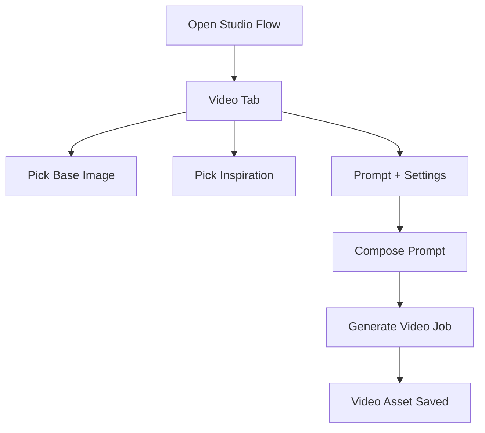

# Design Log #013: Video Generation Panel

**Status**: Implemented
**Created**: 2026-01-18
**Author**: Codex
**Related**: Design Log #005 (Screens & UI Components), Design Log #004 (User Flows), Design Log #003 (Data Model & Terminology)

---

## Background

The epox-platform Studio supports image generation flows in:
- `apps/epox-platform/app/(dashboard)/studio/[id]/page.tsx`
- `apps/epox-platform/app/(dashboard)/studio/collections/[id]/page.tsx`

The draft Pro Studio UI (`draft/epox---pro-studio---beta/App.tsx`) includes a video-generation modal that uses a base image and a motion prompt. The request is to bring that capability into the epox-platform Studio config panel with a dedicated Video tab and reusable video settings.

## Problem

Video generation is not exposed in epox-platform Studio, and there is no panel for selecting base/inspiration images, composing video prompts, or reusing settings across flows or collections.

## Questions and Answers

1. Should video generation be fully wired to backend jobs now, or only UI + settings persistence?
   - Answer: Fully wired to backend jobs.
2. Which model/service should be used for video generation (e.g., Gemini Veo as in draft)?
   - Answer: Veo, but it might also be Kling. Support easy service change via props.
3. Should inspiration images be fed directly to the video model, or only used as prompt guidance?
   - Answer: prompt-only guidance.
4. For collections, should "Generate Video" run for all flows or only for a selected flow?
   - Answer: Run for all flows in the collection.
5. Should video presets be stored in localStorage or persisted per client in the DB?
   - Answer: Persisted in the DB per client (stored as part of flow settings)

## Design

### UI Placement

- Add a **Video** tab inside the Studio config panel.
- The existing image workflow stays in the **Images** tab.
- Video tab appears in both single-flow and collection studio pages.

### Video Inputs (Video Tab)

**Base Image**
- Single flow: use the selected base image from Product Details (existing selection).
- Collection: use `collection.selectedBaseImages[productId]` for each flow (fallback to primary image).
- Show a preview and provide a link to change the base image using existing selectors.

**Inspiration Image**
- Choose one image from the current inspiration images list or select "None".
- Optional note to describe inspiration intent (used in prompt if model only accepts text).

**Prompt**
- Dedicated video prompt (separate from image `userPrompt`).
- Final prompt is composed from prompt + settings + inspiration note.

**Video Settings**
- Freeform text inputs (optional):
  - Video type (e.g., "pan over product", "actor uses product")
  - Camera motion
  - Subject action
  - Scene action / atmosphere
  - Duration (seconds)

### Presets

Users can save the current video settings as a named preset and re-apply later.

- Presets are stored in the DB as part of `FlowGenerationSettings.video` for each flow.
- Applying a preset overwrites the settings fields but does not change the prompt.
- Presets are persisted per client and available across devices.

### State Model (Type Signatures)

`packages/visualizer-types/src/settings.ts`

```ts
export interface VideoPromptSettings {
  videoType?: string;
  cameraMotion?: string;
  subjectAction?: string;
  sceneAction?: string;
  durationSeconds?: number;
}

export interface VideoGenerationSettings {
  prompt?: string;
  inspirationImageUrl?: string;
  inspirationNote?: string;
  settings: VideoPromptSettings;
  presetId?: string | null;
}

export interface FlowGenerationSettings {
  // ...existing fields
  video?: VideoGenerationSettings;
}
```

`apps/epox-platform/app/(dashboard)/studio/*/page.tsx`

```ts
export interface VideoPreset {
  id: string;
  name: string;
  settings: VideoPromptSettings;
}
```

### Prompt Composition

`apps/epox-platform/app/(dashboard)/studio/[id]/page.tsx`

```ts
function buildVideoPrompt(
  basePrompt: string,
  settings: VideoPromptSettings,
  inspirationNote?: string
): string {
  const lines = [basePrompt.trim()];
  if (settings.videoType) lines.push(`Video type: ${settings.videoType}`);
  if (settings.cameraMotion) lines.push(`Camera motion: ${settings.cameraMotion}`);
  if (settings.subjectAction) lines.push(`Subject action: ${settings.subjectAction}`);
  if (settings.sceneAction) lines.push(`Scene action: ${settings.sceneAction}`);
  if (settings.durationSeconds) lines.push(`Duration: ${settings.durationSeconds}s`);
  if (inspirationNote) lines.push(`Style reference: ${inspirationNote}`);
  return lines.filter(Boolean).join('\n');
}
```

### Validation Rules

- **Base image** must resolve to a valid URL.
- **Prompt** must be non-empty.
- **Preset name** must be non-empty before saving.
- Optional fields are allowed to be empty and simply omitted from the composed prompt.

### Flow Diagram



## Implementation Plan

1. **Types**: Add video settings types to `packages/visualizer-types/src/settings.ts` and export from `packages/visualizer-types/src/index.ts`. Update `apps/epox-platform/lib/api-client.ts` payload types.
2. **Settings persistence**: Extend Studio and Collection settings APIs to accept `video` fields and load them on page init. Presets are stored as part of the flow settings in the DB.
3. **Video presets**: Add UI to save/apply presets in both Studio pages. Presets are persisted to the database as part of `FlowGenerationSettings.video.presetId`.
4. **Video generation**:
   - If backend is in scope, add `/api/generate-video` (and collection batch endpoint), add `video_generation` job type, update generation worker, and save `assetType: 'video'`.
   - If backend is out of scope, keep generation button disabled and persist settings only.
5. **Assets UI**: Add a video list + preview in the Video tab (filter by `assetType`).

## Examples

✅ Good (prompt includes settings):
```
Prompt: Clean studio shot of the chair
Video type: slow pan over product
Camera motion: dolly left to right
Subject action: none
Scene action: subtle light sweep
Duration: 6
Style reference: warm minimal studio
```

❌ Bad (missing base image selection):
```
Prompt: cinematic
```

## Trade-offs

- **No multi-image input to Gemini video**: Inspiration is prompt-only unless backend adds multi-image support.
- **DB-persisted presets**: Video settings and presets are stored in the database as part of flow settings, enabling cross-device access and per-client persistence. Trade-off is slightly increased DB payload size per flow.
- **Config panel tab**: Reduces modal usage but slightly increases panel complexity.

## Implementation Results

- **Implemented**: Video tab UI for single studio and collection studio with prompt + settings + presets, persisted to flow/collection settings.
- **Implemented**: Backend video generation job (`/api/generate-video`), job type `video_generation`, worker support, and `assetType: 'video'` storage.
- **Implemented**: Video history/preview in single-flow studio; collection video generation uses selected base image per card.
- **Implemented**: Two-phase video generation with operation IDs and re-queued polling to avoid blocking workers.
- **Tests**: Not run (test runner not available in current environment).

### Deviations From Design

- Added backend video job pipeline and worker support in addition to UI-only settings.
- Collection UI includes a "Generate Videos" action in the video tab; assets are viewed per flow in the single studio.
- Video generation now uses a two-phase polling flow instead of a single blocking worker call.
