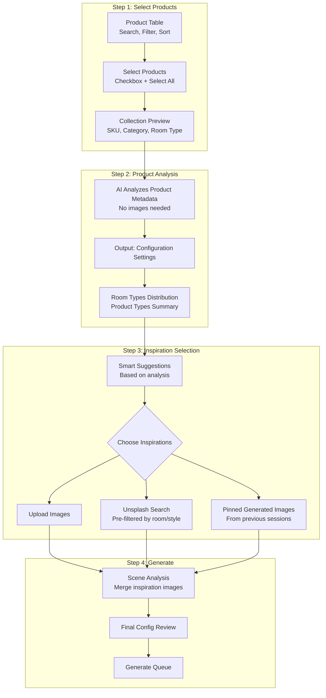
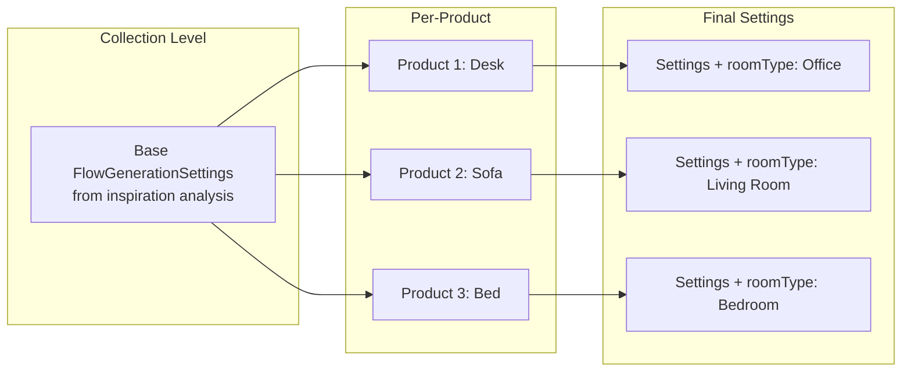

# Visualizer Client - AI Product Collection

## Vision

A streamlined studio for non-technical users to generate beautiful product visualizations at scale. Key principles:

- **Metadata-first analysis** - AI understands your products before you choose inspirations
- **Smart inspiration suggestions** - Show relevant images based on product analysis
- **Bulk-optimized UI** - Table with search/filter/sort for 100s of products

## Refined Workflow



## Step 1: Product Selection Table

Full-featured table UI:| Feature | Description ||---------|-------------|| **Search** | Free-text search across name, SKU, description || **Filter** | By category, room type, tags, date added || **Sort** | By name, SKU, category, date (asc/desc) || **Columns** | Thumbnail, Name, SKU, Category, Room Types, Status || **Selection** | Checkbox per row, "Select All" header, shift-click range || **Pagination** | Handle 1000+ products efficiently |

```javascript
┌─────────────────────────────────────────────────────────────────────┐
│ 🔍 Search products...          [Category ▼] [Room Type ▼] [Clear]  │
├───┬───────┬──────────────────┬──────────┬────────────┬─────────────┤
│ ☐ │ Image │ Name             │ SKU      │ Category   │ Room Types  │
├───┼───────┼──────────────────┼──────────┼────────────┼─────────────┤
│ ☑ │ 🖼️    │ Modern Desk      │ DSK-001  │ Furniture  │ Office      │
│ ☑ │ 🖼️    │ Velvet Sofa      │ SOF-042  │ Furniture  │ Living Room │
│ ☐ │ 🖼️    │ Bathroom Vanity  │ VAN-103  │ Fixtures   │ Bathroom    │
│ ☑ │ 🖼️    │ King Bed Frame   │ BED-077  │ Furniture  │ Bedroom     │
└───┴───────┴──────────────────┴──────────┴────────────┴─────────────┘
                              [3 of 127 selected]
```

## Step 2: Product Analysis (Metadata-Only)

AI analyzes selected products WITHOUT images:**Input:**

```json
{
  "products": [
    { "name": "Modern Desk", "category": "Furniture", "roomTypes": ["Office"] },
    { "name": "Velvet Sofa", "category": "Furniture", "roomTypes": ["Living Room"] },
    { "name": "King Bed Frame", "category": "Furniture", "roomTypes": ["Bedroom"] }
  ]
}
```

**Output - Configuration Settings:**

```json
{
  "roomTypeDistribution": {
    "Office": 1,
    "Living Room": 1,
    "Bedroom": 1
  },
  "productTypes": ["Desk", "Sofa", "Bed"],
  "dominantCategory": "Furniture",
  "suggestedStyles": ["Modern", "Contemporary"],
  "recommendedInspirationKeywords": ["modern home office", "contemporary living room", "minimalist bedroom"]
}
```

This analysis drives the next step's inspiration suggestions.

## Step 3: Inspiration Selection

Three sources, all informed by the product analysis:

### 3a. Upload Images

- Drag & drop up to 5 images
- Available at any time during the flow

### 3b. Unsplash Search

- Pre-populated search based on `recommendedInspirationKeywords`
- Filtered to show relevant room types
- Quick-select from curated suggestions

### 3c. Pinned/Generated Images

- Show previously generated images marked as "pinned"
- Filter to show images matching the room types in this collection
- "Use as inspiration" button

```javascript
┌─────────────────────────────────────────────────────────────────────┐
│ Select Inspiration Images (0-5)                                     │
├─────────────────────────────────────────────────────────────────────┤
│ [Upload] [Unsplash] [My Library]                                    │
├─────────────────────────────────────────────────────────────────────┤
│ Suggested for your collection:                                      │
│ ┌─────────┐ ┌─────────┐ ┌─────────┐ ┌─────────┐                    │
│ │ Office  │ │ Living  │ │ Bedroom │ │ Modern  │                    │
│ │ Setup   │ │ Room    │ │ Cozy    │ │ Minimal │                    │
│ └─────────┘ └─────────┘ └─────────┘ └─────────┘                    │
│                                                                     │
│ Selected (2):                                                       │
│ ┌─────────┐ ┌─────────┐                                            │
│ │ ✓       │ │ ✓       │  [Clear All]                               │
│ └─────────┘ └─────────┘                                            │
└─────────────────────────────────────────────────────────────────────┘
```

## Step 4: Generate

1. **Scene Analysis** - Merge selected inspiration images into unified style config
2. **Final Review** - Show summary, allow minor tweaks
3. **Launch Queue** - Generate all products with progress tracking

## Mapping to FlowGenerationSettings

The collection workflow produces the **same `FlowGenerationSettings`** structure that works with Gemini today.

### How Each Step Populates FlowGenerationSettings

| FlowGenerationSettings Field | Source | Step ||------------------------------|--------|------|| `roomType` | Product metadata + AI matching | Step 2 (per-product) || `style` | Inspiration image analysis | Step 3 || `lighting` | Inspiration image analysis | Step 3 || `colorScheme` | Inspiration image analysis | Step 3 || `cameraAngle` | Collection default or inspiration | Step 3 || `aspectRatio` | Collection default (user choice) | Step 4 || `surroundings` | Inspiration image analysis | Step 3 || `props` | Inspiration image analysis | Step 3 || `sceneImageUrl` | Selected inspiration image URL | Step 3 || `varietyLevel` | Collection default | Step 4 || `matchProductColors` | Collection default (true) | Step 4 || `promptText` | Auto-generated from analysis | Step 2+3 |

### Generation Flow



### Example: Collection to FlowGenerationSettings

**Collection Base Settings** (from inspiration analysis):

```typescript
const collectionBaseSettings: Partial<FlowGenerationSettings> = {
  style: 'Modern Minimalist', // From inspiration images
  lighting: 'Natural Light', // From inspiration images
  colorScheme: 'Neutral Tones', // From inspiration images
  cameraAngle: 'Eye Level', // Default
  aspectRatio: '1:1', // User choice
  surroundings: 'Moderate', // From inspiration images
  props: ['Plants', 'Books'], // From inspiration images
  varietyLevel: 5, // Default
  matchProductColors: true, // Default
  sceneImageUrl: 'https://...', // Primary inspiration image
};
```

**Per-Product Final Settings** :

```typescript
// For "Modern Desk" product
const deskSettings: FlowGenerationSettings = {
  ...collectionBaseSettings,
  roomType: 'Office', // AI-matched from product type
  promptText: 'Professional home office setup with the modern desk as the focal point',
};

// For "Velvet Sofa" product
const sofaSettings: FlowGenerationSettings = {
  ...collectionBaseSettings,
  roomType: 'Living Room', // AI-matched from product type
  promptText: 'Cozy living room with the velvet sofa as the centerpiece',
};
```

## Data Model

```typescript
interface Collection {
  id: string;
  clientId: string;
  name: string;
  status: 'selecting' | 'analyzing' | 'inspiring' | 'ready' | 'generating' | 'completed';

  // Step 1: Selected Products
  selectedProductIds: string[];

  // Step 2: Product Analysis Results
  productAnalysis?: {
    roomTypeDistribution: Record<string, number>;
    productTypes: string[];
    dominantCategory: string;
    suggestedStyles: string[];
    recommendedInspirationKeywords: string[];
    // Per-product room assignments
    productRoomAssignments: Record<string, string>; // productId -> roomType
  };

  // Step 3: Inspirations
  inspirationImages: Array<{
    id: string;
    url: string;
    source: 'upload' | 'unsplash' | 'library';
    analysis?: SceneAnalysis;
  }>;

  // Base settings derived from inspiration analysis
  // Uses SAME structure as existing FlowGenerationSettings
  baseSettings: Partial<FlowGenerationSettings>;

  // Step 4: Generation Queue - each item has full FlowGenerationSettings
  generationQueue: Array<{
    productId: string;
    status: 'pending' | 'generating' | 'completed' | 'error';
    settings: FlowGenerationSettings; // Full settings for this product
    resultImageId?: string;
    jobId?: string;
  }>;

  createdAt: string;
  updatedAt: string;
}

// SceneAnalysis - what we extract from each inspiration image
interface SceneAnalysis {
  environment: 'indoor' | 'outdoor' | 'mixed';
  suggestedRoomTypes: string[];
  style: string;
  lighting: string;
  colorPalette: string[];
  materials: {
    floor?: string;
    walls?: string;
    ceiling?: string;
  };
  props: string[];
  mood: string;
}
```

## Reusing Existing Services

The collection workflow reuses:

1. **`buildSystemImageGenerationPrompt()`** - Same prompt builder from [`lib/services/prompt-builder.ts`](https://file+.vscode-resource.vscode-cdn.net/Users/liorsht/MyThings/MyProjects/scenergy-monorepo/.cursor/plans/apps/scenergy-visualizer/lib/services/prompt-builder.ts)
2. **`/api/batch-generate-images`** - Same batch generation endpoint
3. **Gemini Service** - Same image generation logic
4. **S3 Storage** - Same paths and upload logic

The only new logic:

- **Product Analyzer** - Extract room assignments from metadata
- **Scene Analyzer** - Extract style/lighting/colors from inspiration images
- **Settings Merger** - Combine base settings with per-product overrides

## App Structure

```javascript
apps/visualizer-client/
├── app/
│   ├── layout.tsx
│   ├── page.tsx                      # Dashboard
│   ├── login/page.tsx
│   ├── collections/
│   │   ├── page.tsx                  # List collections
│   │   └── new/
│   │       ├── page.tsx              # Wizard container
│   │       ├── select/page.tsx       # Step 1: Product table
│   │       ├── analyze/page.tsx      # Step 2: Analysis results
│   │       ├── inspire/page.tsx      # Step 3: Inspiration selection
│   │       └── generate/page.tsx     # Step 4: Launch & progress
│   └── api/
│       ├── products/
│       │   ├── route.ts              # List/filter products
│       │   └── analyze/route.ts      # Metadata analysis
│       ├── collections/
│       │   └── [id]/generate/route.ts
│       └── unsplash/
│           └── search/route.ts       # Proxied Unsplash API
├── components/
│   ├── ProductTable/
│   │   ├── ProductTable.tsx
│   │   ├── FilterBar.tsx
│   │   └── SelectionControls.tsx
│   ├── AnalysisResults/
│   │   └── ConfigPreview.tsx
│   ├── InspirationPicker/
│   │   ├── UploadTab.tsx
│   │   ├── UnsplashTab.tsx
│   │   └── LibraryTab.tsx
│   └── GenerationQueue/
└── lib/
    └── services/
        ├── product-analyzer.ts
        └── unsplash-client.ts
```

## Shared Infrastructure

Leverages existing packages:

- `visualizer-auth` - User authentication
- `visualizer-db` - Database schemas
- `visualizer-storage` - S3 storage
- Gemini for analysis and generation

New `visualizer-shared` package:
