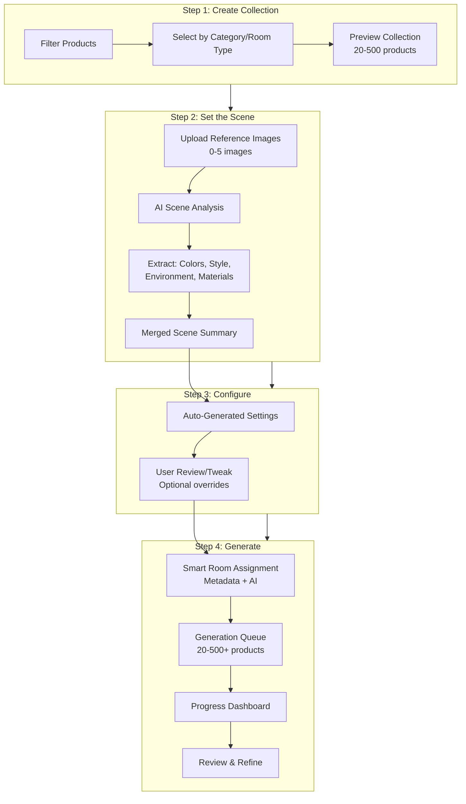
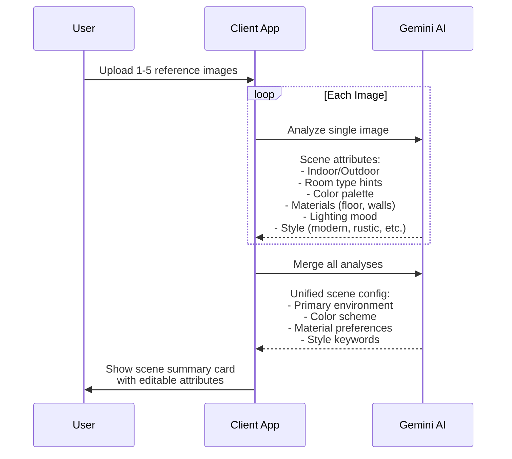

# Visualizer Client - AI Product Studio

## Vision

A streamlined, magical studio experience for non-technical users to generate beautiful product visualizations at scale. The focus is on:

- **Minimal configuration** - AI does the heavy lifting
- **Collection-based workflow** - Bulk generation of 20-500+ products
- **Smart scene matching** - Products automatically placed in appropriate contexts
- **Reference-driven generation** - Up to 5 inspiration images analyzed to extract style/environment

## Core Workflow




## Scene Analysis Pipeline

When user uploads reference images:




## Smart Product-to-Room Matching

For each product in the queue:| Product Type | Auto-Assigned Context ||--------------|----------------------|| Office desk, chair | Home office, corporate office || Bathroom sink, vanity | Bathroom || Rug, coffee table | Living room || Bed, mattress | Bedroom || Dining table | Dining room || Outdoor furniture | Patio, garden |Logic:

1. Check product metadata (category, roomTypes)
2. AI analyzes product image if metadata unclear
3. Match against reference scene (if compatible)
4. Fall back to logical default for product type

## App Structure

```javascript
apps/visualizer-client/
├── app/
│   ├── layout.tsx
│   ├── page.tsx                    # Dashboard - recent collections
│   ├── login/page.tsx
│   ├── collections/
│   │   ├── page.tsx                # List all collections
│   │   ├── new/
│   │   │   └── page.tsx            # Collection creation wizard
│   │   └── [collectionId]/
│   │       ├── page.tsx            # Collection detail/progress
│   │       └── results/page.tsx    # Generated images gallery
│   └── api/
│       ├── auth/[...all]/route.ts
│       ├── collections/
│       │   ├── route.ts            # CRUD collections
│       │   └── [id]/
│       │       ├── route.ts
│       │       ├── analyze/route.ts    # Scene analysis
│       │       └── generate/route.ts   # Start generation
│       └── products/route.ts       # Filter/list products
├── components/
│   ├── CollectionWizard/           # Multi-step creation flow
│   │   ├── ProductFilter.tsx       # Step 1: Filter products
│   │   ├── ReferenceUploader.tsx   # Step 2: Upload inspiration
│   │   ├── ScenePreview.tsx        # Show AI analysis results
│   │   ├── ConfigReview.tsx        # Step 3: Review settings
│   │   └── GenerateButton.tsx      # Step 4: Launch
│   ├── GenerationProgress/         # Real-time queue status
│   └── ResultsGallery/             # View/download results
└── lib/
    ├── auth/client-auth.ts
    ├── services/
    │   └── scene-analyzer.ts       # Multi-image analysis
    └── types/collection.ts
```


## Data Model

```typescript
interface Collection {
  id: string;
  clientId: string;
  name: string;
  status: 'draft' | 'analyzing' | 'ready' | 'generating' | 'completed';
  
  // Step 1: Products
  productFilter: {
    categories?: string[];
    roomTypes?: string[];
    productIds?: string[];  // Or explicit selection
  };
  productCount: number;
  
  // Step 2: Reference Images
  referenceImages: Array<{
    id: string;
    url: string;
    analysis?: SceneAnalysis;
  }>;
  
  // Step 3: Merged Scene Config
  sceneConfig: {
    environment: 'indoor' | 'outdoor' | 'mixed';
    colorPalette: string[];
    style: string[];
    materials: { floor?: string; walls?: string; };
    lighting: string;
    customPromptPrefix?: string;
  };
  
  // Step 4: Generation
  generationQueue: Array<{
    productId: string;
    assignedRoom: string;
    status: 'pending' | 'generating' | 'completed' | 'error';
    resultImageId?: string;
  }>;
  
  createdAt: string;
  updatedAt: string;
}
```


## Key UX Principles

1. **Progressive Disclosure** - Only show complexity when needed
2. **Smart Defaults** - AI fills in sensible values, user just confirms
3. **Visual Feedback** - Show what the AI "sees" in reference images
4. **Bulk-First** - Designed for 100+ products, not one at a time
5. **Non-Technical Language** - "Warm lighting" not "temperature: 5500K"

## Shared Infrastructure

Still leverages existing packages:

- `visualizer-auth` - User authentication (Better Auth)
- `visualizer-db` - Database schemas
- `visualizer-storage` - S3 storage
- Gemini service for scene analysis and generation

New shared code goes to `visualizer-shared`:

- Generation queue logic